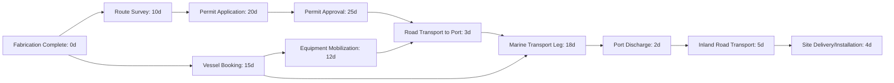

## Project Scheduling and Critical Path Analysis

### Definition and Scope

Project scheduling and critical path analysis in heavy-lift and specialized (project) logistics is the discipline of sequencing, timing, and interdependency-mapping all activities required to move abnormal/indivisible loads (AIL) from origin to final site placement, in order to identify the sequence of activities that determines the shortest possible overall project duration. The Critical Path Method (CPM) is the foundational scheduling technique, adapted from general construction and engineering project management but applied here to the specific interdependencies of multimodal transport: fabrication completion, survey and permitting, equipment mobilization, transport execution, and site installation.

Because heavy-lift logistics activities are frequently interdependent with both upstream fabrication schedules and downstream construction erection sequences, scheduling in this discipline cannot be treated as an isolated transport timeline; it must be integrated into the client's or EPC contractor's master project schedule.

### Why Critical Path Analysis Is Essential in Heavy-Lift Logistics

**Key Points**

- A delay in a non-critical activity (one with schedule float/slack) has no effect on overall project completion; a delay in a critical path activity delays the entire project by the same amount.
- Permitting, survey, and equipment mobilization activities often have long lead times that are not obvious from a simple transit-time calculation, and frequently sit on the critical path even though they are not the "movement" itself.
- Multimodal projects (see related chapter content) involve sequential dependencies across modes, meaning a delay at one interface (e.g., port discharge) can propagate through all downstream legs even if those downstream legs individually have no inherent delay.
- Site construction schedules often treat cargo delivery as a fixed input; identifying and protecting the transport critical path is essential to avoid becoming the cause of broader project delay and associated liquidated damages exposure.

### Core CPM Concepts Applied to Heavy-Lift Logistics

1. **Activity**: A discrete, time-bound task (e.g., "Conduct physical route survey," "Obtain road authority permit," "Mobilize SPMT to origin," "Execute road transport leg")
2. **Duration**: The estimated time required to complete an activity, often itself subject to three-point estimation given inherent uncertainty (permit processing time, weather windows)
3. **Dependency/Predecessor relationships**: The logical sequencing between activities, typically categorized as:
   - **Finish-to-Start (FS)**: The most common relationship; an activity cannot start until its predecessor finishes (e.g., permit approval must finish before transport execution starts)
   - **Start-to-Start (SS)**: Two activities can begin simultaneously once a trigger condition is met (e.g., customs clearance and inland trucking arrangement can start together once import documentation is filed)
   - **Finish-to-Finish (FF)**: Two activities must finish together (e.g., escort vehicle positioning must finish at the same time as convoy arrival at the jurisdiction boundary)
   - **Start-to-Finish (SF)**: Rare in practice; an activity cannot finish until a successor starts
4. **Float/Slack**: The amount of time an activity can be delayed without affecting the overall project completion date; critical path activities have zero float by definition
5. **Milestones**: Zero-duration markers representing key decision points or deliverables (e.g., "Vessel Booking Confirmed," "All Permits Approved," "Cargo Delivered to Site")

### Critical Path Calculation Method

The critical path is identified through a forward pass (calculating earliest start/finish times) and a backward pass (calculating latest start/finish times without delaying the project), with float calculated as the difference.

$$TF = LS - ES = LF - EF$$

Where $TF$ is total float, $LS$ is latest start, $ES$ is earliest start, $LF$ is latest finish, and $EF$ is earliest finish for a given activity. Activities where $TF = 0$ lie on the critical path.

**Forward pass** (earliest start/finish):

$$EF_i = ES_i + D_i$$

$$ES_j = \max(EF_i)\ \text{for all predecessors } i \text{ of activity } j$$

**Backward pass** (latest start/finish), beginning from the project's required completion date:

$$LS_i = LF_i - D_i$$

$$LF_i = \min(LS_j)\ \text{for all successors } j \text{ of activity } i$$

### Typical Heavy-Lift Project Network (Simplified)

In this simplified example, tracing the longest path by cumulative duration (Fabrication → Route Survey → Permit Application → Permit Approval → Road Transport to Port → Marine Transport → Port Discharge → Inland Road Transport → Site Delivery) reveals whether the permitting chain or the vessel booking/mobilization chain is the actual project driver, information that is not obvious without formal network analysis. [Inference] In practice, permitting and regulatory approval chains frequently emerge as the critical path in heavy-lift projects, more often than the physical transport legs themselves, though this varies by project and jurisdiction and should be confirmed by actual network analysis rather than assumed.

### Integration with Multimodal Interdependencies

Because multimodal projects (per the chapter context) involve sequential handoffs between modes, scheduling must explicitly model the interface points as activities with their own duration and dependency logic, not as instantaneous transitions.

| Interface | Typical Schedule Risk | Scheduling Treatment |
| --- | --- | --- |
| Port discharge to road transport | Crane/heavy-lift equipment availability at port, customs clearance timing | Modeled as a discrete activity with realistic duration, not zero-duration |
| Road to rail transload | Rail siding availability, wagon/schnabel car scheduling | Dependency on rail operator's own scheduling system, often requiring buffer |
| Rail/road to site | Site readiness (foundation completion, crane availability) | Finish-to-Start dependency on construction schedule milestones, requiring coordination with the EPC's master schedule |

### Schedule Risk and Buffer Management

- **Critical Chain Project Management (CCPM)**: An alternative/complementary approach to traditional CPM that consolidates individual activity safety margins into pooled buffers (project buffer, feeding buffers) rather than embedding hidden padding into each activity duration, intended to reduce the tendency for buffers to be consumed by poor task-level time management (a phenomenon sometimes referred to in scheduling literature as student syndrome or Parkinson's Law effects)
- **Feeding buffers**: Time buffers placed where a non-critical path activity feeds into the critical path, protecting the critical path from delays originating in parallel activity chains
- **Weather and seasonal buffers**: Explicit schedule allowances for known seasonal constraints (monsoon season, ice-bound ports, high-wind crane lift windows), distinct from generic contingency

[Inference] Adoption of formal CCPM methodology (as opposed to traditional CPM with conventional per-activity buffers) varies across the project logistics industry; both approaches are used in practice, with the choice often depending on the client's or EPC's preferred project controls methodology rather than a universal heavy-lift industry standard.

### Schedule Tracking Metrics

Once a baseline schedule is established, ongoing tracking typically uses standard project controls metrics adapted from Earned Value Management (EVM):

$$SV = EV - PV$$

$$SPI = \frac{EV}{PV}$$

Where $SV$ is schedule variance, $EV$ is earned value (budgeted cost of work actually performed), $PV$ is planned value (budgeted cost of work scheduled), and $SPI$ is the schedule performance index. An $SPI < 1$ indicates the project is behind schedule; this is typically tracked at both the overall project level and specifically for critical path activities, since an on-track overall SPI can mask a critical path activity running behind schedule while non-critical activities compensate in the aggregate metric.

### Common Scheduling Software and Tools

- **Primavera P6**: Widely used in large-scale EPC and infrastructure projects, offering detailed resource loading and multi-project portfolio scheduling
- **Microsoft Project**: Common for small to mid-scale project logistics scheduling, particularly where the logistics scope is a standalone schedule rather than integrated into a large EPC master schedule
- **Bespoke/integrated project controls platforms**: Some larger logistics providers and EPC contractors use custom or integrated platforms combining scheduling with cost control and document management

[Inference] Specific tool adoption varies by company size and client requirements; large EPC-driven projects frequently mandate Primavera P6 for schedule integration and reporting compatibility, though this is a common contractual requirement rather than a technical necessity of the scheduling methodology itself.

### Practical Example

A project logistics team is scheduling the delivery of a 400-tonne pressure vessel from an overseas fabrication yard to an inland refinery site.

- **Network construction**: The team maps all activities from fabrication completion through site installation, including route survey (10 days), permit application and approval (25 days total, run partially in parallel with vessel booking), vessel booking and mobilization (20 days), marine transit (18 days), port discharge (2 days), and inland road transport (5 days).
- **Critical path identification**: Forward and backward pass calculations reveal that the permit approval chain (35 days total from route survey start to permit approval, including a mandatory 15-day regulatory review period) is the critical path, exceeding the vessel booking and marine transit chain (38 days but starting later and largely running in parallel) by only 2 days, making both chains near-critical and worth monitoring closely.
- **Risk response**: Recognizing the permit chain's near-critical status, the team submits the permit application at the earliest possible date (immediately following preliminary desktop survey, rather than waiting for full physical survey completion) and maintains direct liaison with the permitting authority to avoid processing delays, effectively protecting the identified critical path.
- **Buffer allocation**: A 5-day feeding buffer is placed between permit approval and the start of road transport to port, protecting against the risk of the vessel arriving before permits are finalized or vice versa.
- **Outcome**: Weekly SPI tracking during execution shows the permit chain running exactly on schedule (SPI = 1.0) through week 3, while the vessel booking activity shows early completion (SPI > 1.0), confirming the buffer strategy is absorbing minor variance without threatening overall project completion.

### Common Pitfalls

- Treating the "movement" itself (transit time) as the schedule, while ignoring long-lead permitting, survey, and mobilization activities that frequently determine the actual critical path
- Failing to model interface/handoff activities at modal transitions with realistic duration, creating unrealistic schedules that appear compressed on paper
- Applying generic contingency at the end of the schedule rather than protecting the specific critical path with targeted feeding buffers
- Not integrating the transport schedule with the client's or EPC's master construction schedule, resulting in site delivery dates that conflict with actual site readiness or crane availability
- Monitoring only aggregate schedule performance (overall SPI) without separately tracking critical path activity performance, masking emerging critical path delays

### Related Topics

- Contingency and Alternative Routing Strategies
- Cost Estimation and Budgeting for Project Cargo
- Earned Value Management Applied to Project Logistics Execution
- Managing Multi-Origin Consolidation Projects
- Stakeholder Communication and Reporting Structures
- Permit Management and Escort Coordination for Oversized Cargo
- Critical Chain Project Management (CCPM) Buffer Design