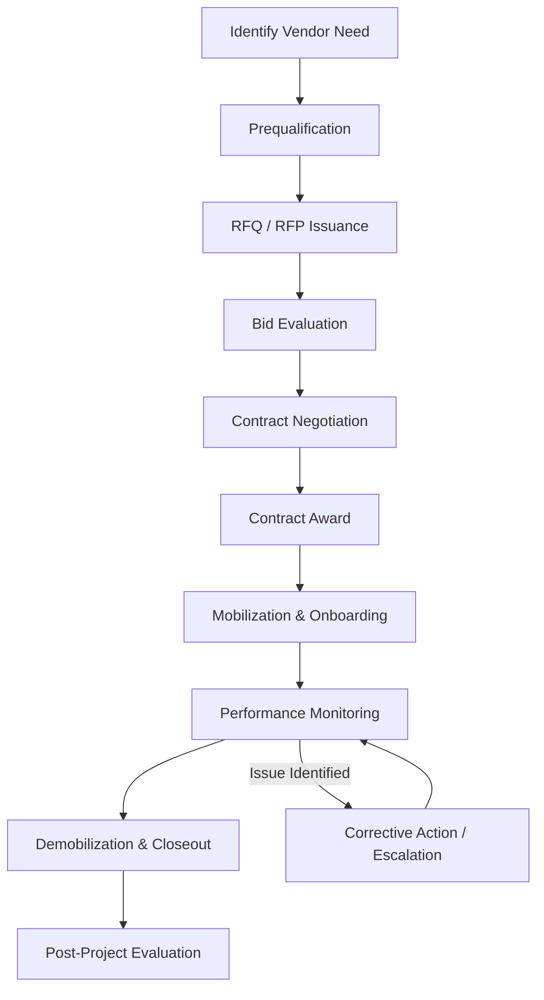

## Vendor and Subcontractor Management

### Overview

Vendor and Subcontractor Management, in the context of Heavy-Lift & Specialized Logistics, is the discipline of identifying, qualifying, contracting, coordinating, and evaluating third-party providers who supply equipment, labor, engineering, or ancillary services required to execute a heavy-lift or abnormal-load transport project. A single heavy-lift project routinely depends on a web of external parties: crane owners, specialized trailer (SPMT) operators, riggers, marine transport providers, route survey firms, permit agents, police/escort services, engineering consultants, and ballast/counterweight suppliers. Because the prime contractor rarely owns every asset class needed, the success or failure of the lift is frequently determined by how well these third parties are selected and managed rather than by the prime contractor's own capabilities.

### Prerequisites

Before this topic, a learner should already understand:

- **Basic project management fundamentals** — scope, schedule, cost, and quality triangle, since vendor management is a subset of overall project controls.
- **Heavy-lift equipment categories** — cranes (crawler, mobile, tower), SPMTs, hydraulic gantries, barges/marine vessels — because vendor scopes are defined around these asset types.
- **Contract types** (lump sum, unit rate, cost-plus, time-and-materials) — vendor agreements are built on these same structures.

[Inference] If any of these are unfamiliar, they should be covered first, since vendor management terminology assumes fluency in them.

### Why Vendor Management Is Distinct in Heavy-Lift Projects

**Key Points**

- Heavy-lift projects have low tolerance for schedule slippage because permits, road closures, and police escorts are often booked for fixed windows.
- Equipment is highly specialized and scarce; there may be only a handful of cranes or SPMT fleets in a region capable of a given lift, which shifts negotiating leverage toward vendors.
- A single vendor failure (e.g., a crane breaking down mid-lift) can cascade into safety incidents, not just cost overruns.
- Liability and insurance structures are more complex, since rigging failures or transport incidents can cause catastrophic property damage or loss of life.

### Vendor and Subcontractor Categories in Heavy-Lift Logistics

| Category | Typical Scope | Example Vendor Type |
| --- | --- | --- |
| Heavy Lift Cranes | Lifting, positioning, rigging | Crawler crane operators |
| Specialized Transport | Abnormal load movement | SPMT operators, low-boy trailer fleets |
| Marine/Barge Transport | Waterborne movement of modules | Barge operators, tug companies |
| Engineering Services | Lift plans, rigging studies, route surveys | Lift engineering consultancies |
| Rigging & Slinging | Sling, shackle, spreader bar supply and operation | Certified rigging contractors |
| Route & Permit Services | Route surveys, permit acquisition, utility coordination | Permit agents, traffic engineers |
| Escort & Traffic Control | Pilot cars, police escorts, traffic management | Escort service providers |
| Ballast/Counterweight Supply | Supply and transport of counterweights | Ballast rental companies |
| Site Preparation | Ground bearing pressure mitigation, mats, pads | Civil subcontractors |

### Vendor Lifecycle Framework

### 1. Vendor Identification and Prequalification

**Key Points**

- Prequalification screens vendors before they are allowed to bid, reducing downstream risk.
- Heavy-lift prequalification criteria are stricter than general construction because of the safety-critical nature of the work.

Typical prequalification criteria include:

- **Safety record**: EMR (Experience Modification Rate), TRIR (Total Recordable Incident Rate), OSHA/local regulator citation history.
- **Technical capability**: fleet inventory, crane capacity charts, SPMT axle-line counts, load ratings.
- **Certifications**: rigger certifications (e.g., NCCCO in the US), crane operator licenses, ISO 9001/45001, lift plan engineering credentials (often requiring a licensed Professional Engineer stamp).
- **Financial stability**: bonding capacity, insurance limits, credit rating.
- **Reference projects**: past performance on comparable tonnage/dimension lifts.
- **Equipment condition/maintenance records**: inspection certificates, load test certificates (often required within the last 12 months depending on jurisdiction).

[Inference] Specific certification requirements vary by country and regulator; the examples above (NCCCO, OSHA) are US-centric and should be substituted with local equivalents (e.g., LEEA in the UK, CIC in various jurisdictions) depending on project location.

### 2. RFQ/RFP Development and Bid Evaluation

A heavy-lift RFP typically includes:

- Detailed load data (weight, dimensions, center of gravity, lift points)
- Route/site constraints (bridge weight limits, overhead clearances, ground bearing capacity)
- Schedule windows, including any fixed permit or closure dates
- Required insurance and indemnification levels
- Scope split (who provides rigging hardware, who provides engineering stamp, who is responsible for permits)

**Example**

A vendor comparison matrix for crane selection might weight criteria as follows:

| Criterion | Weight | Vendor A | Vendor B | Vendor C |
| --- | --- | --- | --- | --- |
| Technical capability | 30% | 9 | 7 | 8 |
| Safety record | 25% | 8 | 9 | 6 |
| Price | 20% | 6 | 8 | 9 |
| Schedule availability | 15% | 9 | 6 | 7 |
| References | 10% | 8 | 8 | 7 |

[Inference] Actual weighting schemes vary by organizational procurement policy; this is an illustrative structure, not a universal standard.

### 3. Contract Structuring for Heavy-Lift Vendors

**Key Points**

- Standby/demurrage clauses are critical because heavy-lift equipment (e.g., a 1,000-ton crawler crane) has extremely high daily standby costs; delays caused by weather, permits, or site readiness must have clearly allocated financial responsibility.
- Mobilization/demobilization costs are often the largest line items and are typically priced separately from operating rates because they are largely fixed regardless of how long the equipment is used on site.
- Force majeure clauses need heavy-lift-specific language covering weather windows (wind speed limits for crane operations), since cranes have hard operational limits (e.g., many mobile cranes cannot lift above certain wind speeds, commonly in the 20–30 mph / 32–48 km/h range depending on load and configuration). [Unverified] Exact thresholds are equipment- and manufacturer-specific and must be confirmed against the specific crane's load chart.

Common contract clauses specific to this domain:

- **Standby rate**: daily/hourly rate when equipment is on site but idle due to circumstances outside vendor control.
- **Weather day allowance**: number of no-cost delay days built into schedule before standby charges apply.
- **Liquidated damages**: for late mobilization or missed permit windows.
- **Indemnification and insurance**: often requiring vendor to carry Contractor's Equipment (CE) insurance, marine cargo insurance (for barge transport), and Protection & Indemnity (P&I) coverage for marine operations.
- **Rigging responsibility clause**: explicitly states which party's engineer stamps the final lift plan, since liability follows the stamp.
- **Escalation clause**: for long-duration contracts, covers fuel and steel price volatility.

### 4. Onboarding and Mobilization Coordination

**Steps typically involved:**

1. **Pre-mobilization meeting** — align on lift plan, site logistics, communication protocols.
2. **Document verification** — collect current insurance certificates, equipment inspection/load test certificates, operator licenses.
3. **Site induction/safety orientation** — vendor personnel complete site-specific safety training.
4. **Equipment inspection on arrival** — joint inspection with vendor representative, documented via checklist/photos.
5. **Communication protocol setup** — define radio channels, escalation contacts, reporting cadence (daily vendor coordination calls are standard on multi-week lifts).

### 5. Performance Monitoring and KPIs

| KPI | Description | Typical Target |
| --- | --- | --- |
| On-time mobilization | Equipment/crew arrives per schedule | 100% |
| Safety incidents | Recordable incidents during vendor scope | Zero |
| Schedule adherence | Actual vs. planned lift/transport duration | ≤5% variance |
| Rework/non-conformance | Instances requiring rigging or engineering rework | Minimize |
| Invoice accuracy | Billing matches contracted rates/scope | 100% match |

[Inference] Numeric targets above are illustrative industry-typical benchmarks, not universal contractual standards; actual KPI thresholds should be defined per project contract.

### 6. Risk Management in Vendor Relationships

**Key Points**

- **Single point of failure risk**: if only one vendor in the region has the required crane class, the project has no fallback if that vendor fails; mitigation includes identifying backup vendors during prequalification even if not awarded the primary contract.
- **Subcontractor default risk**: financial failure of a subcontractor mid-project; mitigated via performance bonds and payment bonds.
- **Insurance gap risk**: a common failure mode is a gap between the prime contractor's policy and the vendor's policy for rigging liability; this is mitigated by requiring a Certificate of Insurance naming the prime contractor as additional insured, reviewed by a risk/legal function before mobilization.
- **Communication risk**: multiple vendors (crane, transport, escort, permit agent) must be synchronized on the same schedule; miscommunication commonly causes costly standby time.

### Vendor Coordination Structure (svg_diagram)

<svg xmlns="http://www.w3.org/2000/svg" viewBox="0 0 760 420" font-family="Arial, sans-serif">
<text x="380" y="30" font-size="18" font-weight="bold" text-anchor="middle" fill="#1a1a1a">Vendor Coordination Structure (svg_diagram)</text>
<rect x="300" y="60" width="160" height="50" rx="8" fill="#2c5f8a" stroke="#1a1a1a" stroke-width="1.5" />
<text x="380" y="90" font-size="13" fill="white" text-anchor="middle" font-weight="bold">Prime Contractor PM</text>
<line x1="380" y1="110" x2="140" y2="170" stroke="#555" stroke-width="1.5" />
<line x1="380" y1="110" x2="300" y2="170" stroke="#555" stroke-width="1.5" />
<line x1="380" y1="110" x2="460" y2="170" stroke="#555" stroke-width="1.5" />
<line x1="380" y1="110" x2="620" y2="170" stroke="#555" stroke-width="1.5" />
<rect x="60" y="170" width="160" height="50" rx="8" fill="#3d7a4f" stroke="#1a1a1a" stroke-width="1.5" />
<text x="140" y="195" font-size="12" fill="white" text-anchor="middle">Crane Vendor</text>
<text x="140" y="210" font-size="10" fill="#e0e0e0" text-anchor="middle">Lift Operations</text>
<rect x="220" y="170" width="160" height="50" rx="8" fill="#3d7a4f" stroke="#1a1a1a" stroke-width="1.5" />
<text x="300" y="195" font-size="12" fill="white" text-anchor="middle">Transport Vendor</text>
<text x="300" y="210" font-size="10" fill="#e0e0e0" text-anchor="middle">SPMT / Trailers</text>
<rect x="380" y="170" width="160" height="50" rx="8" fill="#3d7a4f" stroke="#1a1a1a" stroke-width="1.5" />
<text x="460" y="195" font-size="12" fill="white" text-anchor="middle">Engineering Vendor</text>
<text x="460" y="210" font-size="10" fill="#e0e0e0" text-anchor="middle">Lift Plans / Stamps</text>
<rect x="540" y="170" width="160" height="50" rx="8" fill="#3d7a4f" stroke="#1a1a1a" stroke-width="1.5" />
<text x="620" y="195" font-size="12" fill="white" text-anchor="middle">Permit/Escort Vendor</text>
<text x="620" y="210" font-size="10" fill="#e0e0e0" text-anchor="middle">Route &amp; Traffic</text>
<line x1="140" y1="220" x2="140" y2="260" stroke="#555" stroke-width="1.5" />
<line x1="300" y1="220" x2="300" y2="260" stroke="#555" stroke-width="1.5" />
<line x1="460" y1="220" x2="460" y2="260" stroke="#555" stroke-width="1.5" />
<line x1="620" y1="220" x2="620" y2="260" stroke="#555" stroke-width="1.5" />
<rect x="60" y="260" width="160" height="40" rx="6" fill="#a0522d" stroke="#1a1a1a" stroke-width="1.2" />
<text x="140" y="284" font-size="11" fill="white" text-anchor="middle">Riggers / Crew</text>
<rect x="220" y="260" width="160" height="40" rx="6" fill="#a0522d" stroke="#1a1a1a" stroke-width="1.2" />
<text x="300" y="284" font-size="11" fill="white" text-anchor="middle">Drivers / Operators</text>
<rect x="380" y="260" width="160" height="40" rx="6" fill="#a0522d" stroke="#1a1a1a" stroke-width="1.2" />
<text x="460" y="284" font-size="11" fill="white" text-anchor="middle">Surveyors</text>
<rect x="540" y="260" width="160" height="40" rx="6" fill="#a0522d" stroke="#1a1a1a" stroke-width="1.2" />
<text x="620" y="284" font-size="11" fill="white" text-anchor="middle">Police / Pilot Cars</text>
<rect x="240" y="340" width="280" height="50" rx="8" fill="#8a2c2c" stroke="#1a1a1a" stroke-width="1.5" />
<text x="380" y="365" font-size="12" fill="white" text-anchor="middle" font-weight="bold">Daily Coordination Call</text>
<text x="380" y="380" font-size="10" fill="#e0e0e0" text-anchor="middle">All vendor leads report status to PM</text>
<line x1="140" y1="300" x2="240" y2="360" stroke="#888" stroke-width="1" stroke-dasharray="4,3" />
<line x1="300" y1="300" x2="330" y2="340" stroke="#888" stroke-width="1" stroke-dasharray="4,3" />
<line x1="460" y1="300" x2="430" y2="340" stroke="#888" stroke-width="1" stroke-dasharray="4,3" />
<line x1="620" y1="300" x2="520" y2="360" stroke="#888" stroke-width="1" stroke-dasharray="4,3" />
</svg>

### 7. Change Order and Claims Management

- **Change order triggers**: scope changes (route re-survey due to bridge closure), site condition differences (ground bearing capacity lower than surveyed), weather delays beyond allowance.
- **Documentation discipline**: daily logs, photographs, weather records, and standby justification must be captured in real time — heavy-lift claims are frequently contested and rely heavily on contemporaneous records.
- **Dispute resolution mechanisms**: escalation ladder (site level → PM level → executive level), followed by mediation/arbitration clauses typically embedded in the master service agreement.

### 8. Demobilization and Closeout

**Steps:**

1. Joint final equipment inspection (documenting condition vs. mobilization baseline).
2. Reconciliation of standby days, change orders, and final invoice against contract.
3. Release of retention/performance bond upon confirmed completion.
4. Collection of as-built documentation (final lift reports, load test certificates used, incident-free confirmation).
5. Vendor performance scorecard completion for future prequalification database.

### 9. Post-Project Vendor Evaluation

A structured post-project evaluation feeds back into the prequalification database and typically scores:

- Technical execution quality
- Safety performance
- Schedule adherence
- Communication responsiveness
- Commercial/invoicing accuracy
- Willingness to re-engage (repeat business likelihood)

[Inference] This scorecard approach reflects common industry practice in heavy-lift and EPC (Engineering, Procurement, Construction) contracting environments; the exact scoring instrument is organization-specific.

### Common Pitfalls

- Treating heavy-lift vendor contracts like standard construction subcontracts, underestimating standby/demurrage exposure.
- Failing to verify current load test and inspection certificates before mobilization, creating regulatory and safety exposure.
- Not aligning multiple vendors' schedules against a single fixed permit/road-closure window, causing cascading standby costs.
- Insufficient insurance cross-verification between prime and subcontractor policies, leaving liability gaps in the event of a rigging failure.
- Single-sourcing scarce equipment without a documented contingency/backup vendor plan.

### Related Topics

- Lift Plan Engineering and Rigging Study Review
- Permit Acquisition and Route Survey Management
- Insurance and Risk Transfer in Heavy-Lift Contracts
- Standby, Demurrage, and Liquidated Damages Clause Drafting
- Crane and SPMT Selection Criteria
- Claims Documentation and Dispute Resolution in Specialized Transport
- Site Preparation and Ground Bearing Pressure Coordination with Civil Subcontractors