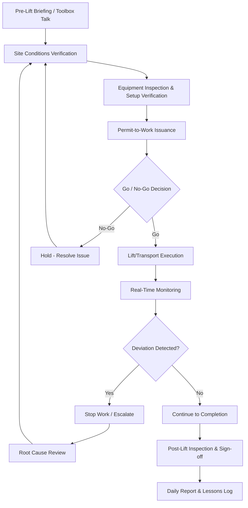
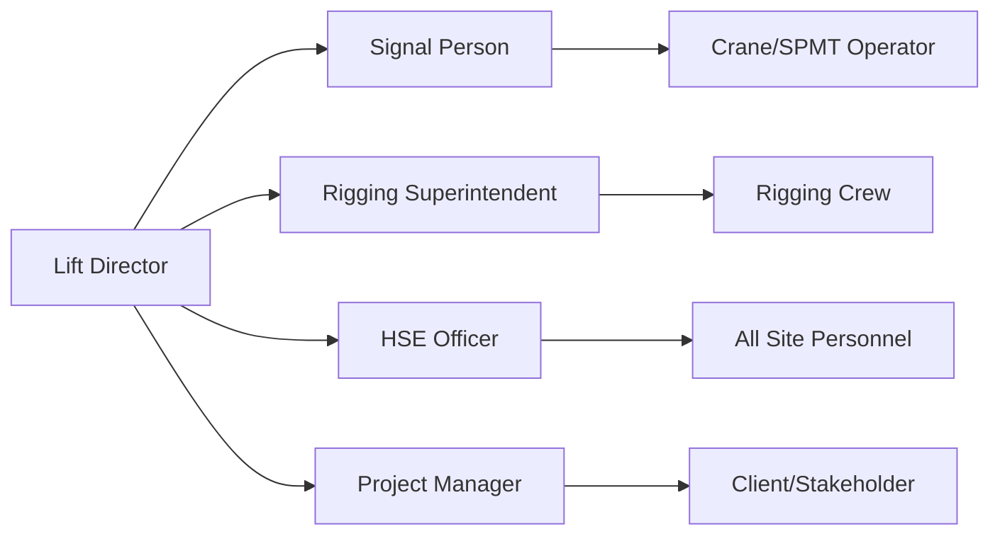

## On-Site Supervision and Execution Oversight

### Overview

On-Site Supervision and Execution Oversight is the discipline of managing personnel, equipment, and process control during the physical execution phase of a heavy-lift or specialized transport operation. While planning and vendor management establish the framework before mobilization, on-site supervision is where the lift plan, rigging study, and transport route plan are converted into real, monitored, moment-to-moment action. In heavy-lift operations, execution-phase oversight carries disproportionate safety and financial weight: a single miscommunication during a critical lift can cause catastrophic equipment damage, injury, or loss of life, and most heavy-lift incident investigations trace root causes to execution-phase supervision gaps rather than design-phase engineering errors. [Inference] This root-cause pattern reflects commonly cited findings in heavy-lift and crane-incident post-mortems across the industry, not a single verified statistic.

### Prerequisites

Before this topic, a learner should already understand:

- **Lift planning fundamentals** — load charts, center of gravity, rigging configurations — since supervision verifies these plans are followed, not created.
- **Vendor and Subcontractor Management** (prior chapter item) — supervision coordinates the same vendors already contracted and mobilized.
- **Basic crane/SPMT operational terminology** — boom angle, outrigger, ground bearing pressure, axle line — required to interpret field conditions against the plan.

[Inference] If these are unfamiliar, review them first; on-site supervision content assumes the reader can read a lift plan, not just execute a checklist.

### Core Roles in On-Site Execution Oversight

| Role | Primary Responsibility |
| --- | --- |
| Project Manager (PM) | Overall schedule, cost, stakeholder communication |
| Site Superintendent | Day-to-day execution authority on site |
| Lift Supervisor / Lift Director | Direct authority over the lift operation itself; final go/no-go call |
| Rigging Superintendent | Rigging configuration verification, sling/shackle inspection |
| Qualified/Competent Person (QP/CP) | Independent safety authority, per OSHA/regulatory definitions |
| Signal Person | Communication between crane operator and ground crew |
| HSE Officer | Site-wide safety compliance, permit-to-work issuance |
| Quality Control Inspector | Verifies work matches engineering specifications |

[Inference] Exact title terminology (e.g., "Competent Person" vs. "Qualified Person") is jurisdiction- and regulator-specific (e.g., OSHA in the US uses both terms with distinct legal definitions); confirm local regulatory definitions before applying titles contractually.

### Execution Oversight Lifecycle

### 1. Pre-Execution Verification (Go/No-Go Process)

**Key Points**

- The go/no-go decision is a formal checkpoint, not an informal judgment call; it should be documented and signed by the designated authority (typically the Lift Director).
- Multiple independent inputs feed the decision: weather, ground conditions, equipment status, personnel readiness, and permit validity.

Typical go/no-go checklist categories:

- **Weather**: wind speed against crane manufacturer limits, visibility, precipitation, lightning proximity.
- **Ground conditions**: bearing capacity confirmed against survey, mats/cribbing in place, no standing water or erosion since last inspection.
- **Equipment**: outriggers fully deployed and cribbed, load charts on hand and matching configuration, inspection tags current.
- **Personnel**: all required certifications on site (rigger, operator, signal person), fatigue/rest hour compliance confirmed.
- **Permits**: permit-to-work signed, any third-party permits (road closure, police escort) confirmed active for the exact window.
- **Communication**: radio checks completed, emergency contact list current, exclusion zones marked and communicated.

**Example**

A wind-speed go/no-go threshold is typically drawn directly from the specific crane's load chart rather than a generic rule; many mobile/crawler cranes carry stepped limits (e.g., full-rated load permitted below one wind speed, derated capacity between that and a second threshold, and lift suspension above a maximum threshold commonly in the 20–30 mph / 32–48 km/h range for many configurations). [Unverified] Exact figures must be confirmed against the specific equipment manufacturer's chart for the boom configuration and load in use — this is not a universal number.

### 2. Pre-Lift Briefing / Toolbox Talk Structure

A pre-lift briefing typically covers:

1. Scope of the day's lift/move and sequence of operations
2. Roles and responsibilities confirmation (who is signal person, who has stop-work authority)
3. Hazards specific to today's activity (overhead lines, adjacent traffic, confined access)
4. Emergency procedures and muster point
5. Communication protocol (radio channel, hand signals if radio fails)
6. Review of any changes since the last briefing (site conditions, personnel changes)

[Inference] This structure reflects standard toolbox-talk practice common across heavy-lift and construction safety programs; specific mandatory content may be defined by local regulation or client HSE policy.

### 3. Real-Time Monitoring During Execution

**Key Points**

- Monitoring during the lift/move itself is continuous, not a single checkpoint — supervision must track load behavior, equipment indicators, and environmental conditions simultaneously.
- Deviation from plan (even minor) should trigger an immediate pause for assessment rather than a "wait and see" approach, given the low margin for error in heavy-lift operations.

Monitoring focus areas:

- **Load Moment Indicator (LMI) / Rated Capacity Indicator (RCI)** readings against planned percentage of capacity
- Boom angle and radius versus lift plan
- Rigging angle (sling angle deviation from planned angle changes effective sling load)
- Ground settlement under outriggers/crawlers
- Real-time wind speed (often via on-site anemometer for critical lifts)
- SPMT hydraulic pressure and axle load distribution (for transport moves)
- Escort/traffic control positioning relative to the moving load

**Example**

If a rigging plan specifies a 60-degree sling angle and field observation shows the angle has drifted to 45 degrees due to an obstruction requiring a rigging point shift, the load on each sling leg increases substantially — a well-known rigging principle is that decreasing sling angle from vertical increases tension per leg. [Inference] This is a standard, well-documented rigging engineering relationship; exact tension increase depends on the specific geometry and should be recalculated by the rigging engineer rather than estimated in the field.

### 4. Stop-Work Authority

**Key Points**

- Every person on site — regardless of rank — typically holds stop-work authority in a well-run heavy-lift safety culture; this is a deliberate design choice, not an oversight gap.
- Stop-work events must be logged, root-caused, and resolved before work resumes, with resumption authorized by the same level (or higher) as the original go/no-go authority.

Common stop-work triggers:

- Wind speed approaching or exceeding chart limits
- Unexpected ground movement or settlement
- Load behaving unpredictably (swinging, rotating unexpectedly)
- Communication failure between signal person and operator
- Personnel entering an exclusion zone
- Equipment warning indicators (LMI alarms, hydraulic pressure anomalies)

### 5. Quality Control and Engineering Compliance Verification

On-site supervision includes verifying that field execution matches the engineered lift plan, not just that the lift "went fine":

- Rigging hardware (shackles, slings, spreader bars) matched to the specified working load limit (WLL) in the plan
- Lift points used match those specified/approved by the structural engineer
- Sequence of operations followed as engineered (e.g., tailing crane synchronized with main crane in tandem lifts)
- As-built deviations documented and, where significant, routed back to the engineer for re-approval before proceeding

### 6. Communication Structure During Execution

**Key Points**

- Single point of command: the Lift Director is the sole authority for lift-specific go/stop decisions during execution, preventing conflicting instructions to the operator.
- The signal person has exclusive communication authority with the operator during the active lift, per standard rigging practice, to avoid confusing or overlapping signals.

### 7. Documentation and Daily Reporting

Typical daily execution documentation includes:

- **Daily Progress Report**: work completed, hours worked, weather conditions, personnel on site
- **Equipment Inspection Log**: pre-shift inspection results for cranes, SPMTs, rigging gear
- **Incident/Near-Miss Log**: even minor deviations recorded for trend analysis
- **Permit-to-Work Register**: active and closed permits with sign-offs
- **Photographic Record**: rigging configuration, ground conditions, critical setup points

[Inference] The specific documentation set is commonly required by client HSE and QA/QC programs on major heavy-lift projects; exact required forms vary by contract and jurisdiction.

### 8. Handling Deviations and Field Changes

When field conditions differ from the engineered plan (e.g., ground bearing capacity found lower than surveyed, an obstruction requiring rigging point relocation):

**Steps:**

1. Stop work immediately; do not proceed on an improvised basis.
2. Document the deviation with measurements/photos.
3. Escalate to the responsible engineer (lift engineer or rigging engineer) for a revised calculation or plan.
4. Obtain written re-approval before resuming.
5. Update the daily log and, if material, notify the client/PM of schedule or cost impact.

### 9. Post-Lift/Post-Move Inspection and Sign-Off

**Steps:**

1. Visual inspection of the set/placed load for damage.
2. Equipment stand-down inspection (crane boom retraction, SPMT disengagement).
3. Rigging hardware removed and inspected for damage/wear before return to service or storage.
4. Sign-off by Lift Director and client representative (where required contractually) confirming successful, incident-free completion.
5. Site restoration (mats/cribbing removed, ground condition documented for any restoration obligations).

### On-Site Command and Control Structure (svg_diagram)

<svg xmlns="http://www.w3.org/2000/svg" viewBox="0 0 760 400" font-family="Arial, sans-serif">
<text x="380" y="28" font-size="18" font-weight="bold" text-anchor="middle" fill="#1a1a1a">On-Site Command and Control Structure (svg_diagram)</text>
<rect x="300" y="55" width="160" height="45" rx="8" fill="#8a2c2c" stroke="#1a1a1a" stroke-width="1.5" />
<text x="380" y="83" font-size="12" fill="white" text-anchor="middle" font-weight="bold">Lift Director</text>
<line x1="380" y1="100" x2="130" y2="155" stroke="#555" stroke-width="1.5" />
<line x1="380" y1="100" x2="300" y2="155" stroke="#555" stroke-width="1.5" />
<line x1="380" y1="100" x2="460" y2="155" stroke="#555" stroke-width="1.5" />
<line x1="380" y1="100" x2="630" y2="155" stroke="#555" stroke-width="1.5" />
<rect x="50" y="155" width="160" height="45" rx="8" fill="#2c5f8a" stroke="#1a1a1a" stroke-width="1.5" />
<text x="130" y="182" font-size="11" fill="white" text-anchor="middle">Signal Person</text>
<rect x="220" y="155" width="160" height="45" rx="8" fill="#2c5f8a" stroke="#1a1a1a" stroke-width="1.5" />
<text x="300" y="182" font-size="11" fill="white" text-anchor="middle">Rigging Superintendent</text>
<rect x="380" y="155" width="160" height="45" rx="8" fill="#2c5f8a" stroke="#1a1a1a" stroke-width="1.5" />
<text x="460" y="182" font-size="11" fill="white" text-anchor="middle">HSE Officer</text>
<rect x="550" y="155" width="160" height="45" rx="8" fill="#2c5f8a" stroke="#1a1a1a" stroke-width="1.5" />
<text x="630" y="182" font-size="11" fill="white" text-anchor="middle">QC Inspector</text>
<line x1="130" y1="200" x2="130" y2="240" stroke="#555" stroke-width="1.5" />
<line x1="300" y1="200" x2="300" y2="240" stroke="#555" stroke-width="1.5" />
<line x1="460" y1="200" x2="460" y2="240" stroke="#555" stroke-width="1.5" />
<rect x="50" y="240" width="160" height="40" rx="6" fill="#3d7a4f" stroke="#1a1a1a" stroke-width="1.2" />
<text x="130" y="264" font-size="11" fill="white" text-anchor="middle">Crane/SPMT Operator</text>
<rect x="220" y="240" width="160" height="40" rx="6" fill="#3d7a4f" stroke="#1a1a1a" stroke-width="1.2" />
<text x="300" y="264" font-size="11" fill="white" text-anchor="middle">Rigging Crew</text>
<rect x="380" y="240" width="160" height="40" rx="6" fill="#3d7a4f" stroke="#1a1a1a" stroke-width="1.2" />
<text x="460" y="264" font-size="11" fill="white" text-anchor="middle">All Site Personnel</text>
<rect x="220" y="330" width="320" height="50" rx="8" fill="#5a3d8a" stroke="#1a1a1a" stroke-width="1.5" />
<text x="380" y="354" font-size="12" fill="white" text-anchor="middle" font-weight="bold">STOP-WORK AUTHORITY</text>
<text x="380" y="370" font-size="10" fill="#e0e0e0" text-anchor="middle">Held by every individual on site</text>
<line x1="130" y1="280" x2="280" y2="330" stroke="#888" stroke-width="1" stroke-dasharray="4,3" />
<line x1="300" y1="280" x2="360" y2="330" stroke="#888" stroke-width="1" stroke-dasharray="4,3" />
<line x1="460" y1="280" x2="450" y2="330" stroke="#888" stroke-width="1" stroke-dasharray="4,3" />
</svg>

### Common Pitfalls

- Allowing informal "it'll be fine" judgment calls to replace documented go/no-go checklists under schedule pressure.
- Diluting stop-work authority in practice (crew hesitant to halt work due to perceived hierarchy), undermining the formal policy.
- Permitting rigging configuration drift (angle, hardware substitution) without routing back through the engineer.
- Treating pre-lift briefings as a formality rather than a genuine hazard-review checkpoint.
- Inadequate documentation of field deviations, creating both safety risk and weak defense in later claims/disputes.
- Wind and weather monitoring based on forecast alone rather than real-time on-site instrumentation for critical lifts.

### Related Topics

- Lift Plan Engineering and Rigging Study Review
- Crane Load Charts and Rated Capacity Indicators (LMI/RCI)
- Permit-to-Work Systems and HSE Compliance
- Incident Investigation and Root Cause Analysis in Heavy-Lift Operations
- SPMT Operations and Hydraulic Load Distribution Monitoring
- Emergency Response Planning for Heavy-Lift Sites
- Vendor and Subcontractor Management (related chapter item)