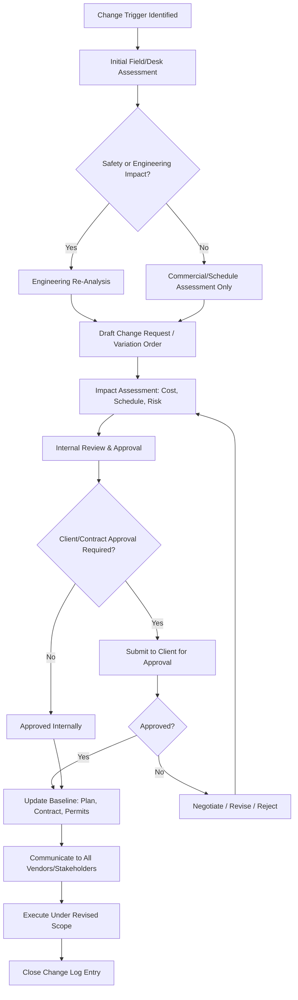

## Change Management and Scope Variation Handling

### Overview

Change Management and Scope Variation Handling is the discipline of identifying, evaluating, approving, and controlling deviations from the originally contracted scope, schedule, or engineering baseline of a heavy-lift or specialized transport project. In this domain, scope variations are not exceptional events — they are a structurally common occurrence, since heavy-lift projects are executed against physical site conditions (roads, bridges, ground bearing capacity, utility clearances) that are surveyed weeks or months before execution and frequently differ from as-found reality. A disciplined change management process distinguishes a controlled, fully-costed variation from an uncontrolled scope creep event that erodes margin and safety assurance simultaneously.

### Prerequisites

Before this topic, a learner should already understand:

- **Contract types and structures** (lump sum, unit rate, cost-plus) — since the change management process differs materially depending on how the base contract is priced.
- **Vendor and Subcontractor Management** (prior chapter item) — many changes originate from or must be communicated to third-party vendors.
- **On-Site Supervision and Execution Oversight** (prior chapter item) — field-level deviations are the most common trigger for formal change requests.

[Inference] If unfamiliar, review these first; change management terminology (e.g., "variation order," "baseline") assumes familiarity with contract and execution fundamentals.

### Why Change Management Is Distinct in Heavy-Lift Projects

**Key Points**

- Physical constraints are fixed and unforgiving: a bridge's posted weight limit or an overhead line's clearance height cannot be negotiated, so scope variations are frequently mandatory rather than discretionary.
- Engineering re-approval is often required for even small deviations (e.g., a shifted lift point), meaning changes carry technical review timelines, not just commercial negotiation timelines.
- Third-party dependencies (permits, police escorts, road closures) mean a scope change can cascade into a full re-permitting cycle, with weeks of delay for what may be a minor physical adjustment.
- The cost delta for heavy-lift changes is often disproportionate to the physical scope of the change, because specialized equipment standby rates are extremely high per day.

### Sources of Scope Variation in Heavy-Lift Projects

| Source Category | Example |
| --- | --- |
| Site Condition Differences | Ground bearing capacity lower than surveyed; unmarked underground utility found |
| Route/Infrastructure Changes | Bridge posted weight reduced after survey; road resurfacing altering clearance |
| Client-Directed Changes | Client requests different lift sequence or additional module included |
| Engineering Revisions | Structural engineer requires additional bracing after further analysis |
| Regulatory/Permit Changes | Local authority imposes new escort requirements or route restriction |
| Weather/Force Majeure | Extended weather delay requiring re-sequencing and re-permitting |
| Vendor-Driven Changes | Equipment substitution due to vendor fleet unavailability |
| Third-Party Interference | Utility company requires line de-energization not in original plan |

### Change Management Lifecycle

### 1. Change Identification and Initial Assessment

**Key Points**

- Speed of identification matters disproportionately in heavy-lift work; a change identified during route survey is a desk exercise, while the same change identified with the load already in transit is an active field emergency.
- Every identified deviation should be logged, even if ultimately assessed as having no cost/schedule impact, to maintain a complete project record.

Typical initial assessment questions:

- Does this affect the engineered lift plan or rigging configuration?
- Does this affect the approved transport route or permit conditions?
- Does this affect schedule-critical dependencies (fixed road closure windows, tidal windows for marine moves)?
- Does this introduce a new safety risk not covered in the original risk assessment?
- Is this within the contract's defined scope, or does it constitute additional/reduced scope?

### 2. Change Request / Variation Order Documentation

A heavy-lift change request typically includes:

- **Description of the change**: what differs from the original scope/plan
- **Trigger/root cause**: why the change is needed
- **Engineering impact**: reference to revised calculations, drawings, or lift plan revisions, with engineer sign-off where applicable
- **Cost impact**: itemized (labor, equipment standby, additional permits, re-engineering fees)
- **Schedule impact**: revised timeline, including any re-permitting or re-scheduling of third-party windows (police escort, road closure)
- **Risk impact**: updated risk register entries
- **Approval routing**: who must sign off internally and, where applicable, on the client side

**Example**

A simplified variation order log entry:

| VO # | Description | Trigger | Cost Impact | Schedule Impact | Status |
| --- | --- | --- | --- | --- | --- |
| VO-014 | Reroute via Highway 9 due to reduced bridge rating | Bridge weight limit reduced post-survey | +$42,000 | +3 days | Approved |
| VO-015 | Additional cribbing at Site B due to soft ground | Ground bearing capacity below survey estimate | +$8,500 | +1 day | Pending client approval |

[Inference] Dollar figures above are illustrative examples only, not derived from a verified project; actual costs depend entirely on project-specific rates and scope.

### 3. Impact Assessment Framework

**Cost Impact Analysis** typically separates:

- **Direct costs**: additional labor, materials, equipment rental
- **Standby/demurrage costs**: specialized equipment idle time while the change is engineered/approved
- **Re-permitting costs**: fees and administrative time for revised permits
- **Indirect costs**: extended project overhead, potential liquidated damages exposure if the change causes overall project delay

**Schedule Impact Analysis** should evaluate:

- Whether the change affects the critical path
- Whether the change affects any fixed external windows (permit validity dates, tidal windows, seasonal weight restrictions on roads that lift in spring/thaw season)
- Cascading effects on downstream vendors (e.g., if the crane is delayed, does the trailing SPMT move also shift)

[Inference] Seasonal road weight restrictions (e.g., spring thaw load limits) are a well-documented practice in cold-climate jurisdictions, but exact timing and thresholds are jurisdiction-specific and must be verified against the relevant local transportation authority.

### 4. Approval Authority and Escalation Matrix

**Key Points**

- Approval authority should be tiered by cost/schedule threshold to avoid bottlenecking minor changes while ensuring major changes receive appropriate scrutiny.
- In lump-sum contracts, change approval is commercially critical, since unapproved work performed outside the original scope may not be reimbursable; in cost-plus or unit-rate contracts, the emphasis shifts more toward transparent documentation than commercial risk.

**Example** escalation matrix:

| Cost/Schedule Threshold | Approval Authority |
| --- | --- |
| < $5,000 / < 4 hours delay | Site Superintendent |
| $5,000–$25,000 / < 1 day delay | Project Manager |
| $25,000–$100,000 / 1–3 days delay | Program Manager + Client Notification |
| > $100,000 / > 3 days delay | Executive Sponsor + Formal Client Approval |

[Inference] This is an illustrative escalation structure reflecting common project-controls practice; actual thresholds are defined by each organization's delegation of authority policy and the specific contract terms.

### 5. Client and Stakeholder Communication

Effective change communication typically includes:

- **Proactive notification**: informing the client of a potential change as soon as it is identified, even before full cost/schedule quantification is complete, to avoid surprise.
- **Clear cost/schedule basis**: presenting the impact with supporting documentation (survey data, engineering revision, vendor quotes) rather than a bare number.
- **Options where possible**: presenting alternative mitigation paths (e.g., "Option A: reroute, +3 days, +$42,000" vs. "Option B: partial disassembly for original route, +6 days, +$28,000") so the client retains decision authority.

### 6. Baseline Control and Documentation Update

Once a change is approved, the following baselines must be updated in a synchronized manner:

- **Lift plan / rigging study**: revised and re-stamped by the engineer of record
- **Transport route plan**: updated route survey, revised permit
- **Master project schedule**: critical path and milestone dates updated
- **Contract/commercial documents**: formal variation order executed, contract value adjusted
- **Vendor work orders**: all affected vendors issued updated instructions reflecting the new scope
- **Risk register**: new or revised risks logged with updated mitigation plans

**Key Points**

- A common failure mode is updating the commercial record (invoice/contract) without correspondingly updating the field-facing documents (lift plan, permits), creating a mismatch between what was approved on paper and what is executed on site.

### 7. Change Log and Trend Analysis

Maintaining a live change log serves two purposes:

1. **Project control**: real-time visibility into cumulative cost/schedule creep against the original baseline.
2. **Lessons learned**: pattern recognition across changes (e.g., repeated ground condition surprises suggest the site survey methodology needs improvement for future projects).

**Example** trend metrics tracked:

- Total variation order value as a percentage of original contract value
- Number of variations by root-cause category (site conditions, client-directed, regulatory, etc.)
- Average time from change identification to approval (a proxy for process efficiency)

### 8. Handling Urgent/Field-Emergency Changes

**Steps** for changes identified during active execution (e.g., load already mobilized and in transit):

1. **Stop work** if the change has any safety or engineering implication (per on-site supervision protocols).
2. **Verbal/emergency approval** from the designated on-call authority, following a predefined emergency change protocol, to avoid unsafe improvisation while formal documentation catches up.
3. **Immediate engineering consultation** if rigging or structural implications exist — even a phone/remote review by the engineer of record before proceeding.
4. **Formal documentation** completed within a defined window after the fact (commonly 24–48 hours), converting the verbal approval into a documented variation order.
5. **Root cause and process review** to determine whether the emergency could have been identified earlier in planning.

[Inference] The 24–48 hour formal documentation window is a commonly used practical benchmark in field change management, not a universal regulatory requirement; actual timeframes should be defined in the project's change management plan.

### Change Impact Escalation Path (svg_diagram)

<svg xmlns="http://www.w3.org/2000/svg" viewBox="0 0 760 380" font-family="Arial, sans-serif">
<text x="380" y="28" font-size="18" font-weight="bold" text-anchor="middle" fill="#1a1a1a">Change Impact Escalation Path (svg_diagram)</text>
<rect x="40" y="60" width="150" height="50" rx="8" fill="#3d7a4f" stroke="#1a1a1a" stroke-width="1.5" />
<text x="115" y="90" font-size="11" fill="white" text-anchor="middle">Site Superintendent</text>
<text x="115" y="45" font-size="10" fill="#333" text-anchor="middle">&lt; \$5K / &lt; 4 hrs</text>
<rect x="220" y="60" width="150" height="50" rx="8" fill="#2c5f8a" stroke="#1a1a1a" stroke-width="1.5" />
<text x="295" y="90" font-size="11" fill="white" text-anchor="middle">Project Manager</text>
<text x="295" y="45" font-size="10" fill="#333" text-anchor="middle">\$5K–25K / &lt; 1 day</text>
<rect x="400" y="60" width="150" height="50" rx="8" fill="#a0522d" stroke="#1a1a1a" stroke-width="1.5" />
<text x="475" y="83" font-size="10" fill="white" text-anchor="middle">Program Manager +</text>
<text x="475" y="97" font-size="10" fill="white" text-anchor="middle">Client Notification</text>
<text x="475" y="45" font-size="10" fill="#333" text-anchor="middle">\$25K–100K / 1–3 days</text>
<rect x="580" y="60" width="150" height="50" rx="8" fill="#8a2c2c" stroke="#1a1a1a" stroke-width="1.5" />
<text x="655" y="83" font-size="10" fill="white" text-anchor="middle">Executive +</text>
<text x="655" y="97" font-size="10" fill="white" text-anchor="middle">Formal Client Approval</text>
<text x="655" y="45" font-size="10" fill="#333" text-anchor="middle">&gt; \$100K / &gt; 3 days</text>
<line x1="190" y1="85" x2="220" y2="85" stroke="#555" stroke-width="2" marker-end="url(#arrow)" />
<line x1="370" y1="85" x2="400" y2="85" stroke="#555" stroke-width="2" marker-end="url(#arrow)" />
<line x1="550" y1="85" x2="580" y2="85" stroke="#555" stroke-width="2" marker-end="url(#arrow)" />
<rect x="150" y="160" width="460" height="60" rx="8" fill="#5a3d8a" stroke="#1a1a1a" stroke-width="1.5" />
<text x="380" y="185" font-size="12" fill="white" text-anchor="middle" font-weight="bold">All Tiers: Update Baseline Documents</text>
<text x="380" y="203" font-size="10" fill="#e0e0e0" text-anchor="middle">Lift Plan · Route Permit · Schedule · Contract · Risk Register</text>
<line x1="115" y1="110" x2="300" y2="160" stroke="#888" stroke-width="1" stroke-dasharray="4,3" />
<line x1="295" y1="110" x2="340" y2="160" stroke="#888" stroke-width="1" stroke-dasharray="4,3" />
<line x1="475" y1="110" x2="420" y2="160" stroke="#888" stroke-width="1" stroke-dasharray="4,3" />
<line x1="655" y1="110" x2="460" y2="160" stroke="#888" stroke-width="1" stroke-dasharray="4,3" />
<rect x="220" y="260" width="320" height="50" rx="8" fill="#8a2c2c" stroke="#1a1a1a" stroke-width="1.5" />
<text x="380" y="284" font-size="12" fill="white" text-anchor="middle" font-weight="bold">Communicate to All Vendors &amp; Stakeholders</text>
<text x="380" y="300" font-size="10" fill="#e0e0e0" text-anchor="middle">Before resuming execution</text>
<line x1="380" y1="220" x2="380" y2="260" stroke="#555" stroke-width="2" marker-end="url(#arrow)" />
</svg>

### Common Pitfalls

- Treating field-identified deviations as informal "just handle it" adjustments rather than routing them through documented change control, creating downstream commercial and liability exposure.
- Updating commercial/contractual records without synchronizing field-facing documents (permits, lift plans), causing execution against an outdated plan.
- Under-costing standby/demurrage impact when quantifying change cost, since specialized equipment daily rates dominate total change cost more than direct labor/material.
- Delayed client notification, converting a manageable variation discussion into a disputed claim due to lack of contemporaneous communication.
- Failing to re-verify permit validity windows after a schedule-impacting change, risking execution under an expired or mismatched permit.
- No formalized emergency change protocol, leading to unsafe improvisation when a change is identified mid-execution.

### Related Topics

- Vendor and Subcontractor Management (related chapter item)
- On-Site Supervision and Execution Oversight (related chapter item)
- Claims Documentation and Dispute Resolution in Specialized Transport
- Permit Acquisition and Route Survey Management
- Risk Register Development for Heavy-Lift Projects
- Contract Structuring for Heavy-Lift Vendors
- Lessons Learned and Post-Project Review Processes