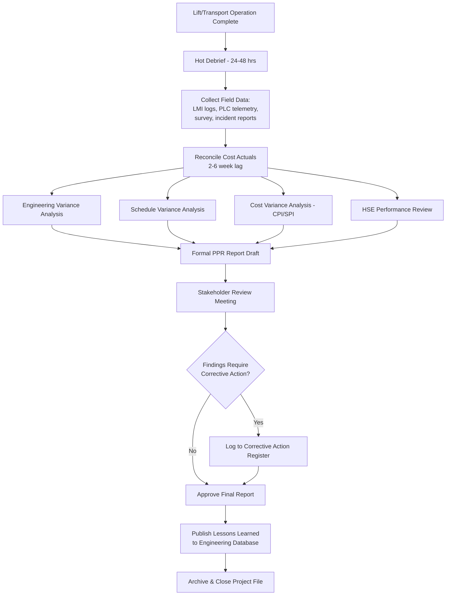
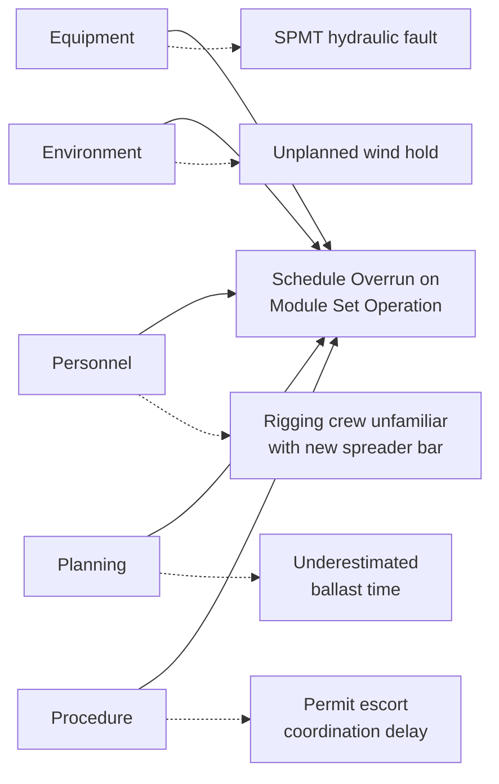

## Post-Project Review and Performance Evaluation

### Purpose and Scope

Post-project review (PPR) in heavy-lift and specialized logistics is the structured process of evaluating a completed lift, transport, or multi-modal move against its planned engineering, schedule, cost, and safety baselines. Unlike general project closeout in typical construction or logistics work, heavy-lift PPR carries elevated technical weight because the operation involved bespoke engineering (rigging plans, lift studies, route surveys), high-value single-point-of-failure equipment (SPMTs, crawler cranes, barges), and narrow safety margins where deviations can produce catastrophic outcomes.

The review serves four functions:

- **Technical validation** — confirming engineering assumptions (load charts, ground bearing pressure, rigging factors) matched field reality
- **Performance measurement** — quantifying schedule, cost, and productivity against baseline
- **Knowledge capture** — feeding lessons learned into the organizational engineering database for future lift studies
- **Accountability and compliance** — closing out permits, incident logs, and contractual deliverables

### Timing and Triggers

PPR is typically triggered by:

- Physical completion of the lift/transport/set operation (mechanical completion)
- Contractual milestone requiring formal sign-off (e.g., EPC handover)
- Regulatory closeout (permit surrender, road use agreement closure)
- Incident or near-miss occurrence, which may trigger an expedited review independent of the scheduled PPR

Best practice separates the review into two tiers:

| Tier | Timing | Focus |
| --- | --- | --- |
| Hot debrief | Within 24–48 hrs of lift completion | Immediate recall accuracy, crew safety observations, equipment condition |
| Formal PPR | 2–6 weeks post-completion | Full data reconciliation, cost actuals, engineering variance analysis |

The hot debrief is deliberately close to the event because rigging crews, crane operators, and engineers lose granular recall of decision points (wind hold thresholds, tag line adjustments, ground condition calls) rapidly. The formal PPR requires the lag time because cost data, weighbridge tickets, and third-party engineering sign-offs are rarely available immediately.

### Core Evaluation Dimensions

**1. Engineering Performance**

Compares as-planned versus as-executed lift parameters:

- Actual rigging configuration vs. the approved lift plan/lift study
- Crane radius, boom angle, and load chart utilization percentage actually achieved vs. planned
- Center of gravity (CoG) verification results vs. calculated CoG
- Ground bearing pressure (GBP) actuals (from mat/timber deflection or load cell data) vs. geotechnical allowable
- SPMT axle load distribution actuals vs. the transport engineering model

A key metric here is **utilization variance**:

$$U_{var} = \frac{U_{actual} - U_{planned}}{U_{planned}} \times 100\%$$

where $U$ is the percentage of rated capacity used at the critical lift radius. Significant positive variance (actual utilization higher than planned) is a red flag requiring root-cause investigation even if the lift was completed safely, since it indicates the engineering margin was smaller than intended.

**2. Schedule Performance**

- Planned vs. actual duration for each operational phase: mobilization, rigging/pick, transport/set, de-rig, demobilization
- Weather-hold hours vs. contingency allowance built into the schedule
- Critical path impact analysis — did the heavy-lift operation drive downstream project milestones

**3. Cost Performance**

Standard earned value metrics adapted for heavy-lift scope:

$$CPI = \frac{EV}{AC} \qquad SPI = \frac{EV}{PV}$$

where $EV$ = earned value (budgeted cost of work performed), $AC$ = actual cost, $PV$ = planned value. Heavy-lift-specific cost categories to isolate: crane/SPMT standby (idle) rates, permit and escort costs, engineering re-work costs, and equipment mobilization/demobilization as a percentage of total operation cost — mob/demob often represents 15–30% of total spend on remote or short-duration lifts, making it a primary target for future efficiency gains.

**4. HSE (Health, Safety, Environment) Performance**

- Total recordable incident rate (TRIR) for the operation, isolated from broader site statistics
- Near-miss and stop-work event log review — frequency, root cause categorization, and closure status
- Compliance verification: permit conditions, exclusion zone breaches, escort/pilot vehicle adherence for abnormal loads
- Environmental incidents (fuel spills, wetland/route damage, noise complaints from route communities)

**5. Stakeholder and Contractual Performance**

- Client satisfaction scoring (if formal survey used)
- Subcontractor/rigging house performance against SOW
- Permitting authority feedback (relevant for repeat corridor use)
- Insurance/warranty claim status arising from the operation

### Data Sources for the Review

| Data Source | Feeds Into |
| --- | --- |
| Lift plan / rigging study (as-approved) | Engineering variance |
| Load cell / dynamometer logs | Actual load verification vs. calculated |
| SPMT PLC telemetry (axle loads, steering angles) | Transport engineering variance |
| Crane LMI (Load Moment Indicator) data logs | Utilization and radius variance |
| Daily progress reports / toolbox talk records | Schedule and HSE narrative |
| Weighbridge tickets | Cargo weight verification |
| Survey data (GPS/total station) | Route deviation, final set position accuracy |
| Cost ledger / timesheets | CPI/SPI calculation |
| Incident/near-miss reports | HSE performance |
| Photographic/video documentation | Visual evidence for lessons learned |

**[Inference]** Telemetry availability varies significantly by equipment vintage and OEM — older crawler cranes and third-party-owned SPMT fleets may not log LMI or PLC data digitally, requiring manual reconciliation from operator logs, which reduces data granularity for the review.

### Structured Review Workflow

### Root Cause Analysis Techniques

When variance exceeds threshold (commonly ±10% on utilization, cost, or schedule), a formal root cause analysis is warranted. Two techniques dominate heavy-lift PPR practice:

**5-Why Analysis** — iterative causal drilling, appropriate for single-point deviations (e.g., "why did ground bearing pressure exceed allowable at pick point 3").

**Fishbone (Ishikawa) Diagram** — used for multi-factor variances (e.g., schedule overrun), organizing causes into categories: Equipment, Environment (weather/ground), Personnel, Planning/Engineering, and Procedure.

### Key Performance Indicators (KPI) Reference

| KPI | Formula / Definition | Target Benchmark (Industry Typical) |
| --- | --- | --- |
| Lift Utilization Accuracy | $ \lvert U_{actual} - U_{planned} \rvert $ | ≤ 5% variance |
| Schedule Variance (SV) | $EV - PV$ | ≥ 0 (on/ahead of schedule) |
| Cost Performance Index (CPI) | $EV / AC$ | ≥ 0.95 |
| Weather Downtime Ratio | Weather-hold hrs / Total operation hrs | ≤ Contingency allowance (typically 10–20%) |
| TRIR (operation-specific) | (Recordables × 200,000) / Hours worked | Company-specific; trending to zero |
| Mob/Demob Cost Ratio | Mob+Demob cost / Total operation cost | ≤ 25% (varies heavily by remoteness) |

**[Unverified]** The 25% mob/demob benchmark is a commonly cited industry rule of thumb rather than a formally standardized metric; actual acceptable ratios vary widely by project remoteness, equipment class, and contract structure.

### Example: PPR Summary Extract

**Example**

Operation: Single-lift installation of a 340-tonne reactor module, 750t crawler crane, tandem pick with 220t assist crane.

- Planned crane utilization at 28m radius: 82% of rated capacity. Actual (from LMI log): 88%. Variance: +7.3%, flagged for review.
- Root cause: as-built rigging hardware (shackles) added 1.2t over the engineering estimate, not captured in the original rigging study revision.
- Corrective action: mandate as-built rigging weight verification against the lift study prior to pick for all future tandem lifts >250t.
- Schedule: planned 14-hour lift window; actual 16.5 hours due to a 2-hour wind hold (within the 20% contingency) and a 0.5-hour tag line re-rig.
- Cost: CPI = 0.97 (slight overrun, driven by standby crane idle time during the wind hold).
- HSE: zero recordables; one near-miss logged (dropped tag line, no contact) — closed with revised tag line handling procedure.

### Lessons Learned Documentation Structure

A well-formed lessons-learned entry for the engineering database should capture, at minimum:

- **Context** — project type, load characteristics, equipment class
- **Observation** — what deviated from plan (quantified where possible)
- **Root cause** — from 5-Why or fishbone analysis
- **Impact** — safety, cost, schedule consequence
- **Recommendation** — specific, actionable change to procedure, engineering margin, or checklist
- **Applicability tag** — so future lift studies can be searched/filtered (e.g., "tandem lift," "soft ground," "SPMT axle overload")

This structured tagging is what separates a usable lessons-learned database from a static report archive — searchability by operation type is what allows engineers on future projects to actually retrieve relevant precedent during lift planning.

### Organizational Governance Diagram

<svg xmlns="http://www.w3.org/2000/svg" viewBox="0 0 760 320" font-family="Arial, sans-serif">
<text x="380" y="24" font-size="16" font-weight="bold" text-anchor="middle">PPR Governance Flow (svg_diagram)</text>
<rect x="20" y="60" width="160" height="60" rx="6" fill="#dbeafe" stroke="#1e3a8a" />
<text x="100" y="85" font-size="12" text-anchor="middle">Field Team</text>
<text x="100" y="102" font-size="11" text-anchor="middle">(Hot Debrief)</text>
<rect x="220" y="60" width="160" height="60" rx="6" fill="#dbeafe" stroke="#1e3a8a" />
<text x="300" y="85" font-size="12" text-anchor="middle">Lift Engineer</text>
<text x="300" y="102" font-size="11" text-anchor="middle">(Variance Analysis)</text>
<rect x="420" y="60" width="160" height="60" rx="6" fill="#dbeafe" stroke="#1e3a8a" />
<text x="500" y="85" font-size="12" text-anchor="middle">PM / Project Controls</text>
<text x="500" y="102" font-size="11" text-anchor="middle">(Cost/Schedule Data)</text>
<rect x="620" y="60" width="120" height="60" rx="6" fill="#dbeafe" stroke="#1e3a8a" />
<text x="680" y="85" font-size="12" text-anchor="middle">HSE Manager</text>
<text x="680" y="102" font-size="11" text-anchor="middle">(Incident Data)</text>
<line x1="100" y1="120" x2="300" y2="170" stroke="#333" stroke-width="1.5" />
<line x1="300" y1="120" x2="300" y2="170" stroke="#333" stroke-width="1.5" />
<line x1="500" y1="120" x2="300" y2="170" stroke="#333" stroke-width="1.5" />
<line x1="680" y1="120" x2="300" y2="170" stroke="#333" stroke-width="1.5" />
<rect x="210" y="170" width="180" height="50" rx="6" fill="#fef3c7" stroke="#92400e" />
<text x="300" y="200" font-size="12" text-anchor="middle">Formal PPR Report Draft</text>
<line x1="300" y1="220" x2="300" y2="250" stroke="#333" stroke-width="1.5" />
<rect x="180" y="250" width="240" height="50" rx="6" fill="#dcfce7" stroke="#166534" />
<text x="300" y="280" font-size="12" text-anchor="middle">Stakeholder Review &amp; Sign-off</text>
<line x1="420" y1="275" x2="600" y2="275" stroke="#333" stroke-width="1.5" />
<rect x="600" y="250" width="140" height="50" rx="6" fill="#ede9fe" stroke="#5b21b6" />
<text x="670" y="272" font-size="11" text-anchor="middle">Lessons Learned</text>
<text x="670" y="286" font-size="11" text-anchor="middle">Database</text>
</svg>

### Common Pitfalls

- Treating PPR as a compliance checkbox rather than an engineering feedback loop — findings never make it back into lift study templates
- Losing telemetry/log data due to equipment handover or subcontractor demobilization before extraction
- Conducting only the hot debrief and skipping the formal PPR, losing cost/schedule reconciliation entirely
- Failing to isolate heavy-lift-specific HSE statistics from whole-site statistics, diluting signal
- No standardized variance threshold, leading to inconsistent escalation of findings across projects

### Related Topics

- Lift Study and Rigging Engineering Documentation
- Earned Value Management for Heavy-Lift Projects
- SPMT Telemetry and PLC Data Logging Systems
- Root Cause Analysis Methods in Industrial Operations
- HSE Incident Investigation and Reporting Frameworks
- Engineering Lessons-Learned Database Design
- Abnormal Load Permit Closeout Procedures