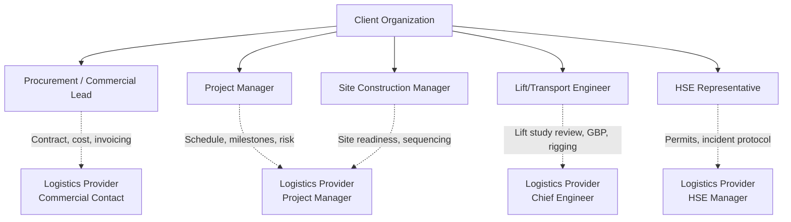
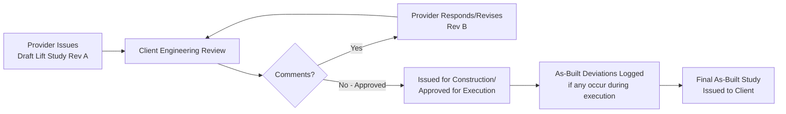

## Client Relationship Management in Project Logistics

### Purpose and Scope

Client Relationship Management (CRM) in project logistics — as distinct from general sales CRM — refers to the structured governance of communication, expectation-setting, and trust-building between a heavy-lift/specialized logistics provider and the client (EPC contractor, owner-operator, or freight forwarder acting as intermediary) across the full project lifecycle. Heavy-lift operations carry unusually high financial and schedule exposure per shipment — a single module delay can idle a construction crew of hundreds — which makes CRM in this domain closer to risk communication management than conventional account management.

The discipline spans four lifecycle phases:

- **Pre-award** — proposal, technical clarification, trust establishment
- **Mobilization/Planning** — engineering review cycles, permit coordination visibility
- **Execution** — real-time status reporting, deviation/change management
- **Post-completion** — performance review, relationship continuity for repeat business

### Why CRM Is Structurally Different in Heavy-Lift Logistics

| Factor | Standard Logistics CRM | Heavy-Lift/Project Logistics CRM |
| --- | --- | --- |
| Shipment value | Low-to-moderate per unit | Often single cargo pieces worth $1M–$100M+ |
| Client technical sophistication | Variable | High — client often has own engineering team reviewing lift plans |
| Communication frequency | Transactional, as-needed | Continuous during critical operations (hourly during lifts) |
| Failure consequence | Delay, cost | Schedule cascade to entire construction project, safety exposure |
| Relationship duration | Often single transaction | Multi-year framework agreements common |
| Decision-makers involved | Procurement | Procurement + engineering + HSE + project controls |

### Core Stakeholder Mapping

Effective CRM requires mapping distinct client-side roles, since each has different information needs:

**[Inference]** Misalignment often arises when the logistics provider routes all communication through a single commercial contact rather than maintaining direct engineer-to-engineer and HSE-to-HSE channels; heavy-lift clients typically expect technical peer-to-peer contact rather than filtered relay through account management.

### Communication Governance Framework

**1. Communication Plan (established at kickoff)**

A formal communication plan for a heavy-lift project typically defines:

| Element | Typical Specification |
| --- | --- |
| Reporting cadence | Daily situation report during active mobilization/execution; weekly during planning |
| Escalation matrix | Defined trigger thresholds (e.g., >24hr schedule slip triggers PM-to-PM call) |
| Critical operation protocol | Real-time updates during lift/transport windows (e.g., every 2 hrs or at defined milestones) |
| Change management channel | Formal RFI/variation process for scope or engineering deviations |
| Single source of truth | Shared document control platform (Aconex, SharePoint, Procore, or project-specific portal) |

**2. Daily/Weekly Progress Reporting**

Standard structure for a heavy-lift daily situation report (DSR):

- Operation status (planned vs. actual activity)
- Weather conditions and forecast impact on upcoming lift windows
- Equipment status/availability
- HSE summary (incidents, near-misses, observations)
- Upcoming 24–72 hour lookahead
- Open issues/risks requiring client input or decision

**3. Escalation Protocol**

A defined escalation matrix prevents ad hoc, inconsistent communication during deviations:

| Severity | Example Trigger | Response Time | Escalation Level |
| --- | --- | --- | --- |
| Low | Minor schedule slip (<8 hrs), no cost impact | Next DSR | Site team |
| Medium | Engineering deviation requiring re-approval | 4 hrs | PM-to-PM |
| High | Safety incident, major schedule slip (>48 hrs) | Immediate (1 hr) | Senior leadership |
| Critical | Loss of cargo/equipment, injury, regulatory breach | Immediate | Executive/legal |

### Expectation Management and the Engineering Review Cycle

A significant share of client relationship friction in heavy-lift logistics originates in the lift/transport study review cycle rather than in execution itself. Best practice structures this as a formal, versioned review:

Setting expectations on review cycle duration up front (e.g., "5 business days per revision cycle, typically 2 cycles to approval") prevents perceived unresponsiveness from becoming a trust issue. **[Inference]** Clients unfamiliar with heavy-lift engineering timelines sometimes expect approval turnaround comparable to standard logistics documentation, so explicitly framing the engineering review cadence during contract kickoff reduces later friction.

### Change and Variation Management

Heavy-lift operations frequently encounter field conditions that diverge from the original engineering basis (soil conditions, as-built cargo weight/CoG, site access constraints). CRM discipline requires that these be handled through a transparent, documented variation process rather than informal field adjustments:

- **Trigger identification** — field team or engineer identifies deviation from baseline
- **Impact assessment** — cost, schedule, and safety impact quantified before client notification
- **Client notification** — formal variation notice issued, not verbal-only
- **Client decision point** — approve, request alternative, or escalate
- **Documentation** — variation logged in the project's change register, referenced in final as-built documentation

This structure protects both parties commercially and is often a contractual requirement under FIDIC-based or similar heavy-civil/EPC contract frameworks, where undocumented verbal instructions can create disputed claims.

### Trust-Building Mechanisms Specific to This Domain

**Key Points**

- **Site visibility** — inviting client engineering/HSE representatives to witness critical lifts builds confidence beyond written reporting
- **Joint risk workshops** — pre-lift HAZID/HAZOP sessions conducted jointly with client representation rather than presented as a finished document
- **Transparent incident reporting** — proactively disclosing near-misses (not just recordable incidents) signals safety culture maturity and tends to strengthen long-term trust more than a spotless-looking report that later proves incomplete
- **Post-project review participation** — inviting the client into the formal PPR process (rather than only delivering a report) reinforces partnership positioning for repeat/framework contracts

### Framework Agreements and Long-Term Relationship Structuring

For clients with recurring heavy-lift needs (e.g., EPC contractors executing multiple modules across a program, or utility-scale wind/oil & gas operators), CRM extends into commercial structuring:

| Mechanism | Purpose |
| --- | --- |
| Master Service Agreement (MSA) | Establishes standard terms, rate cards, liability framework across multiple projects |
| Call-off/framework contracts | Allows rapid mobilization without re-negotiating full contract each time |
| Dedicated account engineering team | Continuity of technical knowledge across a client's project portfolio |
| Joint lessons-learned register | Shared (not just internal) database of what worked/didn't across prior projects with that client |

### Example

**Example**

An EPC contractor engages a heavy-lift provider for six reactor module installations across an 18-month program. After the first module lift experiences a 30-hour weather-driven schedule slip, the client's construction team escalates directly to executive leadership, bypassing the established PM-to-PM channel, indicating the escalation matrix was not clearly communicated at kickoff.

Corrective action: the logistics provider re-issues the communication plan with a signed acknowledgment from all client stakeholder roles (not just procurement), and introduces a joint weekly call including the client's site construction manager — a role that had been excluded from the original communication plan despite being the most schedule-sensitive stakeholder. Subsequent modules experience similar weather holds without escalation friction, because the construction manager now receives forecast-driven advance notice directly.

### Common Pitfalls

- Routing all technical communication through commercial/sales contacts, bypassing engineer-to-engineer channels the client expects
- No formal escalation matrix, leading to ad hoc executive escalation on minor issues
- Treating the lift study review cycle as a formality rather than setting explicit timeline expectations
- Verbal-only handling of field deviations, creating later contractual disputes
- Excluding client HSE or site construction stakeholders from the communication plan
- Delivering the post-project review as a finished report rather than a collaborative session

### Related Topics

- Post-Project Review and Performance Evaluation
- Change and Variation Management in Heavy-Lift Contracts
- HAZID/HAZOP Workshop Facilitation for Lift Operations
- Contractual Frameworks in Project Logistics (FIDIC and EPC Structures)
- Stakeholder Escalation Matrix Design
- Master Service Agreements for Recurring Heavy-Lift Programs