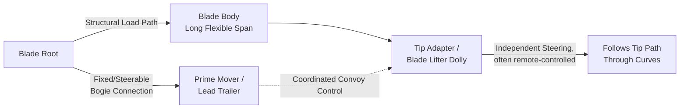
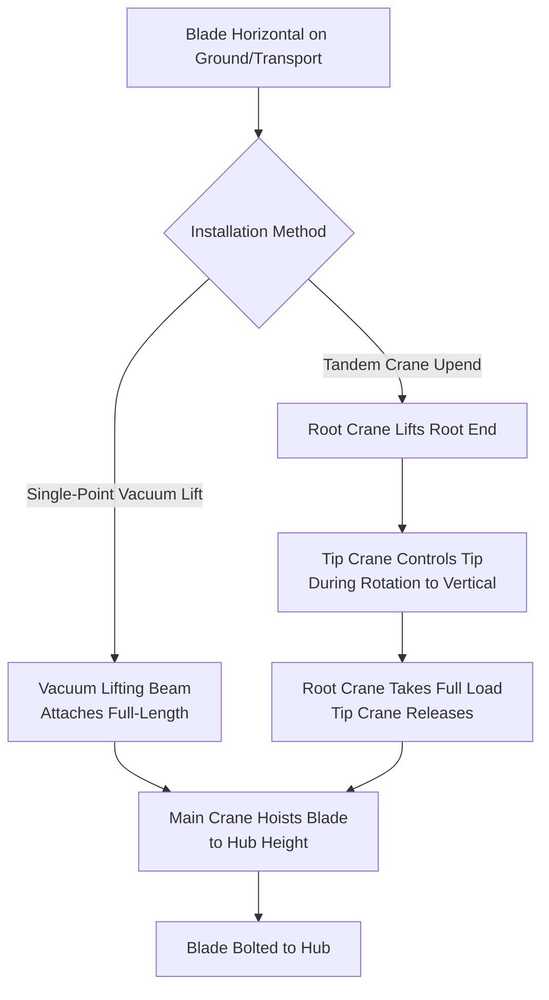

## Blade Transport Challenges and Lifting Point Design

### Purpose and Scope

Wind turbine blade transport and lifting represent one of the most engineering-intensive niches within heavy-lift and specialized logistics due to the combination of extreme length (modern utility-scale blades exceed 80–115m), low structural mass relative to length, aerodynamic sensitivity to wind loading during handling, and increasingly constrained road/rail geometry as blades outgrow legacy infrastructure. This section covers road/rail/marine transport challenges and the engineering basis for lifting point (pick point) design used in installation and intermediate handling.

### Blade Scale Trends and Why They Matter

| Generation | Typical Blade Length | Typical Onshore Turbine Rating |
| --- | --- | --- |
| Early utility-scale (2000s) | 35–45m | 1.5–2 MW |
| Mid-2010s onshore | 55–65m | 3–4 MW |
| Current onshore | 65–80m | 4–6 MW |
| Current offshore | 90–115m+ | 12–18 MW |

**[Inference]** As blade length has grown roughly linearly with rated power while mass has grown more slowly due to advanced composite and hybrid glass/carbon fiber construction, modern blades exhibit a lower mass-to-length ratio than earlier generations, which increases flexural sensitivity during transport and lifting rather than reducing handling difficulty.

### Transport Mode Challenges

**1. Road Transport**

Road transport is constrained primarily by geometry, not mass — a 75m blade may weigh only 20–25 tonnes but requires swept-path clearance far exceeding standard abnormal load envelopes.

Key constraints:

- **Turning radius / swept path** — blade root end typically mounted on a fixed or steerable trailer bogie; tip end often mounted on a self-steering or remotely-steered dolly (blade adapter/blade lifter trailer) to independently track the tip through curves
- **Overhead clearance** — bridges, power lines, signage; blade root diameter (often 3–4.5m) governs vertical clearance, not just trailer height
- **Roundabouts and intersections** — frequently require temporary infrastructure removal (signage, traffic islands) or purpose-built bypass routes
- **Route survey requirements** — full swept-path simulation software (AutoTURN or equivalent) is standard practice, modeling the specific trailer/dolly combination against every curve, intersection, and elevation change on the route

**2. Rail Transport**

Less common than road but used where corridor rail infrastructure exists, primarily for component pre-positioning to regional marshalling yards before final road delivery:

- Constrained by rail gauge, curve radii, and tunnel/overhead clearance (similar geometric logic to road, different limiting infrastructure)
- Blade cradles/saddles designed for rail flatcars must accommodate the blade's natural sag and prevent point-loading of the composite shell

**3. Marine/Port Transport**

For offshore wind and coastal onshore projects, blades typically move via specialized vessels:

- **Feeder vessels** to port marshalling areas, then **installation vessels** (jack-up or heavy-lift vessels) for final turbine installation
- Blade stacking/cradle systems on deck must account for vessel motion (pitch, roll, heave) — dynamic loading during transit can exceed static handling loads
- Port-side lay-down and pre-assembly areas require specialized blade racking systems to avoid ground contact deflection over long unsupported spans

### Transport Trailer Configurations

The tip adapter (often marketed under names like the "Blade Lifter" or similar OEM systems) is a self-propelled or towed steerable dolly that clamps the blade tip and actively steers to keep the tip tracking the intended path independently of the root-end trailer — this decouples the extreme length from requiring proportionally wide swept paths, since without it, a rigid connection would demand impractically wide road corridors on any curve.

### Wind Loading During Transport and Handling

Because blades present a large surface area with an airfoil cross-section, wind loading is a primary operational constraint distinct from most heavy-lift cargo:

- Aerodynamic lift/drag forces on the blade surface can induce torsional and flexural loads not present in static structural analysis
- Crosswind thresholds for road transport are typically defined in the transport engineering study and enforced operationally (common industry thresholds fall in the range of 15–20 m/s sustained, though **[Unverified]** exact thresholds are project- and OEM-specific and not standardized across the industry)
- During crane lifting, wind speed limits are governed by the crane manufacturer's load chart derating AND by blade-specific aerodynamic sensitivity — blades often have lower operational wind limits than the crane's rated limit due to their sail area

### Lifting Point Design Fundamentals

Blade lifting points (pick points) are engineered attachment locations — either purpose-built lifting lugs bonded/bolted into the blade structure at manufacture, or removable lifting yokes/clamps used only during handling — designed to introduce lift loads into the blade's structural load path without inducing damaging local stress concentrations in the composite shell.

**Design approach categories:**

| Method | Description | Typical Use |
| --- | --- | --- |
| Integrated lifting inserts | Threaded inserts or lugs embedded in the blade root/spar during manufacture | Root-end lift point, factory-engineered |
| Vacuum lifting systems | Vacuum pads distributed along blade surface, engineered to distribute suction load over a wide area | Full-length lift during installation (common for single-blade installation methods) |
| Mechanical clamp/yoke systems | Structural clamps gripping the blade at engineered clamp zones (root and/or mid-span) | Tandem or dual-point lifts, upending operations |
| Tip and root dual-point rigging | Combination sling/spreader bar system connecting root lug and a tip-mounted clamp | Upending from horizontal transport to vertical hoist orientation |

### Structural Considerations for Lift Point Location

The blade is a cantilevered, tapering composite structure — its bending stiffness ($EI$) decreases substantially from root to tip. Lift point placement must respect several structural principles:

1. **Load path alignment** — lift points at the root should align with the main spar cap, the blade's primary bending load-carrying structural element, to avoid inducing shell peel or skin buckling
2. **Bending moment minimization during single-point lifts** — for a uniformly (or near-uniformly) loaded cantilever picked at a single point, the maximum bending moment at any location during the lift depends heavily on pick point position relative to the blade's center of gravity and length; poor pick point placement can induce moments exceeding the design envelope even though the blade safely withstands equivalent aerodynamic loads in service (a different load case entirely)
3. **Local stress concentration control** — vacuum pad and clamp systems are engineered to distribute load over a wide contact area specifically to avoid point-loading the thin composite shell, which is not designed to carry concentrated transverse loads

For a simplified single-point lift approximation treating the blade as a cantilever beam with distributed self-weight $w$ (load per unit length) picked at distance $a$ from the root:

$$M_{max} = \frac{w L^2}{8} \quad \text{(uniform beam, optimal pick point at mid-span for two-point support)}$$

**[Inference]** Real blade lifts rarely use this simplified uniform-load model directly in final engineering, since actual mass distribution along a tapered composite blade is non-uniform (heavier near root) and rigging engineers use blade-specific mass distribution data provided by the OEM combined with FEA (finite element analysis) rather than closed-form beam formulas; the simplified formula above is illustrative of the underlying mechanics only, not a substitute for OEM/engineering-firm-certified lift analysis.

### Tandem and Dual-Crane Blade Lifts

For blade installation where a single-point vacuum or root-lift system is unavailable or unsuitable (older turbine models, specific installation methods, or upending operations), tandem lifts using two cranes — one at the root, one at the tip — are used:

Tandem lift load-sharing between the two cranes must be continuously monitored (typically via load cells on each crane's rigging) since the load distribution between root and tip cranes changes dynamically throughout the upending rotation — a fixed 50/50 assumption is generally invalid as the blade angle changes relative to vertical.

### Key Engineering and Operational Considerations

**Key Points**

- Swept-path engineering (not payload weight) is typically the primary road transport constraint for blades
- Tip-steering dolly systems decouple blade length from swept-path width requirements
- Wind loading during lift is governed by blade aerodynamic sensitivity, often more restrictive than crane-rated wind limits
- Lift point design must align with the spar cap load path, not just blade geometry center
- Vacuum and distributed-clamp lifting systems exist specifically to avoid point-loading the composite shell
- Tandem crane load share is dynamic throughout an upending lift and requires active monitoring, not static assumption

### Example

**Example**

A 68m onshore blade transport route includes a rural intersection with a 90° turn and roadside utility poles. Swept-path simulation shows the standard root-trailer/tip-dolly configuration requires temporary removal of two guardrail sections and coordinated tip-dolly steering input timed to the convoy's speed through the turn. The transport engineering package specifies a maximum sustained wind speed of 15 m/s for movement through this specific curve segment (lower than the route-average threshold) due to increased blade sail-area exposure to crosswind while the convoy is at reduced speed and the tip is laterally offset from the root path during the turn.

### Common Pitfalls

- Using generic abnormal-load swept-path assumptions instead of trailer/dolly-specific simulation
- Underestimating wind loading as a transport constraint because blade mass is comparatively low
- Treating vacuum lift pad placement as flexible when it must align with OEM-specified structural zones
- Assuming static 50/50 load share in tandem crane upending lifts without load cell verification
- Failing to obtain OEM blade-specific mass distribution data before finalizing lift engineering, relying instead on generic uniform-beam assumptions

### Related Topics

- Nacelle and Hub Lifting Engineering for Wind Turbine Installation
- Swept-Path Analysis and Abnormal Load Route Surveys
- Tower Section Transport and Stacking Considerations
- Offshore Wind Component Marshalling and Port Logistics
- Crane Load Chart Derating for Wind-Sensitive Cargo
- Vacuum Lifting System Design and Certification