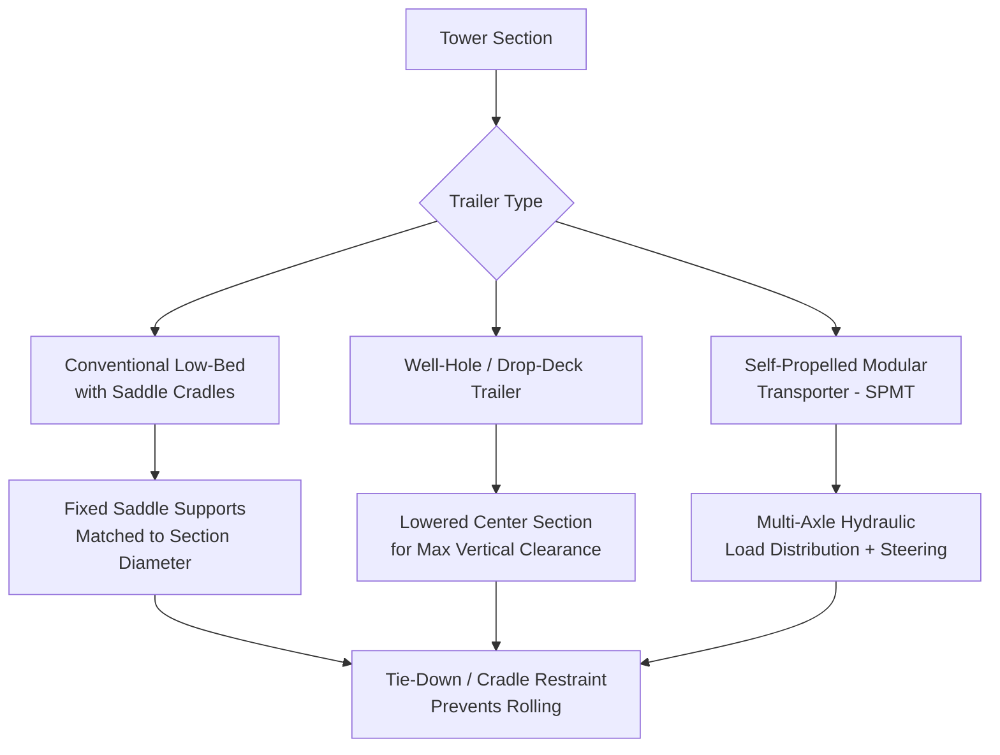

## Tower Section Transport and Dolly Systems

### Purpose and Scope

Wind turbine tower sections present a fundamentally different transport engineering problem than blades: instead of extreme length with low mass, tower sections are large-diameter, high-mass, relatively rigid cylindrical or conical steel structures. The governing constraints shift from swept-path/aerodynamic sensitivity to diameter clearance, axle loading, and structural ovalization control. This section covers road/rail/marine transport methods and the dolly/trailer systems purpose-built for tower section handling.

### Tower Section Characteristics Driving Transport Design

| Parameter | Typical Range (Modern Onshore) | Transport Implication |
| --- | --- | --- |
| Section diameter (base) | 4.0–4.5m+ (trending larger) | Governs height/width clearance envelope |
| Section diameter (top) | 2.5–3.5m | Less constraining but still oversize |
| Section length | 20–30m per section | Governs trailer bed length requirement |
| Section mass | 40–90 tonnes | Governs axle configuration and GBP |
| Sections per tower | Typically 3–5 | Multiplies logistics volume per turbine |
| Wall thickness | 20–50mm (varies by section/height) | Affects structural rigidity assumptions during transport |

**[Inference]** As hub heights have increased to capture higher and more consistent wind resources, base tower section diameters have grown toward or beyond standard road transport envelope limits in many jurisdictions, which is a primary driver behind the adoption of segmented/sectioned towers, "diameter-reducing" transport techniques, and alternative tower technologies (e.g., precast concrete or hybrid steel-concrete towers) in some markets — though the specific threshold varies by country/road authority.

### Road Transport Constraints

**1. Diameter and Clearance**

Base tower sections frequently approach or exceed standard oversize load width and height allowances, requiring:

- Route survey confirming bridge underpass clearance (critical — tower diameter often exceeds standard underpass height when mounted at standard trailer deck height)
- Specialized low-bed or well-hole trailers that lower the effective deck height to maximize available vertical clearance
- In constrained corridors, some projects use **diameter-reduced or flat-packed tower sections** (bolted or field-welded segmented plate towers) specifically to avoid road transport diameter limits — this is a structural/manufacturing decision made upstream of logistics, driven directly by transport constraints

**2. Axle Loading and Ground Bearing**

Given tower section masses of 40–90+ tonnes concentrated over a relatively short, rigid load, axle configuration must be engineered per bridge and road authority weight restrictions:

- Modular hydraulic trailers or fixed-axle heavy-haul trailers distribute load across multiple axle lines
- Bridge formula compliance (axle spacing vs. load) governs trailer configuration on public roads in most jurisdictions
- Turning/cornering loads on the trailer's steering axles must be checked against dynamic (not just static) load cases at tight intersections

**3. Center Section Handling — the "Dolly" Problem**

Tower sections do not have a natural "front/back" load-bearing point the way a blade does — the challenge is instead rotational stability of a large-diameter cylinder on a moving trailer bed, and the need for the trailer/dolly system to physically cradle a curved surface without point-loading the shell plate.

### Tower Section Transport Trailer/Dolly Configurations

**Saddle/cradle design** — tower sections rest in curved saddle supports (often adjustable or diameter-matched) that distribute the section's weight across a wide contact arc rather than a line or point contact, protecting the shell plate from local deformation and preventing rolling motion during transport. Cradle design must account for the taper between sections (each section has a different top/bottom diameter), so saddles are frequently custom-fitted or adjustable per section type.

**Tie-down and restraint** — chain or strap restraint systems secure the section against longitudinal shift (braking/acceleration) and lateral shift (cornering), engineered against dynamic load factors specified in the applicable heavy-haul transport regulation (load securement standards vary by jurisdiction — e.g., in North America this follows FMCSA cargo securement rules; other regions follow their own national/regional heavy-haul codes).

### Rail Transport for Tower Sections

Where rail infrastructure allows, tower sections are sometimes moved via specialized flatcars or well cars:

- Rail clearance (loading gauge) constraints are analogous to road but governed by rail corridor infrastructure rather than road authority limits
- Rail transport is generally more economical for long-distance movement but requires road transport for the final mile from rail siding to site, so route planning must account for a transload/marshalling step
- Section orientation and cradle design on rail cars follow similar structural logic to road (wide-arc support, restraint against shift)

### Marine and Port Transport

For coastal projects or offshore wind foundation-adjacent tower sections:

- Deck stowage on feeder or heavy-lift vessels uses similar cradle logic, adapted for vessel motion (pitch/roll/heave) rather than road dynamics
- Stacking multiple sections (where geometry allows nesting of tapered sections) is sometimes used to maximize vessel deck utilization, requiring engineered dunnage/stacking frames rather than direct steel-on-steel or steel-on-deck contact

### Route Survey and Diameter-Specific Considerations

Unlike blade route surveys (dominated by swept-path/turning geometry), tower section route surveys weight differently:

| Survey Focus | Blade Transport | Tower Section Transport |
| --- | --- | --- |
| Swept path / turning radius | Primary constraint | Secondary (shorter, more rigid load) |
| Vertical clearance (bridges, wires) | Moderate concern | **Primary constraint** — diameter drives height |
| Axle/bridge load rating | Low mass — minor concern | **Primary constraint** — high concentrated mass |
| Wind loading sensitivity | High (large sail area) | Low (relatively low surface-area-to-mass ratio) |
| Road width restrictions | Moderate | High (large diameter often exceeds standard width) |

### Lifting and Installation Handoff

Tower section lifting for stacking/erection uses different rigging logic than blade lifting:

- Lift points are typically pre-engineered lifting lugs welded to the section's top flange or internal structure, positioned symmetrically to maintain the section in a level, vertical orientation during hoist
- Multi-point sling configurations (commonly 3- or 4-point) distribute load evenly around the flange circumference to avoid inducing bending or ovalization of the cylindrical shell during lift
- Section-to-section bolting at the flange connection requires precise rotational alignment during placement — rigging crews use tag lines and sometimes guide pins to control final rotational positioning before bolt-up

$$\sigma_{hoop} \approx \frac{F}{n \cdot A_{lug}}$$

where $F$ is the total lift load, $n$ is the number of lift points, and $A_{lug}$ is the effective bearing area per lug — lift point count and spacing are engineered to keep local flange stress within allowable limits while also controlling section ovalization (out-of-roundness) during the lift, since excessive ovalization at the connecting flange can prevent proper bolt alignment with the adjoining section.

### Key Operational Considerations

**Key Points**

- Diameter/height clearance, not turning geometry, is typically the primary road transport constraint for tower sections
- Saddle/cradle design must distribute load across a wide contact arc to avoid point-loading the shell plate
- Axle configuration and bridge formula compliance are driven by high concentrated section mass, unlike blade transport
- Diameter-reduced or segmented tower designs are sometimes a direct engineering response to road transport constraints, not purely a structural choice
- Lift point (lug) configuration must control both load capacity and ovalization to preserve bolt-hole alignment at flange connections
- Rail transport typically requires a road transload step for final-mile delivery

### Example

**Example**

A project specifies 4.3m base-diameter tower sections for a site requiring transport along a route with a 4.5m-clearance underpass at standard trailer deck height. The transport engineer specifies a well-hole (drop-deck) trailer that lowers the section's centerline by 0.4m relative to a conventional low-bed, restoring adequate clearance margin without requiring a route diversion. Saddle cradles are custom-matched to the 4.3m section diameter, with tie-down chains rated and configured per the regional heavy-haul securement code to resist the calculated dynamic lateral load factor for the route's tightest curve.

### Common Pitfalls

- Assuming turning-radius swept-path analysis (as used for blades) is the primary constraint, when vertical/width clearance typically dominates for tower sections
- Using generic (non-diameter-matched) cradle saddles, risking point-loading and local shell deformation
- Underestimating axle loading requirements due to the section's compact (non-elongated) footprint concentrating mass over fewer axle lines
- Failing to verify bridge weight ratings specifically for the trailer's loaded axle configuration, not just gross combination weight
- Neglecting rotational alignment control during lift, resulting in flange bolt-hole misalignment at connection

### Related Topics

- Blade Transport Challenges and Lifting Point Design
- Nacelle and Hub Lifting Engineering for Wind Turbine Installation
- Segmented and Diameter-Reduced Tower Technologies
- Bridge Formula Compliance and Axle Load Distribution for Heavy Haul
- Rail-to-Road Transload Planning for Oversize Components
- Cargo Securement Standards for Heavy-Haul Transport