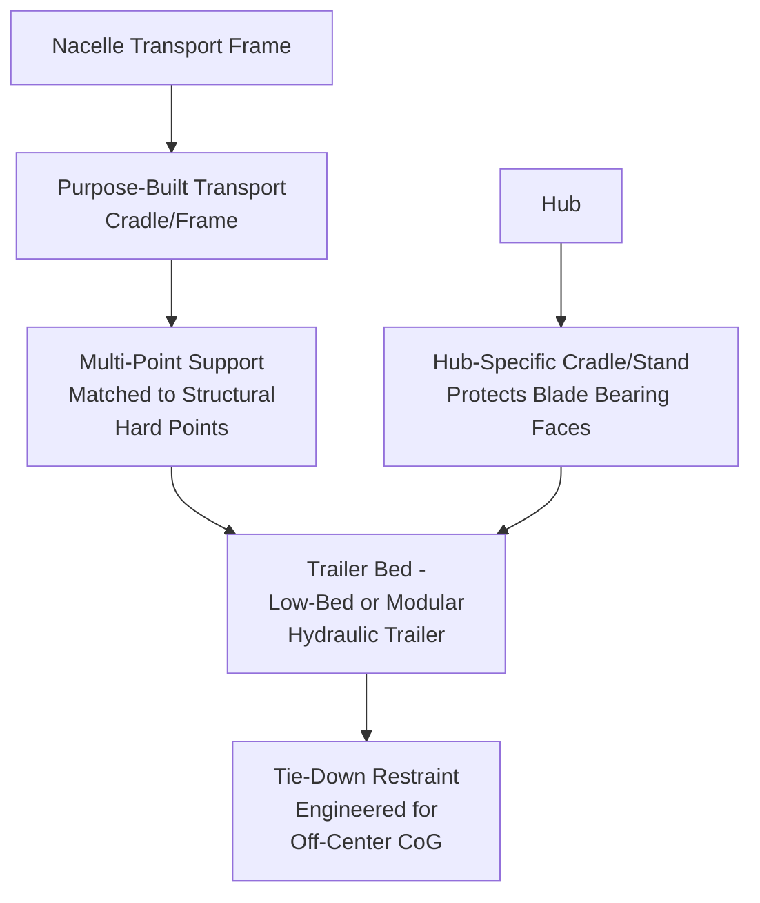
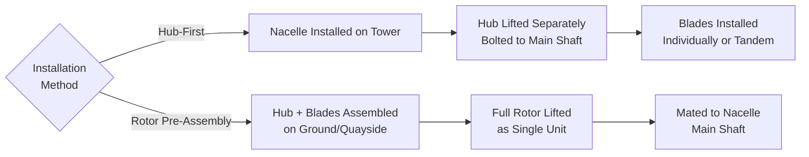

## Nacelle and Hub Transport Considerations

### Purpose and Scope

The nacelle and hub represent the highest-value, most mechanically complex components in wind turbine logistics. Unlike blades (length-dominated) or tower sections (diameter/mass-dominated), nacelle and hub transport challenges center on concentrated high mass in a compact envelope, sensitive internal machinery (gearbox, generator, main bearing, power electronics), and precise CoG-based rigging requirements for both transport securement and final lift. This section covers road/rail/marine transport methods, packaging/protection considerations, and lifting engineering for these two components.

### Component Characteristics

| Parameter | Nacelle (Onshore, Modern) | Hub (Onshore, Modern) |
| --- | --- | --- |
| Mass | 60–120+ tonnes (varies widely by rating/drivetrain type) | 20–45 tonnes |
| Envelope | Large rectangular/housing shape, ~10–14m long | Compact, roughly spherical/cylindrical, 4–6m diameter |
| CoG characteristics | Often significantly offset from geometric center due to internal drivetrain layout | Relatively concentrated but asymmetric due to blade bearing mounts |
| Sensitivity | High — contains gearbox (geared designs), generator, main bearing, control electronics | Moderate — primarily structural casting/weldment, but blade bearing surfaces are precision-machined |
| Transport orientation | Fixed — as-designed orientation, rarely rotated | Fixed — often transported with blade-mounting faces protected |

**[Inference]** Direct-drive turbine architectures, which eliminate the gearbox, tend to concentrate more mass in the generator/nacelle assembly and may shift CoG characteristics relative to geared designs, though exact figures are highly OEM- and platform-specific and not standardized across the industry.

### Why CoG Management Dominates Nacelle Transport Engineering

The nacelle houses an asymmetric internal arrangement of heavy components — main shaft, gearbox (if geared), generator, and yaw/pitch control systems — none of which are centered within the nacelle's external housing geometry. This creates two compounding engineering requirements:

1. **Transport securement** must account for an off-center CoG when calculating restraint loads and trailer/saddle support point placement, since a symmetric restraint assumption on an asymmetric mass can under- or over-load individual tie-down points
2. **Lift rigging** for final installation must use OEM-specified lift points and often a calibrated spreader bar or lift beam specifically designed to compensate for the known CoG offset, ensuring the nacelle hangs level (or at the specific orientation required for hub/drivetrain alignment during mating) rather than tilting during hoist

$$x_{CoG} = \frac{\sum m_i x_i}{\sum m_i}$$

OEM-supplied technical documentation for each nacelle model specifies the certified CoG location (relative to defined reference datums) precisely because this cannot be reliably estimated from external geometry alone — rigging engineers use this OEM data as the basis for lift point loading calculations rather than deriving it independently.

### Transport Trailer and Restraint Configuration

**Transport frame/cradle** — nacelles are rarely secured directly to a flatbed; a purpose-built structural transport frame (sometimes OEM-supplied, sometimes engineered by the logistics provider) interfaces with the nacelle's designated structural hard points (main frame lift/support lugs), distributing load appropriately and protecting the housing and internal components from transport-induced stress or vibration.

**Hub cradle** — hub transport stands or cradles are designed specifically to support the hub without contact on the precision-machined blade bearing mounting faces, since surface damage to these interfaces can compromise blade attachment fit and bearing seal integrity at installation.

### Road Transport Constraints

Unlike blades and tower sections, nacelle/hub road transport is generally less constrained by extreme geometry (nacelles fit within more conventional oversize envelopes in most cases) but more constrained by:

- **Concentrated axle loading** — high mass over a compact footprint requires careful axle spread/count engineering, often using modular hydraulic trailers for larger nacelles to distribute load and enable precise weight distribution tuning
- **Vibration and shock sensitivity** — internal precision components (bearings, gearbox internals, electronics) are more sensitive to transport-induced vibration and shock loading than the comparatively simple structural mass of a tower section or blade; some OEMs specify maximum acceleration/shock thresholds for transport, monitored via onboard shock-logging devices during transit
- **Environmental protection** — electronics and precision-machined surfaces (main bearing, yaw bearing interface) often require weatherproof covering/wrapping during transport, distinct from the largely weather-tolerant transport of raw tower steel

### Rail and Marine Transport

**Rail** — nacelle transport by rail is less common than tower sections due to the specialized cradle/frame requirements and lower frequency of true rail-direct routing to wind sites, but is used on projects with suitable corridor access, typically requiring the same transload-to-road final-mile step as other components.

**Marine (offshore and coastal onshore)** — nacelle and hub transport by vessel requires securement systems engineered for dynamic vessel motion loads (pitch/roll/heave), generally more demanding than static road transport restraint calculations. For offshore wind, nacelles are frequently pre-assembled with the hub (and sometimes one or more blades, in "bunny-ear" or fully pre-assembled rotor-nacelle-assembly configurations) at the marshalling port specifically to reduce offshore installation vessel time, shifting significant lifting/rigging complexity from the offshore installation phase to the quayside phase.

### Lifting Engineering for Installation

**1. Nacelle Lift**

- Nacelle lift points are OEM-designated structural lugs or padeyes on the main frame, engineered by the OEM specifically for hoisting loads (distinct from the transport frame interface points)
- A calibrated lift beam or spreader bar is commonly used to manage the known CoG offset, ensuring the nacelle is presented to the tower top in the correct orientation for yaw bearing alignment and bolt-up
- Crane selection accounts for hook height (tower height + nacelle height + rigging clearance) as the primary radius/capacity driver, since nacelle mass alone is rarely the limiting factor for modern heavy-lift cranes at typical hub heights — reach and hook height are usually the binding constraint

**2. Hub Lift**

- Hub lift configuration depends on installation sequence: hub-first (hub lifted and mounted to nacelle after nacelle is on tower) versus rotor pre-assembly (hub and blades assembled on ground, lifted as a unit)
- Hub-only lifts use lift points engineered around the hub casting/weldment structure, positioned to avoid loading the blade bearing mounting faces
- Rotor (hub + blades) lifts are substantially more complex due to the large asymmetric sail area introduced by the attached blades, requiring tighter wind speed limits and often specialized lifting yokes engineered specifically for the assembled rotor's combined CoG and aerodynamic profile

**[Inference]** Rotor pre-assembly is more common in offshore installation (where vessel time is extremely costly and quayside assembly time is comparatively cheap) than in onshore installation, though method selection ultimately depends on crane availability, wind conditions, and project-specific engineering rather than a fixed industry rule.

### Key Operational Considerations

**Key Points**

- CoG offset, not gross mass, is typically the dominant engineering driver for both nacelle transport restraint and lift rigging
- OEM-certified CoG and lift point data is the required basis for rigging engineering — it is not reliably derivable from external geometry
- Nacelle transport frames and hub cradles are purpose-built to protect structural hard points and precision-machined surfaces respectively
- Hook height/reach, not nacelle mass, is usually the binding constraint on crane selection for nacelle lifts on modern turbines
- Rotor pre-assembly shifts lifting complexity from installation-site (crane) work to quayside/ground work, particularly favored offshore
- Vibration/shock sensitivity of internal components requires transport monitoring beyond what tower or blade transport typically requires

### Example

**Example**

A 5 MW geared onshore nacelle (approximately 85 tonnes) is transported via modular hydraulic trailer due to its concentrated mass and the OEM-specified maximum axle load per contact point. The OEM technical package specifies a CoG offset of 1.2m toward the generator end relative to the nacelle's geometric center; the transport engineer configures asymmetric tie-down point loading calculations accordingly rather than assuming a centered load. At installation, a calibrated spreader bar compensates for the same CoG offset, presenting the nacelle level to the crane hook and ensuring correct yaw bearing alignment orientation when mated to the tower top.

### Common Pitfalls

- Assuming nacelle CoG is centered within the housing geometry rather than obtaining OEM-certified CoG data
- Using generic tie-down restraint calculations that don't account for asymmetric mass distribution
- Contacting or loading precision-machined bearing surfaces (main bearing, yaw bearing, blade bearing mounting faces) with non-dedicated cradle equipment
- Underestimating vibration/shock sensitivity of internal drivetrain and electronic components during road transport
- Selecting crane capacity based primarily on nacelle mass without properly accounting for hook height/reach as the binding constraint
- Applying onshore rotor-assembly sequencing logic to offshore projects without evaluating vessel-time economics that favor quayside pre-assembly

### Related Topics

- Blade Transport Challenges and Lifting Point Design
- Tower Section Transport and Dolly Systems
- Offshore Wind Component Marshalling and Port Logistics
- Rotor Pre-Assembly and Quayside Lifting Operations
- Center of Gravity Verification Methods for Heavy Lift Cargo
- Crane Selection Methodology for Hook Height–Limited Lifts