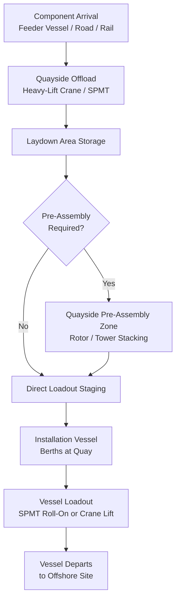
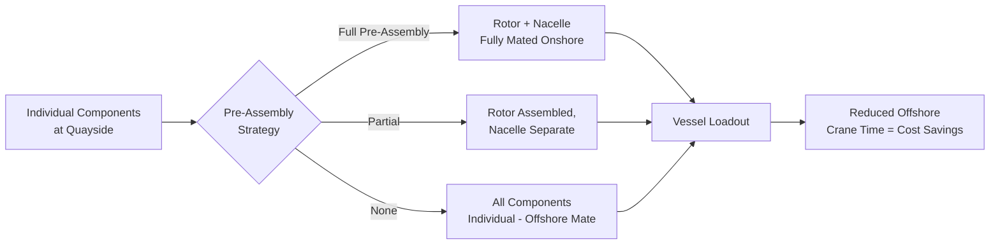

## Offshore Wind Component Marshalling Ports

### Purpose and Scope

Marshalling ports are the shoreside staging facilities where wind turbine components (towers, nacelles, hubs, blades, and increasingly foundations) are received, stored, pre-assembled, and loaded onto installation vessels for offshore delivery. Unlike conventional port logistics, marshalling port operations sit at the intersection of heavy-lift engineering, laydown area planning, and vessel scheduling — the port effectively functions as an extension of the offshore installation sequence rather than a passive transshipment point. This section covers port infrastructure requirements, laydown/storage engineering, quayside pre-assembly operations, and vessel loadout planning.

### Why Marshalling Ports Are Structurally Different from General Cargo Ports

| Factor | General Cargo Port | Offshore Wind Marshalling Port |
| --- | --- | --- |
| Cargo unit value | Low-moderate per unit | Extremely high (single nacelle/rotor assemblies often $multi-million) |
| Storage duration | Short (days) | Extended (weeks-months), tied to vessel campaign scheduling |
| Ground bearing requirements | Standard paved quay/yard | Reinforced quay and laydown areas engineered for concentrated point loads |
| Handling equipment | Standard mobile/gantry cranes | Heavy-lift SPMTs, high-capacity mobile cranes, sometimes purpose-built gantries |
| Pre-assembly activity | Rare | Common (rotor pre-assembly, tower stacking) — port functions as a manufacturing extension |
| Vessel interface | Standard berthing | Jack-up or heavy-lift installation vessel quayside loadout, often requiring specific quay-edge load capacity |

### Port Selection Criteria

Marshalling port selection for an offshore wind project is a significant early-stage logistics engineering decision, typically evaluated against:

- **Quay load-bearing capacity** — quay-edge bearing pressure rating must accommodate the point loads from SPMT transport of foundation/tower components and, critically, the loadout of assembled units onto installation vessels
- **Laydown area size** — sufficient contiguous area to store a full project's component inventory simultaneously (often the limiting factor, since campaigns frequently stage months of components ahead of installation vessel availability)
- **Air draft and channel depth** — controls what vessel classes (particularly jack-up installation vessels with their legs raised) can approach and berth
- **Distance to windfarm site** — directly affects vessel cycle time and thus overall installation campaign duration and cost
- **Crane infrastructure** — availability of high-capacity mobile or fixed cranes suitable for component offloading and pre-assembly lifts
- **Road/rail connectivity** — for components arriving by land rather than by feeder vessel

**[Inference]** As offshore turbine ratings and component sizes have grown substantially, the number of ports globally with sufficient quay bearing capacity and laydown area to serve as primary marshalling hubs for the largest current turbine platforms has become a genuine constraint on project siting flexibility, though the specific list of qualifying ports is highly region- and project-specific and changes as ports invest in upgrades.

### Marshalling Port Layout and Workflow

### Laydown Area Engineering

Component storage in the laydown area is not simply "parking" — each component category has distinct ground bearing and stacking requirements:

- **Tower sections** — typically stored horizontally on engineered cradles/saddles similar to transport cradles, or occasionally stacked (where section taper geometry allows nesting) using purpose-built stacking frames; ground bearing pressure calculations account for cradle contact area, not the component's full footprint
- **Blades** — stored horizontally on racking systems engineered to prevent long-span sag/deflection over extended storage periods, since months of unsupported sag under the blade's own weight can induce measurable permanent set in the composite structure if support spacing is inadequate
- **Nacelles/hubs** — stored on their transport frames/cradles, often under weather protection given sensitivity of internal components and precision-machined surfaces
- **Foundation components** (monopiles, jacket structures, transition pieces) — among the heaviest and most laydown-area-intensive components; monopiles in particular require substantial reinforced storage area and are often stored horizontally on cradles with GBP calculated per cradle contact patch

### Ground Bearing Pressure Considerations at Marshalling Ports

Quay and laydown area GBP verification follows the same fundamental engineering logic as any heavy-lift ground bearing calculation, but at marshalling ports the analysis must additionally account for repeated/cyclical loading (SPMT transit across the same quay areas over an extended campaign) rather than a single-pass load case:

$$GBP = \frac{W}{A_{contact}} \leq GBP_{allowable}$$

where $W$ is the load (component + SPMT/trailer self-weight) and $A_{contact}$ is the effective contact area. Quay structures are typically engineered with a defined allowable GBP rating specific to each zone (quay edge vs. general laydown vs. reinforced heavy-lift pads), and marshalling logistics plans must route SPMT and crane operations to stay within each zone's rated capacity — exceeding quay-edge GBP during vessel loadout in particular carries consequences extending beyond the immediate operation, since quay structural damage can affect the facility's availability for subsequent project phases or other tenants.

### Quayside Pre-Assembly Operations

A defining feature of offshore wind marshalling logistics (distinct from onshore projects) is the frequent use of quayside pre-assembly to reduce offshore installation vessel time, since vessel day-rates for jack-up installation vessels are extremely high relative to quayside crane/labor costs:

- **Rotor pre-assembly** — hub and blades (2 or 3) assembled horizontally or in a "bunny-ear" configuration at the quayside, then lifted as a single unit onto the vessel or directly installed if the vessel loads out with rotor pre-installed
- **Tower stacking** — multiple tower sections pre-bolted together at quayside where vessel deck space and crane capacity allow transporting a partially or fully stacked tower rather than individual sections
- **Nacelle-hub pre-mate** — hub bolted to nacelle main shaft at quayside prior to vessel loading, reducing one lift-and-mate operation offshore

**[Inference]** The degree of pre-assembly chosen for a given project balances offshore vessel time savings against quayside crane/laydown congestion and the added complexity of transporting larger pre-assembled units on the vessel deck; there is no universal optimal pre-assembly level — it is project- and vessel-specific.

### Vessel Loadout Methods

**SPMT Roll-On** — for jack-up installation vessels or heavy-lift vessels with a ramp/deck interface compatible with SPMT transfer, components (or pre-assembled units) are driven directly onto the vessel deck via self-propelled modular transporter, requiring precise deck-to-quay ramp alignment and continuous GBP monitoring across both the quay and vessel deck structure during transfer.

**Crane Lift-On** — components are lifted directly from quayside laydown or a transport trailer onto the vessel deck using a heavy-capacity mobile or crawler crane, used where SPMT roll-on infrastructure isn't available or where component/vessel deck geometry favors direct lift.

Vessel deck loading plans must be coordinated closely with the vessel's own stability and deck load distribution requirements — this is a joint responsibility between the marshalling port logistics team and the vessel's marine/loading engineers, since deck loading affects vessel trim and stability calculations independent of the port-side GBP analysis.

### Key Operational Considerations

**Key Points**

- Quay and laydown GBP capacity, not just laydown area size, frequently constrains which ports can serve as primary marshalling hubs for current-generation turbine platforms
- Extended storage duration (weeks-months) distinguishes marshalling port laydown engineering from short-duration general cargo storage
- Quayside pre-assembly is used specifically to shift cost/time burden away from expensive offshore installation vessel time
- Vessel loadout GBP and stability analysis is a joint port-and-vessel engineering responsibility, not a port-only calculation
- Blade storage racking must be engineered against long-term sag/deflection, not just short-term handling loads

### Example

**Example**

A marshalling port for a 1.2 GW offshore project stages components for 80 turbines over a 14-month installation campaign. The port's laydown area is sized to hold approximately 15 turbine sets simultaneously, requiring careful sequencing between component delivery (via feeder vessel from the manufacturing facility) and installation vessel loadout cadence to avoid laydown congestion. Rotor pre-assembly is performed quayside for all 80 units, reducing offshore installation vessel time per turbine from an estimated multi-day sequential lift-and-mate operation to a single rotor-lift-and-mate operation, a savings justified against the jack-up vessel's high day-rate.

### Common Pitfalls

- Underestimating laydown area requirements relative to installation vessel cycle time, leading to component storage congestion
- Applying single-pass GBP assumptions to quay/laydown areas subject to repeated SPMT transit over an extended campaign
- Storing blades on inadequately spaced racking, risking long-term deflection/permanent set over extended storage
- Treating vessel loadout as a port-only engineering exercise without joint vessel stability/trim coordination
- Selecting a marshalling port based on proximity alone without verifying quay-edge GBP rating against actual loadout requirements

### Related Topics

- Nacelle and Hub Transport Considerations
- Blade Transport Challenges and Lifting Point Design
- Tower Section Transport and Dolly Systems
- Jack-Up Vessel Operations for Offshore Wind Installation
- Ground Bearing Pressure Analysis for Heavy-Lift Operations
- SPMT Operations for Vessel Loadout and Ro-Ro Transfer