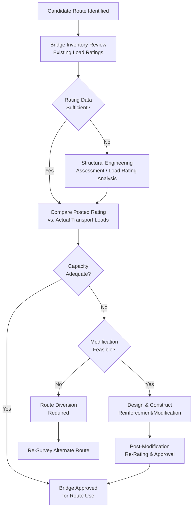

## Onshore Wind Farm Route Constraints and Bridge Modifications

### Purpose and Scope

Onshore wind farm delivery routes present a unique category of abnormal-load logistics problem: unlike most heavy-lift cargo movements, which typically travel between established industrial or port facilities, wind farm delivery routes frequently terminate at remote, purpose-built site access roads with no prior heavy-haul traffic history. This means the route survey and infrastructure modification process — particularly bridge assessment and modification — is often the single largest driver of pre-construction lead time and cost on the logistics side of a wind project. This section covers route constraint categories, the bridge assessment/modification process, and the broader infrastructure upgrade workflow.

### Route Constraint Categories

| Constraint Type | Governs | Primary Affected Component |
| --- | --- | --- |
| Vertical clearance | Bridges, overhead wires, tunnels, signage gantries | Tower sections (diameter), tall trailer configurations |
| Horizontal/width clearance | Lane width, roadside obstructions, medians | Tower sections, nacelles |
| Turning radius / swept path | Intersections, roundabouts, curves | Blades (dominant), long trailer combinations |
| Bridge structural capacity | Load rating vs. actual gross/axle loads | All components, especially tower sections and nacelles |
| Road surface/subgrade capacity | Unpaved or weak-subgrade rural roads | All components, particularly during wet conditions |
| Gradient/grade | Steep approach roads to turbine pads | All components, braking/traction capacity |

### Why Bridge Assessment Is Often the Critical Path Item

Bridge structural capacity assessment and any resulting modification work frequently sits on the logistics critical path for wind projects for several compounding reasons:

- **Bridge inventory data is often outdated or incomplete** — many rural bridges on candidate routes were designed decades ago under load rating standards that don't directly translate to modern abnormal-load axle configurations, requiring fresh structural analysis rather than reliance on posted ratings alone
- **Modification/reinforcement work has its own construction lead time** — unlike a route diversion (which can sometimes be resolved through alternative routing), a required bridge strengthening involves separate engineering design, permitting, and construction scheduling, often measured in months
- **Ownership and permitting complexity** — bridges may be owned/managed by different authorities (state/provincial DOT, county, rail authority for rail bridges) than the surrounding road, each with distinct approval processes and timelines
- **Bridge modifications sometimes require full closure or load restriction during construction**, creating a scheduling dependency between the bridge contractor's work and the wind project's delivery timeline

### Bridge Assessment Workflow

### Bridge Load Rating Comparison

Bridge structural adequacy is evaluated by comparing the bridge's engineered/rated capacity against the actual load case imposed by the specific transport configuration:

$$RF = \frac{C - \gamma_{DC} \cdot D}{\gamma_{LL} \cdot L \cdot (1 + IM)}$$

where $RF$ is the rating factor, $C$ is structural capacity, $D$ is dead load effect, $L$ is live load effect from the transport vehicle, $IM$ is the dynamic (impact) load allowance, and $\gamma$ terms are the applicable load factors under the governing bridge rating methodology (e.g., AASHTO LRFR in the United States, or the equivalent national/regional bridge assessment code elsewhere). An $RF \geq 1.0$ generally indicates adequate capacity for the evaluated load case; $RF < 1.0$ indicates the bridge requires either load restriction (reduced axle loads, escort/positioning requirements), reinforcement, or route avoidance.

**[Inference]** Because abnormal-load transport configurations (SPMTs, multi-axle trailers) often distribute load very differently from the standard design vehicles bridge ratings are originally calibrated against — frequently achieving lower per-axle loads over a longer wheelbase than standard trucks — some bridges rated inadequate for standard heavy vehicle traffic can still be approved for specific abnormal-load configurations once a bridge-specific rating analysis is performed, though this determination requires case-by-case engineering rather than a general rule.

### Common Bridge Modification Approaches

| Modification Type | Application | Relative Duration/Cost |
| --- | --- | --- |
| Temporary load-spreading mats/plates | Distributes wheel/track load over a wider bridge deck area without permanent modification | Low — often deployed per-crossing, removed after |
| Temporary shoring/bracing | Adds temporary support beneath the bridge structure during the crossing event | Moderate — engineering + temporary works |
| Permanent structural reinforcement | Strengthening of girders, deck, or substructure | High — full design/construction cycle |
| Bridge replacement | Where reinforcement is infeasible or uneconomical | Highest — typically only justified for routes with long-term repeat use |
| Temporary bypass/causeway | Constructing an alternate crossing avoiding the bridge entirely | Variable — depends on terrain/waterway |

Temporary load-spreading solutions are frequently preferred for one-time or infrequent abnormal-load crossings since they avoid the cost and approval complexity of permanent structural modification, provided the bridge owner's engineering review confirms the temporary solution adequately addresses the rating deficiency for the specific crossing event.

### Other Route Modification Categories

Beyond bridges, several other infrastructure modification categories are routinely required on wind farm delivery routes:

- **Intersection/roundabout modifications** — temporary removal of curbs, traffic islands, signage, or streetlights to accommodate blade tip-dolly swept paths; typically restored after project completion
- **Utility line adjustments** — temporary de-energization or physical raising of overhead power/telecom lines along the route for vertical clearance, coordinated directly with utility owners
- **Culvert and drainage crossing assessment** — smaller structures than bridges but subject to similar load rating logic, particularly relevant on rural/unpaved route segments
- **New site access road construction** — turbine pad access roads are frequently built new as part of the project's civil works scope, engineered from the outset to accommodate component transport loads (this differs from public road route survey since the access road specification is under direct project control)

### Route Survey and Permitting Sequencing

```mermaid
flowchart LR
    A[Desktop Route Study<br/>GIS/Mapping Review] --> B[Physical Route<br/>Reconnaissance Survey]
    B --> C[Swept-Path Simulation<br/>per Component Type]
    C --> D[Bridge/Structure<br/>Assessment]
    D --> E[Utility Coordination<br/>Overhead/Underground]
    E --> F[Permit Application<br/>to Road Authorities]
    F --> G[Modification Design<br/>& Construction<br/>if Required]
    G --> H[Final Route Approval<br/>& Permit Issuance]
    H --> I[Trial/Pilot Run<br/>Optional but Common<br/>on First Delivery]
```

A trial or pilot convoy run — moving a representative empty trailer configuration (or the first actual delivery) along the full route prior to full-scale campaign delivery — is common practice specifically to validate that swept-path simulation and bridge/clearance assessments translate correctly to actual field conditions before committing to a high-frequency delivery schedule.

### Key Operational Considerations

**Key Points**

- Bridge structural assessment, not route distance or general road quality, is frequently the primary lead-time driver for wind farm delivery route approval
- Abnormal-load axle configurations can sometimes achieve bridge rating approval that standard heavy vehicles cannot, due to more favorable load distribution over a longer wheelbase — but this requires case-specific engineering analysis, not general assumption
- Temporary load-spreading solutions are often preferred over permanent reinforcement for infrequent crossings, subject to bridge owner engineering approval
- Route modification spans multiple constraint categories (bridges, intersections, utilities, culverts) each with distinct ownership and approval pathways
- A pilot/trial run is common practice to validate route engineering before full campaign delivery begins

### Example

**Example**

A candidate delivery route to a wind farm crosses a county-owned bridge with a posted rating established in the 1970s under a superseded load rating standard. The bridge assessment identifies the posted rating as inadequate for the project's SPMT tower-section configuration under standard load rating methodology. A bridge-specific rating analysis, accounting for the SPMT's actual axle spacing and per-axle load (lower per-axle load than the standard rating vehicle, distributed over a longer wheelbase), determines an adequate rating factor for the specific transport configuration without requiring physical modification — avoiding an estimated multi-month reinforcement project and associated schedule risk to the overall delivery campaign.

### Common Pitfalls

- Relying on outdated or generic posted bridge ratings instead of commissioning a load-case-specific structural assessment
- Underestimating the lead time required for bridge modification design, permitting, and construction relative to the overall project schedule
- Failing to identify all relevant infrastructure owners (state/county/utility/rail) early, causing sequential rather than parallel permitting delays
- Skipping a pilot/trial run and discovering field discrepancies from the desktop swept-path simulation during the first full delivery
- Treating route survey as a one-time exercise rather than re-validating for seasonal conditions (e.g., wet-season subgrade capacity on unpaved segments)

### Related Topics

- Blade Transport Challenges and Lifting Point Design
- Tower Section Transport and Dolly Systems
- Swept-Path Analysis and Abnormal Load Route Surveys
- Bridge Load Rating Methodologies (AASHTO LRFR and Regional Equivalents)
- Abnormal Load Permitting and Escort Vehicle Requirements
- Site Access Road Civil Engineering for Wind Farm Construction