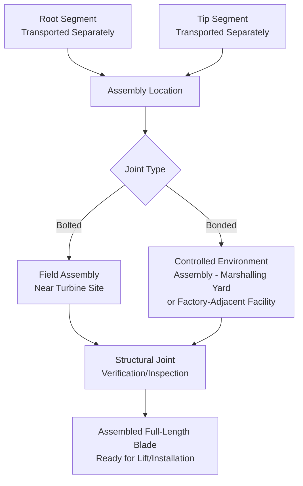

## Segmented and Modular Blade Design Trends

### Purpose and Scope

Segmented (also called sectional or modular) blade design refers to wind turbine blade architectures engineered to be manufactured, transported, and/or assembled in two or more discrete sections rather than as a single continuous monolithic structure. This design trend exists specifically as an engineering response to the transport constraints covered elsewhere in this chapter — as blade lengths have grown toward and beyond practical road transport swept-path and clearance limits, segmentation has emerged as one of the primary strategies for decoupling turbine performance scaling from transport logistics limits. This section covers segmentation approaches, joint engineering considerations, and the logistics implications specific to modular blade handling.

### Why Segmentation Exists — The Core Logistics Driver

As established in blade transport coverage, road swept-path and turning geometry (not mass) are typically the dominant constraint on blade delivery. A single-piece 90m+ blade may be physically impossible to transport on certain route geometries regardless of trailer/dolly sophistication. Segmentation directly addresses this by reducing the transported length of any single piece, at the cost of introducing structural joint engineering complexity that a monolithic blade does not have.

| Driver | Monolithic Blade | Segmented Blade |
| --- | --- | --- |
| Transport swept-path constraint | Full blade length governs | Individual segment length governs (shorter) |
| Structural continuity | Continuous, no joints | Engineered joint(s) required at segment interface |
| Manufacturing | Single mold/process per blade | Separate molds per segment, or single mold with post-cure segmentation |
| Site assembly requirement | None (blade arrives complete) | Joint assembly required at or near site |
| Aerodynamic/structural performance | No joint-induced discontinuity | Joint must preserve aerodynamic profile and structural load path continuity |

### Segmentation Approaches

**1. Root/Tip Two-Piece Segmentation**

The most common approach: the blade is split into a root segment (larger cross-section, structurally dominant, houses the main spar root connection) and a tip segment (smaller cross-section, lower mass). This is the segmentation strategy most directly targeted at solving the swept-path problem, since it's typically the longer, larger-diameter root-to-mid-span region that drives the worst-case transport geometry.

**2. Multi-Segment (Three or More Pieces)**

Less common in current commercial deployment but used or explored where extreme length requires more aggressive segmentation. **[Inference]** Multi-segment designs beyond two pieces introduce proportionally more joint engineering complexity and site assembly time per blade, which likely explains why two-piece segmentation has seen more commercial adoption to date than higher segment counts, though this is an inference from the engineering trade-off rather than a documented industry consensus figure.

**3. Bolted vs. Bonded Joint Systems**

| Joint Type | Description | Assembly Location |
| --- | --- | --- |
| Bolted mechanical joint | Steel or composite interface plates/fittings bolted together at the segment interface | Typically field-assembled (at or near the installation site) |
| Adhesive-bonded joint | Structural adhesive bonding at a scarfed or stepped interface | Typically factory- or marshalling-yard-assembled (requires controlled cure conditions) |
| Hybrid | Combination of bonded interface with mechanical backup/alignment features | Varies by design |

Bolted joint systems are generally more logistics-friendly for field assembly since they don't require the controlled environmental conditions (temperature, humidity, cure time) that adhesive bonding typically demands, making them better suited to on-site or near-site assembly under variable field conditions. Bonded joints generally require assembly under more controlled conditions, which shifts assembly toward a marshalling yard or factory-adjacent facility rather than the final turbine site itself.

### Segment Assembly Workflow

### Logistics Implications of Segmentation

**Positive implications:**

- Each segment individually presents a shorter swept-path challenge, potentially opening routes that would be infeasible for a monolithic blade
- Segments can potentially use different transport modes or timing (e.g., staged delivery) since they are independent transport units until joined
- Reduced single-piece length may allow standard (non-specialized) tip-dolly configurations on some routes where a monolithic blade would require the most aggressive tip-steering equipment

**Added complexity:**

- **New logistics step**: assembly location planning and scheduling — the project now requires either a near-site field assembly area or a marshalling-yard assembly step that doesn't exist for monolithic blades
- **Sequencing dependency**: both segments must arrive at the assembly point before joining can occur, creating a schedule dependency that doesn't exist when a single blade simply arrives complete
- **Assembly area engineering**: field or yard assembly areas require adequate ground preparation, support cradles for both segments during joint work, weather protection (particularly for bonded joints), and often specialized joint assembly equipment/jigs supplied by the OEM
- **Joint quality assurance**: structural joint integrity verification (torque verification for bolted joints, NDT/inspection for bonded joints) becomes a required logistics-adjacent quality step before the assembled blade can be lifted for installation

### Field Assembly Area Requirements

Where field (near-site) assembly is used for bolted-joint segmented blades, the assembly area typically requires:

- Level, prepared ground sufficient to support segment cradles without settlement during the assembly period
- Adequate length/width to lay out both segments in alignment for joining, plus working clearance for assembly crews and equipment
- Access for the delivery trailers of both segments plus, often, a separate transport or handling method to move the assembled full-length blade from the assembly area to the turbine pad if the assembly area isn't immediately adjacent
- OEM-supplied or OEM-specified joint assembly jigs/fixtures to ensure correct alignment and bolt torque sequencing

### Structural and Aerodynamic Joint Considerations

While primarily an engineering (not logistics) concern, the joint design directly affects logistics planning because:

$$\sigma_{joint} = \frac{M_{joint}}{S_{joint}} + \frac{F_{axial}}{A_{joint}}$$

where $M_{joint}$ is the bending moment at the joint location, $S_{joint}$ is the section modulus of the joint interface, $F_{axial}$ is axial load, and $A_{joint}$ is joint cross-sectional area — the joint location along the blade span is selected by the blade designer specifically where combined bending and axial stress can be managed within the joint hardware's capacity, which is a structural engineering decision made far upstream of logistics but one that directly determines where the "split point" falls and therefore the relative length/mass of each transported segment.

**[Inference]** Joint location is likely selected primarily to balance structural load transfer feasibility against the practical benefit of shortening the longer (typically root-to-mid-span) segment for transport purposes, though the precise structural-versus-logistics weighting in this design trade-off is proprietary to individual blade OEMs and not publicly documented in standardized form.

### Key Operational Considerations

**Key Points**

- Segmentation is fundamentally a logistics-driven design response to swept-path/road geometry constraints, not primarily a structural or manufacturing optimization
- Bolted joints generally suit field assembly under variable conditions; bonded joints generally require controlled-environment assembly, shifting the assembly step to a yard or factory-adjacent facility
- Segmentation trades transport ease for a new logistics dependency: assembly location, sequencing, and joint quality verification
- Field or yard assembly areas require dedicated engineering (ground preparation, cradle support, OEM assembly jigs) not present in monolithic blade logistics
- Joint location along the blade span is a structural engineering decision that directly determines segment length/mass split, made upstream of but with direct consequence for logistics planning

### Example

**Example**

A project selects a two-piece segmented blade design for a route where swept-path simulation shows a monolithic 82m blade cannot negotiate a series of rural intersections without extensive infrastructure modification. The root segment (48m) and tip segment (34m) are transported separately, each individually passing the swept-path simulation without requiring the intersection modifications the monolithic design would have needed. A field assembly area is established near the turbine pad with OEM-supplied bolted joint assembly jigs; both segments are delivered on a coordinated schedule to arrive within the same operational window, joint bolt torque is verified per OEM specification, and the assembled blade is then transported the final short distance to the turbine pad for lift and installation — avoiding an estimated multi-month bridge/intersection modification project that the monolithic design would have required.

### Common Pitfalls

- Selecting segmented blade design without accounting for the added field/yard assembly area and scheduling complexity in the overall project logistics plan
- Scheduling segment deliveries independently without ensuring both segments arrive in a coordinated window, causing assembly delays
- Underestimating ground preparation requirements for field assembly areas, particularly on sites with variable subgrade conditions
- Attempting bonded-joint assembly in uncontrolled field conditions where OEM cure specifications cannot be reliably met
- Treating joint quality verification as optional or informal rather than a required, documented QA step prior to lift/installation

### Related Topics

- Blade Transport Challenges and Lifting Point Design
- Swept-Path Analysis and Abnormal Load Route Surveys
- Onshore Wind Farm Route Constraints and Bridge Modifications
- Field Assembly Area Planning for Oversize Components
- Structural Joint Quality Assurance and Non-Destructive Testing
- OEM Coordination for Specialized Handling Equipment