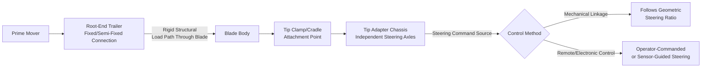
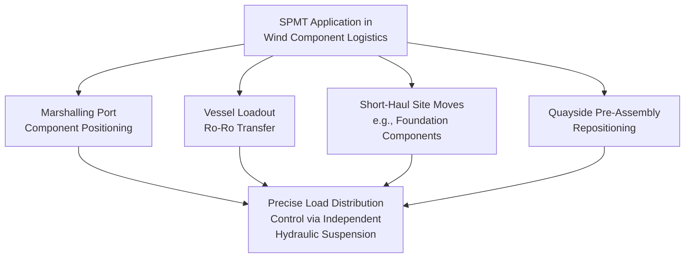

## Specialized Wind Component Trailers and Adapters

### Purpose and Scope

Wind component logistics relies on a distinct family of purpose-built trailers and adapter systems, each engineered to solve the specific handling problem posed by blades, tower sections, and nacelle/hub assemblies. Unlike general abnormal-load trailers, these systems are typically OEM-branded, purpose-designed equipment platforms rather than generic modular trailer configurations. This section consolidates the trailer and adapter technology referenced across blade, tower, and nacelle transport into a single equipment-focused reference, covering design principles, operating mechanics, and selection criteria.

### Equipment Category Overview

| Equipment Category | Primary Function | Target Component |
| --- | --- | --- |
| Blade root trailer | Fixed/semi-fixed connection at blade root, primary tractive/steering interface | Blades |
| Blade tip adapter (steerable dolly) | Independent tip-tracking through curves | Blades |
| Tower section low-bed/well-hole trailer | Diameter/height clearance optimization | Tower sections |
| Tower section saddle/cradle system | Wide-arc load distribution, anti-roll restraint | Tower sections |
| Nacelle transport frame | Structural hard-point interface, off-center CoG accommodation | Nacelles |
| Hub transport cradle | Bearing-face protection, structural support | Hubs |
| SPMT (self-propelled modular transporter) | Multi-axle hydraulic load distribution, precision positioning | All categories, particularly port/marshalling and short-haul heavy moves |

### Blade Tip Adapter (Steerable Dolly) Systems

**Working Principle**

The blade tip adapter is the equipment innovation most specific to the wind logistics sector — it exists to solve a problem that has no close analog in other heavy-lift trailer applications: an extremely long, laterally flexible cargo item that cannot be rigidly connected at both ends without demanding impractically wide swept paths on every curve.

**Design characteristics:**

- Clamps or cradles the blade tip section, typically via an adjustable clamp system accommodating the tapered tip profile of different blade models
- Steering axles allow the tip adapter to track a different path than the root-end trailer through curves, effectively allowing the "middle" of the blade to bow slightly relative to a straight line between the two ends without overstressing the structure
- Most modern systems use remote or semi-autonomous steering control, coordinated with the lead vehicle/root trailer either via a dedicated operator riding the tip adapter or via electronic coordination between the two units
- Load-bearing capacity is generally modest relative to the trailer's structural/steering complexity, since blade mass is low relative to length — the engineering challenge is geometric control, not load capacity

**[Inference]** Several equipment manufacturers offer proprietary blade tip adapter/lifter systems under various trade names; specific capacity ratings, steering angle limits, and control system architecture vary by manufacturer and model, and detailed current specifications should be verified against manufacturer documentation for any specific project rather than assumed from general principles.

### Tower Section Trailers

**Low-bed and well-hole (drop-deck) trailers** lower the effective load deck height relative to a conventional flatbed, directly increasing the available vertical clearance envelope for large-diameter tower sections passing under bridges and overhead obstructions. The well-hole design recesses a center section of the trailer bed between the axle groups, allowing the tower section's centerline to sit lower than the axle-group deck height without compromising structural trailer integrity.

**Saddle/cradle systems** are typically:

- Diameter-adjustable or interchangeable per section type, since a single tower typically comprises 3–5 sections of varying diameter
- Engineered to distribute contact load across a wide arc (commonly citing target contact angles sufficient to keep local bearing stress within the shell plate's allowable limits, though specific angle/stress targets are project- and OEM-engineering-specific rather than standardized)
- Fitted with restraint provisions (chain/strap anchor points) engineered against the dynamic lateral and longitudinal load factors specified by the governing heavy-haul securement regulation for the operating jurisdiction

### Nacelle Transport Frames

Nacelle transport frames are structural steel frames or cradles that interface with OEM-designated structural hard points on the nacelle main frame — distinct from the nacelle's lift points (which are typically separate, hoist-specific attachment locations). Key design considerations:

- **CoG accommodation** — since nacelle mass distribution is typically asymmetric (as covered in nacelle transport considerations), the frame's support point layout and the resulting tie-down load calculations must reflect the actual, OEM-certified CoG location rather than assuming a centered load
- **Vibration/shock isolation** — some transport frame designs incorporate isolation elements between the frame and the nacelle interface to reduce transmitted road-induced vibration to sensitive internal components, though the extent of isolation engineering varies by OEM specification and project requirement
- **Reusability** — nacelle transport frames are frequently reusable, purpose-built assets (sometimes OEM-supplied, sometimes owned by the logistics provider) rather than single-use or generic equipment, given their highly specific interface geometry per nacelle platform

### Hub Transport Cradles

Hub cradles are simpler in load-path terms than nacelle frames (hub CoG is generally more concentrated) but require precise geometric design to avoid any contact with the precision-machined blade bearing mounting faces — cradle contact points are engineered to bear only on non-critical structural surfaces of the hub casting/weldment.

### SPMT (Self-Propelled Modular Transporter) Applications in Wind Logistics

SPMTs appear across multiple wind logistics contexts, distinct from the fixed-configuration trailers above in that they offer:

- **Modular axle line configuration** — axle lines can be added/removed and configured in various width/length arrangements to match the specific load and ground bearing requirements of a given component and route segment
- **Independent hydraulic suspension per axle** — allows continuous load distribution adjustment and precise deck-height/leveling control, valuable for vessel loadout ramp transitions and precision positioning during pre-assembly operations
- **Omnidirectional/crab steering** — enables tight-radius positioning in confined marshalling yard or quayside areas where conventional trailer steering geometry would be inadequate

**[Inference]** SPMTs are generally reserved for shorter-distance, higher-precision movements (port, marshalling yard, foundation set-down) rather than long-distance public road delivery, since their axle configuration and operating speed are optimized for controlled, precision heavy-haul environments rather than highway travel — long-distance public road delivery typically uses conventional or modular hydraulic trailer configurations instead.

### Equipment Selection Criteria Summary

| Selection Factor | Blade Equipment | Tower Equipment | Nacelle/Hub Equipment |
| --- | --- | --- | --- |
| Primary engineering driver | Swept-path/length management | Diameter/height clearance, axle load | CoG accuracy, hard-point interface |
| Load capacity relative to complexity | Low mass, high geometric complexity | High mass, moderate geometric complexity | High mass, high precision/protection requirement |
| Route dependency | Highly route-specific (curve/intersection geometry) | Route-specific (clearance/bridge capacity) | Less route-geometry-sensitive, more load/vibration-sensitive |
| Reusability across projects | High (standard blade tip adapters serve multiple blade models with adjustment) | High (adjustable saddle systems) | Often platform-specific (OEM interface geometry) |

### Key Operational Considerations

**Key Points**

- Blade tip adapter systems solve a geometric (swept-path) problem, not a load-capacity problem — this distinguishes their engineering focus from tower and nacelle equipment
- Tower trailer selection is driven primarily by clearance optimization (well-hole/low-bed decks) and cradle load distribution, not steering complexity
- Nacelle transport frames must reflect OEM-certified CoG data in their support/restraint design, since nacelle mass distribution is typically asymmetric
- SPMTs are generally suited to short-distance, high-precision movements (port, marshalling, foundation set-down) rather than long-haul public road delivery
- Equipment reusability varies significantly by category — blade and tower equipment tend toward adjustable/reusable designs, while nacelle equipment is often platform-specific to the OEM interface geometry

### Example

**Example**

A logistics provider mobilizes equipment for a mixed-component delivery campaign: blade transport uses a fixed root trailer paired with a remotely-steered tip adapter rated for the project's blade tip mass and clamp geometry; tower sections use a well-hole trailer with diameter-adjustable saddle cradles reconfigured for each of the four section diameters across the tower; nacelle transport uses an OEM-supplied structural transport frame with asymmetric tie-down point loading calculated from the OEM's certified CoG data. At the marshalling port, SPMTs handle final positioning of all components for quayside pre-assembly and vessel loadout, leveraging their independent hydraulic suspension for precise deck-height matching during vessel ramp transfer.

### Common Pitfalls

- Using a fixed (non-steerable) tip connection on long blades, forcing impractically wide swept paths on route curves
- Selecting a conventional flatbed instead of a well-hole/low-bed trailer for tower sections on clearance-constrained routes
- Using generic, non-diameter-matched saddle cradles, risking point-loading of tower shell plate
- Applying centered-load restraint assumptions to nacelle transport frames without OEM CoG verification
- Attempting long-distance public road delivery via SPMT where a conventional highway-rated trailer configuration would be more appropriate and cost-effective
- Assuming equipment reusability across nacelle platforms without verifying OEM-specific hard-point interface compatibility

### Related Topics

- Blade Transport Challenges and Lifting Point Design
- Tower Section Transport and Dolly Systems
- Nacelle and Hub Transport Considerations
- Offshore Wind Component Marshalling Ports
- SPMT Operations for Vessel Loadout and Ro-Ro Transfer
- Segmented and Modular Blade Design Trends