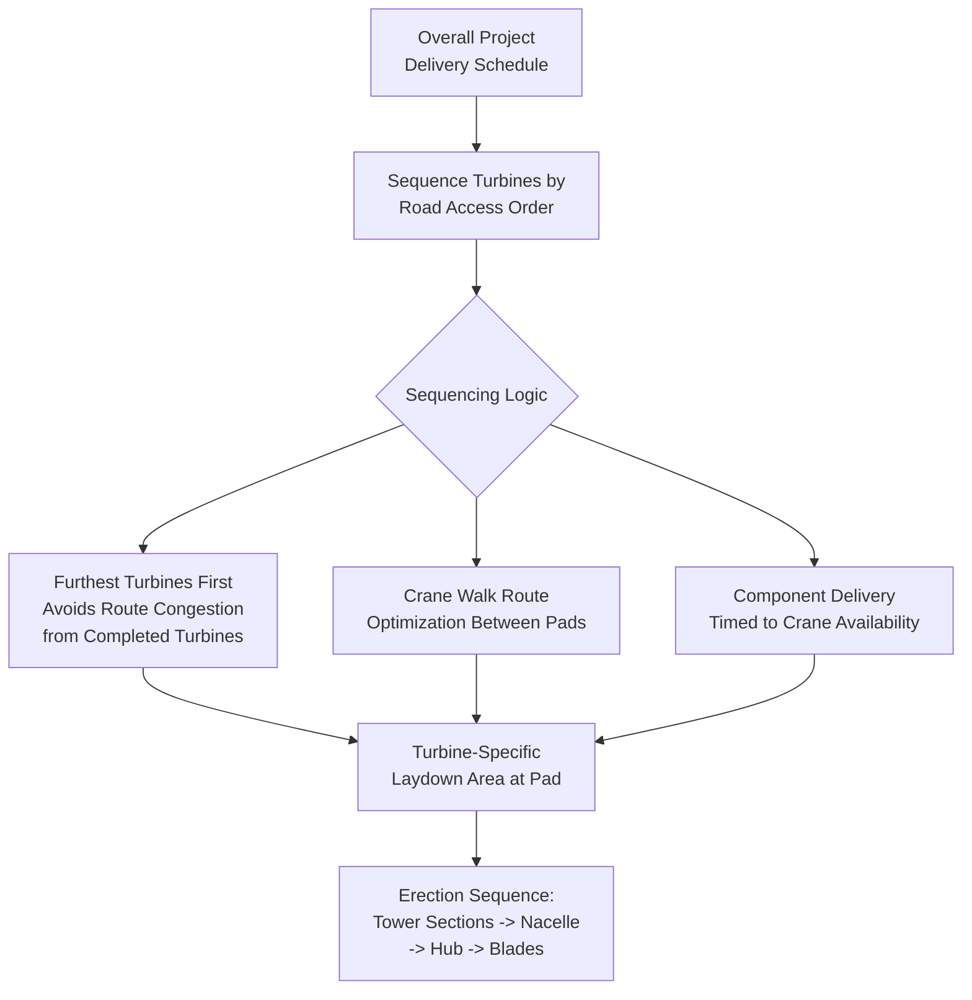

## Wind Farm Site Logistics and Crane Selection

### Purpose and Scope

Wind farm site logistics covers the on-site operational planning that governs how components move from delivery point to final installation position across a multi-turbine project, while crane selection addresses the engineering process for choosing the lift equipment capable of erecting tower sections, nacelles, hubs, and blades at the required hook height and configuration. Unlike the transport-focused topics elsewhere in this chapter, this section addresses site-level sequencing, pad/laydown design, and the crane engineering decision itself. This section covers site access and internal road design, turbine-by-turbine sequencing logistics, crane type selection criteria, and crane pad engineering.

### Site Access Road and Internal Logistics Network

**Site access roads** connect the public road network to the project boundary and are typically new construction, engineered from the outset (unlike public routes) to accommodate the full range of component transport loads without the retrofit constraints covered in public route/bridge topics.

**Internal site roads** connect the site entrance to each individual turbine pad, and present distinct engineering considerations from public route delivery:

| Consideration | Public Route | Internal Site Road |
| --- | --- | --- |
| Design control | Third-party owned, must work within existing constraints | Fully project-controlled, purpose-designed |
| Surface | Typically paved | Often unpaved/aggregate, engineered for construction traffic |
| Turning geometry | Constrained by existing intersections | Designed specifically for delivery vehicle swept paths |
| Grade/drainage | Fixed by existing terrain/infrastructure | Engineered within project civil design, but site topography still constrains options |
| Reusability | N/A (public infrastructure) | Often temporary, sometimes partially restored post-construction per permit conditions |

Internal road design must simultaneously satisfy the swept-path requirements of the largest delivery vehicles (blade convoys in particular) and the load-bearing requirements for repeated heavy component traffic over the construction period — this is why internal road specification is typically developed jointly between the civil engineering team and the logistics/transport engineering team rather than by either in isolation.

### Turbine-by-Turbine Delivery and Installation Sequencing

A common sequencing principle is to deliver and erect turbines in an order that avoids routing later deliveries past already-completed (and now potentially access-constrained by other construction activity) turbine positions, though the specific optimal sequence depends heavily on site topology and the internal road network layout. Crane "walk" routes between adjacent turbine pads (relevant for crawler cranes, which typically travel between pads under their own power rather than being fully disassembled/reassembled at each location) are planned as part of the same sequencing exercise, since crane mobilization time between pads directly affects overall erection cadence.

### Turbine Pad and Laydown Area Design

Each turbine location requires a dedicated laydown/staging area separate from the crane's operating pad, typically sized to accommodate:

- Temporary storage of tower sections, nacelle, hub, and blades for that specific turbine prior to erection sequence
- Crane assembly/erection area (for crawler cranes requiring on-site boom assembly) or standing area (for mobile cranes)
- Access for delivery vehicles to unload without obstructing the crane's operating radius

**Crane pad ground bearing engineering** follows the same fundamental GBP principles covered elsewhere in heavy-lift logistics, but with wind-specific considerations:

$$GBP_{crane} = \frac{W_{crane} + W_{load}}{A_{track/outrigger}} \leq GBP_{allowable}$$

Crane pad allowable GBP is determined by project-specific geotechnical investigation at each turbine location (soil conditions frequently vary meaningfully across a single wind farm site), meaning crane pad design is typically not a single standard specification applied uniformly across all turbines but rather individually verified per pad, particularly at sites with variable subsurface conditions.

### Crane Selection Methodology

Crane selection for wind turbine erection is governed primarily by **hook height requirement**, not by the mass of the heaviest component being lifted — this is a critical distinction from many other heavy-lift applications where capacity is the binding constraint.

**Key parameters for crane selection:**

| Parameter | Description | Why It Matters |
| --- | --- | --- |
| Required hook height | Hub height + nacelle/rigging clearance | Primary driver — increases directly with turbine hub height |
| Lift radius | Horizontal distance from crane center to load position at hook height | Affects load chart capacity at the required height |
| Load chart capacity at radius/height | Crane's rated capacity at the specific radius/height combination | Must exceed component weight plus rigging weight with adequate margin |
| Boom/jib configuration | Main boom length, luffing jib addition | Determines achievable hook height and radius combination |
| Site access/assembly footprint | Crane assembly area, ground bearing at assembly location | Must fit within available pad area and ground conditions |
| Wind speed operational limits | Crane-rated limit vs. component-specific aerodynamic sensitivity limit (especially for blades) | Governs achievable operating window, particularly relevant for tall-hook-height lifts exposed to higher wind speeds aloft |

### Crane Type Comparison for Wind Erection

| Crane Type | Typical Application | Advantages | Limitations |
| --- | --- | --- | --- |
| Crawler crane (lattice boom) | Primary erection crane for tower/nacelle/hub, most common main crane type | High capacity at height, self-propelled between pads (crawler travel) | Large assembly footprint, longer mobilization/assembly time per relocation |
| All-terrain mobile crane | Assist crane (tandem blade lifts), smaller turbine erection | Fast road mobility between sites, quicker setup | Lower height/capacity ceiling than large crawlers for tallest current turbines |
| Tower/self-erecting crane | Rare in current commercial wind erection, more common historically or in niche applications | N/A | **[Unverified]** Limited current commercial relevance for utility-scale wind erection; specific applications would need project-specific verification |
| Specialized wind erection crane systems | Purpose-engineered systems (e.g., ring crane/hydraulic self-climbing platforms) emerging particularly for very tall hub heights | Potentially higher achievable hook height with smaller footprint than equivalent crawler | Emerging/niche technology category — **[Speculation]** adoption trajectory and standard configurations are still developing industry-wide as hub heights continue increasing, and specific system availability should be verified against current manufacturer/project documentation rather than assumed |

**[Inference]** As hub heights have increased into ranges that challenge the practical hook-height ceiling of conventional large crawler cranes, project developers have increasingly explored specialized tall-hook-height erection systems; however, the specific technology landscape in this space is evolving and any current-state claims about market-standard equipment should be verified via up-to-date search rather than relied upon as fixed reference information, since this represents an active area of equipment development.

### Wind Loading and Operational Window Constraints

Crane operations for wind turbine erection are unusually wind-sensitive compared to many other heavy-lift applications, for two compounding reasons:

1. **Height exposure** — wind speed generally increases with height above ground, meaning a lift at 150m+ hook height experiences materially higher wind loading than the same nominal ground-level wind speed would suggest
2. **Blade aerodynamic sensitivity** — as covered in blade transport/lifting content, blade lifts carry lower wind operational limits than the crane's own rated limit due to blade sail area, meaning the blade installation lift is frequently the most wind-restrictive operation in the entire erection sequence

This compounding effect means erection schedule contingency planning must budget meaningfully more weather-hold allowance for blade lifts specifically than for tower or nacelle lifts, even though all lifts occur at similar hook heights within the same erection sequence.

### Key Operational Considerations

**Key Points**

- Hook height requirement, not component mass, is the primary crane selection driver for wind turbine erection
- Crane pad GBP is typically verified per-turbine given the likelihood of variable subsurface conditions across a single site, not applied as a uniform standard specification
- Internal site road design must jointly satisfy swept-path and repeated heavy-load-bearing requirements, developed collaboratively between civil and logistics engineering
- Blade lift wind sensitivity typically drives the tightest operational window in the erection sequence, requiring proportionally larger weather-hold schedule contingency
- Turbine erection sequencing is planned to avoid routing later deliveries through areas congested by earlier-completed turbine construction activity

### Example

**Example**

A wind farm with 165m hub heights requires a large lattice-boom crawler crane configuration capable of achieving the necessary hook height with adequate load chart margin at the nacelle lift radius. Site-specific geotechnical investigation reveals variable soil conditions across the 40-turbine site, requiring individual crane pad GBP verification at each location rather than a single standard pad design — three turbine locations require additional ground improvement (aggregate sub-base reinforcement) to achieve adequate allowable GBP for the crane's track loading. Erection sequencing prioritizes turbines furthest from the site entrance first, avoiding later blade convoy deliveries having to pass by turbines with active crane operations or completed foundations that would constrain the internal road swept path.

### Common Pitfalls

- Selecting crane capacity based on component mass alone without properly verifying load chart capacity at the actual required hook height and radius
- Applying a single standard crane pad design across a site with variable subsurface conditions instead of per-turbine geotechnical verification
- Underestimating weather-hold contingency for blade lifts specifically, applying a uniform contingency assumption across all lift types
- Designing internal site roads primarily around civil construction traffic without adequately verifying delivery vehicle swept-path compatibility
- Sequencing turbine erection without considering how completed turbines and their associated infrastructure may constrain later internal road access

### Related Topics

- Blade Transport Challenges and Lifting Point Design
- Tower Section Transport and Dolly Systems
- Nacelle and Hub Transport Considerations
- Onshore Wind Farm Route Constraints and Bridge Modifications
- Ground Bearing Pressure Analysis for Heavy-Lift Operations
- Crane Load Chart Derating for Wind-Sensitive Cargo