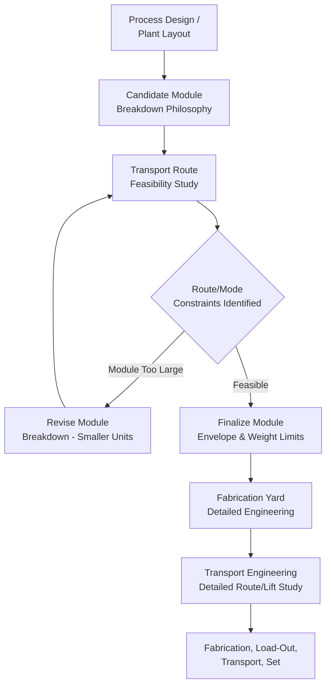
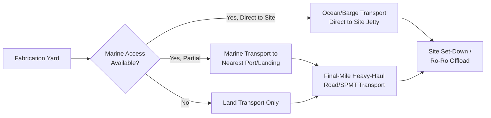
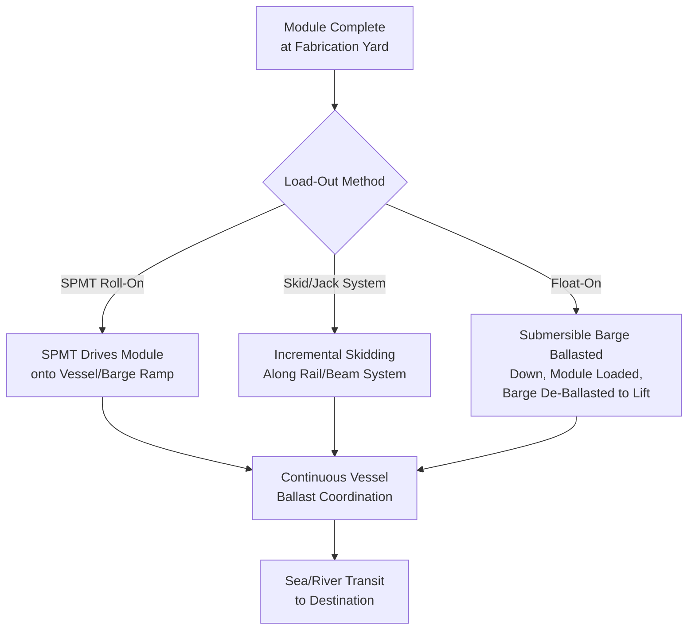

## Refinery Module and Skid Transport Planning

### Purpose and Scope

Refinery module and skid transport planning covers the logistics engineering process for moving pre-fabricated process equipment assemblies — ranging from small equipment skids to mega-modules weighing thousands of tonnes — from fabrication yards to refinery, petrochemical, or LNG construction sites. This differs fundamentally from the single-component logistics covered in wind energy topics: refinery modules are heterogeneous, multi-discipline assemblies (piping, structural steel, electrical, instrumentation, sometimes pressure vessels) built as complete, largely pre-commissioned units specifically to minimize costly field labor at the final site. This section covers module classification, transport route/mode planning, the modularization-logistics feedback loop, and load-out/set-down engineering.

### Module and Skid Classification

| Category | Typical Mass Range | Typical Characteristics |
| --- | --- | --- |
| Equipment skid | 5–200 tonnes | Single-discipline or simple multi-discipline package (pump skid, small heat exchanger package) |
| Pipe rack module | 50–500 tonnes | Structural steel with supported piping, often long/linear geometry |
| Process module | 200–2,000 tonnes | Multi-discipline (structural, piping, E&I), may include vessels/exchangers |
| Mega-module | 2,000–20,000+ tonnes | Large multi-level process units, sometimes near-complete process trains |

**[Inference]** The trend toward larger modularization (mega-modules in particular) has been driven substantially by labor cost/availability differentials between fabrication yard locations (often lower-cost, higher-productivity environments) and remote or high-labor-cost final construction sites, making the transport logistics challenge of moving increasingly larger modules a direct trade-off against field labor savings — though the specific economic threshold favoring larger modularization is project- and region-specific rather than governed by a fixed industry rule.

### The Modularization-Logistics Feedback Loop

Unlike wind components (where component size is driven primarily by turbine performance engineering), refinery module size is frequently driven by a deliberate trade-off between fabrication efficiency and transport feasibility — making logistics engineering an input to the modularization strategy itself, not merely a downstream execution concern.

This iterative loop — where early transport feasibility studies directly constrain the module breakdown philosophy — is a defining characteristic of refinery/petrochemical modular logistics planning, distinct from most other heavy-lift sectors where the component being transported is largely fixed before logistics engineering begins.

### Transport Mode Selection

Mode selection depends heavily on fabrication yard location relative to the final site and the maximum feasible module size for each mode:

| Mode | Typical Application | Module Size Ceiling |
| --- | --- | --- |
| Ocean/barge transport | Fabrication yard with marine access, coastal or river-accessible final site | Highest — vessel deck capacity can accommodate mega-modules exceeding any land transport limit |
| Inland waterway/river barge | Sites with navigable river access | High, but constrained by lock/channel dimensions and air draft |
| Heavy-haul road (SPMT/trailer) | Final-mile delivery from port/barge landing to site, or fully road-based moves for shorter distances | Moderate — governed by the same route/bridge/GBP constraints covered elsewhere in this material |
| Rail | Less common for large modules due to loading gauge constraints; more common for smaller skids | Low-moderate |

**Marine transport for mega-modules** is frequently the enabling factor that makes very large modularization economically viable at all — a module that would be entirely infeasible via road transport due to width/height/GBP constraints may be readily transportable by barge or heavy-lift vessel, which is why fabrication yard site selection (specifically, proximity to navigable water) is often evaluated early as a strategic driver of overall project modularization strategy.

### Route and Mode Planning Workflow

### Load-Out Engineering

Module load-out — the process of moving a completed module from the fabrication yard onto its transport conveyance (barge, ship, or trailer) — is a critical, highly engineered operation distinct from the transit itself:

**Skid/roll-on load-out (SPMT-based)**

The module is loaded onto SPMTs within the fabrication yard, then driven (rolled) directly onto a barge or ship via a ramp, using ballasting of the vessel to maintain a level or controlled-gradient ramp transition as the module's weight progressively shifts onto the vessel deck.

$$\Delta d_{ballast} = \frac{W_{module,transferred}}{TPC}$$

where $\Delta d_{ballast}$ is the required draft/trim adjustment, $W_{module,transferred}$ is the portion of module weight currently borne by the vessel at a given point in the load-out sequence, and $TPC$ (tonnes per centimeter immersion) is the vessel's specific loading characteristic — vessel ballasting during load-out is continuously adjusted to keep the SPMT ramp transition within its operational gradient tolerance as weight progressively transfers from quay to vessel.

**Skidding/jacking systems**

For very heavy modules exceeding practical SPMT capacity, or where ground conditions/space constrain SPMT use, hydraulic skid shoe systems or strand jack systems move the module along engineered skid beams/rails from fabrication position to the load-out point, using incremental hydraulic push/pull cycles rather than wheeled transport.

**Float-on/float-off (submersible barge)**

For the largest mega-modules, a submersible barge is ballasted down, the module is skidded or SPMT-loaded onto the deck while the barge sits at a lowered draft near the quay, and the barge is then de-ballasted (raised) to lift the module clear, effectively "floating" the load rather than mechanically hoisting it.

### Set-Down Engineering at Final Site

Set-down (offloading the module at the final site) mirrors load-out in reverse but introduces site-specific engineering considerations:

- **Foundation readiness verification** — module set-down position must be surveyed and confirmed against the as-built foundation prior to arrival, since a mega-module's positional tolerance for final placement is typically tight relative to its size
- **Jacking/skidding to final position** — modules are frequently set down near, but not exactly at, final position, then moved the last distance via skid system or heavy-lift jacks (strand jacks or hydraulic gantry systems) for precise final placement
- **Multi-module tie-in sequencing** — where a process unit comprises multiple modules, set-down sequencing must account for the order in which adjacent modules need to be positioned to allow inter-module piping/structural tie-in work to proceed efficiently

### Route Survey Considerations Specific to Refinery Modules

Road-based final-mile transport of refinery modules shares fundamental route survey logic with other heavy-lift sectors (GBP, bridge capacity, swept path) but with distinct emphasis:

| Factor | Emphasis for Refinery Modules |
| --- | --- |
| GBP/axle loading | Very high emphasis — mega-modules can far exceed the mass of any single wind or typical industrial component |
| Height clearance | Moderate — module height varies significantly by design, some modules are relatively low-profile |
| Width clearance | High — multi-level process modules can be very wide, sometimes requiring escort/lane closure for the full route |
| Swept path | Moderate — modules are typically more compact in plan than blades, but SPMT convoy length for very heavy loads can still be substantial |

### Key Operational Considerations

**Key Points**

- Module size in refinery/petrochemical projects is frequently a deliberate logistics-fabrication trade-off, not a fixed engineering requirement — transport feasibility studies often directly shape the modularization strategy
- Marine transport access at the fabrication yard is often a strategic driver of maximum feasible module size, since it removes the road transport ceiling entirely
- Load-out engineering (SPMT roll-on, skidding, or float-on) is a distinct, highly engineered operation requiring continuous vessel ballast coordination, not a simple loading step
- Set-down positional tolerance for mega-modules is typically tight, requiring foundation verification and often final-position skidding/jacking after initial placement
- Route survey emphasis for refinery modules weights GBP/axle loading and width more heavily than the swept-path/turning-radius emphasis seen in blade transport

### Example

**Example**

A petrochemical project's process modules are fabricated at a yard with direct river barge access, enabling module sizes up to 4,500 tonnes — significantly larger than what road transport from an inland yard would have permitted. Load-out uses SPMT roll-on with continuous vessel ballast coordination to maintain ramp gradient within tolerance as each module's weight transfers to the barge. At the final site, barges are moored at a purpose-built jetty; modules are skidded from the barge deck onto shore-based skid beams, then moved approximately 200m to final foundation position using a combination of SPMT and strand-jack systems for the final precision placement, with positional tolerance verified against surveyed foundation anchor bolt locations before final set-down.

### Common Pitfalls

- Finalizing module breakdown/sizing before completing a transport feasibility study, resulting in late-stage re-engineering when a module proves untransportable
- Underestimating GBP and axle load requirements for road-based final-mile transport given mega-module mass relative to typical heavy-lift cargo
- Inadequate vessel ballast planning during SPMT roll-on load-out, risking ramp gradient exceedance during weight transfer
- Failing to verify final foundation as-built conditions against the module design before set-down, causing positional tolerance issues
- Neglecting multi-module tie-in sequencing in set-down planning, creating access conflicts for downstream piping/structural connection work

### Related Topics

- Ground Bearing Pressure Analysis for Heavy-Lift Operations
- SPMT Operations for Vessel Loadout and Ro-Ro Transfer
- Float-On/Float-Off Heavy Marine Transport Methods
- Strand Jack Systems for Precision Heavy Lift Positioning
- Onshore Wind Farm Route Constraints and Bridge Modifications (Comparative Route Engineering)
- LNG and Petrochemical Site Foundation Readiness Verification