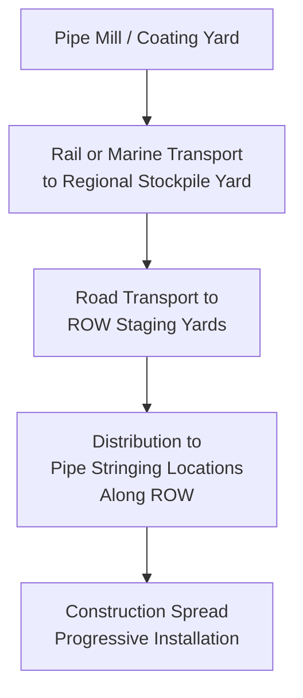
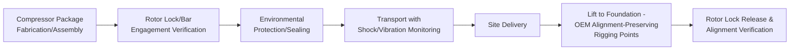

## Pipeline Component and Compressor Logistics

### Purpose and Scope

Pipeline component and compressor logistics covers the transport and handling of two related but distinct cargo categories within oil, gas, and petrochemical projects: linear pipeline construction materials (line pipe, valves, fittings) moved in high volume along a pipeline right-of-way, and compressor/pump station equipment (compressor packages, turbines, associated skids) that combine heavy-lift characteristics with high sensitivity to precision alignment and vibration control. This section covers the distinct logistics models for each category, right-of-way (ROW) access planning, and compressor package handling engineering.

### Two Distinct Logistics Models

| Characteristic | Pipeline Materials (Line Pipe, Valves, Fittings) | Compressor/Pump Station Equipment |
| --- | --- | --- |
| Volume profile | High volume, many repetitive units | Low volume, few high-value units |
| Unit value | Low-moderate per piece | Very high per unit |
| Delivery pattern | Continuous, staged along ROW at intervals | Point delivery to discrete station sites |
| Primary logistics challenge | ROW access, staging, sequencing across long linear distance | Precision handling, vibration/alignment sensitivity, station site access |
| Equipment used | Standard flatbed/lowboy trucks, pipe trailers | Heavy-haul trailers, SPMTs, cranes |

### Pipeline Materials Logistics

**Right-of-Way (ROW) Access Planning**

Unlike point-destination heavy-lift projects, pipeline construction logistics must plan for material delivery and staging along an extended linear corridor, often traversing remote terrain with limited existing road infrastructure.

- **Stockpile/marshalling yards** — regional yards positioned along the pipeline route serve as intermediate storage, allowing bulk delivery (rail/barge) to be broken down into smaller loads matched to construction spread consumption rate
- **ROW access roads** — temporary construction access roads are typically built parallel to or crossing the pipeline corridor at intervals, engineered for repeated truck traffic over the construction period, similar in concept to wind farm internal site roads but distributed along a linear rather than point-cluster layout
- **Pipe stringing** — the process of distributing individual pipe joints along the ROW at the location where each will be welded into the pipeline, sequenced to match the construction spread's progression rate so material arrives ahead of, but not so far ahead as to obstruct, the welding/lowering-in crews

**Sequencing and Spread Coordination**

Pipeline construction typically proceeds via a "spread" — a mobile construction crew and equipment set progressing along the ROW at a defined daily rate (measured in linear distance or pipe joints per day). Material logistics must be synchronized to this progression rate:

$$Delivery\ Rate \geq Consumption\ Rate = \frac{Spread\ Progress\ (km/day)}{Joint\ Length\ (km/joint)} \times Joints$$

Under-delivery stalls the spread (high-cost idle labor/equipment); significant over-delivery creates ROW congestion and potential double-handling costs, so logistics planning targets a delivery rate matched closely to actual consumption with modest buffer stock rather than either extreme.

### Compressor Station and Pump Station Equipment Logistics

**Compressor Package Characteristics**

| Component | Typical Mass Range | Handling Sensitivity |
| --- | --- | --- |
| Gas turbine driver | 20–150 tonnes | High — precision rotating equipment, alignment-critical |
| Centrifugal/reciprocating compressor | 10–100 tonnes | High — precision internals, shaft alignment critical |
| Skid-mounted package (turbine + compressor + auxiliaries) | 100–400+ tonnes | Very high — combines multiple alignment-sensitive units on a single structural skid |
| Associated coolers/heat exchangers | 20–150 tonnes | Moderate — less alignment-sensitive than rotating equipment |

**Transport and Handling Considerations Specific to Compressor Equipment**

- **Vibration and shock sensitivity** — turbines and compressors contain precision-machined rotating assemblies (rotors, bearings) with tight clearance tolerances; transport-induced shock or excessive vibration can cause bearing damage or rotor imbalance even without visible external damage, making shock-logging/monitoring during transit a standard practice for high-value rotating equipment
- **Shaft/rotor locking** — many compressor and turbine units are shipped with internal rotor locking or barring devices engaged specifically to prevent rotor movement/damage during transport, requiring verification of correct lock engagement before transit and safe release procedures at installation
- **Alignment-critical lift rigging** — lift points for compressor packages are typically OEM-engineered specifically to avoid inducing skid frame distortion that could throw off the pre-aligned relationship between the turbine driver and driven compressor mounted on the same skid base
- **Environmental protection** — control systems, instrumentation, and precision surfaces require weatherproofing/sealing during transport and storage, often more stringent than typical structural cargo given the electronic and precision-mechanical content

### Station Site Access and Set-Down

Compressor/pump stations are point-destination facilities (unlike the linear pipeline ROW), so their logistics more closely resemble conventional heavy-lift site delivery than pipeline material logistics:

- Station site access road design follows similar principles to wind farm or refinery site access — engineered for the specific delivery vehicle configuration and repeated heavy traffic during the construction period
- Foundation readiness verification prior to delivery, since compressor packages are typically set directly onto pre-installed foundation bolts/baseplates with tight positional tolerance
- Crane selection for compressor package lifts is generally governed by capacity and precision control (for accurate, low-shock set-down onto foundation bolts) rather than the hook-height-driven selection logic seen in wind turbine erection, since compressor stations involve much lower lift heights

### Valve and Fitting Logistics

Distinct from line pipe (which is relatively simple, repetitive cargo) and compressor equipment (high-value, sensitive), large valves (particularly big-bore mainline block valves) occupy a middle category:

- Larger mainline valves can weigh several tonnes to tens of tonnes and require dedicated handling equipment beyond standard pipe-handling trailers
- Valve internals (seats, seals) can be sensitive to shock/vibration similar to (though generally less critical than) compressor equipment, warranting careful handling and sometimes specific transport orientation requirements per manufacturer specification
- Valve installation at mainline block valve sites or station piping tie-ins requires coordination with the broader pipeline construction schedule, similar to compressor equipment but at a smaller logistics scale

### Comparative Route Engineering Considerations

| Factor | Pipeline Materials | Compressor/Station Equipment |
| --- | --- | --- |
| Route type | Distributed, parallel to entire ROW length | Point-to-point to discrete station site |
| Primary constraint | ROW access road capacity, staging yard throughput | Conventional heavy-haul route survey (GBP, clearance, swept path) |
| Delivery frequency | High-frequency, continuous over construction period | Low-frequency, often single or few deliveries per station |
| Weather sensitivity | Moderate — affects unpaved ROW road trafficability | Moderate-high — precision equipment handling sometimes has its own weather/wind restrictions during lift |

### Key Operational Considerations

**Key Points**

- Pipeline material logistics and compressor/station equipment logistics represent fundamentally different logistics models within the same project — high-volume linear distribution versus low-volume point-precision delivery
- Material delivery rate to a pipeline construction spread should be matched closely to consumption rate; both under- and over-delivery carry meaningful cost/schedule consequences
- Compressor and turbine equipment requires rotor lock verification, shock/vibration monitoring, and alignment-preserving rigging — handling considerations largely absent from pipeline material logistics
- Compressor package lift point design prioritizes avoiding skid frame distortion that could disturb pre-aligned driver/compressor relationships, distinct from typical heavy-lift rigging objectives
- Crane selection for compressor station equipment is generally capacity/precision-driven rather than hook-height-driven, unlike wind turbine erection

### Example

**Example**

A 300km pipeline project establishes three regional stockpile yards along the ROW, each resupplied by rail from the coating yard and distributing pipe joints via truck to stringing locations matched to the construction spread's average progress rate of 1.2km/day. In parallel, a compressor station along the route receives a 180-tonne turbine-compressor skid package via heavy-haul trailer; the package ships with rotor barring devices engaged and shock-logging instrumentation active throughout transit. At the station site, the package is lifted using OEM-specified rigging points positioned to avoid skid frame distortion, set onto pre-verified foundation bolts with the crane's precision control minimizing set-down shock, after which the rotor lock is released and alignment is verified per OEM commissioning procedure before further mechanical completion work proceeds.

### Common Pitfalls

- Mismatching pipe delivery rate to construction spread consumption rate, causing either spread stalls or ROW congestion from over-delivery
- Neglecting rotor lock verification before compressor/turbine transport, risking undetected internal damage during transit
- Using generic lift rigging points on compressor skids rather than OEM-specified alignment-preserving points, risking skid frame distortion
- Underestimating shock/vibration sensitivity of precision rotating equipment relative to more robust structural cargo
- Applying pipeline material logistics planning assumptions (high-frequency, high-volume) to compressor equipment logistics (low-frequency, high-precision), or vice versa

### Related Topics

- Refinery Module and Skid Transport Planning
- Ground Bearing Pressure Analysis for Heavy-Lift Operations
- Onshore Wind Farm Route Constraints and Bridge Modifications (Comparative ROW/Access Planning)
- Foundation Readiness Verification for Heavy Equipment Set-Down
- Shock and Vibration Monitoring for Precision Rotating Equipment Transport
- Crane Selection Methodology for Precision Set-Down Operations