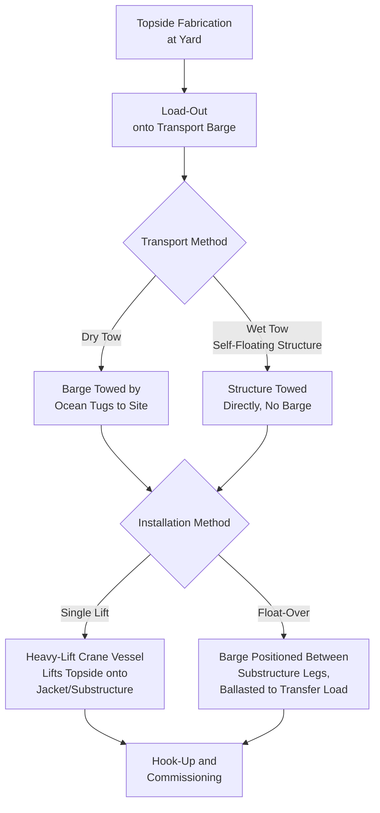
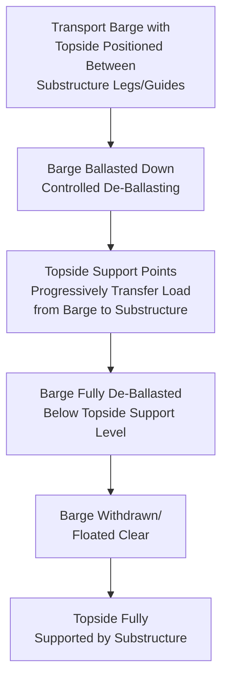

## Offshore Platform Topside Transport and Installation

### Purpose and Scope

Offshore platform topside transport and installation covers the marine heavy-lift logistics required to move a fully or substantially fabricated topside module — the above-water process, utility, and living-quarters structure of an offshore oil and gas platform — from the fabrication yard to the offshore installation site, and the engineering methods used to place it onto the platform's jacket or floating substructure. Topsides represent some of the largest single-lift or single-float cargo items in the entire heavy-lift industry, and their installation engineering has directly shaped the development of major marine heavy-lift vessel classes. This section covers topside characteristics, load-out methods, transport (tow/carry), and installation techniques.

### Topside Scale and Classification

| Category | Typical Mass Range | Installation Method Typically Used |
| --- | --- | --- |
| Small/unmanned platform topside | 500–3,000 tonnes | Single-lift (crane vessel) |
| Medium integrated topside | 3,000–15,000 tonnes | Single-lift (large heavy-lift crane vessel) or float-over |
| Large integrated topside | 15,000–30,000+ tonnes | Float-over (exceeds most crane vessel single-lift capacity) |
| Modular topside (multiple modules) | Individual modules 500–5,000+ tonnes each | Sequential single-lift installation of separate modules |

**[Inference]** The choice between building a topside as a single large integrated structure versus multiple smaller modules involves a trade-off between fabrication/commissioning efficiency (favoring larger integration) and installation method flexibility (smaller modules can use more widely available crane vessel capacity rather than requiring the largest-class vessels or float-over methods), similar in principle to the modularization-logistics trade-off seen in refinery projects, though the specific threshold decision is project-specific.

### Topside Development Path: Fabrication to Installation

### Load-Out Methods

Topside load-out from the fabrication yard onto the transport barge follows the same fundamental methods covered in refinery module logistics, applied at larger scale:

- **Skidding load-out** — the topside is skidded along engineered skid beams/rails from its fabrication position onto the barge, with continuous barge ballast coordination to manage the ramp/deck interface as weight transfers
- **SPMT roll-on** — used for smaller topsides or modules where SPMT capacity is sufficient, offering more positioning flexibility than fixed skid rail systems
- **Direct fabrication on barge** — for some projects, the topside (or substructure) is fabricated directly on the barge itself, eliminating the load-out step entirely at the cost of constraining fabrication yard logistics to barge-based staging throughout the build

### Transport: Tow Methods

**Dry tow** — the topside sits on a transport barge, which is towed by ocean-going tugs to the installation site. This is the most common transport method for topsides that will be installed via single-lift or float-over, since the barge provides a stable, engineered deck interface independent of the topside's own structural characteristics.

**Wet tow** — applicable only to certain self-floating substructure types (not topsides directly, but relevant to the broader platform installation sequence, particularly for floating production systems), where the structure has sufficient buoyancy to be towed directly without a carrier barge.

Barge motion during ocean tow (pitch, roll, heave, particularly in open-water transit) governs sea-fastening (structural tie-down/bracing) design for the topside on the barge deck — sea-fastening engineering must account for dynamic loads substantially exceeding static road/rail transport restraint calculations, since ocean tow exposes the cargo to continuously varying multi-axis acceleration loads over the full transit duration rather than discrete, predictable events.

### Installation Method: Single Lift

Single-lift installation uses a heavy-lift crane vessel to hoist the topside directly from the transport barge (or occasionally directly from quayside for very short-distance installations) and place it onto the pre-installed jacket or substructure.

**Key engineering considerations:**

- **Vessel crane capacity** — must exceed topside weight plus rigging weight with adequate margin at the required lift radius/height, following the same load chart logic as land-based crane selection but at vessel scale
- **Dual-crane vessels** — many of the largest heavy-lift crane vessels feature two main cranes that can operate in tandem to lift topsides exceeding any single crane's individual capacity, requiring the same dynamic load-share monitoring principles as tandem land-based lifts
- **Motion compensation** — vessel-based lifts must account for both the crane vessel's own motion and the transport barge's motion (if lifting directly from a barge alongside) during the critical lift-off moment, when the topside transitions from barge-supported to fully crane-supported
- **Mating/set-down precision** — the topside must be lowered onto the jacket/substructure with connection points (leg guides, mating structures) aligned within tight tolerance, often assisted by guide cones or similar alignment features engineered into both the topside and substructure

### Installation Method: Float-Over

Float-over is used for topsides exceeding practical single-lift crane vessel capacity, or where project economics favor avoiding the day-rate cost of the largest-class heavy-lift crane vessels.

**Working principle:**

The transport barge, carrying the topside, is maneuvered into position between the legs (or adjacent to the mating structure) of the pre-installed jacket or floating substructure. The barge is then progressively de-ballasted (or, depending on tidal/method variant, ballasted), causing it to rise (or the relative position to change) such that the topside's support points engage with the substructure's receiving structure, transferring load progressively from the barge to the substructure. Once fully transferred, the barge is withdrawn.

**Key engineering considerations:**

- **Motion/weather window** — float-over requires a calm weather window with tightly controlled barge motion during the critical mating phase, since relative motion between barge and substructure during load transfer risks damage to both structures
- **Fendering and guidance systems** — engineered fender/guide structures on the substructure help control barge approach and lateral position during the mating sequence
- **Load transfer monitoring** — support point loads are monitored throughout the ballast/de-ballast sequence to verify load transfer is proceeding as engineered, without unexpected concentration on any single support point
- **Tug and positioning support** — multiple tugs typically provide precise positioning control during barge approach and throughout the mating sequence, since the barge itself has limited independent maneuverability at this scale

$$\Delta T = \frac{W_{topside,transferred}}{TPC_{barge}}$$

where $\Delta T$ is the resulting draft change on the transport barge as topside weight transfers, mirroring the ballasting principle used in refinery module load-out but scaled to topside mass and applied to the float-over mating sequence rather than a load-out ramp transition.

### Single Lift vs. Float-Over Comparison

| Factor | Single Lift (Crane Vessel) | Float-Over |
| --- | --- | --- |
| Topside mass ceiling | Limited by largest available crane vessel capacity | Effectively unlimited by crane capacity — limited by barge/ballast system engineering |
| Vessel availability | Constrained to specialized heavy-lift crane vessel fleet, limited global availability | Requires appropriately sized transport barge, more broadly available |
| Weather window sensitivity | Moderate — lift operation itself is relatively brief | High — mating sequence requires sustained calm conditions |
| Substructure design impact | Jacket/substructure designed for crane lift-and-set | Substructure requires purpose-engineered mating/guide structures |
| Typical cost driver | Crane vessel day rate (very high for largest-capacity vessels) | Barge/tug spread cost, generally lower than largest crane vessel rates |

### Hook-Up and Commissioning Handoff

Following installation (either method), the topside enters the hook-up and commissioning phase, where structural, piping, and electrical connections between the topside and substructure/existing platform infrastructure are completed. While this phase is primarily a construction/commissioning activity rather than a logistics one, the installation method chosen directly affects hook-up scope and duration — float-over installations, for instance, typically require final tie-in of connections that couldn't be pre-made before mating, while single-lift installations sometimes allow a greater degree of pre-installation connection work depending on project-specific engineering.

### Key Operational Considerations

**Key Points**

- Topside installation method selection (single lift vs. float-over) is driven primarily by mass relative to available crane vessel capacity, with float-over serving as the enabling method for topsides exceeding practical single-lift limits
- Sea-fastening design for ocean tow must account for dynamic multi-axis motion loads substantially exceeding static land transport restraint calculations
- Float-over requires a sustained calm weather window during the critical mating phase, making it generally more weather-window-sensitive than single-lift installation
- Dual-crane vessel tandem lifts require the same dynamic load-share monitoring principles as land-based tandem crane lifts, scaled to vessel operations
- Load transfer monitoring during float-over ballast/de-ballast sequencing is essential to verify progressive, controlled transfer rather than unexpected support point concentration

### Example

**Example**

A 22,000-tonne integrated topside exceeds the single-lift capacity of available heavy-lift crane vessels for the project region, driving selection of float-over installation. The topside is skidded onto a transport barge at the fabrication yard with continuous ballast coordination during the skid-out sequence, then dry-towed to the installation site with sea-fastening engineered for the ocean tow's dynamic motion profile. At the site, the barge is maneuvered between the jacket's guide structures using multiple tugs during a forecast calm-weather window, then progressively de-ballasted to transfer the topside's full weight onto the jacket's support structure while load cells monitor each support point to confirm even, controlled load transfer before the barge is withdrawn.

### Common Pitfalls

- Underestimating sea-fastening requirements by applying land-transport-scale restraint assumptions to ocean tow dynamic loading
- Selecting single-lift installation without verifying actual available crane vessel capacity against current topside weight estimates, risking late-stage method changes
- Inadequate weather window planning for float-over mating sequences, risking schedule delay or, in poor conditions, damage during the critical transfer phase
- Insufficient load transfer monitoring during float-over ballast sequencing, risking undetected support point overload
- Underestimating tug/positioning support requirements for barge maneuvering during float-over approach and mating

### Related Topics

- Refinery Module and Skid Transport Planning
- Float-On/Float-Off Heavy Marine Transport Methods
- SPMT Operations for Vessel Loadout and Ro-Ro Transfer
- Ground Bearing Pressure Analysis for Heavy-Lift Operations (Comparative Load Transfer Engineering)
- Offshore Wind Component Marshalling Ports (Comparative Marine Logistics)
- Jacket and Substructure Installation Engineering for Offshore Platforms