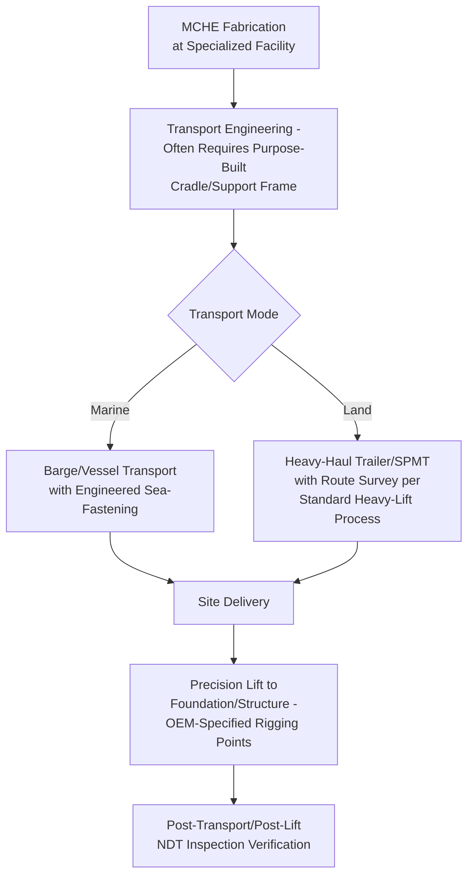

## LNG Facility Equipment Movements

### Purpose and Scope

LNG (liquefied natural gas) facility equipment movements cover the specialized heavy-lift and transport logistics required for liquefaction plant (export terminal) and regasification plant (import terminal) construction, distinguished from general petrochemical logistics by the presence of cryogenic-service equipment with unique handling sensitivities, extremely large single-piece process equipment (main cryogenic heat exchangers, LNG storage tanks), and stringent materials-of-construction handling requirements (many cryogenic components use materials susceptible to damage from mishandling in ways that aren't visually obvious). This section covers major LNG equipment categories, cryogenic handling considerations, and LNG-specific module/equipment logistics.

### Major LNG Equipment Categories

| Equipment | Typical Characteristics | Primary Logistics Challenge |
| --- | --- | --- |
| Main Cryogenic Heat Exchanger (MCHE) | Large coil-wound or plate-fin exchangers, tens to 100+ tonnes, tall/vertical or long/horizontal geometry depending on type | Size/geometry combined with precision internals sensitive to shock |
| LNG storage tank components | Inner tank (often 9% nickel steel or similar cryogenic-rated material), outer tank, large-diameter plate/shell sections | Specialized material handling, often field-erected rather than transported whole |
| Liquefaction train modules | Multi-discipline process modules similar in concept to refinery modules but incorporating cryogenic piping/insulation | Same modularization-logistics trade-offs as refinery modules, with added cryogenic material considerations |
| Cryogenic pumps and compressors | Precision rotating equipment rated for cryogenic service | Similar sensitivity profile to standard compressor logistics, with added low-temperature material certification requirements |
| Loading arms and jetty equipment | Large articulated structures for ship loading/unloading | Combines heavy-lift handling with precision alignment for operational function |

### Why Cryogenic Equipment Requires Distinct Handling Considerations

Equipment rated for cryogenic service (typically materials and welds qualified for LNG's approximately -162°C storage/process temperature) often uses specialized materials — 9% nickel steel, austenitic stainless steels, or aluminum alloys — selected specifically for low-temperature toughness. These materials and their welded joints can be more sensitive to certain types of mechanical damage (impact, excessive local stress) than standard carbon steel construction, and damage that would be cosmetically invisible or structurally insignificant on conventional equipment can compromise cryogenic service integrity.

**[Inference]** This sensitivity is the underlying reason cryogenic equipment handling procedures typically specify more conservative lift/transport load factors, more rigorous NDT (non-destructive testing) inspection following any handling incident (even minor), and stricter documentation of handling events throughout the logistics chain compared to equivalent-sized standard carbon steel process equipment, though specific inspection/documentation requirements are governed by project-specific quality procedures and applicable codes rather than a single universal standard.

### Main Cryogenic Heat Exchanger (MCHE) Handling

The MCHE is frequently among the largest and most logistically challenging single equipment items in an LNG liquefaction train:

- **Support/cradle engineering** — MCHE units, particularly coil-wound designs, often have specific orientation and support point requirements to avoid inducing internal coil/tube stress during transport, requiring purpose-engineered cradles rather than generic heavy-lift support
- **Lift point specification** — OEM-designated lift points are used specifically because they align with the unit's internal structural reinforcement, avoiding load introduction at points that could stress internal tube bundles or coils
- **Post-handling inspection** — given cryogenic material sensitivity, post-transport and post-lift inspection (visual and often NDT) is standard practice before the unit proceeds to installation, verifying no handling-induced damage occurred that could compromise later cryogenic service integrity

### LNG Storage Tank Construction Logistics

Unlike most equipment covered in this material, large LNG storage tanks (particularly full-containment tanks with inner cryogenic tank and outer concrete/steel containment structure) are typically **field-erected rather than transported as a complete unit** — the tank is far too large for any practical transport method as a finished structure.

Logistics therefore focuses on:

- **Plate and shell section delivery** — individual steel plates or pre-curved shell sections delivered to site for field welding/erection, following conventional steel plate logistics rather than heavy-lift module logistics
- **Specialized cryogenic material handling** — 9% nickel steel or equivalent inner tank material often requires specific handling procedures (lifting sling/spreader configurations that avoid point-loading edges, careful storage orientation to prevent warping) distinct from standard carbon steel plate handling
- **Large-item deliveries within tank construction** — certain tank-associated equipment (large roof structures for some tank designs, if not built in place) may still require heavy-lift handling even though the tank shell itself is field-erected

### Modular Liquefaction Train Logistics

Liquefaction (and to a lesser extent regasification) process equipment is increasingly delivered via modularization, following the same fundamental modularization-logistics feedback loop covered in refinery module logistics, with LNG-specific additions:

| Consideration | Refinery Module (General) | LNG Liquefaction Module (Specific) |
| --- | --- | --- |
| Modularization driver | Fabrication yard labor cost/productivity advantage | Same driver, often amplified by remote/Arctic or otherwise high-cost LNG project locations |
| Material handling | Standard structural/piping handling | Additional cryogenic material handling procedures for cold-service piping sections |
| Insulation considerations | Not typically applicable | Some modules are pre-insulated for cryogenic service before shipment, requiring transport protection for insulation systems in addition to the structural cargo itself |
| Pre-commissioning scope | Standard multi-discipline pre-commissioning | Often includes cryogenic system pressure/leak testing before shipment, adding a quality gate to the fabrication-to-shipment sequence |

**[Inference]** Given that many LNG liquefaction projects are sited in remote locations specifically chosen for gas resource proximity rather than fabrication convenience, the labor-cost/productivity case for aggressive modularization is often particularly strong in this sector relative to refinery projects sited nearer to existing industrial infrastructure — though this varies significantly by specific project location and is not a universal rule.

### Site Access and Terminal-Specific Logistics Considerations

LNG terminal sites frequently present distinct site access characteristics:

- **Coastal/marine-adjacent siting** — LNG terminals require marine access for LNG carrier loading/unloading, meaning many projects have direct marine transport access at or very near the final site, similar to the marine-access advantage discussed for refinery mega-modules, but even more consistently present given the fundamental marine-dependent nature of LNG terminal operations
- **Remote location logistics** — many LNG projects (particularly liquefaction/export facilities) are sited in remote regions near gas resources, introducing the same remote-site logistics challenges covered broadly in heavy-lift practice (limited existing infrastructure, extended supply chain lead times, potential need for temporary port/jetty facilities specifically to support construction logistics before permanent terminal infrastructure is operational)
- **Jetty and loading arm installation** — the marine loading/unloading interface itself (jetty structure, loading arms) requires its own heavy-lift installation logistics, often using marine-based crane vessels similar in principle to (though generally smaller scale than) offshore platform topside installation

### Key Operational Considerations

**Key Points**

- Cryogenic material sensitivity (9% nickel steel and similar) drives more conservative handling load factors and more rigorous post-handling inspection than equivalent standard carbon steel equipment
- MCHE and similar large cryogenic equipment require purpose-engineered cradles and OEM-specified lift points to avoid inducing internal component stress
- LNG storage tanks are field-erected from plate/shell sections rather than transported as complete units, distinguishing tank logistics from most other LNG equipment logistics
- Modularization economics in LNG projects are often amplified by remote siting, making the fabrication-yard-labor-cost driver particularly strong relative to less remote petrochemical projects
- Marine access is a near-universal characteristic of LNG terminal sites given the fundamental need for LNG carrier access, distinct from refinery projects where marine access is a favorable but not defining site characteristic

### Example

**Example**

A liquefaction facility MCHE unit (a large coil-wound exchanger, approximately 480 tonnes) is fabricated at a specialized facility and transported via barge to the remote coastal project site, using a purpose-engineered cradle designed to support the unit at its OEM-specified support points and avoid inducing coil stress during the marine transit's dynamic motion loading. On arrival, the unit undergoes visual and NDT inspection to verify no transport-induced damage occurred before proceeding to lift. The lift itself uses OEM-designated rigging points aligned with the unit's internal structural reinforcement, and a further inspection is performed post-lift before the unit is accepted into the mechanical completion sequence — reflecting the more conservative, multi-stage inspection regime applied to cryogenic-service equipment relative to standard process equipment of similar scale.

### Common Pitfalls

- Applying standard carbon steel equipment handling load factors and inspection regimes to cryogenic-rated equipment without accounting for its distinct material sensitivity
- Using generic (non-OEM) lift or cradle support points on large cryogenic exchangers, risking internal coil/tube stress not visible through external inspection alone
- Underestimating the remote-site logistics burden for liquefaction projects, particularly regarding extended supply chain lead times and temporary construction-phase port infrastructure needs
- Treating LNG storage tank logistics with the same "transport-as-complete-unit" framework applied to other heavy-lift equipment, rather than recognizing the field-erection-from-components model
- Failing to build post-handling NDT inspection into the fabrication-to-installation schedule as a quality gate, risking undetected handling damage carrying through to commissioning

### Related Topics

- Refinery Module and Skid Transport Planning
- Pipeline Component and Compressor Logistics
- Offshore Platform Topside Transport and Installation
- Cryogenic Material Handling and NDT Inspection Standards
- Remote Site Logistics Planning for Resource-Adjacent Facilities
- Marine Jetty and Loading Arm Installation Engineering