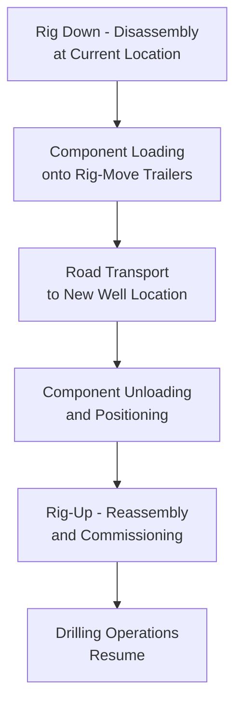
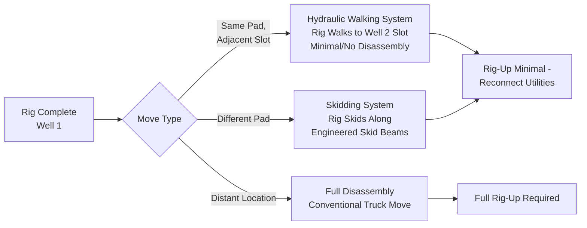
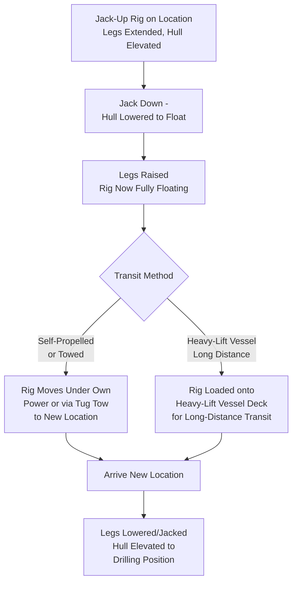

## Drilling Rig Relocation Logistics

### Purpose and Scope

Drilling rig relocation logistics covers the disassembly, transport, and reassembly of land and jack-up offshore drilling rigs as they move between well locations. This differs structurally from the project cargo topics covered elsewhere in this chapter: a rig move is a recurring, cyclical logistics operation rather than a one-time project delivery, and the equipment itself (the rig) is both the cargo and, in its assembled state, a piece of capital equipment generating revenue only while drilling — meaning rig-move duration directly and continuously erodes operator economics for the entire relocation window. This section covers land rig walking/skidding and modular rig moves, and jack-up offshore rig relocation.

### Why Rig Moves Are a Distinct Logistics Category

| Factor | Typical Project Cargo (This Chapter) | Drilling Rig Relocation |
| --- | --- | --- |
| Frequency | One-time delivery per project | Recurring — rigs move between wells repeatedly over their operating life |
| Revenue impact | Delay affects project schedule | Delay directly idles a high-day-rate revenue-generating asset |
| Disassembly requirement | Equipment typically delivered pre-assembled | Rig is disassembled into components, moved, and reassembled at each location |
| Standardization | Project-specific engineering per component | Rig-specific but standardized move procedures developed per rig fleet/type |
| Crew continuity | Delivery crew separate from installation crew | Same rig crew typically involved throughout disassembly, move, and rig-up |

### Land Rig Relocation Methods

**1. Conventional Truck-Based Moves**

The traditional method: the rig is disassembled into major components (substructure, derrick sections, mud pumps, generators, pipe racks, camp/accommodation units), each loaded onto specialized rig-moving trailers and trucked to the new location, then reassembled ("rigged up").

Component categories typically include:

- **Substructure** — the base structure supporting the derrick and rig floor, often moved as one or several major sections
- **Derrick** — the vertical tower structure; may be lowered/telescoped for transport on some rig designs, or transported as separated sections on others
- **Drawworks, mud pumps, generators** — major mechanical/power equipment, each typically on dedicated skid units
- **Pipe racks and tubular storage** — drill pipe, casing, and related tubular goods
- **Mud tanks and solids control equipment**
- **Camp/accommodation and support facilities**

**2. Walking/Skidding Systems (Pad-to-Pad Moves)**

For multi-well pad drilling (common in unconventional/shale development), rigs increasingly use hydraulic walking systems or skidding systems that allow the assembled rig (or substantially assembled rig, minimally disassembled) to move directly between adjacent well slots on the same pad without full disassembly.

**Walking systems** use hydraulic "feet" or skid shoes beneath the rig substructure that lift, advance, and set down the rig incrementally, essentially allowing the fully assembled rig to walk short distances (typically well-slot spacing on a multi-well pad) under its own hydraulic power, without craneage.

**[Inference]** The adoption of walking/skidding systems has been driven substantially by the growth of multi-well pad drilling in unconventional resource development, where minimizing move time between adjacent wells on the same pad has a direct and significant impact on overall well-cost economics; the specific time savings relative to conventional truck-based moves vary by rig design and pad configuration and would need project-specific verification rather than a general industry figure.

### Move Time as the Central Economic Driver

Unlike most heavy-lift logistics where cost is measured primarily in direct transport/crane expense, drilling rig relocation economics are dominated by **non-productive time (NPT)** — the day-rate cost of the rig standing idle during the move, which typically far exceeds the direct trucking/crane cost of the move itself.

$$Total\ Move\ Cost \approx (Move\ Duration \times Day\ Rate) + Direct\ Transport\ Cost$$

Given that rig day rates are typically substantial relative to daily trucking costs, minimizing move duration — even at some increase in direct transport cost (more trucks/cranes working in parallel, premium mobilization for faster equipment availability) — is frequently the economically optimal logistics strategy, which is why walking/skidding system adoption has been justified primarily on move-time reduction rather than direct cost-per-move savings.

### Component Handling and Lifting Considerations

Rig component lifting during disassembly/reassembly shares fundamental heavy-lift rigging principles with other equipment covered in this material, with rig-specific considerations:

- **Derrick raising/lowering** — many rig designs feature a derrick that is raised/lowered as an integrated structure using the rig's own hydraulic raising system rather than external crane lift, though some designs or component-level moves do require crane assistance for specific sections
- **Substructure lift/skid points** — substructure sections typically have engineered lift/skid points designed into the structure from manufacture, specifically to support the repeated disassembly/reassembly cycle a rig undergoes over its operating life (unlike most project cargo, which is handled once)
- **Repeated-use fatigue consideration** — because rig components undergo many more lift/handling cycles over their operating life than typical single-delivery project cargo, lift point and structural fatigue considerations receive engineering attention specific to this repeated-cycle use case

### Jack-Up Offshore Rig Relocation

Jack-up drilling rigs (mobile offshore units with retractable legs that jack the hull above water level for stable drilling operations) relocate via a distinct method from both land rig moves and the topside marine transport covered elsewhere in this chapter:

- **Self-propelled or towed transit** — for relatively short-distance moves within a region, jack-up rigs typically transit under their own propulsion (if self-propelled) or via tug tow with the hull floating and legs raised, similar in principle to a large floating vessel move
- **Heavy-lift vessel transport** — for long-distance relocations (particularly between ocean basins or regions), jack-up rigs are sometimes loaded onto a heavy-lift vessel deck for the transit, since self-propelled/towed transit over very long distances can be slower and carries higher weather/sea-state exposure risk over the extended transit duration than a dry-transport heavy-lift vessel move
- **Site-specific jacking engineering** — at both the departure and arrival location, seabed conditions must be verified adequate for the rig's leg spudcan bearing loads, following similar ground/seabed bearing pressure logic to onshore crane pad GBP verification, but applied to the marine seabed environment

### Comparative Summary: Land vs. Jack-Up Rig Relocation

| Factor | Land Rig | Jack-Up Offshore Rig |
| --- | --- | --- |
| Primary move method | Truck transport (disassembled) or walking/skidding (assembled) | Self-propelled/towed float, or heavy-lift vessel for long distance |
| Disassembly requirement | Full disassembly for distant moves; minimal for walking/skidding | No disassembly — rig transits as a floating unit with legs raised |
| Primary economic driver | Non-productive time (day rate) during disassembly/transport/reassembly | Non-productive time during transit, plus weather-window sensitivity for extended tows |
| Site verification requirement | Ground bearing for rig pad/substructure | Seabed bearing capacity for leg spudcan loads at both departure and arrival |

### Key Operational Considerations

**Key Points**

- Non-productive time (rig day-rate cost during the move) typically dominates drilling rig relocation economics far more than direct transport cost, distinguishing rig-move logistics from most project cargo cost structures
- Walking/skidding systems for multi-well pad moves are justified primarily by move-time reduction rather than direct cost-per-move savings
- Rig components are engineered for repeated lift/handling cycles over the rig's operating life, unlike most project cargo designed for single-delivery handling
- Jack-up rig relocation requires seabed bearing capacity verification for leg spudcan loads at both departure and arrival locations, paralleling onshore crane pad GBP verification logic
- Long-distance jack-up rig relocation sometimes uses heavy-lift vessel transport specifically to reduce weather/sea-state exposure risk relative to extended self-propelled/towed transit

### Example

**Example**

A land drilling rig operating on a multi-well pad uses a hydraulic walking system to move between four well slots on the same pad, each move completed within a period the operator's economics show is substantially faster than a comparable conventional disassembly/truck/reassembly move would require, minimizing non-productive day-rate time between wells. When the rig subsequently moves to a distant pad outside walking range, it undergoes full disassembly, with substructure and derrick sections transported via dedicated rig-move trailers using the components' engineered, fatigue-rated lift/skid points designed for the rig's repeated relocation cycle over its operating life.

### Common Pitfalls

- Optimizing rig-move logistics around direct transport cost minimization rather than total non-productive time economics, missing the larger cost driver
- Applying single-use lift point/structural assumptions to rig components without accounting for repeated-cycle fatigue considerations specific to rigs' operating life
- Underestimating seabed bearing verification requirements for jack-up rig leg spudcans at a new location, risking punch-through or inadequate support during jacking
- Selecting self-propelled/towed transit for long-distance jack-up relocations without adequately weighing extended weather/sea-state exposure risk against heavy-lift vessel transport
- Failing to develop rig-specific standardized move procedures, resulting in inconsistent move times across an operator's rig fleet

### Related Topics

- Offshore Platform Topside Transport and Installation
- Pipeline Component and Compressor Logistics
- Ground Bearing Pressure Analysis for Heavy-Lift Operations
- SPMT Operations for Vessel Loadout and Ro-Ro Transfer (Comparative Skidding/Walking Systems)
- Seabed Bearing Capacity Assessment for Marine Structures
- Multi-Well Pad Drilling Logistics Planning