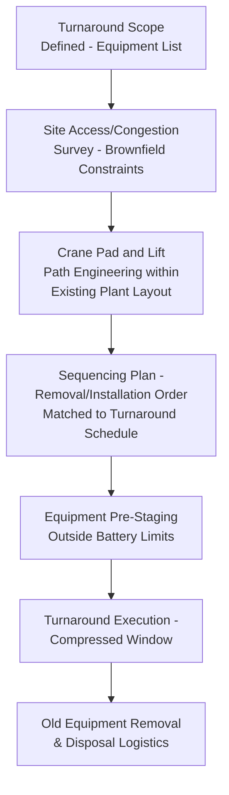

## Petrochemical Plant Turnaround Logistics

### Purpose and Scope

Petrochemical plant turnaround logistics covers the specialized heavy-lift and transport planning required to support a plant turnaround (also called a shutdown, outage, or STO — shutdown/turnaround/outage) — a planned, time-boxed period during which a process unit or entire facility is taken offline for inspection, maintenance, catalyst change-out, and equipment replacement. This differs fundamentally from the new-build project cargo logistics covered elsewhere in this chapter: turnaround logistics operates within an extremely compressed, fixed-duration schedule inside a live, operating (though shut down) industrial facility, with every day of schedule overrun carrying direct, quantifiable lost-production cost. This section covers turnaround logistics planning principles, equipment/access constraints unique to brownfield sites, and critical-path heavy-lift sequencing within a turnaround.

### Why Turnaround Logistics Is a Distinct Category

| Factor | New-Build Project Cargo | Turnaround Logistics |
| --- | --- | --- |
| Site condition | Greenfield or actively-constructing site, generally open access | Live, congested operating facility with existing infrastructure constraints |
| Schedule pressure | Significant but generally has more built-in float | Extremely compressed, fixed-duration window with heavy financial penalty for overrun |
| Site access | Purpose-designed for construction logistics | Constrained by existing plant layout, pipe racks, roads not designed for heavy-lift access |
| Cargo characteristics | New equipment being installed | Mix of new replacement equipment inbound and old/removed equipment outbound |
| Crane/lift planning | Generally more flexible pad/route options | Highly constrained lift zones, often requiring lifts over or near live (though shut-down) process equipment |
| Cost of delay | Schedule cost, generally | Direct lost-production cost, frequently the dominant project cost driver |

### The Economic Driver: Lost Production Cost

Turnaround logistics planning is governed above all by the extremely high cost of schedule overrun, since a delayed turnaround directly delays the unit's return to production:

$$Overrun\ Cost \approx Lost\ Production\ Value\ (per\ day) \times Overrun\ Days$$

**[Inference]** Given that lost production value for a major process unit typically substantially exceeds the direct cost of the heavy-lift/logistics operations supporting the turnaround, logistics planning for turnarounds is generally weighted heavily toward schedule certainty and risk mitigation — even at premium direct cost — over minimizing logistics spend itself, a different optimization priority than much new-build project cargo logistics where cost and schedule are more comparably weighted.

### Pre-Turnaround Logistics Planning

**Site access and congestion survey** — unlike greenfield project sites, turnaround lift planning must work within existing plant infrastructure: pipe racks, adjacent operating units (which may remain live even while the turnaround unit is shut down), existing roads not designed for heavy-lift traffic, and limited laydown space within the plant boundary. This often requires detailed 3D site modeling to verify crane lift paths clear existing structures with adequate margin.

**Crane pad engineering within constrained footprint** — crane positions for turnaround lifts are frequently far more constrained than new-build sites, sometimes requiring cranes to operate at reduced capacity (working at a non-optimal radius/configuration dictated by the only available pad location) rather than the more flexible pad siting possible on open construction sites.

**Equipment pre-staging** — because turnaround execution windows are so compressed, replacement equipment (new catalyst vessels, heat exchanger bundles, valve assemblies) is typically pre-staged at a laydown area near, but outside, the operating unit's battery limits well before the turnaround begins, so it is immediately available for installation the moment the relevant old equipment is removed, rather than being delivered reactively during the turnaround window itself.

### Common Turnaround Heavy-Lift Scope Items

| Equipment Category | Typical Activity |
| --- | --- |
| Heat exchanger bundles | Pull (remove) old bundle, install new/re-tubed bundle |
| Reactor internals/catalyst | Catalyst unloading/loading, sometimes internals replacement |
| Column trays/internals | Removal and reinstallation for inspection or replacement |
| Compressor rotors | Rotor pull for inspection/overhaul, reinstallation |
| Piping spool replacement | Removal of old piping sections, installation of new/modified spools |
| Vessel replacement | Full vessel swap where equipment has reached end of service life |

**Heat exchanger bundle pulling** is one of the most common and logistically routine turnaround heavy-lift activities, using a specialized bundle puller (a hydraulic extraction device that withdraws the tube bundle axially from the shell) combined with crane support for lifting the extracted bundle clear and positioning the replacement.

### Sequencing and Critical Path Logistics

Because turnaround duration is fixed and heavily penalized for overrun, heavy-lift sequencing is typically developed as a tightly integrated part of the overall turnaround critical path schedule, not as a separately optimized logistics plan:

Lift sequencing prioritizes critical-path equipment — items whose inspection/maintenance timeline is the longest of all turnaround activities — for the earliest possible removal, since any delay in getting a critical-path item out for inspection directly extends the overall turnaround duration. Non-critical-path lifts have more scheduling flexibility and are typically sequenced around crane/crew availability without directly threatening overall turnaround duration, provided they still complete within the window.

### Crane and Equipment Sharing Across Multiple Work Fronts

A characteristic feature of turnaround logistics not typically present in new-build project cargo work: multiple simultaneous work fronts within the same turnaround (different equipment items, different areas of the unit) frequently compete for a limited pool of cranes and heavy-lift equipment mobilized for the turnaround period.

- **Crane scheduling/allocation planning** — a detailed crane utilization schedule is typically developed pre-turnaround, allocating specific crane time windows to specific lifts across the full equipment list, since crane availability (not just individual lift engineering) becomes a scheduling constraint when many lifts compete for limited crane-hours within the fixed window
- **Mobile vs. crawler crane trade-offs** — turnarounds often favor a mix of smaller, faster-mobilizing mobile cranes for routine lifts (heat exchanger bundles, smaller vessels) alongside one or a few larger cranes reserved for the heaviest critical-path items, balancing the need for many parallel smaller lifts against the capacity requirement of the largest items

### Old Equipment Removal and Disposal Logistics

Turnaround logistics also encompasses outbound logistics that new-build project cargo generally doesn't: removed equipment (old heat exchanger bundles, decommissioned vessels, spent catalyst) must be transported off-site, often to specialized disposal, recycling, or catalyst reclamation facilities, sometimes under hazardous materials transport requirements distinct from the inbound new-equipment logistics.

### Key Operational Considerations

**Key Points**

- Lost production cost, not direct logistics spend, is typically the dominant economic driver shaping turnaround logistics planning priorities
- Crane pad and lift path engineering within an existing, congested brownfield facility is fundamentally more constrained than greenfield project site planning
- Pre-staging replacement equipment outside battery limits well ahead of the turnaround window is standard practice to eliminate reactive delivery risk during the compressed execution period
- Critical-path equipment removal sequencing directly governs overall turnaround duration, making lift sequencing for those specific items the highest-priority logistics planning focus
- Crane allocation across multiple simultaneous work fronts becomes a scheduling constraint in its own right during turnarounds, distinct from single-lift engineering planning
- Outbound logistics for removed/decommissioned equipment and spent catalyst is a turnaround-specific logistics scope largely absent from new-build project cargo work

### Example

**Example**

A refinery unit turnaround includes replacement of a critical-path reactor's internals (longest inspection/maintenance duration of any item in the turnaround) alongside routine heat exchanger bundle pulls across the unit. The reactor internals removal is scheduled as the very first lift after unit isolation is complete, using the turnaround's largest mobilized crane reserved specifically for this critical-path sequence, while a smaller mobile crane works in parallel on heat exchanger bundle pulls elsewhere in the unit using pre-staged replacement bundles positioned at the laydown area weeks before turnaround start. Old reactor internals and spent catalyst are transported off-site to a specialized reclamation facility under the applicable hazardous materials transport requirements, running as a separate outbound logistics stream alongside the inbound replacement equipment delivery.

### Common Pitfalls

- Underestimating brownfield site congestion when engineering crane pad locations and lift paths, discovering interference issues only during execution
- Delivering replacement equipment reactively during the turnaround window rather than pre-staging, introducing unnecessary schedule risk
- Failing to prioritize critical-path equipment in lift sequencing, allowing a longer-duration inspection item to become the unplanned schedule-limiting factor
- Underestimating crane allocation conflicts across multiple simultaneous work fronts, causing lift delays due to crane unavailability rather than lift engineering issues
- Neglecting outbound disposal/reclamation logistics planning for removed equipment and spent catalyst, treating turnaround logistics as inbound-only

### Related Topics

- Post-Project Review and Performance Evaluation
- Refinery Module and Skid Transport Planning
- Pipeline Component and Compressor Logistics
- Client Relationship Management in Project Logistics
- Heat Exchanger Bundle Pulling Equipment and Techniques
- Hazardous Materials Transport for Spent Catalyst and Decommissioned Equipment