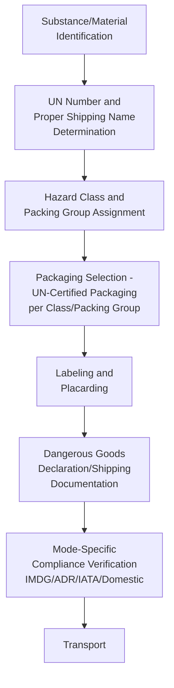

## Hazardous Materials Handling in Project Cargo

### Purpose and Scope

Hazardous materials handling in project cargo covers the regulatory classification, packaging, documentation, and operational controls required when heavy-lift and specialized logistics shipments involve dangerous goods — a category that appears throughout oil, gas, and petrochemical logistics in forms ranging from process chemicals and catalysts to radioactive sources used in equipment inspection. This differs from the equipment-handling-sensitivity topics covered elsewhere in this chapter (e.g., cryogenic material sensitivity) in that hazardous materials logistics is governed by a formal international regulatory framework with legally binding classification, packaging, and documentation requirements, independent of the cargo's structural or mechanical handling characteristics. This section covers the major international regulatory frameworks, classification systems, and operational controls relevant to project cargo hazardous materials.

### Why Hazardous Materials Appear Throughout Oil, Gas, and Petrochemical Project Cargo

Hazardous materials intersect with heavy-lift logistics in several distinct ways across topics covered elsewhere in this chapter:

- **Spent catalyst** from turnaround activities (often pyrophoric or containing heavy metals) requiring hazardous waste transport classification
- **Radioactive sources** used for radiographic (NDT) inspection of welds on pressure vessels, piping, and structural components — common throughout fabrication and field construction quality assurance
- **Process chemicals** delivered to site for initial plant commissioning (catalysts, chemical inventory, lubricants) ahead of startup
- **Residual product/chemicals** in equipment being relocated or decommissioned (e.g., a compressor or vessel that previously contained process fluids)
- **Compressed gases** used in construction/commissioning activities (nitrogen for purging, welding gases)

### Major Regulatory Frameworks

| Framework | Governing Scope | Administering Body |
| --- | --- | --- |
| IMDG Code (International Maritime Dangerous Goods) | Sea transport of dangerous goods | International Maritime Organization (IMO) |
| ADR (European Agreement on International Carriage of Dangerous Goods by Road) | Road transport within/through Europe | UNECE |
| IATA Dangerous Goods Regulations | Air transport | International Air Transport Association |
| Country-specific road/rail regulations | Domestic road/rail transport | National regulatory authorities (e.g., PHMSA/DOT in the US, equivalent bodies elsewhere) |
| UN Recommendations on the Transport of Dangerous Goods (the "Orange Book") | Foundational classification framework underpinning most modal regulations | United Nations |

**[Inference]** Because heavy-lift project cargo frequently moves via multiple transport modes within a single shipment (e.g., ocean vessel to port, then road to site), hazardous materials documentation and packaging must typically satisfy the most stringent applicable modal requirement across the full multi-modal journey, meaning compliance planning generally needs to reference all relevant frameworks for the specific route rather than a single governing code — though the specific compliance strategy is shipment- and route-specific.

### UN Hazard Classification System

The foundational classification system (adopted with modal-specific adaptations across IMDG, ADR, IATA, and most national frameworks) organizes dangerous goods into nine classes:

| Class | Category | Relevance to Project Cargo |
| --- | --- | --- |
| 1 | Explosives | Rare in typical project cargo; relevant for certain specialized applications |
| 2 | Gases | Compressed/liquefied gases for construction, commissioning, or process inventory |
| 3 | Flammable liquids | Fuels, solvents, some process chemical inventory |
| 4 | Flammable solids, spontaneously combustible, dangerous when wet | Some catalysts fall here (pyrophoric materials) |
| 5 | Oxidizing substances and organic peroxides | Certain process chemicals |
| 6 | Toxic and infectious substances | Certain process chemicals, catalysts |
| 7 | Radioactive material | NDT radiography sources |
| 8 | Corrosive substances | Acids, caustics used in process chemical inventory |
| 9 | Miscellaneous dangerous goods | Various, including some environmentally hazardous substances |

Each class has associated packing group designations (where applicable) reflecting the degree of hazard, which in turn govern the specific packaging, labeling, and documentation requirements for a given substance.

### Documentation and Packaging Requirements

- **UN number and proper shipping name** — every regulated dangerous good has a standardized 4-digit UN number and associated proper shipping name used consistently across documentation and packaging
- **UN-certified packaging** — packaging used for regulated hazardous materials must meet UN performance testing standards specific to the substance's class and packing group, marked with the UN certification code on the packaging itself
- **Placarding** — vehicles/containers carrying hazardous materials above threshold quantities require external placarding displaying the relevant hazard class symbol(s), visible for emergency responder identification
- **Dangerous goods declaration** — formal shipping documentation (format varies by mode but content is broadly standardized around UN number, proper shipping name, class, packing group, quantity, and emergency contact information) must accompany the shipment

### Radioactive Sources for Industrial Radiography (NDT)

Radioactive sources (Class 7) used for weld radiography on heavy-lift project cargo components warrant specific attention given their prevalence in fabrication and field quality assurance:

- **Source licensing and control** — radiographic sources (commonly Iridium-192 or Cobalt-60 for industrial NDT) are subject to strict licensing, tracking, and security requirements distinct from most other hazardous materials categories, reflecting both radiation safety and nuclear security concerns
- **Type A/Type B package requirements** — radioactive source transport packaging must meet specific performance-tested containment standards (Type A or Type B packaging, depending on source activity level) certified to contain the source under both normal and, for higher-activity sources, accident-condition transport scenarios
- **Site radiography safety zones** — when radiography is performed on-site (e.g., inspecting a field weld on installed piping or a module), exclusion zone establishment and radiation safety officer oversight are standard operational controls layered on top of the transport/handling regulatory requirements
- **Chain of custody documentation** — radioactive source movement typically requires more rigorous chain-of-custody documentation than most other dangerous goods categories, reflecting the security-sensitive nature of the material

**[Unverified]** Specific source activity thresholds, licensing categories, and Type A vs. Type B packaging determination criteria are governed by detailed technical standards (e.g., IAEA transport regulations and national nuclear regulatory authority requirements) that should be verified against current applicable regulation for the specific jurisdiction and source involved, rather than assumed from general principles.

### Spent Catalyst and Process Residual Handling

Turnaround and decommissioning activities (covered elsewhere in this chapter) frequently generate hazardous materials logistics requirements distinct from new-equipment delivery:

- **Pyrophoric catalyst** — many refining/petrochemical catalysts (particularly certain hydroprocessing catalysts) are pyrophoric (spontaneously combustible on exposure to air) when removed from service, requiring specific handling procedures (often wetting/passivation treatment before removal) and Class 4 hazardous materials transport classification for disposal/reclamation shipment
- **Residual product decontamination** — equipment being relocated or decommissioned that previously contained process fluids typically requires decontamination/purging and verification (e.g., gas-free certification) before it can be classified as non-hazardous for transport, or alternatively must be transported under the appropriate hazardous materials classification if residual content cannot be fully removed
- **Waste classification vs. dangerous goods classification** — removed hazardous materials destined for disposal may be subject to both transport dangerous goods regulation and separate hazardous waste regulation (which can carry additional documentation requirements such as waste manifests), depending on jurisdiction

### Operational Controls During Heavy-Lift Operations Involving Hazardous Materials

Where hazardous materials logistics intersects directly with heavy-lift handling (e.g., lifting a vessel or module with residual hazardous content, or coordinating radiography during an active lift campaign):

- **Segregation requirements** — certain hazard classes cannot be transported or stored together (incompatible substance segregation rules), which can affect laydown area planning at marshalling yards or construction sites handling multiple material types
- **Emergency response planning** — sites and transport routes handling significant hazardous materials volumes typically require project-specific emergency response planning coordinated with local emergency services, distinct from standard heavy-lift HSE planning
- **Training and certification** — personnel involved in hazardous materials packaging, documentation, or handling typically require specific regulatory training/certification (varies by framework — e.g., IMDG-specific training for personnel handling IMDG-classified shipments)

### Key Operational Considerations

**Key Points**

- Multi-modal project cargo shipments typically must satisfy the most stringent applicable regulatory framework across the full route, not a single governing code
- Radioactive sources for NDT radiography carry additional licensing, security, and chain-of-custody requirements beyond standard dangerous goods classification, reflecting radiation safety and nuclear security concerns
- Pyrophoric spent catalyst requires specific passivation/wetting treatment before it can be safely handled and transported under appropriate hazardous materials classification
- Equipment being relocated or decommissioned with residual process content requires decontamination and verification before it can be classified as non-hazardous, or must otherwise be transported under appropriate hazardous classification
- Segregation and incompatibility rules between hazard classes can directly affect laydown area and storage planning at sites handling multiple hazardous material types

### Example

**Example**

A refinery turnaround generates a shipment of spent hydroprocessing catalyst requiring passivation treatment on-site before removal, due to its pyrophoric characteristics when exposed to air. The passivated catalyst is packaged in UN-certified containers appropriate to its assigned Class 4 hazard classification and packing group, labeled and placarded accordingly, and transported to a specialized reclamation facility under a dangerous goods declaration satisfying the applicable domestic road transport regulation. In parallel, radiographic inspection of new piping welds installed during the same turnaround uses an Iridium-192 source transported in a certified Type B package under IAEA-aligned transport regulations, with a site-established radiography exclusion zone and radiation safety officer oversight during on-site use, and formal chain-of-custody documentation maintained throughout the source's presence at the facility.

### Common Pitfalls

- Assuming a single regulatory framework governs a shipment that actually crosses multiple transport modes, each with potentially differing requirements
- Underestimating radioactive source security/chain-of-custody requirements relative to standard dangerous goods documentation
- Skipping or inadequately verifying pyrophoric catalyst passivation before handling, risking spontaneous combustion incidents
- Failing to verify residual product decontamination/gas-free status before classifying relocated equipment as non-hazardous for transport
- Overlooking hazard class segregation requirements when planning shared laydown or storage areas for multiple material types

### Related Topics

- Petrochemical Plant Turnaround Logistics
- LNG Facility Equipment Movements
- Post-Project Review and Performance Evaluation
- Pipeline Component and Compressor Logistics
- Radiographic NDT Inspection Standards for Welded Construction
- HSE Incident Investigation and Reporting Frameworks