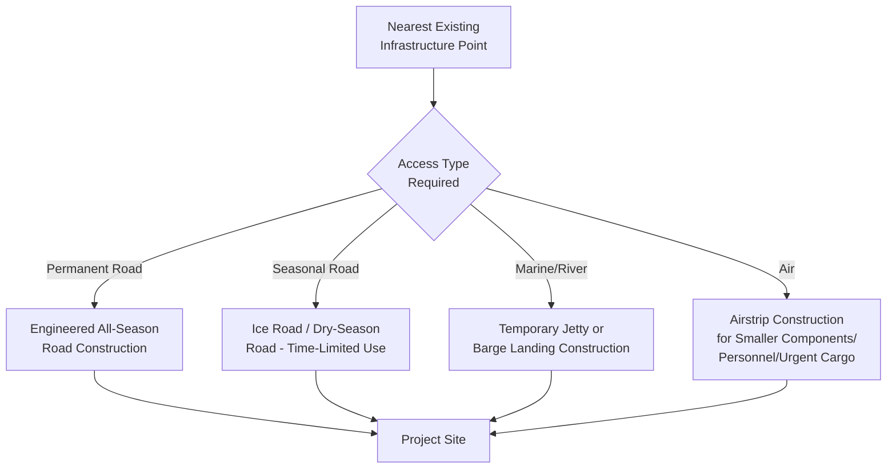
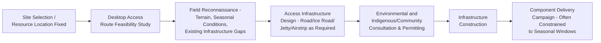

## Remote Site Access for Oil and Gas Projects

### Purpose and Scope

Remote site access logistics covers the planning and infrastructure development required to deliver heavy-lift and project cargo to oil and gas project sites lacking existing industrial-grade transport infrastructure — a recurring characteristic across upstream (drilling, production facilities), midstream (pipeline compressor stations), and increasingly LNG liquefaction projects, since gas and oil resources are frequently located far from established road, rail, and port networks. Unlike the route-constraint topics covered elsewhere (which address working within existing infrastructure), remote site logistics frequently requires building substantial temporary or permanent infrastructure from nothing before any component delivery can begin. This section covers remote access infrastructure categories, seasonal/environmental access windows, and the strategic planning approach distinct to this logistics category.

### Why Remote Access Is a Distinct Planning Category

| Factor | Standard Route Logistics (Existing Infrastructure) | Remote Site Access |
| --- | --- | --- |
| Starting infrastructure | Existing road/rail/port network, subject to constraint assessment | Often no existing heavy-haul-capable infrastructure at all |
| Primary planning activity | Route survey, bridge/clearance assessment, permitting | Infrastructure design and construction, in addition to survey/permitting |
| Lead time driver | Permit approval, bridge modification if needed | Infrastructure construction itself, often the longest lead-time item in the entire project |
| Seasonal sensitivity | Generally moderate | Often severe — many remote regions have narrow seasonal access windows (ice roads, dry-season-only routes) |
| Cost allocation | Logistics cost within transport budget | Infrastructure cost often allocated to overall project civil works budget, blurring the boundary between "logistics" and "construction" |

### Categories of Remote Access Infrastructure

**1. Temporary and Permanent Access Roads**

Where no road exists, a purpose-built access road must be engineered and constructed before any component delivery can occur — this differs from the site-internal road planning covered in wind farm and refinery site logistics in that remote access roads frequently extend far beyond the immediate project boundary, sometimes tens or hundreds of kilometers, to connect to the nearest existing infrastructure.

**2. Ice Roads**

In Arctic and sub-Arctic regions (northern Canada, Alaska, Russia, parts of Scandinavia), seasonal ice roads — engineered snow/ice-reinforced routes over frozen ground, lakes, or rivers — provide a heavy-haul-capable route that exists only during winter months, when frozen ground bearing capacity is sufficient to support heavy component loads that would be entirely infeasible during unfrozen conditions.

- **Ice road engineering** — ice thickness over water crossings is engineered and monitored against calculated load capacity requirements, with different thickness thresholds for different vehicle/load weight categories
- **Narrow operational window** — the viable ice road season is often only a few months (varies significantly by region/winter severity), meaning an entire year's heavy component delivery to a remote site may need to be compressed into this window, creating a hard external constraint on project schedule that doesn't exist for temperate-region projects
- **Weather/temperature monitoring** — ice road opening/closing dates depend on real-time ice thickness and temperature monitoring rather than a fixed calendar schedule, introducing planning uncertainty around the exact usable window length in any given year

**[Inference]** Given documented trends toward warmer winters in many Arctic/sub-Arctic regions, ice road season length and reliability have likely become less predictable in recent years relative to historical planning assumptions in at least some regions, though the specific magnitude and regional variation of this effect would require current climate/engineering data specific to the region in question rather than a general assumption.

**3. Dry-Season Roads**

In tropical or monsoon-affected regions, unpaved routes may only support heavy-haul traffic during dry-season months, with wet-season conditions rendering subgrade bearing capacity inadequate for heavy component loads — conceptually similar to the ice road seasonal constraint but driven by soil moisture/bearing capacity rather than freezing.

**4. Marine and River Access**

Where remote sites are near navigable water (coastal or river-accessible), marine/river transport can bypass the need for extensive overland road construction:

- **Temporary jetty/landing construction** — a purpose-built temporary jetty or barge landing may be constructed specifically to support project construction logistics, sometimes later removed or converted to permanent facility infrastructure (e.g., for LNG terminals, this overlaps directly with the permanent marine loading infrastructure covered in LNG facility logistics)
- **Seasonal river access** — river-based access may itself be seasonally constrained by water level (navigable only during high-water season, or conversely inaccessible during flood conditions), requiring the same seasonal-window planning logic as ice/dry-season roads

**5. Air Access**

For the most remote locations, or for time-critical smaller components, personnel, or urgent spare parts, temporary or permanent airstrip construction may support air delivery — though air transport capacity is fundamentally limited relative to road/rail/marine for the large-mass heavy-lift components central to this material, restricting air access utility primarily to smaller components, personnel, and time-critical light cargo rather than the major heavy-lift equipment items covered elsewhere in this chapter.

### Strategic Planning Sequence for Remote Access

**Early integration with site selection** — because remote access infrastructure development can represent a very large portion of overall project cost and schedule, access feasibility is typically evaluated as part of the site selection process itself (particularly for greenfield upstream or LNG projects with some flexibility in exact site location), rather than treated purely as a downstream logistics execution task once the site is already fixed.

**Environmental and community consultation** — remote sites frequently intersect with environmentally sensitive terrain (wetlands, permafrost, sensitive ecosystems) and Indigenous or local community land/traditional use areas, requiring consultation and permitting processes that can carry substantial lead time and are integral to, not separate from, the access infrastructure planning process.

### Schedule and Campaign Planning Under Seasonal Constraints

Where a hard seasonal access window exists (ice road, dry-season road, or navigable-water-level-dependent marine access), overall project component delivery scheduling must work backward from the available window(s) rather than forward from a flexible construction schedule:

$$Available\ Delivery\ Capacity = Window\ Duration \times Daily\ Throughput\ Capacity$$

If total required component tonnage/volume exceeds the capacity achievable within a single seasonal window, project planning must either accept a multi-year delivery campaign (staging components across successive seasonal windows) or invest in infrastructure upgrades to increase daily throughput capacity within the existing window — a strategic trade-off decision made early in project planning given its substantial schedule and cost implications.

### Comparative Summary of Access Infrastructure Types

| Access Type | Typical Component Suitability | Primary Constraint |
| --- | --- | --- |
| Permanent all-season road | Full range, including largest heavy-lift components | Highest construction cost/lead time, but no seasonal window limitation |
| Ice road | Full range during operational window | Narrow, weather-dependent seasonal window |
| Dry-season road | Full range during dry season | Seasonal window, potentially less predictable than ice road in some regions |
| Marine/river (jetty/landing) | Full range, often highest capacity if navigable access exists | Water level/tidal/seasonal access, jetty construction lead time |
| Air | Small-moderate components, personnel, urgent parts only | Payload/size limitation excludes most major heavy-lift equipment |

### Key Operational Considerations

**Key Points**

- Remote access infrastructure development is frequently the longest lead-time item in the entire project logistics chain, warranting early integration with site selection rather than downstream execution planning
- Seasonal access windows (ice roads, dry-season roads, water-level-dependent marine access) impose hard external schedule constraints that require component delivery planning to work backward from window availability
- Environmental and community consultation/permitting for remote access routes is integral to, not separate from, access infrastructure planning given the frequent intersection with sensitive terrain and land use areas
- Where required delivery volume exceeds single-window capacity, projects face a strategic trade-off between multi-year phased delivery and infrastructure investment to increase throughput capacity
- Air access is generally limited to smaller components, personnel, and urgent cargo given fundamental payload constraints relative to major heavy-lift equipment

### Example

**Example**

A remote gas processing facility site is accessible only via a seasonal ice road with an operational window typically spanning a few winter months, subject to year-to-year variation based on temperature and ice thickness monitoring. Desktop feasibility studies conducted during site selection confirm the ice road can be engineered to support the project's heaviest compressor module loads, but total tonnage requirements exceed what a single season's window can deliver at achievable daily throughput. The project accepts a two-season delivery campaign, staging the heaviest, longest-lead-time equipment (compressor packages) in the first season and remaining structural/piping materials in the second, with environmental and Indigenous community consultation for the ice road route conducted in parallel with early project planning well ahead of the first delivery season.

### Common Pitfalls

- Treating remote access infrastructure as a downstream logistics execution task rather than integrating feasibility assessment into early site selection
- Underestimating seasonal window variability (particularly ice road conditions), planning to a fixed calendar assumption rather than building in monitoring-based contingency
- Sequencing environmental/community consultation and permitting after infrastructure design is finalized rather than as an integral, parallel planning stream
- Failing to verify whether total component delivery volume fits within a single seasonal window's realistic throughput capacity, discovering the shortfall only after construction has begun
- Assuming air access can substitute for road/marine access for major heavy-lift components, when payload limitations generally restrict air delivery to smaller items

### Related Topics

- Onshore Wind Farm Route Constraints and Bridge Modifications (Comparative Route Engineering)
- LNG Facility Equipment Movements
- Pipeline Component and Compressor Logistics
- Ground Bearing Pressure Analysis for Heavy-Lift Operations
- Environmental and Indigenous Community Consultation for Infrastructure Projects
- Multi-Season Project Delivery Campaign Planning