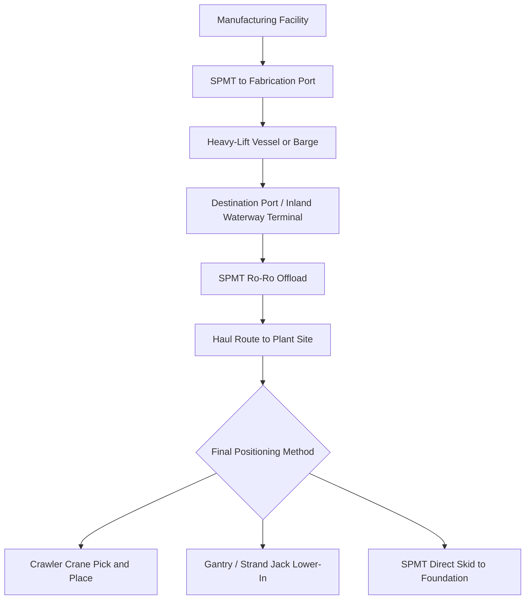

## Generator and Turbine Movements for Power Plants

### Overview

Generator and turbine movements encompass the transport, handling, and site installation of the largest single components in power generation projects: steam turbines, gas turbines, generator stators/rotors, and their auxiliary skids. These components differ from transformers in that they combine extreme weight with rotating-equipment precision tolerances — rotor shafts and bearing journals can be damaged by shock loads measured in fractions of a millimeter of deflection, making rigging and transport engineering as critical as raw lift capacity.

### Component Categories and Typical Weights

- **Steam turbine casings/rotors**: 100–400 tons depending on plant size (utility-scale units can exceed 500 MW)
- **Gas turbine generators (GTGs)**: 200–450 tons as a packaged unit for large-frame heavy-duty gas turbines
- **Generator stators**: 200–500+ tons — often the single heaviest indivisible component on a power plant project
- **Generator rotors**: 50–150 tons, shipped separately from the stator due to fragility of windings and shaft balance
- **HRSG (Heat Recovery Steam Generator) modules**: 50–300 tons per module in combined-cycle plants

### Key Points — Why These Movements Are Specialized

- **Rotor balance sensitivity**: Rotors are dynamically balanced to extremely tight tolerances; transport shock or improper support can induce permanent bow, requiring costly re-balancing or replacement
- **Journal and bearing protection**: Shafts are typically supported on transport cradles that isolate journals from direct load-bearing contact
- **Single lift-point engineering**: Stators and casings often have only 2-4 designed lift/trunnion points, dictating rigging geometry
- **Sequencing criticality**: Turbine and generator delivery is frequently the construction schedule's critical path — late delivery cascades into full project delays

### Primary Movement Methods

#### 1. Factory-to-Port Transport

- SPMT (Self-Propelled Modular Transporter) convoys for factory or fabrication yard to port moves, using the same axle-load-distribution principles as transformer transport
- Air-ride or hydraulic-suspension trailers preferred over rigid-frame trailers to minimize shock transmission to precision components
- Rotors often shipped in dedicated shipping frames/cradles with vibration-dampening mounts

#### 2. Marine Transport

- **Heavy-lift vessels** with onboard cranes (typically 400-2,000 ton capacity) for direct lift-on/lift-off at ports without shore crane infrastructure
- **Semi-submersible or flat-deck barges** for inland waterway delivery to plant sites located on navigable rivers
- Deck stowage engineering accounts for sea-fastening loads (pitch, roll, heave accelerations) distinct from road/rail dynamic loads

#### 3. Site Delivery and Final Positioning

- **SPMT-to-foundation transfer**: Modular trailers move the unit directly over the foundation pit, followed by jacking/skidding systems to lower onto final bedplates
- **Gantry or strand jack systems**: Used where crane capacity or headroom is insufficient, particularly for placing stators/rotors into enclosed turbine halls
- **Mobile/crawler crane lifts**: For sites with adequate laydown area and ground bearing capacity; ringer cranes or heavy crawler cranes (1,000+ ton capacity) commonly used for direct pick-and-place into the turbine hall

**Example**

A 450-ton gas turbine generator arriving by barge at a combined-cycle plant site might be offloaded via ro-ro SPMT directly onto a prepared haul road, transported to the turbine hall opening, then transferred to a gantry/strand-jack system for precision lowering onto isolators at tolerances often specified within a few millimeters.

### Typical Movement Sequence

### Rigging and Lift Engineering Considerations

- **Center of gravity verification**: Manufacturer-supplied CG data is cross-checked against actual measured/weighed values before lift planning, since fabrication variance can shift CG from nominal drawings
- **Trunnion and lift-lug loading**: Engineered lift points are rated for specific sling angles; deviation from designed angles can overload lugs beyond rated capacity
- **Spreader bar and below-the-hook devices**: Used to maintain proper sling angles and avoid point-loading the casing shell
- **Tandem lift coordination**: Very large stators sometimes require two-crane tandem lifts, demanding precise load-sharing calculations (commonly limiting each crane to 75-80% of rated capacity for the shared-load configuration)

### Diagram — Turbine Hall Final Placement (Strand Jack Method)

<svg xmlns="http://www.w3.org/2000/svg" viewBox="0 0 800 350">
<text x="400" y="25" text-anchor="middle" font-size="16" font-weight="bold" fill="#1a1a1a">Generator Stator Lower-In via Strand Jacks (svg_diagram)</text>
<rect x="50" y="50" width="700" height="250" fill="none" stroke="#2c3e50" stroke-width="2" />
<text x="70" y="70" font-size="11" fill="#5a6b78">Turbine Hall Structure</text>
<line x1="200" y1="60" x2="200" y2="100" stroke="#2c3e50" stroke-width="4" />
<line x1="600" y1="60" x2="600" y2="100" stroke="#2c3e50" stroke-width="4" />
<rect x="180" y="55" width="40" height="15" fill="#5a6b78" />
<rect x="580" y="55" width="40" height="15" fill="#5a6b78" />
<text x="200" y="45" text-anchor="middle" font-size="10" fill="#1a1a1a">Strand Jack A</text>
<text x="600" y="45" text-anchor="middle" font-size="10" fill="#1a1a1a">Strand Jack B</text>
<line x1="200" y1="100" x2="250" y2="180" stroke="#2c3e50" stroke-width="1.5" />
<line x1="600" y1="100" x2="550" y2="180" stroke="#2c3e50" stroke-width="1.5" />
<rect x="250" y="180" width="300" height="90" fill="#8a9ba8" stroke="#2c3e50" stroke-width="2" />
<text x="400" y="230" text-anchor="middle" font-size="13" fill="#1a1a1a">Generator Stator (350t)</text>
<rect x="300" y="290" width="200" height="15" fill="#3a4a56" />
<text x="400" y="325" text-anchor="middle" font-size="11" fill="#1a1a1a">Foundation Bedplate — target tolerance: few mm</text>
</svg>

### Schedule and Sequencing Risk

- **[Inference] Critical path exposure**: Because turbine hall construction often proceeds around the planned delivery window, heavy-equipment delivery delays frequently propagate directly into commissioning schedule slippage — this dependency is a common driver of "early works" logistics planning that begins 12-18 months before delivery
- Foundation curing schedules must align precisely with delivery windows, since bedplate grouting and alignment procedures follow strict concrete cure timelines
- Alignment/coupling procedures (turbine-to-generator shaft coupling) typically require climate-controlled conditions and are scheduled as a discrete, weather-contingent activity

### Site Access and Infrastructure Requirements

- Temporary haul roads engineered for SPMT/crawler crane ground bearing pressure, often requiring compacted aggregate or steel trackway matting
- Laydown areas sized for component staging, sequential unloading, and crane outrigger/crawler footprint
- Overhead clearance verification for indoor turbine hall delivery routes (crane boom clearance, structural steel clearance)

### Related Topics

- Rotor Shipping Cradles and Vibration Isolation Design
- Tandem Crane Lift Load-Sharing Calculations
- Strand Jack and Gantry System Selection for Turbine Halls
- Heavy-Lift Vessel Booking and Port Crane Capacity Assessment
- Critical Path Scheduling for Power Plant Heavy Equipment Delivery
- Foundation and Bedplate Grouting Coordination with Delivery Windows
- Shaft Alignment and Coupling Procedures Post-Installation
- Ground Bearing Pressure Analysis for Haul Roads and Crane Pads