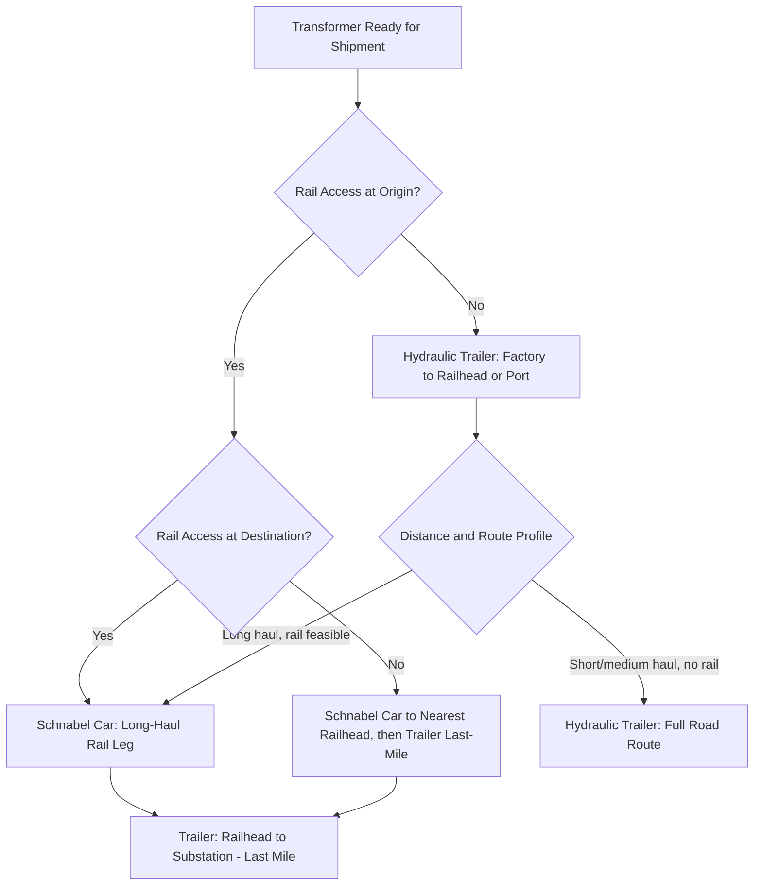

## Schnabel Car versus Hydraulic Trailer Selection for Transformers

### Overview

Selecting between Schnabel rail cars and hydraulic modular trailers (SPMTs or conventional multi-axle trailers) for large power transformer (LPT) movement is a route-and-constraint-driven decision rather than a simple cost comparison. Each method distributes load and interfaces with infrastructure differently, and most real-world moves ultimately combine both across different legs of a single journey. This entry compares the two methods directly to support mode-selection decisions.

### Core Mechanical Difference

- **Schnabel car**: The transformer becomes a structural load-bearing member connecting two rail well sections; the car has no continuous deck — the cargo itself bridges the gap between bogies. Load is carried via the transformer's own lifting lugs/trunnions.
- **Hydraulic modular trailer**: The transformer sits on a continuous deck/platform supported independently by hydraulically suspended axle lines; the cargo is a passive payload, not a structural component of the transporter.

This distinction drives most of the downstream differences in capability, routing constraints, and handling risk.

### Comparison

| Factor | Schnabel Rail Car | Hydraulic Modular Trailer / SPMT |
| --- | --- | --- |
| Typical capacity | 200–900+ tons | 200–1,000+ tons (scalable by adding modules) |
| Infrastructure dependency | Fixed rail network, bridge/tunnel clearances, curve radii | Road network, bridge load ratings, intersection geometry |
| Load path | Transformer is structural member between bogies | Continuous deck; transformer is passive payload |
| Fleet availability | Very limited globally; long lead-time booking | More widely available regionally; multiple rental fleets |
| Route flexibility | Fixed to existing track; no route improvisation | Can reroute around obstacles with permit adjustment |
| Last-mile capability | Cannot leave the rail corridor — requires transload at railhead | Can typically travel door-to-door, including into substations |
| Speed of travel | Faster over long distances once loaded | Slower (walking pace/road speed with escorts) |
| Loading complexity | Requires transformer to be lifted or positioned to fit between wells | Load-in via SPMT self-loading (ro-ro style) or crane placement |
| Typical use case | Long-haul cross-country movement on existing rail corridors | Port-to-site, factory-to-port, and final delivery legs |

### Key Points — When Schnabel Cars Are Preferred

- Long-distance inland movement (500+ km) where rail corridors directly connect origin and destination regions
- Origin or destination already has rail siding infrastructure (substation rail spurs are common at major generation/transmission facilities)
- Road infrastructure along the route has restrictive bridge ratings, weight limits, or urban congestion that would make an equivalent road move impractical
- Utilities and manufacturers with existing rail relationships and pre-cleared route studies from prior shipments

### Key Points — When Hydraulic Trailers Are Preferred

- Origin or destination lacks direct rail access (the majority of substations and many factories)
- Short-to-medium haul distances (port to site, factory to port)
- Precision final positioning is required — SPMTs allow millimeter-level maneuvering for foundation alignment that rail cannot replicate
- Route requires navigating urban streets, roundabouts, or tight intersections where crab-steering/pivot-steering capability is essential
- Timeline flexibility is needed — trailer fleets generally have shorter lead times than booking scarce Schnabel car capacity

### Combined Multimodal Selection Logic

### Cost and Lead-Time Considerations

- **[Inference] Schnabel car costs**: Generally involve higher fixed mobilization costs (car positioning, specialized rail crew) but lower marginal cost per mile over long distances compared to road transport with continuous escort requirements — actual figures vary significantly by region, fleet owner, and contract terms
- **Trailer costs**: Scale more directly with rental duration, escort vehicle requirements, and permit costs across multiple jurisdictions, which can compound on multi-state/multi-province road routes
- Schnabel car booking lead times are frequently cited as 6-18+ months for major grid projects due to limited global fleet size; this scarcity is a primary driver of early logistics planning in transformer procurement schedules

### Technical Constraints Specific to Each Method

**Schnabel Car**

- Transformer lifting lugs/trunnions must be engineered to accept the specific loading geometry of the Schnabel car's articulation points
- Car articulation allows some curve negotiation, but minimum curve radius and maximum grade restrictions still apply and must be verified against the specific rail corridor
- Tunnel and overhead clearance (catenary lines on electrified routes) require dimensional verification specific to the loaded height

**Hydraulic Trailer**

- Axle load limits are jurisdiction-specific (commonly 8-12 tons per axle line, varying by state/country pavement design standards)
- Number of modules/files required scales with total weight; very heavy transformers may require dual-lane configurations, widening the effective transport footprint
- Turning radius and ground pressure must be verified against culverts, buried utilities, and pavement structure along the entire route

### Related Topics

- Rail Route Survey and Curve/Clearance Verification for Schnabel Cars
- SPMT Axle Configuration and Load Line Calculation
- Substation Rail Spur Design and Transload Facility Planning
- Multimodal Transfer Point (Railhead-to-Trailer) Operations
- Permit and Escort Requirements for Oversize Road Transport
- Transformer Lifting Lug and Trunnion Design Standards