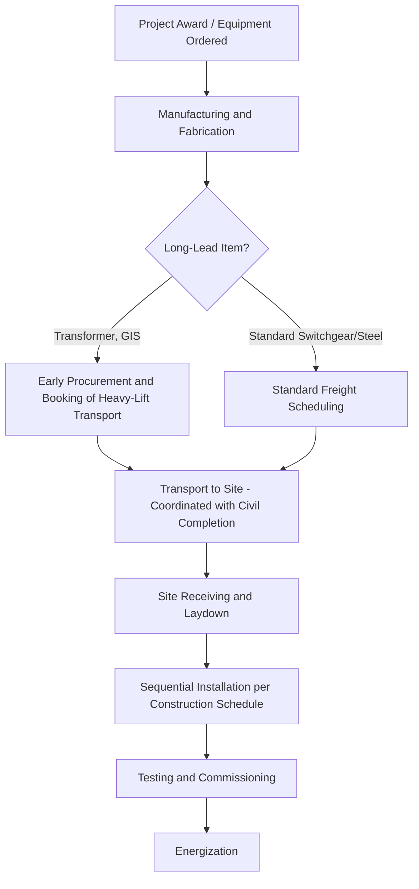

## Substation Equipment Delivery Planning

### Overview

Substation equipment delivery planning is the discipline of sequencing, routing, and coordinating the transport of all major and minor components required to construct or upgrade a substation — from the power transformer itself down to circuit breakers, switchgear, control buildings, and structural steel. Unlike a single heavy-lift shipment, this is a multi-shipment logistics program that must align with civil construction sequencing, crane mobilization, and commissioning timelines across a project spanning months to years.

### Scope of Equipment Typically Involved

- **Power transformers**: The dominant heavy-lift item, often the schedule-critical component (see related transformer transport topics)
- **Circuit breakers and disconnect switches**: Moderate weight, high fragility (insulator porcelain/composite bushings)
- **Gas-Insulated Switchgear (GIS)**: Sealed SF6-filled modules requiring pressure/leak monitoring during transit
- **Control and relay buildings**: Prefabricated buildings shipped as modular units (20-80+ tons)
- **Structural steel**: Bus support structures, dead-end structures, shield masts
- **Capacitor banks, reactors, and instrument transformers**: Smaller but numerous, requiring careful manifest tracking
- **Foundation and grounding materials**: Bulk materials with different logistics profile (standard freight vs. heavy-lift)

### Key Points — Planning Fundamentals

- **Reverse scheduling from energization date**: Delivery plans are typically built backward from the required in-service date, working through commissioning, testing, installation, and civil readiness milestones
- **Critical path identification**: The power transformer is almost always the long-lead, schedule-critical item due to manufacturing lead time (often 12-24+ months) combined with transport lead time
- **Site readiness sequencing**: Foundations must be cured and civil work complete before heavy equipment arrives; premature delivery creates storage/security burdens, while late delivery cascades delays
- **Laydown area planning**: Site must accommodate staged component storage, often requiring temporary hardstand areas engineered for point loads of stored equipment

### Delivery Sequencing Logic

### Route and Access Planning

- **Site access survey**: Verification of haul road capacity, gate widths, turning radii for the largest component (typically the transformer) — this single survey often governs access design for the entire project
- **Permanent vs. temporary access**: Some substations require temporary haul roads or reinforced entry points built specifically for the delivery window, then removed or downgraded post-construction
- **Multi-shipment coordination**: Avoiding schedule conflicts where multiple heavy-lift deliveries compete for the same site crane, access road, or laydown space in the same window
- **Local infrastructure coordination**: Utility relocations, traffic control, and community notification for oversize loads transiting public roads to reach the site

### Key Points — Common Sequencing Conflicts

- **Crane mobilization overlap**: If both transformer offload and structural steel erection require the same crawler crane, scheduling must avoid double-booking, since heavy crawler crane mobilization/demobilization itself takes days and carries significant cost
- **Foundation cure vs. delivery timing**: Concrete foundations for transformers typically require a minimum cure period before load-bearing; delivering the transformer before this window forces costly temporary storage and re-handling
- **Weather-window dependency**: Regions with seasonal road restrictions (spring thaw load limits, winter ice road access) can create hard delivery windows that must be built into the master schedule

### GIS and Sensitive Equipment Considerations

- Gas-Insulated Switchgear modules are pressurized and typically monitored for SF6 pressure loss throughout transit; pressure drop beyond a specified threshold can trigger inspection holds before installation
- Bushings, current transformers, and other porcelain/composite-insulated components require vibration-isolated packaging and are frequently shipped in dedicated crates separate from the main equipment body
- Some components (notably GIS and certain transformer accessories) may have transport orientation restrictions (must remain upright) that constrain trailer/container selection

### Documentation and Coordination Requirements

- **Delivery schedule integration**: Master delivery schedule cross-referenced against the EPC (Engineering, Procurement, Construction) master project schedule, updated as manufacturing and transport milestones are confirmed
- **Permit tracking across shipments**: Oversize/overweight permits for multiple shipments moving through the same jurisdictions need coordinated application to avoid conflicting road closure windows
- **Customs and import coordination**: For internationally sourced equipment, import documentation, tariff classification, and customs clearance timelines must be built into the schedule as a discrete risk factor
- **Insurance and inspection checkpoints**: Pre-shipment inspection, in-transit monitoring (impact recorders for heavy items), and post-delivery inspection documentation for warranty and claims purposes

### Risk Factors

- **[Inference] Schedule compression risk**: Because transformer and GIS lead times are long and relatively fixed, schedule slippage earlier in the project (design changes, permitting delays) often compresses the delivery and construction window disproportionately, increasing pressure on transport logistics to expedite — this dynamic is commonly cited as a driver of premium freight costs on substation projects
- **Route degradation between survey and delivery**: Road/bridge conditions surveyed months in advance during planning may change before actual delivery (construction, weight restriction changes), so route re-verification close to the delivery date is standard practice for major shipments
- **Single point of failure on transformer delivery**: Because most substations have one primary transformer (or an N-1 pair), any delay or damage to that single shipment can delay project energization entirely, unlike smaller components where partial delivery can sometimes allow parallel installation work

### Stakeholder Coordination

- **EPC contractor**: Owns overall schedule integration and site readiness
- **Equipment manufacturers**: Provide manufacturing completion dates and packaging/handling requirements
- **Heavy-lift transport provider**: Executes route survey, permitting, and physical movement
- **Utility/owner**: Approves outage windows, provides site access, coordinates energization timeline
- **Local authorities**: Issue permits, coordinate traffic control and road use agreements

### Related Topics

- Large Power Transformer Transport Methods
- Gas-Insulated Switchgear (GIS) Transport and Pressure Monitoring
- Crawler Crane Mobilization and Site Lift Planning
- Foundation Cure Scheduling and Heavy Equipment Load-In Timing
- Customs Clearance and Import Logistics for Substation Equipment
- Master Schedule Integration Between EPC and Transport Providers
- Oversize Load Permitting Across Multiple Jurisdictions