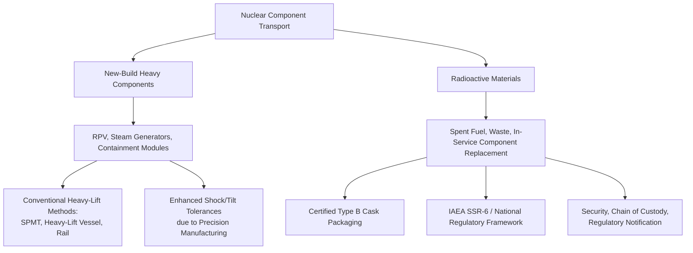

## Nuclear Component Transport Considerations

### Overview

Nuclear component transport spans two fundamentally different categories that are often conflated but require separate treatment: (1) heavy conventional power-generation equipment for nuclear plants (steam generators, reactor vessels, turbine-generators) which are radiologically clean during initial construction transport, and (2) radioactive materials transport (spent fuel, low/intermediate-level waste, certain in-service component replacements) which is governed by an entirely distinct regulatory regime. This entry covers both, with clear separation of which considerations apply to each.

### Category 1: New-Build Heavy Components (Non-Radioactive)

New reactor construction involves some of the largest single components in all of heavy-lift logistics, transported before any radioactive material is introduced.

**Key Points**

- **Reactor pressure vessels (RPVs)**: 300–500+ tons depending on reactor design (PWR vs. BWR), among the largest forged single components in industrial manufacturing
- **Steam generators**: 300–400+ tons each; large PWR plants typically require multiple units, each an individual heavy-lift shipment
- **Pressurizers, reactor coolant pumps**: Smaller but still heavy-lift class (50-150 tons), with high-precision internals sensitive to shock
- **Containment structure modules**: Prefabricated steel/concrete modules used in modular construction approaches, ranging widely in size and weight

**Transport methods** largely mirror conventional heavy-lift power generation logistics: SPMT/hydraulic trailer for factory-to-port and port-to-site legs, heavy-lift vessel or barge for marine legs, with route/bridge/clearance engineering identical in principle to turbine and transformer moves — but with tighter tolerance on shock and tilt limits given the precision manufacturing and long lead times (RPVs can have multi-year fabrication schedules, making any transport damage catastrophic to project timeline).

**[Inference] Fabrication concentration risk**: Because only a small number of forges worldwide have the capacity to produce RPVs and large steam generator forgings, transport routes are often long and international, concentrating schedule risk on a small number of high-value, single-point-of-failure shipments.

### Category 2: Radioactive Materials Transport

This category is governed by a distinct international regulatory framework and requires specialized packaging engineering rather than conventional rigging/tie-down approaches.

**Regulatory Framework**

- Governed internationally by IAEA Regulations for the Safe Transport of Radioactive Material (SSR-6), adopted into national regulations (e.g., in the US, 10 CFR Part 71 and DOT 49 CFR)
- Packages are classified by content and quantity into categories (Excepted, Industrial, Type A, Type B, Type C) with escalating containment and testing requirements
- Spent nuclear fuel and high-activity waste require **Type B packages** — casks certified to withstand a defined sequence of hypothetical accident conditions (drop, puncture, fire, water immersion tests) rather than simply meeting a weight/dimension spec

**Key Points — Cask Transport**

- Spent fuel casks are extremely heavy (loaded rail casks can exceed 100-180 tons; truck casks are lighter but still heavy-lift class) due to shielding mass (steel, lead, or concrete)
- Casks are certified as a complete system (cask + internals + closure) — the transport method must maintain certified configuration; any deviation requires re-certification
- Both rail (via Schnabel-adjacent or specialized flatcars) and heavy-haul truck transport are used depending on route, cask type, and national infrastructure
- Continuous radiological monitoring, dedicated escort, and often law enforcement coordination accompany shipments, distinct from conventional heavy-lift escort requirements

**Chain of Custody and Security**

- Unlike conventional heavy-lift cargo, radioactive material shipments involve security planning against both accidental release and malicious intervention
- Route selection often avoids populated areas and critical infrastructure to the extent feasible, with route information handled under enhanced security protocols in most jurisdictions
- Real-time tracking and communication with regulatory bodies (e.g., NRC in the US) is typically mandatory throughout transit

### Comparative Framework

### Key Points — In-Service Component Replacement

A distinct sub-case: transport of large components removed from an operating plant (e.g., steam generator replacement during major outages), which may carry both heavy-lift weight characteristics and radiological considerations.

- Removed steam generators can be contaminated internally and require specialized shielding/containment packaging beyond standard rigging practices
- These shipments combine heavy-lift transport engineering (weight, dimension, route) with radioactive materials regulatory compliance (packaging certification, monitoring, security) — a genuinely hybrid logistics problem
- Disposal-site transport (often to specialized low-level waste facilities) adds destination-specific licensing and acceptance criteria considerations

### Route and Infrastructure Considerations

- Both categories share standard heavy-lift concerns: bridge load ratings, curve radii, clearance verification
- Radioactive shipments add jurisdiction-specific notification requirements — many states/countries require advance notice to emergency response agencies along the route
- **[Unverified]** Specific route pre-approval timelines vary significantly by jurisdiction and shipment classification; project-specific regulatory consultation is standard practice rather than relying on general timelines

### Risk and Contingency Planning

- **New-build components**: Primary risk is schedule/cost impact from damage to irreplaceable, long-lead forgings; contingency planning emphasizes redundant route surveys and conservative shock/tilt monitoring thresholds
- **Radioactive materials**: Primary risk framework centers on containment integrity and public safety; contingency planning includes emergency response coordination, spill/release protocols, and communication plans with regulatory bodies distinct from conventional cargo damage contingencies

### Related Topics

- Reactor Pressure Vessel Manufacturing and Forging Lead Times
- IAEA SSR-6 Package Classification and Type B Cask Certification
- Spent Fuel Cask Design and Shielding Engineering
- Heavy-Lift Vessel Selection for Reactor Component Transport
- Regulatory Notification and Route Security for Radioactive Shipments
- Steam Generator Replacement Outage Logistics Planning
- Low-Level Waste Disposal Site Transport and Acceptance Criteria