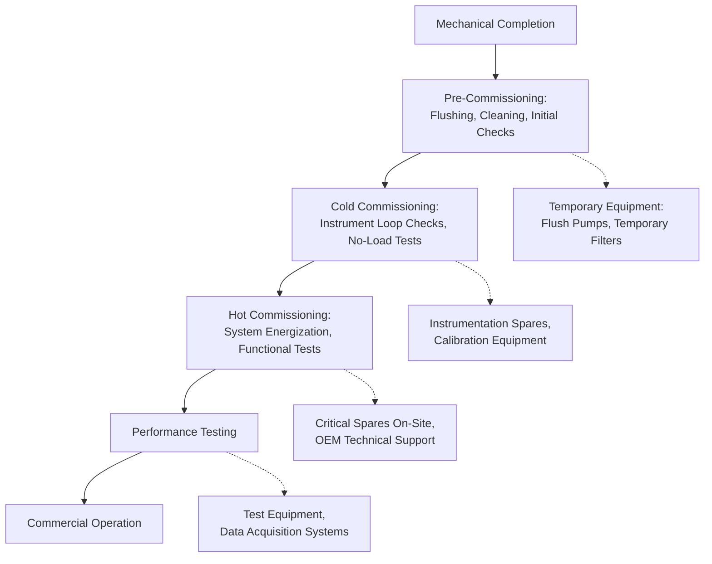

## Power Plant Commissioning Logistics Coordination

### Overview

Commissioning logistics coordination is the transitional discipline connecting heavy-lift equipment delivery to operational readiness — managing the flow of remaining components, spare parts, specialized tools, temporary equipment, and personnel/technical support required to move a power plant from mechanical completion through testing to commercial operation. Where earlier logistics phases focus on getting massive indivisible loads to site, commissioning logistics focuses on precision, timing, and just-in-time delivery of a much wider variety of smaller but schedule-critical items.

### Distinction from Construction-Phase Logistics

**Key Points**

- Construction-phase logistics is dominated by a small number of very large, long-lead shipments (transformers, turbines, RPVs)
- Commissioning-phase logistics involves a much higher volume of smaller shipments: instrumentation, control system components, spare parts, temporary generators, calibration equipment, and consumables
- The commissioning phase compresses timelines significantly — items are often needed within days rather than months, shifting the logistics model from planned heavy-haul to expedited/emergency freight
- Personnel logistics (OEM commissioning engineers, specialized technicians) becomes a parallel coordination stream alongside equipment

### Phases of Commissioning and Associated Logistics Needs

### Key Logistics Categories During Commissioning

#### 1. Critical Spares Positioning

- **Strategic pre-positioning**: High-risk components with long replacement lead times (excitation system boards, specialized bearings, instrumentation modules) are often pre-positioned on or near site before energization, since a failure during hot commissioning with a component on a multi-week lead time can idle an entire project team
- **Spares inventory coordination**: Requires close coordination with OEM parts logistics, often involving air freight for international sourcing given compressed timelines
- **[Inference] Cost-risk tradeoff**: Pre-positioning spares carries direct holding/insurance cost, but the alternative — schedule delay during commissioning — typically carries substantially higher cost (idle craft labor, extended commissioning team mobilization, delayed commercial operation revenue), which is why conservative spares positioning is standard industry practice for critical-path systems

#### 2. Temporary Equipment and Test Apparatus

- Temporary strainers, flush pumps, and temporary piping bypass connections used during pre-commissioning cleaning phases, often rented rather than purchased
- Load banks for generator testing where grid connection or full-load testing isn't immediately available
- Temporary power supplies for construction/commissioning activities before permanent station power is established
- Data acquisition and monitoring equipment for performance testing, often mobilized just for the test window and demobilized after

#### 3. Personnel and Technical Support Logistics

- **OEM commissioning engineers**: Scheduling and mobilization of specialized personnel (turbine OEM engineers, control system specialists, protection relay engineers) often on tight, sequential windows tied to specific test procedures
- **Visa and work authorization logistics**: For international projects, technical personnel mobilization requires lead time for work permits distinct from equipment logistics
- **Accommodation and site access logistics**: Particularly relevant for remote plant sites where lodging and local transport for commissioning teams must be arranged alongside equipment

#### 4. Documentation and Materials Flow

- As-built documentation, test procedures, and calibration certificates must physically or digitally accompany equipment and be available at the point of use
- Consumables (lubricants, specialty gases such as hydrogen for generator cooling or SF6 for switchgear, calibration fluids) require just-in-time delivery coordination, often with hazardous materials handling requirements

### Key Points — Coordination Challenges Specific to This Phase

- **Compressed decision windows**: Unlike construction logistics where a multi-week delay can often be absorbed, commissioning issues frequently require same-day or next-day resolution to avoid idling an assembled multi-disciplinary commissioning team
- **Multi-vendor synchronization**: Commissioning involves simultaneous activity from multiple OEMs (turbine, generator, control system, transformer, balance-of-plant) whose technical support and parts logistics must be coordinated without a single unifying supply chain
- **Site congestion management**: Commissioning often overlaps with tail-end construction activity, requiring coordination between ongoing construction logistics (still receiving BOP materials) and commissioning logistics (receiving spares/test equipment) competing for the same site access and laydown space

### Example Coordination Scenario

A combined-cycle plant approaching first-fire on its gas turbine identifies a faulty flame detector during cold commissioning checks. The commissioning logistics coordinator must simultaneously: confirm OEM spare availability (often via direct OEM emergency parts line), arrange expedited freight (air freight for international sourcing, given days-not-weeks tolerance), coordinate customs clearance if crossing borders, and align delivery with the next available test window on the integrated commissioning schedule — all while the on-site commissioning team's labor cost continues to accrue during the wait.

### Interface with Broader Project Schedule

- Commissioning logistics coordination typically reports into the overall commissioning management plan, which itself is a subset of the master project schedule
- **Punch list resolution logistics**: Outstanding construction punch-list items requiring parts or materials are tracked alongside commissioning-specific needs, often through a shared materials tracking system
- Performance test scheduling (e.g., guarantee performance tests) depends on all test equipment and any outstanding spares being resolved, making logistics coordination a direct gating factor for contractual test completion dates

### Risk Factors

- **[Inference] Supply chain visibility gaps**: Because commissioning-phase parts needs are often unplanned (identified only once systems are actually energized and tested), logistics teams frequently operate with less advance visibility than during construction, increasing reliance on strong OEM relationships and expedited freight capability rather than pre-planned heavy-haul logistics
- **Single-point technical dependency**: Specialized commissioning personnel (e.g., a specific control system programmer) can become a schedule bottleneck if unavailable, a risk distinct from equipment logistics but often managed by the same coordination function on smaller projects

### Related Topics

- Critical Spares Strategy for Power Plant Commissioning
- OEM Technical Support Mobilization and Scheduling
- Performance Testing Logistics and Guarantee Test Coordination
- Punch List Materials Tracking During Construction-to-Commissioning Transition
- Hazardous Materials Handling for Commissioning Consumables (Hydrogen, SF6)
- Site Laydown and Access Coordination Between Construction and Commissioning Teams