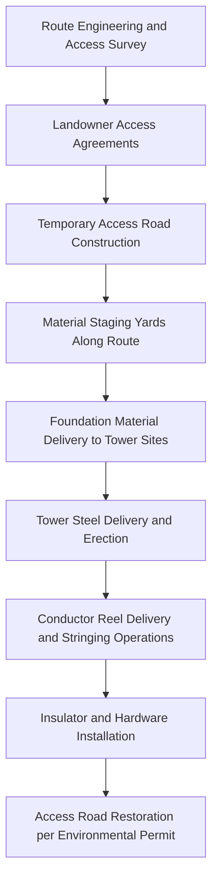

## Grid Infrastructure Project Logistics

### Overview

Grid infrastructure project logistics encompasses the transport, staging, and delivery coordination for transmission and distribution network construction — a category distinct from single-site substation or power plant logistics because it is inherently linear and distributed, spanning many kilometers of right-of-way with dozens or hundreds of discrete delivery points rather than one concentrated site. This includes transmission line construction (towers, conductors, insulators), underground cable installation, and multi-substation upgrade programs executed as a single coordinated project.

### Key Characteristics Distinguishing Grid Logistics from Single-Site Logistics

- **Distributed delivery points**: Materials must reach dozens to hundreds of tower/pole sites or cable pull points along a route, often with no fixed road access
- **Right-of-way (ROW) access constraints**: Many delivery points are on private land, agricultural land, or environmentally sensitive terrain requiring temporary access roads, matting, or even helicopter delivery
- **Sequenced, rolling logistics**: Unlike a single large delivery, grid projects require continuous material flow synchronized with a moving construction front (foundation crews, erection crews, stringing crews progressing along the route)
- **Weight/dimension profile differs from heavy-lift**: Most individual components (tower steel sections, conductor reels, insulators) are moderate weight but high volume, shifting the logistics challenge from single-lift engineering to fleet/scheduling optimization

### Major Material Categories

- **Transmission tower steel**: Fabricated lattice tower sections or monopole segments, typically 1-15 tons per piece depending on structure type and voltage class
- **Conductor and cable reels**: Large reels of ACSR (Aluminum Conductor Steel Reinforced) or similar conductor, weighing several tons each, requiring specialized reel-handling trailers
- **Insulators and hardware**: Composite or porcelain insulator strings, moderate weight but fragile, requiring careful packaging
- **Foundation materials**: Concrete, rebar, anchor bolt cages — often locally sourced/batched rather than long-haul transported given bulk volume
- **Underground cable systems**: For underground transmission, cable drums can be extremely heavy (tens of tons per drum) and require specialized cable-laying equipment and jointing bay logistics

### Access and Route Planning

**Key Points**

- **Temporary access road construction**: A major logistics sub-project in itself for rural/remote ROW segments — often requiring engineered timber matting or aggregate roads that are later removed per environmental permit conditions
- **Seasonal access windows**: Wetland crossings, agricultural land (avoiding planting/harvest seasons), and frozen-ground-dependent access (winter roads in northern regions) create hard scheduling constraints unrelated to the equipment itself
- **Helicopter logistics**: Used for tower construction in genuinely inaccessible terrain (mountainous, environmentally protected, or heavily forested sections), typically for smaller component delivery and sometimes for tower erection itself via heavy-lift helicopter
- **Multi-landowner coordination**: Each access point may cross different private landholdings, requiring individual access agreements that can bottleneck the overall schedule if not secured well ahead of construction

### Logistics Flow for a Typical Transmission Line Project

### Staging Yard Strategy

- **Regional staging/marshalling yards**: Central yards positioned along the route receive bulk material shipments (rail or long-haul truck) and redistribute via smaller vehicles to individual tower sites — this "hub and spoke" model is standard for linear infrastructure projects
- **Just-in-time site delivery**: Because tower/pole sites often have minimal on-site storage capacity and are exposed to weather/theft risk, materials are typically delivered close to the point of installation rather than stockpiled at each site
- **Reel management**: Conductor reels require sequencing logistics tied directly to the stringing plan — reel handling equipment, tensioners, and pullers must be positioned ahead of the stringing crew's progress along the line

### Key Points — Coordination Complexity

- **Construction front synchronization**: Materials must arrive ahead of but not too far ahead of the moving construction crews — over-delivery creates site storage/security burdens across dozens of locations, while under-delivery stalls crews who cannot easily be redirected to unrelated work given the linear, sequential nature of tower erection and stringing
- **Multi-contractor coordination**: Large grid projects often involve separate contractors for foundations, tower erection, and stringing, each with distinct material needs on overlapping but staggered schedules
- **Environmental and permitting overlay**: Unlike single-site logistics, ROW-based projects frequently operate under environmental permits with specific seasonal restrictions (bird nesting season access limits, wetland crossing windows) that constrain the delivery schedule independent of material availability

### Underground Cable-Specific Logistics

- Cable drums for underground transmission are substantially heavier than overhead conductor reels and require specialized transport (often heavy-haul trailers similar in principle to transformer transport for the largest EHV cable drums)
- Jointing bay locations along the cable route become discrete delivery/staging points, similar in function to tower sites but with more intensive local equipment needs (jointing requires cleanroom-adjacent conditions and specialized technician mobilization)
- Duct bank material (concrete, conduit) logistics resemble civil construction material flow more than heavy-lift logistics

### Comparison to Single-Site Substation Logistics

| Factor | Substation Logistics | Grid/Transmission Line Logistics |
| --- | --- | --- |
| Delivery points | Single site | Dozens to hundreds of points along a route |
| Dominant challenge | Heavy-lift engineering for few large items | Fleet/scheduling optimization for many moderate items |
| Access | Fixed, often permanent site access | Distributed, often temporary access requiring construction |
| Storage strategy | On-site laydown for full project duration | Just-in-time, minimal per-site storage |
| Environmental/seasonal constraints | Site-specific | Route-wide, often the primary schedule driver |

### Risk Factors

- **[Inference] Access agreement risk as schedule driver**: Because landowner access agreements for dozens of individual parcels must be secured before construction logistics can begin, delays in this administrative process — rather than equipment or transport availability — are a commonly cited root cause of grid project schedule slippage
- **Weather-dependent access windows**: Where temporary roads or crossings depend on frozen ground or dry-season conditions, a missed seasonal window can push an entire route segment's material delivery to the following year, distinct from typical weather-delay risk on single-site projects
- **Regional staging yard capacity**: Undersized or poorly located staging yards can become a bottleneck constraining the rate of material flow to the construction front, independent of overall material availability

### Related Topics

- Right-of-Way Access Agreement Coordination and Landowner Negotiation
- Temporary Access Road and Timber Matting Design for Utility Construction
- Conductor Reel Handling and Stringing Operation Logistics
- Helicopter Construction Logistics for Transmission Lines
- Regional Marshalling Yard Design for Linear Infrastructure Projects
- Underground Cable Drum Transport and Jointing Bay Logistics
- Environmental Permitting Constraints on Utility Construction Scheduling