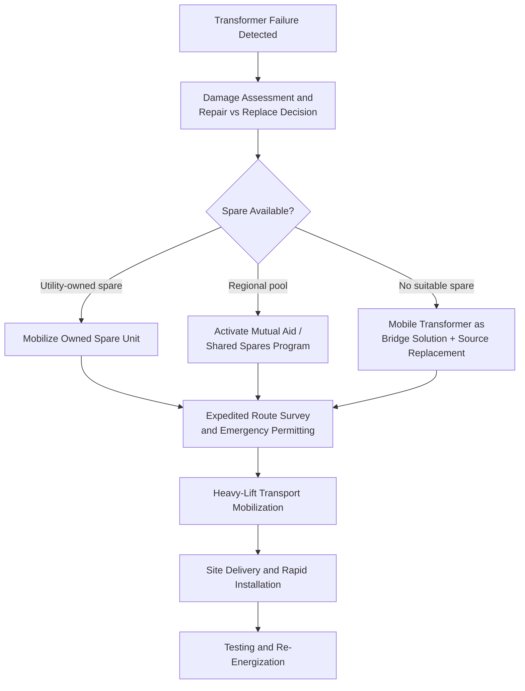

## Emergency Transformer Replacement Logistics

### Overview

Emergency transformer replacement logistics addresses the compressed, high-stakes movement of a power transformer following an unplanned failure — distinct from planned new-build or substation upgrade logistics in that lead times are measured in days to weeks rather than months to years, and the operational cost of delay (outage duration, load-shedding, cascading grid impacts) is immediate and often quantifiable in real time. This discipline sits at the intersection of heavy-lift transport engineering and crisis/contingency logistics management.

### Why Emergency Replacement Differs Fundamentally from Planned Delivery

**Key Points**

- **Compressed timeline**: A planned transformer procurement/delivery cycle can span 12-24+ months from order to site; an emergency replacement compresses sourcing, transport, and installation into a fraction of that time, fundamentally changing which options are viable
- **No route pre-survey luxury**: Planned shipments benefit from months of route engineering; emergency moves often must execute route surveys, permitting, and transport mobilization in parallel rather than sequentially
- **Sourcing constraint**: New transformer manufacturing cannot be compressed to emergency timelines (custom units still require months of fabrication), so emergency response typically relies on spare transformer pools rather than new manufacturing
- **Cost structure inversion**: Premium freight, expedited permitting fees, and overtime labor costs that would be avoided in planned logistics become acceptable/expected given the cost of continued outage

### The Spare Transformer Pool Concept

**Key Points**

- **Utility-owned strategic spares**: Many utilities maintain one or more spare transformers matched to critical substation specifications, stored at a central yard or directly at high-risk substations, specifically to enable rapid emergency swap
- **Shared/regional spare programs**: Given the high cost of individually-owned spares, some regions operate shared spare transformer pools (mutual aid arrangements) among multiple utilities, coordinated through industry programs such as spare transformer equipment sharing initiatives common in North America and similar frameworks elsewhere
- **Mobile substation/transformer units**: Trailer-mounted mobile transformers provide a bridging solution — a fully assembled, transport-ready unit that can be moved directly to a failed substation and connected as a temporary measure while a permanent replacement is sourced or the failed unit is repaired
- **[Inference] Spare compatibility risk**: Because spare transformers must match electrical characteristics (voltage ratio, impedance, MVA rating) reasonably closely to the failed unit, pool effectiveness depends heavily on standardization of specifications across a utility's fleet — a consideration that shapes procurement standardization policy well before any emergency occurs

### Emergency Response Sequence

### Expedited Transport Considerations

- **Permitting fast-tracking**: Many jurisdictions have emergency/expedited permit processes for oversize loads tied to grid restoration, often bypassing standard multi-week processing timelines — but this varies significantly by jurisdiction and is not universal
- **24/7 mobilization**: Emergency moves often run continuous operations (multiple shifts) rather than standard business-hours transport, compressing the physical transit timeline
- **Pre-qualified transport providers**: Utilities with mature emergency response plans typically maintain standing contracts or pre-qualified heavy-haul carriers specifically to avoid procurement delay when an emergency occurs
- **Route compromise decisions**: Emergency logistics may accept a less-than-optimal route (higher cost, additional escort requirements) to save time, a trade-off rarely made in planned logistics where the lowest-cost compliant route is typically preferred

### Mobile Substation/Transformer Units — Technical Notes

- Mounted on heavy-duty trailers, designed to be towed directly to site and connected with minimal site preparation
- Typically lower capacity than permanent station transformers, sized as a bridging/emergency measure rather than a permanent replacement
- Require compatible connection points (bus configuration, protection scheme compatibility) pre-engineered into critical substations as part of emergency preparedness planning — retrofitting connection compatibility during the emergency itself adds significant delay
- Deployment still requires basic heavy-lift logistics (SPMT or heavy trailer transport, crane assistance for positioning) even though the unit itself is transport-ready by design

### Key Points — Coordination During an Emergency Event

- **Damage assessment speed**: Initial electrical and physical inspection determines whether repair (on-site or off-site) is feasible versus full replacement — this decision gates the entire logistics response and is typically made within hours to days of failure
- **Parallel-path decision making**: Mature emergency response plans often mobilize transport logistics in parallel with the repair-vs-replace assessment rather than waiting for a final decision, accepting some risk of wasted mobilization cost in exchange for time savings
- **Regulatory and grid operator coordination**: Depending on the criticality of the failed transformer, grid operators/system operators may be involved in prioritization decisions, particularly where the outage has broader system stability or load-shedding implications
- **Public/regulatory communication**: Extended outages affecting large customer populations often trigger regulatory reporting and public communication obligations that run parallel to, but do not delay, the logistics response

### Risk Factors and Mitigation Planning

- **[Inference] Route degradation since last use**: Spare transformers are sometimes stored for years before an emergency deployment; infrastructure along the anticipated route (bridge conditions, new construction, height restrictions) may have changed since the spare was acquired, making rapid route re-verification a necessary — not optional — step even under time pressure
- **Rigging/lifting equipment availability**: Emergency scenarios can be compounded if specialized cranes or SPMT fleets are not locally available and must themselves be mobilized from distant locations, adding to total response time
- **Weather and seasonal constraints**: An emergency occurring during a seasonal road-restriction period (spring thaw weight limits, winter storm conditions) can conflict with the urgency of the response, sometimes requiring special weight-limit exemptions negotiated in real time with road authorities

### Preparedness Planning (Pre-Emergency)

- **Key Points**
  - Pre-identified and pre-surveyed emergency routes to critical substations, updated periodically even without an active emergency
  - Standing mutual aid agreements and pre-negotiated transport contracts to eliminate procurement delay
  - Substation design standardization (compatible bus configurations, connection points) to enable mobile transformer or spare unit connection without redesign
  - Regular emergency response drills/tabletop exercises specifically testing the logistics coordination chain, not just the electrical restoration procedures

### Related Topics

- Spare Transformer Pooling and Mutual Aid Program Design
- Mobile Substation and Mobile Transformer Unit Specifications
- Emergency Permitting Processes for Oversize Load Transport
- Large Power Transformer Transport Methods
- Substation Design Standardization for Emergency Interoperability
- Grid Operator Coordination During Critical Equipment Outages
- Post-Failure Root Cause Analysis and Repair-vs-Replace Decision Frameworks