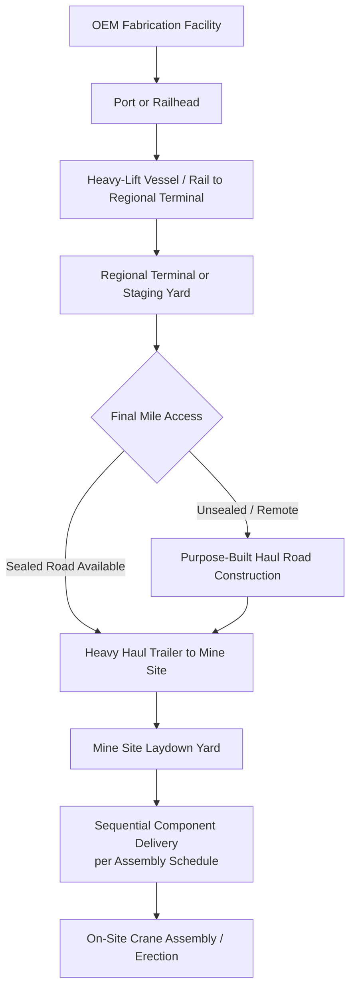

## Mining Equipment and Dragline Component Transport

### Overview

Mining equipment transport covers the movement of the largest mobile machines in heavy-lift logistics — draglines, electric rope shovels, haul trucks, and processing plant components — from manufacturing origin to often extremely remote mine sites. Draglines in particular represent a unique logistics category: single machines that can exceed 3,000-8,000+ tons in operating weight, making full-machine transport physically impossible and forcing a "disassemble, ship, reassemble" logistics model rather than conventional heavy-lift movement.

### Dragline Component Transport — Why It's Different

**Key Points**

- **No single-piece transport option**: Unlike transformers or turbines, walking draglines are manufactured, shipped, and reassembled on-site as thousands of individual structural and mechanical components — there is no scenario where the complete machine moves as one unit
- **On-site assembly as the norm**: Major dragline OEMs ship components to site and perform final assembly/erection in the field, often over many months, using site-based cranes rather than moving a finished product
- **Component weight range**: Individual components still fall solidly in heavy-lift territory — bucket structures, boom sections, machinery house bedframes, and walking mechanism components can each weigh 50-300+ tons
- **Remote site access dominance**: Mine sites are frequently the most access-constrained destinations in heavy-lift logistics — unpaved haul roads, seasonal access, and complete absence of rail or port infrastructure at the final site are the norm rather than the exception

### Major Component Categories

- **Boom and mast structures**: Extremely long, moderate-weight lattice or box structures requiring escort-heavy road transport due to length rather than weight
- **Machinery house / bedframe assemblies**: House the hoist, drag, and swing machinery; among the heaviest single lifts in dragline logistics (commonly 150-300+ tons for large-class draglines)
- **Bucket and rigging assemblies**: Massive excavating buckets shipped separately from the boom, along with dragline chains and rigging hardware
- **Walking mechanism components**: The tub base, walking shoes/pontoons, and associated hydraulic or mechanical drive systems — critical to final machine mobility and engineered to very tight assembly tolerances
- **Electrical/control system components**: Transformers, drive motors, and control houses specific to the machine, following similar handling principles to power-generation electrical equipment

### Transport Chain for Remote Mine Sites

### Other Major Mining Equipment Transport Categories

#### Electric Rope Shovels and Large Excavators

- Similar disassembly logic to draglines but generally smaller and sometimes transportable with fewer major component splits (some large shovels move as a few major sub-assemblies rather than thousands of pieces)
- House/upper structure and undercarriage/crawler assemblies are typically the two dominant heavy-lift components

#### Ultra-Class Haul Trucks

- Truck frames, dump bodies, and wheel/tire assemblies (tires alone can weigh several tons each for the largest ultra-class trucks) shipped as separate components
- Often assembled at a dedicated on-site or near-site assembly facility rather than the pit itself, then driven the final distance under their own power once assembled

#### Processing Plant Components (Crushers, Mills, SAG/Ball Mills)

- Mill shells for large grinding mills are among the heaviest single-piece components in mining logistics, frequently exceeding 200-400 tons for a single shell casting
- Require the same shock/tilt sensitivity considerations as other precision-machined heavy equipment, plus corrosion protection for shipments through humid or marine environments

### Key Points — Remote Site Access Engineering

- **Purpose-built haul road construction**: For greenfield or expansion mine sites without existing heavy-haul infrastructure, road construction to accept the largest anticipated component load is often a prerequisite logistics project in itself, executed before major equipment deliveries begin
- **Bridge and culvert engineering for remote crossings**: Remote access roads frequently cross waterways with infrastructure not originally designed for heavy-lift loads, requiring either reinforcement or purpose-built heavy-haul crossings
- **Multi-modal necessity**: Because most large mines are not directly rail- or port-adjacent, nearly all mining equipment logistics is inherently multimodal — vessel or rail to a regional terminal, followed by a long final heavy-haul road leg that can itself span hundreds of kilometers
- **Seasonal access windows**: Wet-season road degradation (particularly in tropical or monsoon-affected mining regions) can create hard delivery windows similar in character to grid infrastructure logistics, but often more severe given the total absence of alternative routes

### Example Scenario

A greenfield copper mine in a remote mountainous region requires a new walking dragline. Component shipments arrive by heavy-lift vessel at the nearest deep-water port, then transfer to heavy-haul trailers for a 300 km final-mile journey requiring purpose-built road sections, temporary bridge reinforcement at three river crossings, and a dedicated staging yard at the mine to sequence the thousands of individual components against the OEM's field assembly schedule — a process that can span 12-18 months from first component delivery to first bucket load.

### Assembly Sequencing and Delivery Coordination

- **Key Points**
  - Component delivery sequence is dictated by the erection schedule, not by shipping convenience — structural base components must arrive and be positioned before upper machinery components can be installed
  - Site laydown area sizing must account for staging thousands of individual pieces over a multi-month or multi-year assembly campaign, distinct from the shorter staging windows typical of substation or power plant projects
  - OEM field engineers and erection crews mobilize on a schedule tightly linked to component delivery — delivery delays cascade directly into idle skilled-labor cost on site, similar in principle to commissioning logistics risk but sustained over a much longer campaign

### Risk Factors

- **[Inference] Remote-site cost multiplier**: Because mine sites are frequently hundreds of kilometers from the nearest port or rail infrastructure, and because purpose-built road/bridge infrastructure is often required specifically to support equipment delivery, the final-mile logistics leg for mining equipment can represent a disproportionately large share of total transport cost relative to the vessel/rail legs — a pattern distinct from most other heavy-lift sectors where the long-haul leg dominates cost
- **Fabrication and shipping sequence errors**: Given the sheer component count for a dragline (potentially thousands of individually tracked pieces), manifest and sequencing errors pose a genuine schedule risk distinct from the physical transport risks common to single-item heavy-lift shipments
- **Currency/exposure risk on multi-year campaigns**: [Speculation] Extended assembly campaigns spanning a year or more may expose logistics budgets to currency fluctuation or freight rate volatility not typically a factor in shorter single-shipment heavy-lift projects — this is a general commercial consideration rather than a documented industry-standard risk factor

### Related Topics

- Purpose-Built Haul Road Design for Remote Mine Access
- SAG/Ball Mill Shell Transport and Handling
- Ultra-Class Haul Truck Component Logistics and Site Assembly
- Heavy-Lift Vessel Selection for Remote Regional Terminals
- Multi-Year Component Delivery Sequencing and Manifest Tracking
- Temporary Bridge and River Crossing Engineering for Heavy Haul Routes
- OEM Field Erection Coordination and Labor Mobilization Scheduling