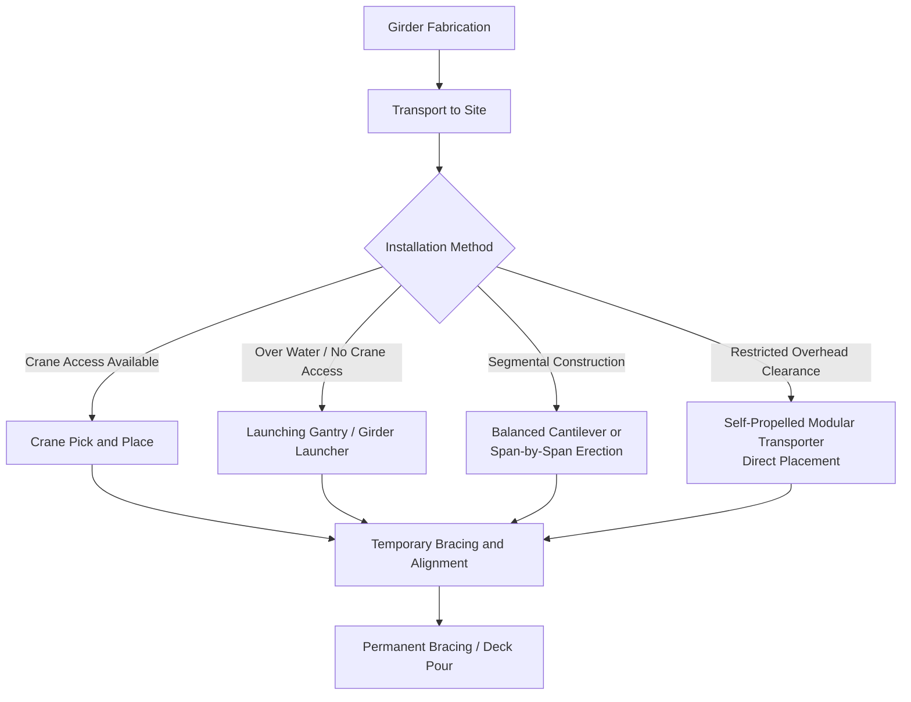

## Bridge Girder and Span Transport and Installation

### Overview

Bridge girder and span transport covers the logistics of moving prefabricated structural bridge elements — steel plate girders, precast concrete box/I-girders, and fully assembled truss or segmental spans — from fabrication yard to installation site. This category is distinguished by extreme length-to-weight ratios (girders can exceed 40-60 m in length while weighing "only" 50-150 tons), making overhang, swing radius, and route geometry the dominant engineering constraints rather than raw weight capacity.

### Component Types and Characteristics

- **Steel plate girders**: Fabricated I-shaped or box girders, typically 30-60 m long, weighing 40-150 tons depending on span and depth; often shipped in shorter sections and field-spliced if length exceeds transport limits
- **Precast concrete I-girders/bulb-tees**: Common in highway bridge construction, typically 20-45 m long and 40-100 tons; concrete girders are less tolerant of dynamic bending loads during transport than steel
- **Segmental box girder units**: Shorter, heavier individual segments (10-30 tons each) used in segmental bridge construction, assembled progressively at the site rather than transported as full spans
- **Fully assembled truss spans**: In some cases, shorter truss spans are fabricated and shipped as complete units, particularly for rail bridges or specialized crossings, though this is less common than segmented delivery for longer spans

### Key Points — Why Length Dominates the Engineering Problem

- **Swept path and turning radius**: A 55 m girder on a specialized trailer cannot navigate standard intersection geometry; route surveys focus heavily on turning radius at every intersection along the route, sometimes requiring temporary widening or alternate routing around problem corners
- **Overhang management**: Girders extending well beyond the trailer's wheelbase require overhang support trailers (a "dolly" or rear steering module) to prevent excessive cantilever stress and to provide independent steering control at the rear of the load
- **Bending stress during transport**: Long girders supported only at trailer bolster points experience significant bending moments different from their in-service support condition; transport bracing and support point locations are specifically engineered to keep stresses within allowable limits, distinct from the girder's final structural design loading

### Transport Configuration

**Key Points**

- **Steerable dolly/jeep and dolly trailers**: A standard configuration pairs a front tractor/jeep with a rear-steered dolly, with the girder spanning between two bolster points — this allows independent front and rear steering to navigate curves without excessive overhang swing
- **Self-propelled modular transporters (SPMTs)**: Increasingly used for girder transport, particularly for short-haul or site-internal moves, offering superior maneuverability for tight site access compared to conventional dolly configurations
- **Pole trailers/stretch trailers**: Adjustable-length trailers used for moderate-length girders where a fixed-length flatbed is insufficient but a full dolly/jeep configuration isn't required

### Installation Methods

#### 1. Crane Pick-and-Place

- Standard method where site access and ground bearing conditions permit crane positioning; crawler or mobile cranes lift girders directly from delivery trailers or a staging area into final position
- Tandem crane lifts are common for very long girders to control bending stress during the lift itself, requiring coordinated load-sharing calculations similar in principle to tandem lifts for power generation equipment

#### 2. Launching Gantries / Girder Launchers

- Used for over-water or over-valley crossings where crane access from below is impractical or impossible
- A gantry system positioned on already-completed spans or piers extends forward to place the next girder/segment, progressively "walking" across the crossing
- Common for long viaducts and segmental bridge construction where repetitive, systematic placement across many spans favors a purpose-built launching system over repeated crane mobilization

#### 3. SPMT Direct Placement

- SPMTs carrying a pre-assembled span or girder can drive directly into position and use their integrated hydraulic lift capability to set the girder onto bearings without crane involvement
- Particularly valuable for rapid bridge replacement projects (e.g., weekend closures) where minimizing on-site installation time is a primary driver, since SPMT placement can be significantly faster than sequential crane picks

#### 4. Segmental Erection (Balanced Cantilever / Span-by-Span)

- Individual segments delivered progressively and erected using a form traveler (balanced cantilever) or underslung/overhead launching truss (span-by-span), rather than moving a complete span as a single piece
- Delivery logistics shift from occasional large shipments to a sustained, sequenced flow of moderate-size segments over the construction duration, resembling the "rolling logistics" model seen in linear grid infrastructure projects

### Route Engineering Considerations

- **Bridge-on-bridge loading**: Transport routes that cross other bridges en route to the installation site require those crossing structures to be checked against the girder transport's concentrated axle/trailer loads — a critical check often overlooked in initial planning
- **Overhead clearance for tall box girders**: Deep box girders can exceed standard height clearances, requiring route verification against overhead utility lines, signage, and existing bridge undercrossings
- **Night/off-peak transport windows**: Long girders traveling through urban or high-traffic corridors are frequently restricted to off-peak or overnight movement windows to minimize traffic disruption from the load's length and required escort convoy

### Key Points — Rapid Bridge Replacement Applications

- **Accelerated Bridge Construction (ABC)** techniques increasingly rely on off-site pre-fabrication of complete spans, transported and set using SPMTs during short closure windows (commonly targeting 24-72 hour closures rather than months of on-site construction)
- This approach shifts nearly all schedule risk to the transport/installation logistics window itself, making transport method reliability and contingency planning disproportionately important compared to conventional phased construction
- **[Inference] Weather contingency criticality**: Because ABC closure windows are often fixed and publicly announced (with detour plans activated), weather-related transport delays carry outsized schedule and public-relations consequences compared to conventional construction where schedule buffer is more readily absorbed

### Risk Factors

- **Dynamic bending stress accumulation**: Repeated loading/unloading and road-induced vibration over long-haul transport can accumulate fatigue stress in girders not originally designed with transport dynamics as the governing load case; transport engineers typically apply specific allowable stress limits distinct from the girder's final in-service design
- **[Inference] Route survey obsolescence**: As with other long-distance heavy-haul moves, infrastructure conditions along a surveyed route can change between planning and actual transport date, making close-to-date route re-verification standard practice for major girder moves, particularly on routes not previously used for oversize transport
- **Ground bearing capacity at installation site**: Crane or SPMT positioning near excavated abutments, embankments, or soft ground requires site-specific bearing capacity verification distinct from the transport route's road-based bearing checks

### Related Topics

- Self-Propelled Modular Transporter Direct Placement Techniques
- Launching Gantry Systems for Segmental Bridge Construction
- Accelerated Bridge Construction and Rapid Closure Window Planning
- Swept Path Analysis and Turning Radius Verification for Long Loads
- Tandem Crane Lift Coordination for Long-Span Girders
- Bridge-on-Bridge Load Rating Verification for Transport Routes
- Overhang Support Trailer and Steerable Dolly Configuration Design