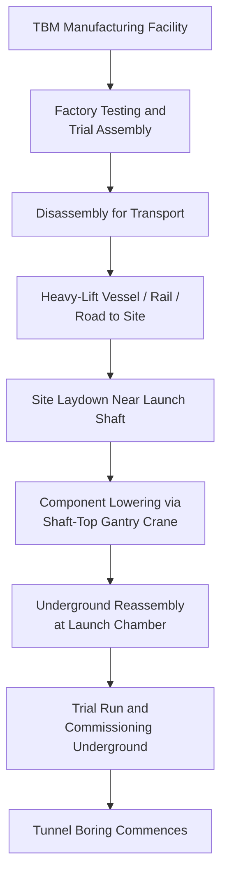

## Tunnel Boring Machine Logistics

### Overview

Tunnel Boring Machine (TBM) logistics covers the transport, delivery, and site handling of the largest and most complex rotating excavation equipment in heavy civil construction. TBMs combine extreme weight (complete machines can exceed 1,000-3,000+ tons for large-diameter units) with a fundamentally different delivery model than most heavy-lift equipment: the machine is disassembled for transport, delivered component-by-component to a shaft or portal, then lowered and reassembled underground or at the tunnel face — meaning final "installation" logistics happens below grade, adding a dimension absent from surface-based heavy-lift projects.

### TBM Component Categories

- **Cutterhead**: The rotating front face carrying cutting tools; among the heaviest single components (commonly 100-400+ tons for large-diameter machines) and largest in diameter, often exceeding the width of standard trailers and requiring specialized permits even before considering weight
- **Shield/main bearing assembly**: Houses the main drive bearing and shield structure; extremely heavy and precision-machined, sensitive to shock and requiring careful handling during transport and lowering
- **Trailing gear / backup system**: A series of connected gantries carrying conveyor systems, ventilation, power supply, and control systems — shipped as multiple separate units due to length, often assembled into a long trailing train only after being lowered underground
- **Screw conveyor / muck removal system**: Separate large component for earth pressure balance (EPB) machines, handling excavated material removal
- **Segment erector and other internal systems**: Numerous smaller but still substantial components for precast segment handling in segment-lined tunnels

### Key Points — Why TBM Logistics Is Distinct

- **Shaft-constrained delivery**: Unlike surface heavy-lift projects, TBM components must ultimately pass through a launch shaft or portal of fixed dimensions, meaning the shaft/portal design itself constrains maximum component size — this constraint is established early in project design specifically to accommodate the selected TBM's component breakdown
- **Underground reassembly**: After lowering, components are reassembled at the tunnel face or in an underground assembly chamber, requiring underground crane/gantry systems and confined-space logistics coordination distinct from any surface heavy-lift scenario
- **Custom-built machines**: Most large TBMs are custom-engineered for a specific project's geology and diameter, meaning transport planning typically begins during machine design rather than after fabrication — component breakdown for transport is a design input, not an afterthought

### Delivery and Launch Sequence

### Transport Methods for Major Components

- **Cutterhead and shield transport**: Follows conventional heavy-lift principles (SPMT, heavy-haul trailer for road; heavy-lift vessel or barge for marine legs), but diameter often becomes the binding constraint rather than weight, since cutterhead diameter directly determines route width clearance requirements at every point along the transport path
- **Trailing gear transport**: Individual backup gantries are typically more manageable in weight and dimension than the cutterhead/shield, transported as a series of standard-to-moderate oversize loads rather than a single extreme shipment
- **Marine transport for large-diameter machines**: For very large tunnel projects (e.g., major transportation tunnels, large-diameter sewer/water tunnels), heavy-lift vessel transport is common when the manufacturing origin and project site are both port-accessible, avoiding road diameter constraints entirely for the long-haul leg

### Shaft-Top Handling and Lowering

**Key Points**

- **Shaft-top gantry cranes**: Purpose-erected or mobile gantry/tower cranes positioned directly over the launch shaft handle the lowering of each component in sequence, engineered specifically for the shaft geometry and component weights involved
- **Component sequencing for lowering**: Lowering order is dictated by underground assembly sequence (heaviest/most foundational components first), requiring tight coordination between surface delivery scheduling and the shaft-top crane's lowering capacity/availability
- **Confined lowering tolerances**: Shaft diameter provides limited clearance around lowered components, demanding precise rigging control distinct from open-site crane lifts — a rigging error with much less margin for correction than a typical surface heavy-lift operation

### Key Points — Reassembly and Launch Chamber Logistics

- Underground launch chambers are sized specifically to accommodate full TBM assembly, requiring civil excavation to be complete and verified against as-designed dimensions before component lowering begins
- Underground lighting, ventilation, and temporary power must be established before reassembly work can proceed safely, representing a parallel logistics stream to the physical component delivery
- Specialized underground rigging crews, often with specific TBM assembly experience from the OEM, are typically flown in and coordinated on a schedule tightly linked to the component delivery sequence — component delay directly idles this specialized underground labor force

### Multi-Machine and Multi-Shaft Projects

- Large tunnel projects sometimes deploy multiple TBMs launched from different shafts simultaneously to accelerate schedule, multiplying the logistics coordination challenge across parallel delivery streams
- Component staging areas at each shaft must be sized and sequenced independently, though they may draw from a shared regional import/receiving terminal if machines arrive via the same port

### Risk Factors

- **[Inference] Design-stage transport constraint propagation**: Because shaft and portal dimensions are fixed early in civil design based on the selected TBM's component breakdown, any late-stage change to the TBM specification (different manufacturer, different diameter) can cascade into shaft redesign — making early, firm coordination between TBM procurement and civil shaft design a significant schedule risk driver on tunnel projects
- **Component damage sensitivity during lowering**: The main bearing assembly in particular is manufactured to extremely tight tolerances; shock loading during the lowering operation carries risk of damage that may not be immediately apparent, making controlled, low-speed lowering procedures standard rather than optional practice
- **Single-machine dependency**: Unlike surface construction where parallel work fronts can sometimes absorb equipment delay, tunnel excavation is entirely dependent on the TBM being operational — any delay in machine delivery or reassembly directly delays the start of all downstream tunneling and lining work with no parallel-path mitigation available

### Related Topics

- Launch Shaft and Portal Design Coordination with TBM Component Dimensions
- Shaft-Top Gantry Crane Selection and Lowering Sequence Planning
- Underground Assembly Chamber Logistics and Confined-Space Rigging
- Heavy-Lift Vessel Transport for Large-Diameter Cutterhead Shipments
- Multi-Shaft Tunnel Project Logistics Coordination
- OEM Underground Assembly Crew Mobilization Scheduling
- Precast Segment Delivery Logistics for Segment-Lined Tunnels