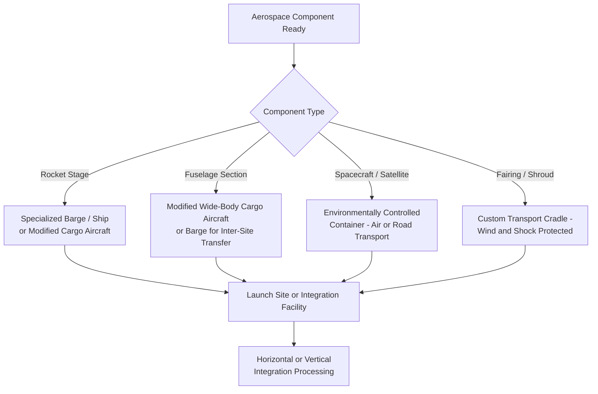

## Aerospace and Rocket Component Transport

### Overview

Aerospace and rocket component transport covers the movement of launch vehicle stages, spacecraft, aircraft fuselage sections, and related ground support equipment — a category defined less by raw weight (most components are lighter than power generation or mining equipment) and more by extreme dimensional sensitivity, environmental control requirements, and the catastrophic cost of even minor damage to one-of-a-kind or highly specialized hardware. This makes it a distinct discipline within heavy-lift logistics, prioritizing controlled handling over sheer lifting capacity.

### Key Characteristics Distinguishing Aerospace Transport

**Key Points**

- **Dimension-dominant, not weight-dominant**: Rocket stages and large fuselage sections are often long, wide-diameter, thin-walled structures (a rocket first stage might weigh only 25-30 tons empty but span 40-70 m in length) — transport engineering centers on managing length, diameter, and structural flexure rather than raw tonnage
- **Environmental control requirements**: Many components require controlled temperature, humidity, and cleanliness during transit to protect sensitive materials, coatings, and in some cases residual propellant system components
- **Extreme cost-of-damage asymmetry**: Unlike bulk industrial equipment where damage typically means repair cost and schedule delay, damage to a flight-article rocket stage or spacecraft can mean total loss of a unique, high-value asset with a multi-year replacement lead time — driving conservative handling practices well beyond what weight/dimension alone would suggest
- **Multi-modal specialization**: Rocket stages frequently move by specialized barge, wide-body cargo aircraft (e.g., modified aircraft such as the Guppy-series or Beluga-type transports for major aircraft manufacturers), or purpose-built rail cars, each selected specifically for the component's fragility profile rather than pure cost optimization

### Major Component Categories

- **Rocket stages (first/booster and upper stages)**: Long, large-diameter, thin-walled cylindrical structures; structurally weak against point loading or bending in directions not encountered during flight, requiring specialized transport cradles that distribute support along the structure's design load paths
- **Fairings and payload shrouds**: Very large diameter but lightweight and aerodynamically shaped components, highly sensitive to surface damage and wind loading during transport and handling
- **Spacecraft and satellite buses**: Typically smaller and lighter than launch vehicle stages but extremely sensitive to contamination, static discharge, and shock — often transported in dedicated environmentally controlled containers
- **Aircraft fuselage sections and major structural assemblies**: For large commercial aircraft manufacturing, fuselage barrel sections and wing assemblies are transported between geographically distributed manufacturing sites using purpose-built methods

### Transport Methods by Component Type

### Marine and Barge Transport for Rocket Stages

- Barge transport is widely used for moving rocket stages between manufacturing/test sites and launch sites, particularly where sites are coastal or river-accessible, since it avoids the dimensional and dynamic-load constraints of road transport for very long, thin-walled structures
- Barges are often purpose-built or heavily modified with internal cradle systems matched to the specific vehicle's structural hard points, minimizing bending loads during transit
- Sea-state and weather routing is a critical planning factor, since even moderate barge motion can impart bending loads a thin-walled stage structure is not designed to absorb outside its normal (vertical, supported) flight/ground configuration

### Specialized Cargo Aircraft

- **Key Points**
  - Modified wide-body aircraft with enlarged fuselage sections (used by major aerospace manufacturers for fuselage/wing section transport between international production sites) allow rapid inter-facility movement that would otherwise require weeks by sea
  - These aircraft carry substantial dimensional capacity but are not unlimited — component design for manufacturability increasingly considers compatibility with available specialized transport aircraft as a design constraint
  - Air transport commands a significant cost premium over marine/barge options but is selected where production schedule compression outweighs the cost difference, a trade-off decision made at the program level rather than a default logistics choice

### Road and Rail Transport for Aerospace Components

- Specialized flatbed or extended trailers with custom cradle fixtures move stages/sections for shorter overland legs, particularly the final movement from a receiving port or airfield to the integration/launch facility
- Route surveys emphasize overhead clearance and curve radius given component length, similar in principle to bridge girder transport, but with substantially tighter allowable dynamic load and vibration limits given structural fragility
- Some launch providers use dedicated rail systems for stage movement between manufacturing and nearby launch/test facilities where a fixed, repeatable route justifies rail infrastructure investment

### Environmental and Handling Controls

- **Climate-controlled transport**: Sensitive components may require maintained temperature/humidity ranges throughout transit, monitored continuously with logged data similar in principle to the shock/tilt monitoring used for transformers, but focused on environmental rather than mechanical parameters
- **Cleanroom-adjacent handling**: Spacecraft and certain rocket stage sections require particulate contamination control during loading/unloading, sometimes necessitating portable cleanroom enclosures or covered transfer structures at transfer points
- **Vibration and shock isolation**: Custom cradle and tie-down systems engineered specifically to the component's structural load paths, since generic heavy-lift tie-down approaches used for rigid industrial equipment are generally unsuitable for thin-walled, flexible aerospace structures

### Key Points — Integration Site Logistics

- Final assembly/integration facilities (horizontal integration buildings or vertical assembly buildings) require component delivery sequenced precisely against the integration/stacking schedule, since components often cannot be stored in ready-to-integrate condition for extended periods without environmental control
- Crane and lifting systems at integration facilities are typically purpose-built for the specific vehicle program, with lift points and rigging configurations matched exactly to the component's designed hard points

### Risk Factors

- **[Inference] Single-asset loss exposure**: Because many rocket stages and spacecraft are effectively unique, high-value assets without ready substitutes, transport risk management for aerospace components tends to prioritize damage prevention far more heavily relative to cost/schedule efficiency than in most other heavy-lift sectors, where a damaged item can often be repaired or a substitute sourced
- **Weather-sensitivity of barge and marine routes**: Sea-state limits for stage-carrying barges are typically conservative given the structure's limited tolerance for off-axis bending loads, meaning weather delays are a routine and expected part of transport scheduling rather than an exceptional risk
- **[Speculation] Design-for-transport trends**: Some launch vehicle programs have reportedly influenced stage diameter and length decisions partly around transport mode compatibility (road, barge, or aircraft), though the degree to which this is a formal design constraint versus a secondary consideration likely varies by program and is not something that can be generalized across the industry

### Related Topics

- Specialized Barge Design for Rocket Stage Transport
- Modified Cargo Aircraft for Aerospace Component Logistics
- Vertical and Horizontal Integration Facility Delivery Sequencing
- Environmental Control and Contamination Prevention During Transit
- Custom Cradle and Tie-Down Design for Thin-Walled Structures
- Sea-State Routing and Weather Risk for Marine Aerospace Transport
- Route Survey for Long, Fragile Component Overland Transport