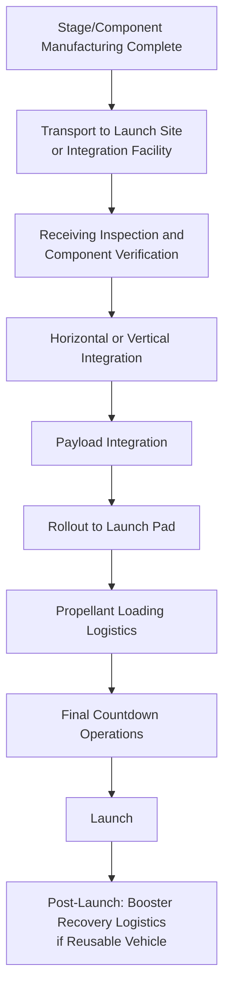

## Space Launch Vehicle Logistics

### Overview

Space launch vehicle logistics is the end-to-end coordination discipline that integrates component transport, launch site receiving, vertical/horizontal integration, and pre-launch ground operations into a single sequenced program. Where the previous topic addressed how individual rocket components physically move, this topic addresses how an entire launch campaign's logistics — components, propellants, ground support equipment, and personnel — are coordinated against a fixed, often immovable launch window.

### Key Characteristics Distinguishing Launch Vehicle Program Logistics

**Key Points**

- **Launch window as the ultimate schedule constraint**: Unlike most heavy-lift projects where a missed delivery date causes cost and inconvenience, missing a launch window (particularly for interplanetary missions with narrow orbital mechanics windows measured in days or weeks) can mean waiting months or years for the next opportunity — this asymmetry shapes logistics risk tolerance throughout the program
- **Recurring campaign structure**: For operational launch vehicles (as opposed to one-off developmental missions), logistics becomes a repeating cadence — component delivery, integration, and launch operations recur on a defined cycle, allowing logistics processes to be refined and standardized in a way most heavy-lift projects (which are typically one-time moves) cannot replicate
- **Range and site-specific constraints**: Launch sites operate under range safety and airspace/sea-space closure requirements that add a coordination layer entirely absent from conventional heavy-lift destinations

### Launch Campaign Logistics Flow

### Ground Support Equipment (GSE) Logistics

- **Key Points**
  - Transporter-erector systems, strongbacks, and specialized handling fixtures must be positioned and operational ahead of stage arrival, representing a parallel logistics stream to the vehicle hardware itself
  - Propellant loading systems (particularly for cryogenic propellants such as liquid oxygen and liquid hydrogen/methane) require dedicated supply logistics — cryogenic propellant delivery to the launch site is itself a specialized bulk logistics operation with its own safety and scheduling constraints distinct from vehicle hardware transport
  - Payload processing facility logistics run on a separate but tightly coordinated timeline with the vehicle integration schedule, since payload and launch vehicle readiness must converge at the same point

### Range Safety and Site Access Coordination

- **Airspace and sea-space closure**: Launch operations typically require coordinated closure of surrounding airspace and maritime areas during specific operational windows, requiring advance notification and coordination with aviation and maritime authorities — a logistics coordination layer with no direct analog in most other heavy-lift sectors
- **Range scheduling conflicts**: At multi-user launch ranges (facilities supporting multiple launch vehicle programs), range time itself becomes a scheduled and contested resource, meaning logistics timelines must accommodate range availability windows independent of the specific program's own readiness
- **Weather constraints on launch and rollout**: Both the physical rollout of the vehicle to the pad and the launch itself are subject to weather criteria (wind speed limits for rollout, broader weather rules for launch), adding schedule uncertainty that logistics planning must buffer against

### Reusable Vehicle Recovery Logistics

For launch vehicle programs employing reusable boosters, post-launch logistics adds a return leg absent from expendable vehicle programs:

- **Droneship/barge recovery operations**: Downrange recovery vessels must be positioned, and recovered boosters require securing (robotic or manual arm systems) for the return transit, followed by port offload and transport back to a refurbishment facility
- **Return transport to refurbishment facility**: Recovered stages typically move via SPMT or specialized trailer from the recovery port to a processing facility, following heavy-haul principles similar to other large cylindrical component transport, adapted for a stage that has undergone flight/landing stresses and requires inspection before further handling
- **[Inference] Turnaround cadence pressure**: Because reusable vehicle programs aim to minimize time between landing and next flight, recovery and return logistics are typically optimized far more aggressively for speed than comparable one-way heavy-lift moves, where transport efficiency is generally optimized for cost rather than turnaround time

### Integration Sequencing

**Key Points**

- **Horizontal integration**: Stages are assembled and tested in a horizontal orientation, then transported (often via specialized transporter, rail, or self-propelled trailer) to the pad and erected — a method favored by some vehicle programs for its ground processing simplicity
- **Vertical integration**: Stages are stacked directly in a vertical assembly building or on-pad, requiring substantial crane/gantry lifting capability but avoiding the erection step required by horizontal integration approaches
- Component delivery sequencing to the integration facility must align precisely with the chosen integration method's build sequence — a late-arriving second stage, for example, can idle an otherwise-ready integration team regardless of first-stage readiness

### Multi-Program Coordination at Shared Facilities

- Launch sites and integration facilities supporting multiple vehicle programs or multiple customers require careful logistics deconfliction — shared cranes, transporters, and integration bays must be scheduled across programs without conflict
- Component storage and staging areas at busy launch sites can become constrained resources, particularly during periods of high launch cadence, requiring logistics coordinators to sequence deliveries tightly rather than relying on generous buffer storage

### Risk Factors

- **[Inference] Cascading schedule impact of narrow windows**: Because orbital mechanics can impose hard launch windows for certain mission types, any logistics delay that pushes a vehicle past its intended launch date can trigger disproportionate downstream cost (extended stand-down, propellant off-loading/reloading cycles, range rescheduling) relative to the size of the original delay — a dynamic distinct from most heavy-lift logistics where delay cost scales roughly linearly with delay duration
- **Cryogenic propellant logistics as a schedule-coupled constraint**: Because cryogenic propellants cannot be stored indefinitely once loaded (boil-off considerations), propellant loading logistics are tightly time-coupled to the launch countdown in a way that adds schedule inflexibility once loading begins
- **Weather buffer inadequacy**: [Speculation] Launch programs with very high cadence targets may face increasing schedule pressure to reduce weather buffer margins in logistics planning, though the extent of this pattern across the industry is not something that can be confirmed generally

### Related Topics

- Cryogenic Propellant Supply Chain and Bulk Delivery Logistics
- Reusable Booster Recovery and Return Transport Operations
- Range Safety Coordination and Airspace/Sea-Space Closure Planning
- Horizontal versus Vertical Integration Method Selection
- Multi-Program Launch Site Resource Scheduling and Deconfliction
- Payload Processing Facility Logistics Coordination
- Transporter-Erector System Design and Ground Support Equipment Logistics