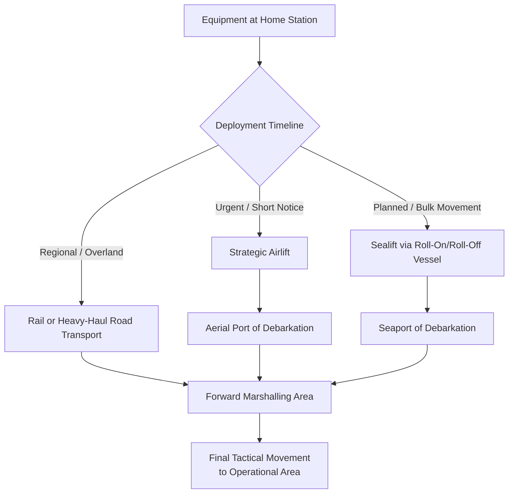

## Defense and Military Equipment Movements

### Overview

Defense and military equipment movements cover the transport of armored vehicles, artillery systems, aircraft, naval components, and associated heavy equipment for training, deployment, exercises, and sustainment operations. This category shares significant technical overlap with civilian heavy-lift logistics (weight, dimension, and route engineering challenges are often similar) but operates under a distinct planning framework shaped by strategic mobility doctrine, security classification, and multimodal integration across military-specific transport assets.

### Key Characteristics Distinguishing Military Equipment Logistics

**Key Points**

- **Strategic mobility triad**: Military logistics doctrine typically organizes long-distance movement capability around airlift, sealift, and surface (road/rail) transport, each selected based on speed requirements, distance, and equipment characteristics — a framework more formalized than the mode-selection logic typical in civilian heavy-lift planning
- **Security and operational sensitivity**: Route information, timing, and sometimes cargo contents may be classified or restricted, adding an information-security dimension largely absent from civilian heavy-lift coordination
- **Readiness-driven timelines**: Unlike most civilian heavy-lift projects planned months in advance, military deployment logistics must often accommodate compressed, exercise- or contingency-driven timelines where equipment must reach a marshalling point or point of embarkation on short notice
- **Standardized platform dimensions**: Military vehicles and equipment are generally designed with known, standardized weight/dimension envelopes (unlike bespoke industrial equipment), which allows for more pre-established transport planning data, though very heavy platforms (main battle tanks, self-propelled artillery) still exceed standard commercial trailer/rail car capacities in many jurisdictions

### Major Equipment Categories

- **Armored vehicles**: Main battle tanks (typically 55-70+ tons for modern platforms), infantry fighting vehicles, and self-propelled artillery — heavy but generally within a more standardized weight/dimension range than civilian heavy-lift cargo
- **Aircraft**: Fixed-wing and rotary-wing aircraft moved disassembled (wings/rotors removed) via road, rail, or airlift for depot maintenance, base relocation, or deployment
- **Naval equipment and components**: Ship modules, large naval guns, and vessel components moved between shipyards and fitting-out facilities, sharing significant technical overlap with civilian marine heavy-lift logistics
- **Bridging and engineering equipment**: Military bridging systems, heavy engineering vehicles, and construction equipment for forward operating base development

### Strategic Mobility Modes

### Roll-On/Roll-Off (Ro-Ro) Sealift

- **Key Points**
  - Military sealift heavily utilizes Ro-Ro vessels, allowing wheeled and tracked vehicles to be driven directly on and off under their own power or via towing, significantly reducing port handling time compared to lift-on/lift-off cargo operations
  - Vessel deck loading plans account for vehicle weight distribution across deck levels, similar in principle to commercial Ro-Ro stowage planning but often optimized for rapid combat-loading sequences that anticipate the order of offload needed at the destination
  - Strategic sealift capacity (government-owned or chartered commercial Ro-Ro vessels) represents the dominant mode for bulk equipment movement over long distances where airlift speed is not required

### Strategic and Tactical Airlift

- Large military and military-chartered civilian cargo aircraft provide rapid movement capability for equipment where speed outweighs cost, typically reserved for urgent deployment needs or equipment/timelines unsuited to sealift
- Aircraft loading requires equipment to fit within the aircraft's cargo bay dimensions and weight/balance limits, meaning airlift-compatible equipment configuration (e.g., specific vehicle variants designed to fit standard cargo aircraft) is sometimes a design consideration for military platforms, paralleling how some civilian equipment is designed with transport mode compatibility in mind
- Loading/unloading procedures for tracked and wheeled vehicles onto aircraft require precision ramp operations with tight clearance tolerances

### Rail and Heavy-Haul Road Movement

- Military rail movement follows broadly similar principles to civilian heavy-haul rail (flatcar/well-car loading, route/clearance verification) but often uses dedicated military rail loading facilities at major installations designed specifically for rapid unit deployment loading
- Overland convoy movement of oversize/overweight military vehicles on public roads typically requires coordination with civilian transportation authorities for permits and escorts, similar to civilian oversize load requirements, though military convoys may operate under specific regulatory provisions in some jurisdictions

### Marshalling and Port Operations

**Key Points**

- **Marshalling areas**: Designated staging areas near ports of embarkation where units consolidate equipment before loading, requiring substantial space and traffic management to sequence hundreds of vehicles for efficient vessel or aircraft loading
- **Load planning**: Detailed load plans sequence which equipment loads first/last based on the anticipated order of need at the destination, a sequencing discipline with some conceptual overlap to construction material delivery sequencing but driven by operational rather than construction-schedule logic
- **Reception, staging, onward movement, and integration (RSOI)**: A formal framework in many militaries for coordinating the receipt and onward movement of deployed equipment and personnel at the destination, representing the mirror-image process to the origin-side marshalling and loading operations

### Security and Classification Considerations

- Movement schedules, routes, and sometimes cargo manifests may be subject to operational security (OPSEC) restrictions, limiting information sharing in ways that can complicate coordination with civilian infrastructure authorities compared to fully transparent civilian heavy-lift route planning
- **[Inference] Coordination trade-off**: Because detailed route/timing information supports both efficient civilian infrastructure coordination and adversary situational awareness, military logistics planners generally must balance operational security against the coordination benefits of advance disclosure — a tension not present in civilian heavy-lift planning, where maximal transparency with authorities is typically the unambiguous best practice

### Risk Factors

- **Compressed-timeline route risk**: Because military deployments can require movement on short notice, route surveys and infrastructure verification that civilian heavy-lift projects would complete over months may need to be compressed or rely on pre-established route data, carrying elevated risk of encountering unexpected infrastructure constraints
- **Dual-use infrastructure dependency**: Military logistics for oversize/overweight equipment still depends on the same civilian road, rail, bridge, and port infrastructure used for commercial heavy-lift, meaning infrastructure degradation or capacity limits affecting civilian heavy-lift logistics apply equally to military movements
- **[Speculation] Surge capacity constraints**: During large-scale exercises or contingency deployments, competing demand for limited strategic sealift/airlift assets and marshalling area capacity may create bottlenecks similar in character to fleet-availability constraints seen in civilian heavy-lift (e.g., Schnabel car scarcity), though the specific dynamics are program- and context-dependent rather than something that can be generalized

### Related Topics

- Roll-On/Roll-Off Vessel Load Planning for Military Sealift
- Strategic Airlift Weight and Balance Planning for Oversize Vehicles
- Marshalling Area Design and Port of Embarkation Operations
- Reception, Staging, Onward Movement, and Integration (RSOI) Frameworks
- Operational Security Considerations in Logistics Route Planning
- Military Rail Loading Facility Design and Capabilities
- Civilian-Military Infrastructure Coordination for Oversize Transport