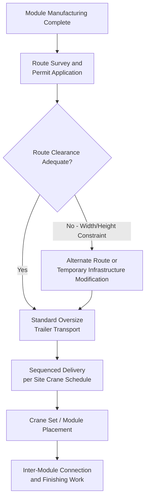

## Modular Building and Pre-Fabricated Structure Transport

### Overview

Modular building and pre-fabricated structure transport covers the movement of factory-built building modules, room-sized units, and large structural building components from manufacturing facility to final assembly site. This category is characterized by high-volume, moderate-weight cargo with large physical dimensions (particularly width and height), making it fundamentally a route-and-clearance engineering problem similar to bridge girder transport, but recurring at much higher shipment volumes given that entire buildings are assembled from many individual modules.

### Key Characteristics of Modular Structure Transport

**Key Points**

- **Volume over weight**: Individual modules are typically in the 10-40 ton range — moderate by heavy-lift standards — but are often near or at legal width/height limits, meaning route and permit engineering dominates the logistics challenge rather than weight capacity
- **High shipment count**: A modular building project can involve dozens to hundreds of individual module shipments, shifting the core logistics challenge toward fleet scheduling, sequencing, and route/permit repeatability rather than single-shipment engineering
- **Finished interior sensitivity**: Unlike raw structural steel or industrial equipment, modules often arrive substantially finished internally (fixtures, finishes, sometimes furniture), requiring transport methods that limit vibration, racking (structural distortion), and weather exposure to protect finished surfaces
- **Standard trailer types with specialized permitting**: Most modules move on conventional flatbed or specialized module-carrier trailers rather than exotic heavy-lift equipment, but nearly every shipment requires oversize permitting given typical module widths (commonly exceeding standard legal width limits)

### Module Types and Transport Profiles

- **Single-wide modules**: Narrower modules (closer to standard legal width) requiring less permitting complexity, common for smaller residential or simple commercial modular units
- **Double-wide/multi-section modules**: Wider modules requiring "super-load" or wide-load permitting, common for larger residential and commercial modular construction, often exceeding 4-5 m in width
- **Volumetric commercial/institutional modules**: Larger modules for hotels, student housing, healthcare, and educational facilities, sometimes approaching maximum practical road transport dimensions given structural and finish requirements
- **Large prefabricated structural components**: Non-volumetric elements such as prefabricated wall panels, roof trusses, and structural steel building frames, which share more logistics characteristics with conventional structural steel transport than with volumetric modules

### Transport and Route Planning

### Key Points — Route and Permit Considerations

- **Width as the primary constraint**: Because many modules exceed standard legal width, route surveys focus heavily on lane width, shoulder clearance, and oncoming traffic management at pinch points — a different emphasis than the length-dominant concerns of girder transport or the weight-dominant concerns of industrial equipment transport
- **Overhead clearance for module height**: Modules with finished roofing and sometimes rooftop equipment pre-installed can approach height limits, requiring verification against overhead utility lines, traffic signals, and low bridges along the route
- **Escort and pilot car requirements**: Wide-load modules typically require escort vehicles (front and/or rear pilot cars) per jurisdictional thresholds, with requirements scaling by width/length similar to other oversize load categories
- **Repeatable route corridors**: Given the high shipment volume typical of modular projects, logistics planners often work to identify and pre-clear a single repeatable route rather than conducting a full independent survey for each shipment — a practical efficiency not typically available for one-off heavy-lift moves

### Crane Set and Site Sequencing

**Key Points**

- **Delivery sequenced to crane availability**: Because modules are typically set directly from the delivery trailer via crane (minimizing on-site storage and re-handling of finished units), delivery timing must align precisely with crane availability and the building's assembly sequence
- **Just-in-time delivery model**: Site storage of finished modules is generally avoided given weather exposure risk to finished interiors and the practical difficulty of storing large modules on constrained urban or suburban construction sites — deliveries are typically scheduled for same-day or near-same-day set
- **Module numbering and sequencing systems**: Given the volume of individual shipments, modules are typically numbered and tracked against a placement plan, with delivery order matching the crane's planned lift sequence rather than manufacturing completion order

### Weather and Protection During Transit

- Modules with finished interiors typically require weatherproofing (shrink wrap, tarping) during transport to protect finishes from precipitation and road debris, an consideration largely absent from raw structural steel or industrial equipment transport
- Interior racking/distortion prevention: some modules incorporate temporary internal bracing specifically for the transport phase, removed after the module is set and structurally connected to adjacent modules, since a module's final structural rigidity often depends on connections made after transport rather than the module's standalone strength

### Comparison to Related Heavy-Lift Categories

| Factor | Modular Building Transport | Bridge Girder Transport | Industrial Equipment Transport |
| --- | --- | --- | --- |
| Dominant constraint | Width/route clearance | Length/turning radius | Weight/axle loading |
| Typical weight per unit | 10-40 tons | 40-150 tons | 50-800+ tons |
| Shipment volume per project | Dozens to hundreds | Few to dozens | Often single or few |
| Cargo fragility concern | Finished interior surfaces | Structural bending stress | Precision mechanical tolerances |
| Storage tolerance on site | Low (weather/finish protection) | Moderate | Often high |

### Risk Factors

- **[Inference] Cumulative permit/schedule risk**: Because modular projects involve many individual shipments each requiring permits and escort coordination, the probability of at least one shipment encountering a delay (permit processing, weather, route obstruction) scales with shipment count — making buffer planning and contingency scheduling proportionally more important than for single-shipment heavy-lift projects, even though each individual module carries lower per-shipment risk than a single large heavy-lift item
- **Site access constraints for crane setting**: Urban or space-constrained sites may have limited crane positioning options, requiring careful coordination between delivery truck positioning and crane reach/capacity — a site-specific constraint that can bottleneck delivery rate independent of transport logistics itself
- **Weather exposure during extended campaigns**: Projects with many sequential module deliveries over weeks or months carry cumulative weather risk to delivery schedule reliability, distinct from the more contained weather risk window of a single heavy-lift shipment

### Related Topics

- Wide-Load Permitting and Escort Vehicle Requirements
- Crane Set Sequencing and Just-in-Time Module Delivery Scheduling
- Module Numbering and Placement Plan Tracking Systems
- Weatherproofing and Finish Protection During Module Transit
- Repeatable Route Corridor Identification for High-Volume Shipments
- Temporary Internal Bracing for Module Structural Integrity During Transport