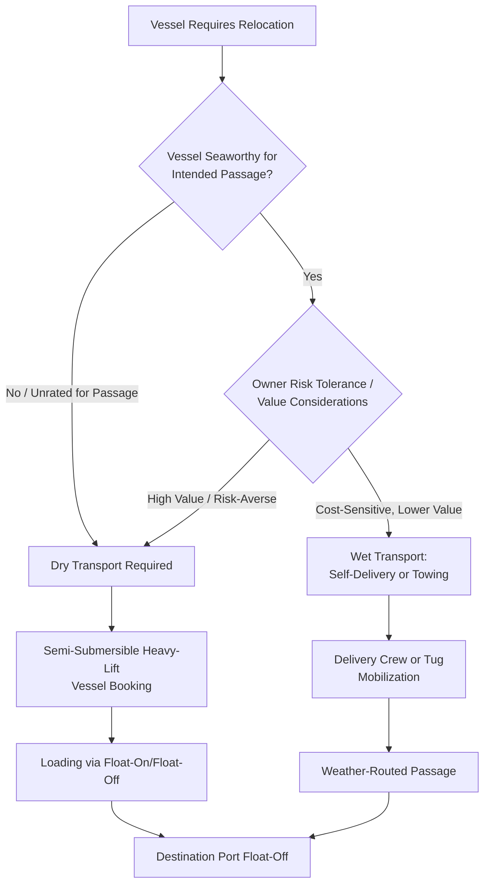

## Ship and Yacht Transport Logistics

### Overview

Ship and yacht transport logistics covers the movement of complete or largely complete marine vessels — from mega-yachts and pleasure craft to smaller commercial vessels, naval auxiliary craft, and barges — between shipyards, delivery destinations, and seasonal relocation points. Unlike most heavy-lift cargo, the "cargo" here is itself a vessel, creating a unique intersection of dry-transport (heavy-lift ship or trailer) and traditional maritime operations, along with a distinct seasonal/lifestyle-driven demand pattern for the yacht segment specifically.

### Key Characteristics Distinguishing Vessel Transport

**Key Points**

- **Dual transport modes**: Vessels can move either under their own power/via towing (wet transport) or loaded aboard a larger heavy-lift/semi-submersible vessel (dry transport) — the choice between these fundamentally different approaches is a first-order decision distinct from most heavy-lift logistics, which rarely offers a "move under its own power" alternative
- **Hull and structural sensitivity**: Vessel hulls, particularly composite/fiberglass yacht hulls, are engineered for buoyant support distributed across the hull shape, not for point-loaded cradle support — transport cradle design must replicate reasonable support distribution to avoid hull stress or deformation
- **Seasonal demand patterns**: Yacht transport in particular follows strong seasonal patterns tied to cruising seasons (e.g., relocating vessels between Mediterranean and Caribbean cruising grounds), creating predictable but concentrated demand peaks distinct from the more evenly distributed demand of industrial heavy-lift logistics
- **Value and insurance sensitivity**: High-value yachts carry insurance and owner-relationship considerations that elevate handling care standards, similar in spirit to the damage-cost-asymmetry seen in aerospace transport

### Dry Transport (Semi-Submersible / Heavy-Lift Vessel)

- **Key Points**
  - Semi-submersible heavy-lift vessels ballast down to allow the vessel to be floated on over a submerged deck, then de-ballast to lift the cargo vessel clear of the water — a "float-on/float-off" (FloFlo) method requiring no crane lift for the largest vessels
  - Cradle/blocking systems are custom-fitted to each vessel's hull shape, often requiring pre-shipment hull survey and cradle engineering specific to the vessel being carried
  - Multiple smaller yachts can sometimes be carried on a single heavy-lift vessel voyage, improving cost efficiency compared to single-vessel dedicated transport
  - Suitable for vessels too large, too valuable, or with hulls unsuited to sustained open-ocean self-propulsion (e.g., vessels not rated for the sea states of an intended ocean passage)

### Wet Transport (Self-Propelled Delivery / Towing)

- Vessels capable of and rated for the intended passage may be delivered "wet" — sailed or motored to destination by a professional delivery crew, or towed by a tug for vessels unable to self-propel reliably over the distance
- Weather routing becomes a primary operational concern, with delivery crews and towing operations planning around seasonal weather windows and storm avoidance, distinct from the more schedule-fixed nature of dry transport aboard a heavy-lift vessel
- **[Inference] Risk-cost trade-off**: Wet transport is generally lower-cost than dry transport but exposes the vessel to open-ocean risk (weather damage, mechanical failure, collision) for the duration of the passage, making the choice between wet and dry transport fundamentally a risk-tolerance and vessel-value decision rather than a purely cost-driven one

### Transport Decision Framework

### Loading and Cradle Engineering

- **Hull survey and cradle design**: Prior to loading, the vessel's hull lines and structural bulkhead locations are assessed to engineer a cradle that supports the hull at appropriate structural points, avoiding point loads on unsupported hull sections
- **Loading sequence coordination**: Multiple vessels loaded on a single heavy-lift vessel voyage require careful sequencing and positioning to balance the carrying vessel's deck loading and to allow safe float-off sequencing at destination (vessels loaded last are typically positioned for first float-off, or vice versa depending on destination port sequencing)
- **Sea-fastening**: Once positioned on the heavy-lift vessel's deck/cradle, the cargo vessel is secured against the carrying vessel's own motion during the ocean passage, engineered to the specific voyage's anticipated sea states

### Port and Destination Logistics

- **Draft and port depth requirements**: Semi-submersible loading/unloading requires sufficient water depth at the port for the heavy-lift vessel's ballasted-down draft, constraining which ports can serve as loading/discharge points
- **Crane-assisted loading alternative**: For vessels within crane capacity limits, some heavy-lift vessels or port cranes can lift smaller yachts aboard rather than requiring float-on/float-off, offering flexibility where FloFlo-capable ports aren't accessible
- **Final delivery to marina/berth**: After vessel float-off or wet-transport arrival, final positioning to the destination marina or berth typically involves conventional vessel handling (own power, tug assistance) rather than heavy-lift logistics

### Risk Factors

- **Hull damage during cradle loading**: Improper cradle fit or support point placement carries risk of hull stress damage, particularly for composite hulls not designed for out-of-water point loading — pre-shipment hull survey accuracy is a key mitigation
- **Weather delay exposure for wet transport**: Delivery voyages are subject to weather routing delays, and in adverse conditions, passage may be delayed at intermediate ports awaiting a suitable weather window, creating schedule uncertainty not present in the more fixed scheduling of dry transport
- **[Speculation] Seasonal capacity constraints**: Given concentrated seasonal demand for yacht relocation (particularly around major cruising ground transitions), heavy-lift vessel and towing capacity may tighten during peak season windows, though the degree of this constraint likely varies by year and specific trade routes and is not something that can be generalized with confidence

### Related Topics

- Semi-Submersible Vessel Float-On/Float-Off Operations
- Hull Survey and Custom Cradle Engineering for Vessel Transport
- Weather Routing for Wet Delivery Voyages and Towing Operations
- Seasonal Yacht Relocation Patterns and Capacity Planning
- Sea-Fastening Design for Deck-Carried Vessels
- Port Draft Requirements for Semi-Submersible Loading Operations