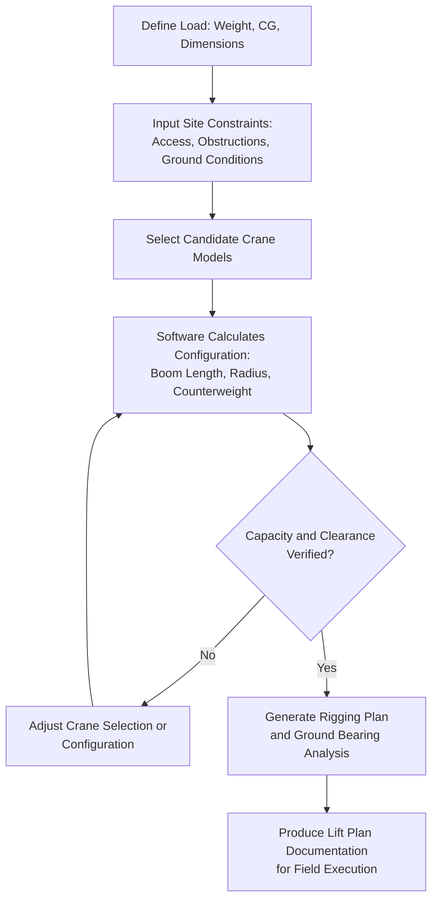

## Lift Planning and Crane Selection Software

### Overview

Lift planning and crane selection software forms the digital backbone of modern heavy-lift rigging engineering, replacing manual load charts and hand calculations with parametric modeling tools that verify crane capacity, boom configuration, ground bearing pressure, and rigging geometry before a physical lift occurs. This software category ranges from crane manufacturers' proprietary load-chart tools to independent third-party lift planning suites used across the heavy-lift and rigging industry.

### Core Functions of Lift Planning Software

**Key Points**

- **Load chart interpretation and capacity verification**: Automatically cross-references crane model, boom length, radius, and configuration against manufacturer-published load charts to confirm a proposed lift falls within rated capacity, including deductions for rigging weight, wind, and other derating factors
- **3D lift simulation and clearance checking**: Models the crane, load, and surrounding site (structures, power lines, existing equipment) in three dimensions to verify swing path clearance and identify collision risks before the lift is physically attempted
- **Ground bearing pressure calculation**: Computes outrigger or crawler track ground pressure based on total crane/load weight and support footprint, checked against site-specific soil bearing capacity data
- **Rigging configuration modeling**: Calculates sling angles, tension in individual rigging legs, and center-of-gravity positioning for multi-point lifts, flagging configurations that would overload individual rigging components even when total crane capacity is adequate

### Typical Software Categories

- **Crane manufacturer proprietary tools**: Major crane OEMs (Liebherr, Terex, Manitowoc, and others) provide dedicated load-chart and configuration software specific to their crane models, often bundled with the crane's onboard rated capacity indicator (RCI) system
- **Independent third-party lift planning suites**: Standalone software used by rigging engineers across multiple crane brands, supporting broader fleet comparison and cross-manufacturer crane selection during the planning phase
- **CAD-integrated rigging modeling tools**: Software that imports site CAD/BIM models to overlay crane swing paths and load paths directly against as-built or as-designed site geometry, increasingly common on complex industrial and construction sites
- **Tandem/multi-crane lift coordination modules**: Specialized functionality (found in advanced lift planning suites) for calculating load-sharing percentages and synchronized rigging geometry across two or more cranes lifting a single load

### Typical Lift Planning Workflow

### Key Points — Crane Selection Logic

- **Radius-capacity trade-off modeling**: Software automates the fundamental crane selection trade-off where capacity decreases as boom radius (horizontal distance to load) increases — engineers input the required radius (determined by site access and load position) and the software identifies which crane models/configurations can meet that capacity at that specific radius
- **Multi-crane comparison**: Rather than manually cross-referencing load charts for several candidate crane models, software can rapidly compare multiple cranes against the same lift parameters, supporting more efficient equipment selection and rental cost optimization
- **Configuration optimization**: For a selected crane, software can identify the minimum boom length/counterweight configuration that satisfies the lift requirements, since over-specifying configuration (excess counterweight, unnecessarily long boom) adds unnecessary cost and site footprint

### Ground Bearing and Site Integration

- **Key Points**
  - Ground bearing pressure calculations integrate crane weight distribution (outrigger pad loads or crawler track pressure) with load weight during the critical lift moment, when total system weight is at its highest
  - Some advanced software integrates geotechnical data directly, allowing automated flagging when calculated ground pressure exceeds site-specific soil bearing capacity, prompting consideration of matting, piling, or alternate crane positioning
  - Site model integration (importing existing structure, utility, and obstruction data) allows swing path verification against real site geometry rather than relying solely on manual sketch-based clearance checks

### Documentation and Field Execution Support

- Generated lift plans typically produce standardized documentation packages (crane configuration, rigging diagram, ground bearing calculations, swing path diagrams) used for internal engineering review, client approval, and on-site execution reference by the crane operator and rigging crew
- Some software integrates with mobile/tablet field applications, allowing the approved lift plan to be referenced directly on-site during execution, reducing transcription errors between office planning and field practice
- Revision tracking within the software supports the common real-world scenario where site conditions or load specifications change between initial planning and actual lift execution, requiring documented re-verification

### Integration with Broader Project Digital Tools

- **BIM/CAD interoperability**: Increasingly, lift planning software imports building information model (BIM) data directly, allowing lift sequences to be verified against the actual as-designed structure rather than simplified site sketches, particularly valuable for complex industrial or power generation projects with congested existing structures
- **[Inference] Trend toward simulation-first planning**: The broader industry trend toward digital twin and simulation-based planning (also seen in areas like grid modernization and asset lifecycle management) appears to extend naturally into lift planning software, where 3D simulation increasingly supplements or replaces purely calculation-based load chart verification — though the pace and extent of this adoption likely varies significantly across firms and regions

### Limitations and Practical Considerations

- Software output remains dependent on accurate input data (actual measured load weight and CG rather than nominal manufacturer specifications, accurate site survey data); the well-known "garbage in, garbage out" principle applies directly, and discrepancies between assumed and actual conditions are a recurring source of field lift plan deviations
- Software-generated lift plans typically require review and sign-off by a qualified rigging engineer rather than being treated as fully automated final output, reflecting the safety-critical nature of crane lift operations
- **[Unverified]** Specific software packages, feature sets, and market adoption levels change frequently in this space; project teams evaluating specific tools should consult current vendor documentation and industry reviews rather than relying on any fixed list of capabilities

### Related Topics

- Load Chart Interpretation and Crane Capacity Derating Factors
- Rated Capacity Indicator (RCI) Systems and Onboard Crane Monitoring
- Multi-Crane Tandem Lift Load-Sharing Calculation Methods
- Ground Bearing Pressure Analysis and Matting Design
- BIM Integration for Construction and Heavy-Lift Planning
- Digital Twin Applications in Heavy-Lift and Rigging Engineering