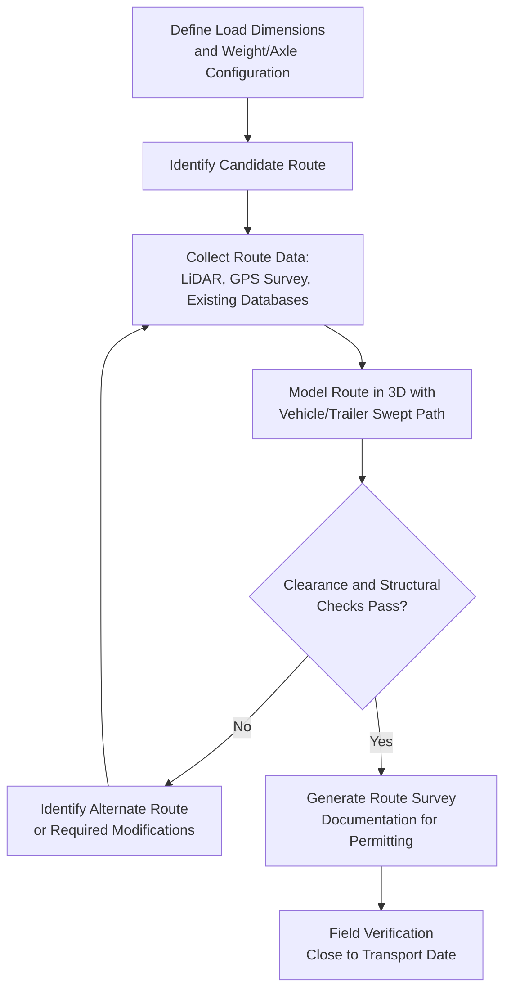

## Route Survey and Clearance Simulation Tools

### Overview

Route survey and clearance simulation tools digitize the process of verifying that a proposed oversize/overweight transport route can physically accommodate a specific load — replacing or augmenting traditional manual route surveys (measuring tape, physical drive-throughs, visual estimation) with GPS-referenced data collection, 3D route modeling, and automated swept-path and clearance analysis. Given how central route feasibility is to virtually every heavy-lift movement covered elsewhere in this syllabus, this software category represents a foundational digital capability underlying modern heavy-lift logistics planning.

### Core Functions

**Key Points**

- **Swept path analysis**: Models the actual path traced by a specific vehicle/trailer combination (accounting for articulation points, trailer length, and steering geometry) through turns and intersections, verifying the load's swept envelope stays within available road width — critical for long loads like girders, wind turbine blades, or dolly-trailer transformer configurations
- **Overhead clearance verification**: Combines load height data with mapped overhead obstruction data (bridges, power lines, traffic signals, tree canopy) to flag insufficient clearance points along a route before physical transport
- **Bridge and structure load rating cross-reference**: Some tools integrate with bridge inventory databases to cross-check a route's structures against the load's weight and axle configuration, flagging structures requiring engineering review or alternate routing
- **3D route visualization**: Presents the surveyed or modeled route as a navigable 3D environment, allowing planners to visually walk through pinch points, turns, and obstructions rather than relying solely on tabulated measurement data

### Data Collection Methods Feeding These Tools

- **LiDAR and photogrammetry surveys**: Vehicle-mounted or drone-based LiDAR scanning captures precise 3D point cloud data of the route corridor, including overhead structures, road geometry, and roadside obstructions, providing the most accurate but also most resource-intensive data source
- **GPS-tagged manual measurements**: Traditional survey methods (physical measurement of clearances, widths) combined with GPS location tagging, allowing data to be organized and referenced digitally even when collected manually
- **Existing infrastructure databases**: Integration with government-maintained bridge inventory systems (where available) and mapped utility/infrastructure data reduces the need for fully independent data collection on well-documented routes
- **Satellite and aerial imagery**: Used for preliminary route screening and identifying obvious obstacles before committing resources to detailed ground survey

### Route Survey and Simulation Workflow

### Key Points — Swept Path Analysis Specifics

- **Articulated vehicle modeling**: Software must accurately model the specific trailer configuration's turning behavior — a dolly/jeep girder-carrying configuration, an SPMT with crab-steering capability, and a Schnabel-adjacent rail configuration each have fundamentally different swept path characteristics requiring distinct modeling approaches
- **Multi-pass turn analysis**: For extremely long or wide loads at tight intersections, software can model multi-point turn maneuvers (pulling forward, reversing, repositioning) rather than assuming a single continuous turning motion, reflecting actual field practice for the most challenging pinch points
- **Lane encroachment quantification**: Rather than a simple pass/fail, sophisticated tools quantify how far a swept path encroaches into opposing lanes or shoulders, supporting traffic control planning (lane closures, opposing traffic holds) at specific points along the route

### Integration with Permitting and Escort Planning

- **Key Points**
  - Clearance simulation output directly feeds oversize/overweight permit applications, providing the documented technical basis (measured or modeled clearances) that permitting authorities require to approve a route
  - Identified pinch points and required traffic control measures from the simulation inform escort vehicle positioning plans and, where needed, temporary infrastructure modification requests (signal removal, utility relocation)
  - Some platforms support multi-jurisdiction route planning, aggregating permit and clearance data across the multiple states, provinces, or countries a long-haul route may cross

### Field Verification and Data Currency

- **[Inference] Data staleness risk**: Because infrastructure conditions (new construction, temporary obstructions, changed traffic patterns) can change between initial route survey and actual transport date, close-to-date field verification remains standard practice even when comprehensive digital survey data exists — the software reduces but does not eliminate the need for final physical confirmation, particularly for routes not recently used for similar oversize transport
- Some advanced platforms support crowd-sourced or shared route condition updates among heavy-haul carriers operating in the same regions, allowing more current route condition awareness than a single company's own survey history would provide

### Comparison to Traditional Manual Survey

| Factor | Traditional Manual Survey | Digital Clearance Simulation |
| --- | --- | --- |
| Data collection time | Slower, often requires physical drive-through | Faster with LiDAR/photogrammetry, though still requires field time |
| Precision | Dependent on surveyor measurement accuracy | Generally higher precision with 3D scanning methods |
| Reusability | Limited; often re-surveyed for each shipment | Route data reusable/updatable across multiple future shipments |
| Multi-vehicle testing | Requires re-analysis for each vehicle configuration | Can rapidly re-model swept path for different trailer configurations |
| Documentation for permits | Manual reports and photos | Structured digital output integrating directly with permit workflows |

### Limitations and Practical Considerations

- **[Unverified]** The specific accuracy tolerances, data currency, and feature sets of particular commercial route survey and clearance simulation platforms vary by vendor and are best confirmed against current product documentation rather than assumed from general industry description
- Software-based clearance verification is generally treated as a planning and risk-reduction tool rather than a complete substitute for professional engineering judgment on marginal or high-consequence route decisions, particularly for structures with uncertain or aging load rating documentation
- Weather-dependent obstructions (foliage growth affecting overhead clearance, seasonal water levels affecting underpass clearance) require the simulation's underlying data to be dated and assessed for continued relevance rather than treated as permanently valid

### Related Topics

- LiDAR and Photogrammetry Survey Methods for Route Data Collection
- Swept Path Analysis for Articulated Heavy-Haul Vehicle Configurations
- Bridge Load Rating Databases and Structural Cross-Reference Tools
- Multi-Jurisdiction Oversize Load Permitting Coordination
- Field Verification Practices for Close-to-Date Route Confirmation
- Traffic Control Planning Based on Swept Path Lane Encroachment Data