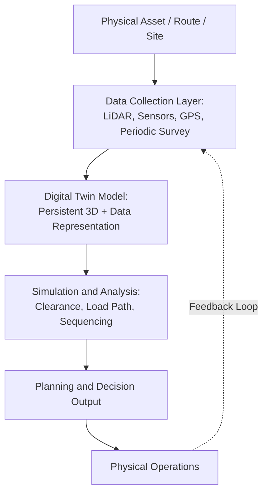

## Digital Twin Modeling for Transport Engineering

### Overview

Digital twin modeling for transport engineering extends beyond single-purpose lift planning or route survey tools into persistent, continuously updated virtual representations of a load, transport asset, or entire logistics corridor. Where route survey tools typically produce a snapshot model for a single shipment's planning phase, a true digital twin maintains an ongoing, data-linked virtual replica that can be updated with real-time or recurring sensor/survey data and used across multiple shipments, transport assets, or the full lifecycle of a long-duration project.

### Defining Characteristics of a Digital Twin (vs. Static 3D Models)

**Key Points**

- **Persistent data linkage**: Unlike a one-time route survey model, a digital twin maintains a live or periodically refreshed connection to real-world data sources (sensors, GPS tracking, periodic re-survey), so the virtual model reflects current rather than historical conditions
- **Bi-directional potential**: In mature implementations, data flows both from the physical asset/environment into the model (sensor feedback, condition monitoring) and from the model back into physical operations (informing maintenance schedules, route decisions, or load management in near real-time)
- **Lifecycle scope**: Digital twins are typically designed to persist across a project's full duration or an asset's operational life, rather than being generated and discarded after a single transport event — this aligns conceptually with digital twin applications in adjacent fields such as asset lifecycle management
- **[Inference] Maturity spectrum**: In practice, many systems described as "digital twins" in transport engineering may occupy a spectrum between a simple static 3D model and a fully sensor-integrated live twin — the term is used with varying rigor across the industry, and the specific data-linkage capability of any given implementation should be evaluated on its own merits rather than assumed from the label alone

### Application Areas in Heavy-Lift Transport Engineering

#### 1. Transport Corridor Digital Twins

- Extends route survey/clearance simulation data into a maintained model of a frequently-used heavy-haul corridor, updated periodically as infrastructure changes are identified, supporting faster and more reliable planning for recurring shipments along that corridor
- Particularly valuable for organizations with sustained heavy-lift programs along fixed routes (e.g., a mining company's regular equipment corridor, or a utility's repeated substation delivery routes)

#### 2. Vessel and Cargo Loading Digital Twins

- Models a heavy-lift vessel's deck/cargo hold in conjunction with cargo characteristics, supporting stowage planning, sea-fastening design, and load distribution verification that can be refined across multiple voyages using the same vessel
- Some implementations link with vessel stability software to jointly optimize cargo placement against both structural deck loading and overall vessel stability requirements

#### 3. Site and Facility Digital Twins for Installation Logistics

- Models a destination site (substation, power plant, launch facility) capturing existing structures, planned construction sequence, and crane/access constraints, allowing lift and delivery sequencing to be tested and refined virtually before physical execution
- Can be updated as construction progresses, keeping the model synchronized with as-built conditions rather than only the original design intent — addressing a common real-world gap where physical site conditions diverge from original design drawings over a long project duration

#### 4. Equipment/Asset Digital Twins

- For complex heavy equipment moved in stages (dragline components, TBM components), a digital twin of the equipment itself can track component-level status, location, and condition throughout a multi-month or multi-year delivery and assembly campaign, integrating with the manifest tracking and sequencing challenges discussed in those equipment categories

### Conceptual Architecture

### Key Points — Value Proposition Over Static Modeling

- **Reduced re-survey burden for recurring routes/assets**: Where a corridor or facility is used repeatedly, a maintained digital twin can reduce the need for full independent survey work on each occasion, provided the update cadence is sufficient to catch meaningful changes
- **Cross-shipment learning**: Data and lessons captured during one shipment's execution (actual measured clearances versus modeled, unexpected obstructions encountered) can be fed back into the twin, improving accuracy for subsequent shipments along the same corridor
- **Scenario testing without physical risk**: Complex sequencing decisions (component delivery order for a TBM or dragline assembly, crane positioning sequence at a congested site) can be tested virtually before committing to a physical execution plan, reducing the cost of sequencing errors discovered only in the field

### Data Currency and Trust Considerations

- **Update cadence versus real-world change rate**: A digital twin's value depends on its update frequency matching the rate of real-world change in the modeled environment — a corridor with frequent construction activity requires more frequent re-survey than a stable rural route, and mismatched cadence can create false confidence in outdated data
- **Sensor and data source reliability**: Where twins incorporate live sensor feeds (structural monitoring on a bridge along a route, for example), data quality and sensor maintenance become operational dependencies that did not exist for static survey-based planning
- **Human verification role**: As with route clearance simulation tools generally, digital twin output is generally treated as decision support rather than a full substitute for professional engineering judgment and close-to-date field verification on safety-critical decisions

### Risk Factors

- **[Inference] Overconfidence risk from model persistence**: Because a digital twin projects an appearance of continuous currency, there may be elevated risk (compared to a known-single-snapshot survey) of planners under-weighting the need for final field verification, particularly if the twin's actual update cadence has lagged real-world changes — this is a plausible risk pattern based on how persistent data systems are generally used, rather than a documented industry finding
- **Integration complexity across systems**: Building a true digital twin often requires integrating data from multiple sources and formats (LiDAR survey, GPS tracking, structural sensors, CAD/BIM models), and integration complexity/cost can be a practical barrier to adoption relative to simpler single-purpose tools
- **[Speculation] Vendor and standard fragmentation**: The broader digital twin space across engineering disciplines has seen varying approaches to data standards and interoperability; whether the heavy-lift transport engineering segment specifically has converged toward common standards, or remains fragmented across proprietary platforms, is not something that can be confirmed with confidence without consulting current vendor and industry-standard documentation

### Related Topics

- Route Survey and Clearance Simulation Tools
- Digital Twins and Emerging Asset Technologies in Lifecycle Management
- Vessel Stability Software and Cargo Stowage Optimization
- Sensor Integration and Structural Health Monitoring for Transport Corridors
- BIM Integration and As-Built Model Synchronization for Site Logistics
- Cross-Shipment Data Learning and Route Knowledge Management