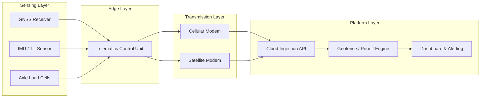
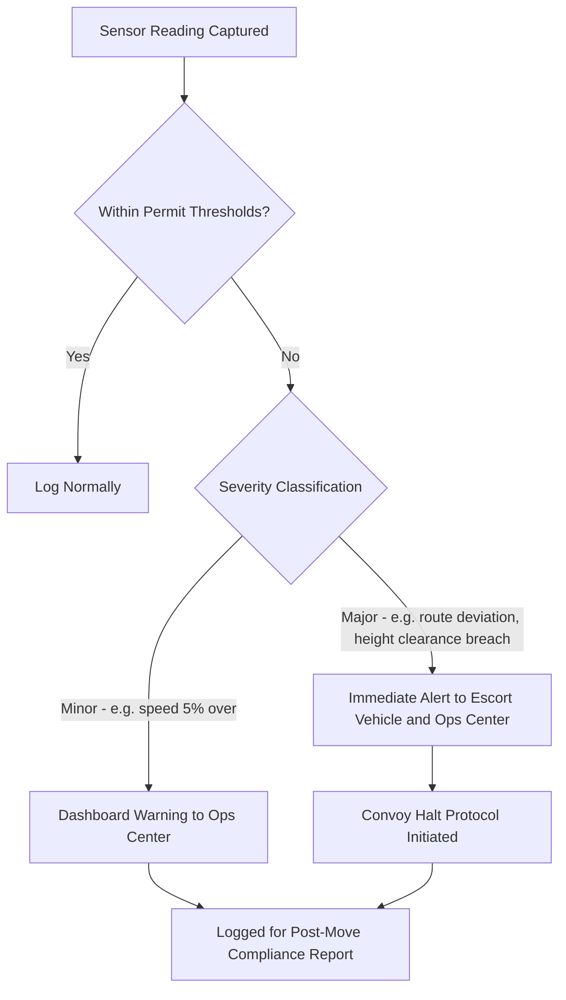

## GPS Tracking and Telematics for Abnormal Loads

### Overview

GPS tracking and telematics systems for abnormal (out-of-gauge, overweight, or over-dimensional) loads extend beyond standard fleet telematics. Because abnormal loads move under specific permit conditions — restricted routes, time windows, escort requirements, and structural clearance limits — the telematics stack must integrate positional tracking with permit compliance monitoring, structural load sensing, and real-time route-deviation alerting. This differs from standard freight telematics, which is primarily concerned with ETA prediction and fuel efficiency.

### Core System Architecture

A typical abnormal-load telematics stack consists of four layers:

1. **Sensing layer** — GNSS receivers, inertial measurement units (IMUs), load cells, tilt sensors, and axle-weight sensors mounted on the trailer/SPMT (self-propelled modular transporter)
2. **Edge/telematics unit** — an onboard telematics control unit (TCU) that aggregates sensor data, timestamps it, and buffers it during connectivity gaps
3. **Transmission layer** — cellular (4G/5G), satellite (for remote corridors with no cellular coverage), or hybrid failover between the two
4. **Platform/analytics layer** — cloud-based or on-premise platform providing map visualization, geofence management, permit compliance dashboards, and alerting



### Positioning Technology Considerations

**GNSS accuracy tiers** relevant to abnormal load operations:

| Tier | Typical Accuracy | Use Case |
| --- | --- | --- |
| Standard GPS (SPS) | 3–5 m | General location tracking, ETA reporting |
| DGPS (Differential GPS) | 0.5–2 m | Route corridor compliance verification |
| RTK (Real-Time Kinematic) | 1–2 cm | Precision positioning during critical lifts, load-out alignment, bridge crossing clearance verification |

[Inference] RTK-grade positioning is not standard equipment on most abnormal load convoys and is typically reserved for high-precision phases such as SPMT load-out onto a vessel ramp or alignment through a constrained clearance point, given the cost of RTK base station infrastructure and corrections service subscriptions.

**Dead reckoning and IMU fusion** compensate for GNSS signal loss in tunnels, dense urban canyons, or under bridges — common conditions on abnormal load routes that intentionally traverse infrastructure with clearance margins.

### Telematics Data Points Specific to Abnormal Loads

Beyond position (latitude/longitude/altitude) and speed, abnormal load telematics typically capture:

- **Axle group weight distribution** — verifying compliance with the permit's stated axle load limits, since bridge and pavement permits are often issued against per-axle-group limits rather than gross vehicle weight alone
- **Overall height clearance margin** — real-time height sensor feedback compared against the lowest known overhead obstruction on the permitted route
- **Trailer articulation angle** — critical for multi-axle modular trailers (e.g., SPMT combinations) navigating tight turns or roundabouts
- **Tilt/roll angle** — early warning for load shift or ground settlement, particularly on soft shoulders or temporary crossing structures
- **Speed against permit-specified maximum** — many abnormal load permits cap speed well below normal traffic limits, particularly across bridges or through escorted zones
- **Geofence entry/exit timestamps** — used to verify compliance with permit-specified movement windows (e.g., night-only movement, or exclusion during school hours)

### Geofencing and Route Compliance

A **route corridor geofence** is typically constructed as a buffered polygon around the permitted route, generated from the survey data used during permit application. The telematics platform continuously compares the vehicle's live position against this corridor and triggers alerts on deviation.

$$d = \left| \frac{(y_2 - y_1)x_0 - (x_2 - x_1)y_0 + x_2 y_1 - y_2 x_1}{\sqrt{(y_2-y_1)^2 + (x_2-x_1)^2}} \right|$$

This is the standard point-to-line-segment perpendicular distance formula, used to compute the vehicle's lateral deviation $d$ from a route segment defined by endpoints $(x_1, y_1)$ and $(x_2, y_2)$, given current position $(x_0, y_0)$. If $d$ exceeds the corridor buffer width, a deviation alert fires.

**Time-window geofencing** adds a temporal dimension: a geofence may only be "active" (i.e., permitted for occupancy) during specific hours, requiring the platform to evaluate both spatial containment and temporal validity simultaneously.

### Communication Redundancy

Abnormal load routes frequently pass through rural or remote corridors with inconsistent cellular coverage. Standard practice layers:

- **Primary: cellular (4G/5G)** — lowest cost, highest bandwidth, used where coverage exists
- **Secondary: satellite (e.g., Iridium, Inmarsat)** — lower bandwidth but near-global coverage, used as automatic failover
- **Store-and-forward buffering** — the TCU logs positional and sensor data locally during connectivity gaps and bulk-uploads once connectivity resumes, preventing data loss during dead zones

[Unverified] Specific satellite bandwidth costs and hardware selection vary significantly by provider and region; project logistics operators typically select satellite hardware based on the specific remoteness profile of the trade lane rather than a one-size-fits-all standard.

### Alerting and Escalation Workflow



### Integration with Escort and Convoy Management

Telematics for abnormal loads typically integrates with escort vehicle positioning (pilot cars, police escorts) to maintain formation awareness:

- **Convoy spacing monitoring** — alerts if escort-to-load spacing falls outside the safe following distance specified in the movement plan
- **Two-way communication bridging** — telematics platforms often bridge radio (VHF/UHF) communication logs with digital tracking for a unified movement record
- **Bridge/structure crossing protocols** — some systems integrate with structural monitoring sensors temporarily installed on bridges to log load transit vibration and deflection data, supporting post-crossing structural clearance reporting to the bridge authority

### Post-Move Compliance Reporting

Regulatory authorities issuing abnormal load permits frequently require a post-move compliance report, which the telematics platform generates from logged data:

- Confirmation of route adherence (no unauthorized deviation)
- Confirmation of movement within permitted time windows
- Speed compliance summary
- Any incidents or near-misses logged with timestamp and location
- Axle weight compliance across the full route (relevant where the route crosses multiple bridge structures with differing load ratings)

**Example: Compliance Summary Data Structure**



```
{
  "permit_id": "AL-2026-04471",
  "route_corridor_id": "RC-118",
  "movement_window": {
    "authorized_start": "2026-09-10T22:00:00Z",
    "authorized_end": "2026-09-11T05:00:00Z",
    "actual_start": "2026-09-10T22:14:00Z",
    "actual_end": "2026-09-11T04:52:00Z"
  },
  "max_speed_recorded_kmh": 38,
  "permit_speed_limit_kmh": 40,
  "route_deviation_events": 0,
  "height_clearance_min_margin_m": 0.18,
  "axle_weight_compliance": "pass",
  "escort_spacing_violations": 0
}
```

### Common Implementation Pitfalls

- **Relying solely on cellular coverage** in corridors with known dead zones, resulting in gaps in the compliance record precisely during the highest-risk segments (often the most remote parts of a route)
- **Geofence buffer too narrow**, generating false-positive deviation alerts from normal GNSS positional drift (typically 3–5 m under standard GPS), which erodes operator trust in the alerting system
- **Failing to integrate axle-weight sensor calibration checks** before mobilization, leading to compliance reports that inaccurately represent actual axle loading
- **Treating telematics data as tracking-only** rather than as the evidentiary record required to demonstrate permit compliance to the issuing road/bridge authority after the fact

**Key Points**

- Abnormal load telematics extends standard GPS fleet tracking with axle-weight, height-clearance, tilt, and permit-window compliance monitoring
- Route corridor geofencing combines spatial containment (buffered polygon around the surveyed route) with temporal validity (permitted movement windows)
- Communication redundancy (cellular + satellite with store-and-forward buffering) is standard practice for remote or coverage-inconsistent corridors
- Post-move compliance reporting, generated from logged telematics data, is often a regulatory deliverable to the permit-issuing authority, not merely an internal record

**Related Topics**

- Route Survey Methodology and Digital Terrain Modeling for Abnormal Loads
- SPMT (Self-Propelled Modular Transporter) Control Systems and Load Distribution
- Bridge and Structure Load Rating Assessment for Heavy Cargo Transit
- Digital Twin and Simulation Tools for Lift Planning
- Escort Vehicle Coordination and Convoy Management Protocols