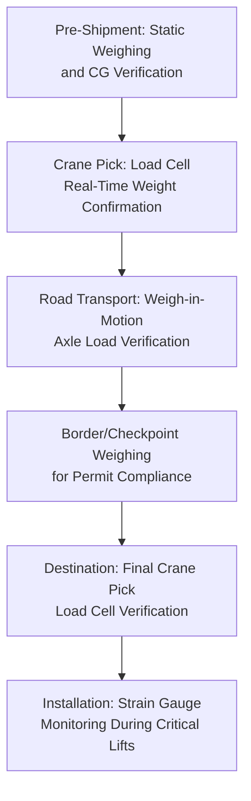

## Load Monitoring and Weighing Sensor Systems

### Overview

Load monitoring and weighing sensor systems provide the measured weight and weight-distribution data that underpins accurate lift planning, axle load compliance, and rigging verification — replacing reliance on nominal manufacturer-specified weights with actual measured values at the point of lifting, loading, or transport. Given how frequently prior topics in this syllabus have referenced the gap between nominal and actual measured weight/CG data as a source of planning risk, this sensor category addresses that gap directly at the operational level.

### Core Sensor Types

**Key Points**

- **Load cells / crane scale systems**: Integrated into crane hook blocks, shackles, or dedicated load-cell shackles, measuring actual lifted weight in real time during a crane pick — the most direct method of verifying a load's true weight before or during a lift
- **Weigh-in-motion (WIM) systems**: Road-embedded or portable sensor arrays that measure axle-by-axle weight as a vehicle passes over, used both for regulatory compliance verification and for confirming actual load distribution across a multi-axle trailer configuration
- **Static platform scales**: Fixed or portable weighbridge-style scales used to weigh an entire vehicle/trailer combination at rest, commonly used at ports, rail yards, or dedicated weighing stations along a heavy-haul route
- **Strain gauge instrumentation**: Applied directly to lifting lugs, trunnions, or structural members to measure actual stress/strain during a lift, providing verification data beyond simple total weight — particularly relevant for multi-point lifts where load distribution across individual lift points matters as much as total weight

### Application Across the Transport Lifecycle

### Key Points — Why Measured Weight Matters More Than Nominal Specification

- **Fabrication and manufacturing variance**: As-built weight can differ meaningfully from design/nominal weight due to manufacturing tolerances, material substitutions, or accumulated coatings/fittings not reflected in original drawings — a discrepancy directly relevant to the lift planning software topic's emphasis on load chart capacity margins
- **CG shift verification**: Beyond total weight, actual center-of-gravity position (verifiable through multi-point load cell readings during a trial lift) can differ from nominal drawings, directly affecting rigging geometry and sling angle calculations discussed in the lift planning context
- **Axle load compliance**: For road transport, actual measured axle loads (rather than calculated estimates) are what permitting authorities and enforcement checkpoints are concerned with, making WIM and platform scale verification a practical compliance necessity rather than an optional engineering nicety

### Integration with Lift Planning and Rigging Engineering

- **Trial lift verification**: For high-value or unusually configured loads, a controlled trial lift with load cell monitoring (lifting the load a short distance while confirming weight and apparent CG behavior) is a standard risk-mitigation practice before proceeding to the full planned lift sequence
- **Real-time overload protection**: Modern load cell systems integrated with crane rated capacity indicator (RCI) systems can provide automatic alerts or lift-motion cutoffs if measured load approaches or exceeds the crane's rated capacity at the current configuration, adding a real-time safety layer beyond pre-lift calculation alone
- **Multi-point lift load-sharing verification**: For tandem crane lifts or multi-point rigging configurations, individual load cells at each lift point confirm actual load-sharing percentages match the planned distribution, flagging unexpected imbalance that could indicate CG miscalculation or rigging geometry issues

### Weigh-in-Motion and Regulatory Compliance

- **Key Points**
  - WIM systems allow axle load verification without requiring a vehicle to stop, supporting both routine compliance checkpoints and, increasingly, integration with automated permit enforcement systems in some jurisdictions
  - Portable WIM units can be deployed at specific points along a planned heavy-haul route for pre-transit verification, allowing carriers to confirm compliance before reaching a fixed government weighing station
  - **[Unverified]** The extent of WIM technology deployment and its integration with automated permit systems varies significantly by jurisdiction and should be confirmed against current regional transportation authority information rather than assumed uniform across regions

### Data Recording and Documentation

- Weight verification data, similar to the telematics shock/tilt data discussed previously, supports both operational decision-making (confirming a lift or transport move is compliant/safe to proceed) and post-event documentation for regulatory or insurance purposes
- Some platforms integrate weighing data directly into the broader lift planning and telematics ecosystem, allowing actual measured weight to automatically update and refine the digital lift plan or corridor digital twin discussed in earlier topics, rather than existing as an isolated data point

### Risk Factors and Practical Considerations

- **Calibration and accuracy maintenance**: Load cells and scale systems require periodic calibration to maintain measurement accuracy; uncalibrated or drifted sensors can provide false confidence in weight/load-sharing data, making calibration record-keeping a meaningful quality assurance consideration
- **Dynamic versus static measurement differences**: Weight readings taken during a moving lift or a moving vehicle pass (dynamic) can differ from static at-rest measurements due to momentary acceleration effects, meaning system specification should match the intended measurement context (static compliance weighing versus dynamic lift monitoring)
- **[Inference] Sensor placement consistency with actual load path**: As with telematics shock sensors, load cell and strain gauge placement must genuinely reflect the structural load path being measured; misapplied instrumentation can produce technically accurate but practically misleading readings if not positioned according to the actual rigging/lift point configuration in use

### Related Topics

- Lift Planning and Crane Selection Software
- GPS Tracking and Telematics for Abnormal Loads
- Rated Capacity Indicator (RCI) Systems and Onboard Crane Monitoring
- Trial Lift Procedures for High-Value and Unusually Configured Loads
- Multi-Point Rigging Load-Sharing Verification
- Weigh-in-Motion Technology and Automated Permit Compliance Systems