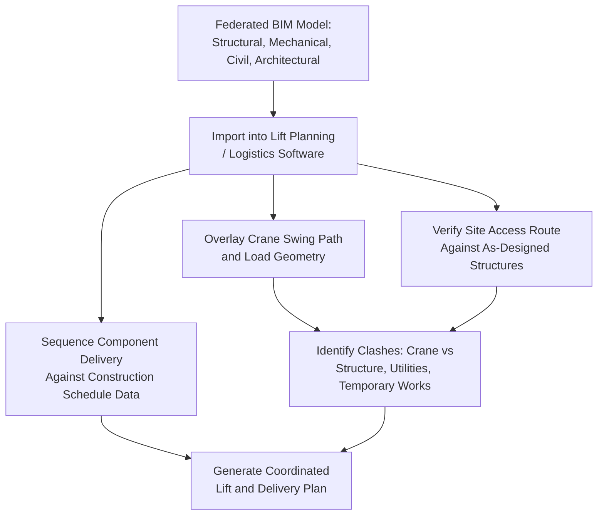

## Building Information Modeling Integration in Project Logistics

### Overview

Building Information Modeling (BIM) integration in project logistics extends the structured, data-rich 3D modeling approach used in design and construction into the heavy-lift and transport planning domain — allowing lift sequences, delivery routes, and site laydown plans to be verified directly against the actual as-designed (and increasingly as-built) building or facility model, rather than relying on separate, disconnected logistics drawings. This topic ties together threads introduced in lift planning software, route survey tools, and digital twin modeling, focusing specifically on the BIM-as-source-model integration pattern.

### What BIM Provides to Logistics Planning

**Key Points**

- **Structured, object-based 3D data**: Unlike a generic 3D visualization, a BIM model contains discrete, data-tagged objects (structural members, mechanical equipment, architectural elements) with associated metadata (dimensions, weight where specified, installation sequence), making it possible to query the model for logistics-relevant information rather than only viewing geometry
- **Single source of design truth**: Because BIM models are typically the authoritative design reference used by structural, mechanical, and architectural disciplines, using the same model for logistics planning reduces the risk of logistics plans being based on outdated or superseded drawings — a discrepancy risk noted as a recurring theme across lift planning and route survey topics in this syllabus
- **Federated model coordination**: Large projects typically federate multiple discipline-specific BIM models (structural, mechanical, electrical, civil) into a combined view, allowing logistics planners to see how a proposed lift or delivery route interacts with elements from multiple disciplines simultaneously

### Integration Points with Heavy-Lift Logistics Planning

### Key Application Areas

#### 1. Crane Swing Path and Clash Detection

- Importing structural and architectural BIM data allows a lift planning tool (as discussed in the crane selection software topic) to verify swing path clearance against actual designed building geometry, catching potential clashes with structural steel, partially completed walls, or permanent equipment before they occur in the field
- This is particularly valuable for congested industrial and power generation sites, where turbine hall or substation structures create tight clearance envelopes for crane operation, as discussed in the generator/turbine movement and substation delivery topics

#### 2. Sequencing Delivery Against 4D Construction Schedules

- **4D BIM** (3D model linked to construction schedule data) allows logistics planners to visualize not just where a component needs to go, but when it can physically be delivered and installed given the surrounding construction sequence — directly supporting the delivery sequencing challenges discussed in substation equipment delivery and modular building transport topics
- This linkage helps identify sequencing conflicts (e.g., a heavy component scheduled for delivery before its planned access route is structurally complete) earlier in planning than would be apparent from a static schedule alone

#### 3. Site Laydown and Logistics Zone Planning

- BIM-integrated site models allow laydown area, temporary road, and crane pad locations to be planned and visualized directly against the evolving construction site model, supporting the site access and staging coordination challenges discussed across multiple prior topics (substation delivery, grid infrastructure, mining equipment, TBM logistics)
- As construction progresses and the model is updated toward as-built condition, logistics zone plans can be re-verified against current rather than only original-design site conditions

#### 4. As-Built Model Synchronization for Long-Duration Projects

- For projects spanning many months or years (dragline assembly, TBM tunnel construction, large power plant construction), keeping the BIM model synchronized with actual as-built progress allows later-stage logistics decisions (final equipment delivery, commissioning-phase access) to be planned against real site conditions rather than only the original design intent — directly connecting to the digital twin concept of persistent, updated modeling discussed in the previous topic

### Key Points — Data Format and Interoperability Considerations

- **Industry Foundation Classes (IFC)**: An open, vendor-neutral data format widely used to exchange BIM data between different software platforms, supporting interoperability between design-authoring tools (used by architects/engineers) and logistics/lift-planning tools that may be produced by different vendors
- **Level of Detail (LOD) considerations**: BIM models are developed to varying levels of detail depending on project phase; logistics planners need models with sufficient LOD to extract meaningful dimensional and clash-detection value, and coordination with the design team on required LOD for logistics purposes is a practical prerequisite for effective integration
- **[Unverified]** Specific interoperability performance, file size handling, and feature support for BIM import vary across individual lift-planning and logistics software products, and should be verified against current vendor documentation for any specific tool being evaluated

### Coordination Workflow in Practice

**Key Points**

- Logistics planners typically receive federated BIM model exports (often in IFC or a proprietary format bridge) from the project's BIM coordination team, rather than working with live, directly-editable design models
- Version control and model currency are critical practical concerns — a logistics plan built against an outdated model export can propagate design changes into a flawed lift or delivery plan, echoing the "data staleness" risk theme raised in the route survey and digital twin topics
- Clash detection findings from logistics-integrated BIM review typically feed back into broader project coordination meetings, alongside architectural and structural clash findings, rather than being resolved in isolation by the logistics team alone

### Risk Factors

- **[Inference] Model currency as a persistent risk**: Because BIM models are actively edited throughout a project's design and construction phases, a logistics team working from a model export that has not been refreshed recently faces meaningful risk of planning against superseded design information — this mirrors the data-currency risk discussed for route survey and digital twin tools, but is arguably more acute given how frequently structural and mechanical design details can change during active construction
- **Discipline silo risk**: Where logistics planning is conducted by a separate team or contractor without close integration into the project's BIM coordination process, the practical benefit of BIM integration is reduced — meaningful value depends on genuine workflow integration rather than simply having access to a model file
- **Metadata completeness dependency**: The usefulness of BIM data for logistics purposes (e.g., automatically extracting component weights) depends on how completely that metadata was populated by the original modeling discipline; sparse or inconsistent metadata limits how much manual verification remains necessary despite the model's availability

### Related Topics

- Lift Planning and Crane Selection Software
- Digital Twin Modeling for Transport Engineering
- 4D Construction Scheduling and Delivery Sequencing Integration
- Industry Foundation Classes (IFC) and BIM Data Interoperability Standards
- Site Laydown and Access Coordination for Congested Construction Sites
- As-Built Model Synchronization for Long-Duration Heavy-Lift Projects