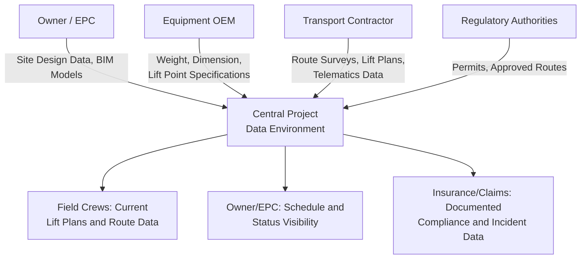

## Data Management Across Multi-Party Project Teams

### Overview

Data management across multi-party project teams addresses how heavy-lift and specialized logistics projects — which routinely involve owners, EPC contractors, equipment OEMs, transport providers, engineering firms, and regulatory authorities — coordinate, version-control, and share the technical data (route surveys, lift plans, BIM models, telematics feeds, permits) generated by the digital tools discussed throughout this chapter. Where earlier topics addressed individual tool categories, this topic addresses the cross-organizational information management challenge that determines whether those tools' outputs actually reach the people who need them, when they need them.

### Why This Is a Distinct Challenge in Heavy-Lift Logistics

**Key Points**

- **High stakeholder count relative to project duration**: A single major heavy-lift shipment can involve the equipment owner, manufacturer, engineering firm, transport contractor, multiple subcontracted carriers, permitting authorities across several jurisdictions, and destination-site construction management — a stakeholder count that is large relative to the often compressed timeline of the physical move itself
- **Mixed data maturity across parties**: Different organizations in the chain often operate at different levels of digital maturity — an owner's BIM-integrated project team may need to exchange data with a regional trucking subcontractor still working from paper permits and phone coordination, creating a genuine interoperability gap rather than a purely technical one
- **Safety-critical data currency requirements**: Unlike general project documentation where minor version lag is a manageable inconvenience, outdated route survey, weight, or lift plan data reaching a field crew can directly contribute to safety incidents — raising the practical stakes of data management failures above typical project documentation concerns

### Common Data Types Requiring Cross-Party Coordination

### Common Data Environment (CDE) Concepts

**Key Points**

- **Single authoritative repository model**: Borrowing from broader construction industry practice (particularly BIM-adjacent workflows), a Common Data Environment concept centralizes project data in a single managed location with defined access permissions, aiming to eliminate the "which version is current" ambiguity that arises when data is exchanged via email attachments or disconnected file shares
- **Status-based information workflows**: Mature CDE implementations typically use status tagging (e.g., work-in-progress, shared-for-review, approved-for-construction/transport) so that downstream users can distinguish draft data from data approved for field use — directly relevant to preventing field crews from acting on an unapproved or superseded lift plan or route survey
- **Permission-scoped access**: Different parties typically have different access levels — a subcontracted carrier may need access to their specific route segment's approved data without visibility into unrelated commercial or design information, requiring access control architecture beyond simple shared-folder approaches

### Version Control Challenges Specific to This Domain

- **Route and lift plan revision tracking**: As discussed in the route survey and lift planning software topics, plans are frequently revised between initial planning and execution as site conditions or load specifications change — data management systems must make clear which revision is currently authoritative and ensure field crews are working from that version, not an earlier one retained on a local device or printout
- **Telematics and monitoring data ownership**: Shock/tilt/weight monitoring data generated during transport (discussed in the telematics and load monitoring topics) often needs to be accessible to multiple parties for different purposes — the transport contractor for operational monitoring, the owner for acceptance decisions, and insurers for claims documentation — raising questions of data ownership, retention, and access rights that are typically addressed contractually before the project begins
- **Multi-jurisdiction permit data**: For routes crossing multiple regulatory jurisdictions, permit approval data and conditions can vary significantly by jurisdiction and must be tracked and made available to relevant field crews in a way that clearly indicates which conditions apply to which route segment

### Interoperability Standards Relevant to This Domain

- **IFC and open BIM data exchange**: As discussed in the BIM integration topic, open data standards support exchange between different organizations' software platforms, reducing the "lowest common denominator" data loss that can occur when data must be manually re-entered or converted between incompatible proprietary formats
- **[Unverified]** The heavy-lift and specialized transport logistics industry does not appear, based on currently available information, to have converged on a single dominant open data standard specific to route survey, lift plan, or telematics data exchange in the way BIM has converged around IFC for building design data — organizations should verify current interoperability options against specific software vendors rather than assume a universal standard exists

### Contractual and Governance Considerations

**Key Points**

- **Data ownership and retention clauses**: Given the multi-party nature of these projects, contracts typically need to specify who owns generated data (route surveys, telematics logs, lift plans), how long it must be retained, and under what circumstances it can be shared with third parties (insurers, regulators, future project teams)
- **Defined data handover protocols**: At project milestones (e.g., transfer from transport contractor to site installation team), formal data handover protocols help ensure the receiving party has the complete, current dataset needed for their phase of work, rather than relying on informal or incomplete information transfer
- **Security and confidentiality for sensitive routes**: As discussed in the defense/military movements and nuclear transport topics, some project data may carry security sensitivity requiring restricted access controls beyond standard commercial confidentiality — multi-party data management systems serving these project types need to accommodate tiered security classifications

### Risk Factors

- **[Inference] Weakest-link data currency risk**: Because a multi-party data chain is only as reliable as its least digitally mature participant, a project with a highly sophisticated central data environment can still experience field-level data currency failures if a subcontracted carrier or crew relies on offline copies not synchronized with the central system — suggesting that data management strategy needs to account for the actual working practices of all parties, not just the most sophisticated ones
- **Handover gaps at organizational boundaries**: Data management failures are plausibly more likely at transition points between organizations (design to construction, transport to installation) than within a single organization's internal workflow, since formal handover protocols are more easily skipped or informally handled across company boundaries than within one
- **[Speculation] Industry standardization trajectory**: Given the broader construction and infrastructure sector's ongoing movement toward BIM-centric common data environments, it's plausible that heavy-lift and specialized logistics data management will continue trending toward greater standardization and platform integration over time, though the pace and ultimate extent of this convergence specifically within the heavy-lift transport sub-industry is not something that can be confirmed with confidence from currently available information

### Related Topics

- Building Information Modeling Integration in Project Logistics
- Common Data Environment Architecture and Status-Based Workflows
- Contractual Data Ownership and Retention for Multi-Party Projects
- Multi-Jurisdiction Permit Data Tracking and Field Communication
- Security Classification and Restricted Data Access for Sensitive Routes
- GPS Tracking and Telematics for Abnormal Loads