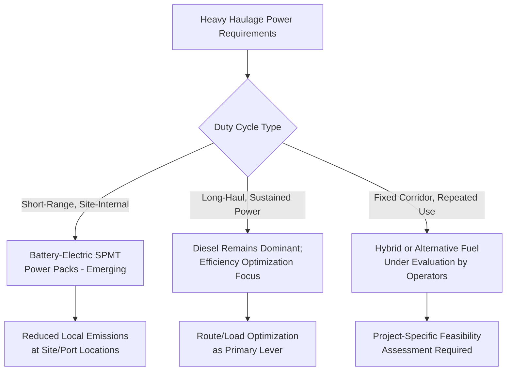

## Fuel Efficiency and Emissions Reduction in Heavy Haulage

### Overview

Fuel efficiency and emissions reduction in heavy haulage addresses the sustainability dimension of moving extremely heavy, often diesel-power-unit-dependent loads across long distances — a segment of the broader transport industry facing particular decarbonization challenges given the power density requirements of hauling hundreds to thousands of tons. This topic surveys current operational efficiency practices, emerging propulsion alternatives, and the structural constraints that make heavy-lift haulage decarbonization more complex than lighter-duty freight transport.

### Why Heavy Haulage Faces Distinct Decarbonization Challenges

**Key Points**

- **Power density requirements**: Moving loads in the hundreds-to-thousands-of-tons range (as discussed throughout this syllabus for transformers, turbines, mining equipment, and modular structures) requires sustained high power output over potentially many hours of continuous operation, a duty cycle that current battery-electric technology handles less readily than it does for lighter, shorter-range freight applications
- **Diverse power unit fleet composition**: SPMT and heavy-haul trailer power packs, escort/support vehicles, and cranes mobilized for a project each represent separate emissions sources requiring different mitigation approaches, rather than a single fleet-wide solution
- **Route and duty-cycle unpredictability**: Unlike scheduled freight routes, heavy-lift moves often involve unique one-off routes with variable terrain, grade, and duration, making standardized efficiency benchmarking more difficult than for repetitive freight corridors

### Operational Efficiency Measures (Current Practice)

**Key Points**

- **Route optimization for grade and distance**: As discussed in the route survey and clearance simulation topic, route selection already accounts for physical feasibility; incorporating fuel efficiency (minimizing grade, avoiding unnecessary distance) as an explicit route selection criterion alongside clearance and weight constraints can meaningfully reduce fuel consumption without requiring new technology
- **Load consolidation and trip reduction**: Combining multiple smaller shipments into fewer, better-planned moves where feasible reduces total vehicle-miles, particularly relevant to the multi-shipment logistics programs discussed in substation delivery and modular building transport topics
- **Driver/operator training for efficient operation**: Smooth acceleration, optimal engine load management, and reduced idling during staging and loading operations are well-established efficiency practices applicable to heavy-haul power units as much as conventional trucking
- **Aerodynamic and mechanical maintenance**: Standard heavy-vehicle efficiency practices (tire pressure management, engine maintenance, reduced unnecessary idling during long loading/staging periods common to heavy-lift operations) apply directly to heavy-haul tractor and power pack units

### Alternative Propulsion and Power Unit Technologies

- **Battery-electric SPMT power packs**: For shorter-duration, site-internal moves (factory to port, port to nearby site), battery-electric power packs are technically feasible and offer local emissions benefits, particularly valuable at ports and urban sites where local air quality and noise considerations matter; suitability decreases as duty cycle length and continuous power demand increase
- **Hybrid power unit configurations**: Some heavy-haul equipment manufacturers and operators have explored hybrid diesel-electric configurations aiming to capture efficiency gains during variable-load operation (acceleration, deceleration, idling) while retaining diesel's sustained power capability for long-haul segments
- **Alternative fuels (biodiesel, renewable diesel, HVO)**: Drop-in alternative diesel fuels are increasingly used by some heavy-haul and construction equipment operators as a lower-carbon-intensity substitute compatible with existing diesel engines, avoiding the range/power limitations of full electrification while reducing lifecycle emissions
- **[Unverified]** The specific commercial availability, adoption rate, and performance characteristics of battery-electric and hybrid heavy-haul power packs vary by manufacturer and region, and change relatively quickly in this space; current vendor and industry association sources should be consulted for up-to-date specifics on any particular technology's commercial maturity

### Marine and Vessel-Related Emissions Considerations

- Heavy-lift vessels used for the marine legs discussed throughout this syllabus (transformer, turbine, mining equipment, and aerospace component transport) are subject to broader maritime emissions regulation trends (including sulfur content limits on marine fuels and evolving efficiency/carbon intensity requirements applicable to commercial shipping generally), which indirectly affects the marine transport leg of heavy-lift logistics chains
- Vessel selection and voyage planning (speed optimization, route efficiency) offer emissions reduction levers on the marine leg analogous to the route/load optimization levers available on the road-based leg

### Key Points — Practical Constraints on Rapid Transition

- **Duty cycle mismatch with current battery technology**: The sustained, high-power, often multi-day duty cycles typical of long-haul heavy transport remain challenging for current battery-electric technology to match without impractical charging infrastructure or vehicle downtime, making a full transition away from diesel power units a longer-term rather than immediate prospect for this specific segment
- **Fleet capital cycle considerations**: Heavy-haul equipment (SPMTs, specialized trailers, power packs) represents substantial capital investment with long service lives; fleet-wide transition to alternative propulsion is naturally paced by normal capital replacement cycles rather than able to be accelerated without significant cost, a general economic constraint applicable across capital-intensive equipment sectors
- **Remote and off-grid operating environments**: As discussed in the mining equipment and grid infrastructure logistics topics, many heavy-haul operations occur in locations with limited or no electrical grid access, constraining the practical feasibility of battery-electric or grid-charged alternatives for those specific operating contexts regardless of the technology's general maturity

### Emissions Reporting and Client/Regulatory Drivers

- **Key Points**
  - Increasingly, project owners (particularly in sectors with their own sustainability commitments, such as utilities and renewable energy developers) may request or require emissions data from heavy-lift transport contractors as part of broader project carbon accounting, creating a demand-side driver for efficiency and alternative fuel adoption independent of direct regulatory mandate
  - Telematics systems discussed earlier in this chapter, originally deployed for shock/tilt/position monitoring, can in principle also support fuel consumption and emissions tracking, offering a practical data source for operators seeking to report or optimize fuel efficiency without deploying entirely separate monitoring systems

### Risk Factors and Considerations

- **[Inference] Segment-specific transition pace**: Given the duty-cycle and power-density constraints described above, it's plausible that heavy-lift and specialized haulage will transition toward lower-emissions propulsion more slowly than lighter-duty freight or urban delivery segments, where electrification has generally progressed faster — though the specific pace and sequencing of this transition across different heavy-haul applications is not something that can be confidently generalized without reference to current, application-specific technology and market data
- **Infrastructure dependency for alternative propulsion**: Any shift toward battery-electric or other grid-dependent power units for heavy-haul equipment would require charging infrastructure investment at ports, staging yards, and potentially along routes — an infrastructure gap that itself represents a practical barrier independent of the underlying vehicle technology's readiness
- **[Speculation] Cost premium trajectory**: Alternative fuel and hybrid/electric heavy-haul equipment may currently carry a cost premium over conventional diesel equipment; whether and how quickly this premium narrows is a market dynamic that varies by technology and region and should not be assumed to follow a fixed trajectory

### Related Topics

- Route Survey and Clearance Simulation Tools
- GPS Tracking and Telematics for Abnormal Loads
- Heavy-Lift Vessel Selection and Marine Emissions Regulation
- Remote SPMT Control and Automation Trends
- Alternative Fuel Adoption in Construction and Heavy Equipment Fleets
- Carbon Accounting and Client Emissions Reporting Requirements for Transport Contractors