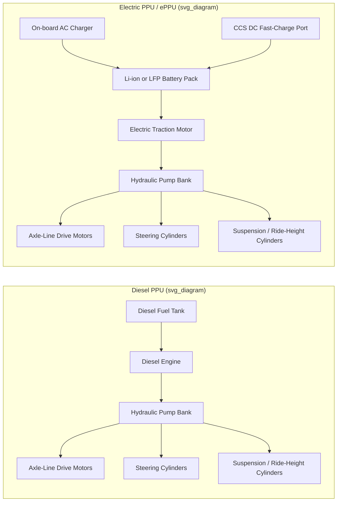

## Electrification of SPMTs and Support Vehicles

### Overview

Self-Propelled Modular Transporters (SPMTs) are the primary heavy-haul asset class for moving oversized, high-mass cargo in energy, shipbuilding, power generation, and industrial plant relocation work. Historically, SPMT propulsion, hydraulics, and steering have all been driven by a diesel Power Pack Unit (PPU) — typically a diesel engine coupled to hydraulic pumps that power both the wheel drives and the suspension/steering system. Electrification of SPMTs refers to replacing that diesel PPU with a battery-electric equivalent (an ePPU or EPPU), while "support vehicle" electrification extends the same shift to the auxiliary fleet around a heavy-lift jobsite: terminal tractors, ballast/counterweight trucks, pilot/escort vehicles, generator sets, and yard support equipment.

This is one of the most active engineering fronts in the heavy-lift sector as of 2025–2026, driven by emissions regulation in ports/urban cores, client ESG requirements, and the operational advantages of electric torque delivery in precision spotting work.

---

### Why Electrify the PPU

**Key Points**

- **Emissions and permitting**: Indoor/enclosed-space work (tunnels, fabrication halls, nuclear facilities) increasingly requires zero local-exhaust equipment; diesel PPUs generate CO, NOx, and particulate matter that must be ventilated or restricted.
- **Noise**: The ePPU is designed for zero emission operation in enclosed spaces such as tunnels, while offering lower noise levels than diesel powered units, making it particularly suitable for use in urban areas or indoor applications. [Vertikal](https://vertikal.net/en/news/story/45870/scheuerle-launches-electric-spmt)
- **Torque and control**: The electric motor delivers maximum torque immediately for improved starting performance and traction compared to diesel units. This matters directly for the fine, low-speed spotting maneuvers (crabbing, pivot-steer, load alignment under a structure) that define SPMT operations. [Vertikal](https://vertikal.net/en/news/story/45870/scheuerle-launches-electric-spmt)
- **Efficiency and maintenance**: The company says the system is up to four times more energy efficient than diesel engines, with lower maintenance requirements due to fewer moving parts. [Vertikal](https://vertikal.net/en/news/story/45870/scheuerle-launches-electric-spmt)
- **Idle losses**: On the Mammoet EPPU, the start-stop system works very efficiently due to the nature of the power from the electrical system, further reducing power drain, meaning effectively no power is expended when the unit is idling, unlike a diesel PPU. [khl](https://www.khl.com/news/electric-spmt-new-from-mammoet/8029576.article)

---

### Architecture: Diesel PPU vs. Electric PPU (ePPU)

A conventional SPMT PPU is a self-contained diesel engine driving hydraulic pumps; those pumps feed hydraulic motors at each axle line for propulsion, plus hydraulic cylinders for steering and ride-height/suspension leveling. An ePPU replaces the diesel engine and fuel system with a battery pack and electric motor(s), while largely preserving the downstream hydraulic drivetrain at the axle-line level — this is what allows ePPUs to be retrofit-compatible with existing diesel-generation axle lines in several manufacturer designs.



**Key Points**

- The battery/motor stage substitutes for the diesel engine stage; the hydraulic distribution layer downstream is frequently retained, which is why several ePPUs are marketed as retrofits onto existing SPMT axle lines rather than requiring an entirely new vehicle.
- Some systems (e.g., Goldhofer's E-Powerpack, per Wikipedia's summary — [Unverified, secondary source] noted below) draw on electric drivetrain experience from adjacent product lines such as electric airport tractors.

---

### Representative Manufacturer Implementations

#### Scheuerle (TII Group) — ePPU

TII Scheuerle has introduced a battery electric power pack unit (ePPU) for its SPMT self-propelled modular transporter range, compatible with all generation two to four axle lines. The new unit provides the same performance as the company's most powerful diesel Z390 power pack, capable of operating up to 26 driven pendulum axles or 40 conventional axle lines. [Vertikal](https://vertikal.net/en/news/story/45870/scheuerle-launches-electric-spmt)

**Key Points**

- **Battery**: The lithium ion battery pack provides sufficient power for a full working day's operation. [Vertikal](https://vertikal.net/en/news/story/45870/scheuerle-launches-electric-spmt)
- **Charging**: Recharging from 20 to 80 percent is possible in under 30 minutes using a 300kW CCS power plug, or overnight with a 44kW AC connection. [Vertikal](https://vertikal.net/en/news/story/45870/scheuerle-launches-electric-spmt)
- Cross-generation compatibility (2- to 4-axle-line generations) is significant for fleet operators wanting to electrify power sources without replacing an entire axle-line inventory.

#### Mammoet — EPPU (retrofit-oriented)

Mammoet has launched a zero-emission electric power pack unit (EPPU) suitable for use with any of the company's self-propelled modular transporters. Existing diesel power pack units in the fleet can be retrofitted with the new battery-electric system, developed in conjunction with a company specializing in zero-emissions powertrains for heavy industry. Some funding for the development was also provided by DKTI, a Dutch government programme to develop climate technologies and innovations in logistics. [khl](https://www.khl.com/news/electric-spmt-new-from-mammoet/8029576.article)[dieselprogress](https://www.dieselprogress.com/news/electric-spmt-new-from-mammoet-updated/8029576.article)

**Key Points**

- **Powertrain**: Instead of the diesel engine there is a 350 kW electric motor powered by a 194 kWh lithium iron phosphate (LFP) battery, with a 44 kW battery charger included onboard within the existing envelope of the PPU. [khl](https://www.khl.com/news/electric-spmt-new-from-mammoet/8029576.article)
- **Endurance**: Running time is enough that the EPPU should only need charging every four or five days, depending on use. [khl](https://www.khl.com/news/electric-spmt-new-from-mammoet/8029576.article)
- **Charging**: AC mains charging from empty to full can be done in 5 hours from a 63 Amp three-phase supply; a single-phase, 13 Amp domestic supply can also be used with a commensurately longer charge time, and charging from a battery-based power supply (i.e., a mobile battery bank rather than grid connection) has also been successfully tested. [khl](https://www.khl.com/news/electric-spmt-new-from-mammoet/8029576.article)
- **Retrofit rationale**: A Mammoet spokesperson stated that retrofitting existing SPMT fleets cuts down on both waste and additional fabrication compared to sourcing new zero-emission equipment, and that the EPPU's power output is comparable to the diesel versions it replaces. [dieselprogress](https://www.dieselprogress.com/news/electric-spmt-new-from-mammoet-updated/8029576.article)

#### Goldhofer — E-Powerpack / PST/SL-E Split

[Unverified — sourced from a Wikipedia article, not a primary manufacturer source, so treat load figures with caution and confirm against current Goldhofer literature before quoting to a client.] In early 2025, Goldhofer, a Memmingen-based German transport solutions manufacturer, developed a fully electric powerpack for its PST/SL-E Split SPMT, reportedly capable of lifting 45 tons per axle row, with a widening option allowing the platform width to be adjusted between roughly 9.8 ft and 16.7 ft to help secure loads and reduce the need for side-by-side axle-line combinations. The same source states Goldhofer's E-Powerpack draws on the company's Airport Technology division, which had already produced fully electric aircraft tractors capable of pushback operations for aircraft above 300 tons. [Wikipedia](https://en.wikipedia.org/wiki/Powerpack_(drivetrain))[Wikipedia](https://en.wikipedia.org/wiki/Powerpack_(drivetrain))

#### Field deployment example — Mammoet at ITER

Mammoet's electric battery-powered SPMTs began operation at the ITER nuclear fusion research facility in southern France, supporting client DAHER in transporting key components including 367-tonne toroidal field coils and 440-tonne vacuum vessel sectors. Two combinations of twelve axle lines of SPMT were used inside the facility to move components from storage to the assembly area. This is frequently cited industry-wide as the first large-scale deployment of fully electric SPMTs on a major heavy-component project — described elsewhere as the first fully electric battery-powered SPMTs, moving 440-tonne vacuum vessel sectors with zero exhaust emissions in 2024. [Danisesne](https://www.electronicspecifier.com/news/mammoet-s-electric-powered-spmts-successful-debut/)[Huayutrailer](https://huayutrailer.com/blog/what-is-spmt)

#### Smaller-scale / in-plant electric SPMTs (Morello, SinoTrailers, FADA)

Beyond retrofit ePPUs for large project-logistics SPMTs, a distinct product segment covers smaller, purpose-built battery-electric SPMTs for in-plant and factory material handling:

- Morello's electric SPMTs are driven by electric motors and powered by batteries, produce no emissions, and are marketed as suitable for indoor use; they can transport loads ranging from roughly 1 ton to over 1,000 tons and are multidirectional, capable of standard steering, turning on their own axis, and diagonal or compass movement. Units can be purchased individually or connected via cable or wireless link to operate as a single system, and hydraulic suspensions on the lifting deck allow loads to be picked and placed without a crane while adapting to uneven floors. [Morello Giovanni](https://www.morello.eu.com/blog-news/electric-spmt-self-propelled-modular-transporters/)[Morello Giovanni](https://www.morello.eu.com/blog-news/electric-spmt-self-propelled-modular-transporters/)
- SinoTrailers describes electric SPMT as using battery power rather than a high-power diesel engine, eliminating emissions and noise concerns compared with conventional diesel SPMTs; a high volume of lithium battery capacity also allows relatively straightforward conversion to an automated guided vehicle (AGV) configuration. Demand for electric SPMT is described as growing in China and nearby markets, driven partly by rising emission standards. [SinoTrailers](https://www.sinotrailers.com/electric-spmt/)[SinoTrailers](https://www.sinotrailers.com/electric-spmt/)
- FADA's SPMT line can be configured with load capacities from 100 to 400 tons, reaching speeds up to 30 m/min with 360-degree steering, crab movement, and diagonal travel, offering power options of lithium battery or diesel combined with high-efficiency AC or PMAC drive motors. [Fada](https://www.fada.com.tr/en/product/en-self-propelled-modular-transporter-spmt/)

---

### Battery Technology and Charging Infrastructure

**Key Points**

- **Chemistry**: Lithium iron phosphate (LFP) appears favored over other lithium-ion chemistries in at least one major implementation (Mammoet's EPPU uses a 194 kWh LFP battery), consistent with LFP's thermal stability and cycle-life advantages for heavy-duty industrial duty cycles — [Inference: the specific rationale for LFP selection was not stated in the sourced material, but LFP's known safety and cycle-life profile makes it a plausible fit for continuous industrial/jobsite use]. [khl](https://www.khl.com/news/electric-spmt-new-from-mammoet/8029576.article)
- **Charging modes** seen across manufacturers:
  - DC fast charging via CCS connector (e.g., a 300kW CCS power plug enabling 20–80% charge in under 30 minutes on the Scheuerle ePPU). [Vertikal](https://vertikal.net/en/news/story/45870/scheuerle-launches-electric-spmt)
  - Overnight AC charging (44kW AC connection on Scheuerle; 44 kW onboard charger on Mammoet's EPPU, drawing from a 63A three-phase or 13A single-phase domestic supply). [Vertikal](https://vertikal.net/en/news/story/45870/scheuerle-launches-electric-spmt)[khl](https://www.khl.com/news/electric-spmt-new-from-mammoet/8029576.article)
  - Mobile/off-grid charging from a battery-based power source, validated by Mammoet for remote sites without fixed grid infrastructure.
- **Jobsite implication**: Charging infrastructure planning (transformer capacity, CCS charger placement, cable runs to laydown yards) becomes a new element of heavy-lift project mobilization planning that did not exist for diesel PPU fleets, which only required fuel logistics.

---

### Support Vehicle Electrification

"Support vehicles" in a heavy-lift/specialized-logistics context include the non-SPMT assets that make a heavy transport move possible: escort/pilot vehicles, ballast tractors, terminal/yard tractors, mobile generator sets, and crew/utility trucks. Electrification trends in this category are generally less mature than SPMT ePPUs specifically, but follow parallel industry logic:

**Key Points**

- **Terminal tractors and yard trucks**: Battery-electric terminal tractors are commercially established in ports and container terminals (a market adjacent to, but broader than, heavy-lift logistics specifically), motivated by the same zero-local-emission and noise drivers cited for SPMTs.
- **Escort/pilot vehicles**: Electrification of light escort vehicles follows the general EV/light-commercial-EV market rather than heavy-lift-specific engineering; the main project consideration is charging logistics along a route (especially for multi-day permitted moves through rural areas with sparse charging infrastructure).
- **Generator sets / site power**: As SPMT fleets add on-board chargers, jobsites increasingly need either grid connection or battery-based mobile power sources at the marshaling yard — Mammoet's testing of charging an EPPU from a battery-based power supply illustrates this shift toward battery-to-battery site power chains, reducing reliance on diesel generator sets historically used to support diesel PPU refueling and ancillary site equipment. [khl](https://www.khl.com/news/electric-spmt-new-from-mammoet/8029576.article)
- [Inference: The sourced material addresses SPMT ePPUs in far greater technical detail than dedicated heavy-lift support-vehicle electrification; broader claims about escort-vehicle or generator electrification in this domain should be treated as general industry-trend inference rather than documented, sourced fact, and verified against a specific OEM or operator's current fleet plan before being used in client-facing material.]

---

### Operational and Planning Considerations

**Key Points**

- **Range/duty-cycle matching**: A "full working day" battery rating (as claimed for the Scheuerle ePPU) or a "four to five day" duty cycle (Mammoet EPPU) must be matched against the specific project's shift pattern, ambient temperature (which affects battery performance), and duty intensity (continuous crawl-speed load spotting draws differently than intermittent moves).
- **Charging window planning**: DC fast-charging (30 minutes to 80%) supports intensive multi-shift operations; AC overnight charging suits single-shift daily operations, but requires reliable site power provisioning during mobilization.
- **Retrofit vs. new-build decision**: Operators with existing diesel-PPU axle-line fleets (a major capital asset) can, per Mammoet's stated rationale, retrofit an EPPU onto existing axle lines rather than replace the entire fleet — this is a significant total-cost-of-ownership and asset-utilization consideration for heavy-lift contractors.
- **Enclosed-space and regulated-site work**: Electrified SPMTs materially expand where heavy transport work can be performed — inside nuclear facilities (as demonstrated at ITER), tunnels, and indoor fabrication halls — where diesel exhaust and noise would otherwise restrict or prohibit the work.
- **Behavior may vary**: [Behavioral disclaimer] Battery performance, charge times, and range figures cited by manufacturers are nameplate/marketing figures; actual field performance depends on ambient temperature, battery state of health over its service life, load intensity, and duty cycle, and should be validated against the specific unit's technical documentation and site conditions before being used for project scheduling.

---

### Illustrative Diagram — Electrified SPMT Fleet + Support Ecosystem

```mermaid
flowchart TD
    Grid[Site Grid Connection / Mobile Battery Power (svg_diagram)] --> Charger[44kW AC Charger and/or 300kW CCS DC Charger]
    Charger --> ePPU1[SPMT ePPU Unit 1]
    Charger --> ePPU2[SPMT ePPU Unit 2]
    ePPU1 --> AxleLines1[Axle Line Group - Load A]
    ePPU2 --> AxleLines2[Axle Line Group - Load A]
    AxleLines1 --> Load[Oversized / Heavy Load]
    AxleLines2 --> Load
    Grid --> SupportCharge[Support Vehicle Charging Point]
    SupportCharge --> Tractor[Electric Terminal / Ballast Tractor]
    SupportCharge --> Escort[Electric Escort / Pilot Vehicle]
```

---

**Related Topics**

- Hydrogen fuel-cell power packs as an alternative to battery-electric PPUs for extended-range heavy transport
- Grid capacity and temporary power planning for electrified heavy-lift mobilizations
- Retrofit engineering economics: diesel-to-electric PPU conversion on legacy axle-line fleets
- Battery thermal management in high-duty-cycle industrial mobile equipment
- Automated Guided Vehicle (AGV) conversion pathways for battery-electric SPMTs
- Regulatory drivers: port and urban low-emission zones affecting heavy-haul routing
- Total cost of ownership (TCO) modeling: diesel PPU vs. ePPU over a multi-year fleet lifecycle
- Electrification of aircraft/airport ground-support tractors as an adjacent technology source (Goldhofer Airport Technology precedent)