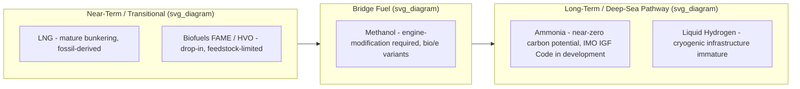

## Alternative Fuels for Heavy-Lift Vessels

### Overview

Heavy-lift and project-cargo vessels — the ocean-going ships that carry oversized, high-mass cargo (wind turbine components, refinery modules, offshore substations) using onboard heavy-lift cranes — face the same International Maritime Organization (IMO) decarbonization pressure as the broader shipping industry, while also carrying vessel-specific design constraints: large open deck areas, high crane loads, and long, often irregular voyage patterns tied to project schedules rather than fixed liner routes. This review evaluates the viability of five alternative marine fuels — liquefied natural gas (LNG), methanol, ammonia, biofuel, and hydrogen — as potential solutions for maritime decarbonization, and each of these candidate fuels is now appearing, in varying stages of maturity, in heavy-lift newbuilding programs.

**Key Points**

- The shipping industry is responsible for transporting roughly 90% of global goods and is a major source of greenhouse gas emissions, which is why regulatory pressure (principally from the IMO) is pushing all vessel segments — including heavy-lift — toward alternative fuels.
- DNV's Alternative Fuels Insight (AFI) database shows that 84% of vessels on order still rely on conventional fuels, while just 16% are alternative-fuel capable, indicating the transition across shipping generally (and heavy-lift specifically) is still early-stage rather than mainstream.
- There is no single winning fuel yet; DNV's forecast points to efficiency improvements as the only large-scale, proven decarbonization path available this decade, meaning fuel-switching is one lever among several (hull/route efficiency, hybridization, slow steaming) rather than a complete solution on its own.

---

### Candidate Fuel Types

#### LNG (Liquefied Natural Gas)

**Key Points**

- LNG remains the most established alternative fuel, supported by a mature bunkering network and immediate reductions in sulphur, nitrogen oxide, and particulate emissions, with an established global bunkering infrastructure spanning over 200 ports and a fleet of more than 700 LNG-fuelled vessels providing an operational precedent.
- LNG can offer up to roughly a 25% reduction in carbon emissions versus conventional fuel oil, along with reduced nitrogen oxide emissions and vastly decreased particulate matter and sulfur oxide emissions due to the absence of sulfur, plus cost and efficiency benefits.
- LNG's classification as a transitional fuel reflects its fossil origin and ongoing GHG emissions; even with optimized dual-fuel engines achieving less than 1% methane slip, lifecycle emissions can remain 15–20% higher than IMO 2050 targets, and ongoing technological and operational work to mitigate methane slip is considered vital to preserving LNG's long-term environmental credibility.
- **Suitability for heavy-lift**: LNG's technical maturity and dual-fuel engine availability make it a viable near-term compliance fuel, but its status as a fossil-derived transitional fuel limits its role as an end-state solution for owners with 2050 net-zero commitments.

#### Methanol

**Key Points**

- Methanol is a versatile, readily available chemical producible from a variety of renewable sources, and is attracting increasing industry attention, particularly for container ships and roll-on/roll-off (RORO) vessels — a profile that extends naturally to heavy-lift/project vessels given similar engine and bunkering considerations.
- Methanol offers an appealing option for operators requiring rapid deployment because of its compatibility with modified conventional engines, its ability to be bunkered via adapted petroleum liquid-fuel infrastructure, and its availability in bio- or e-methanol variants — making it the most practical near-term solution identified for short-sea corridors in comparative reviews.
- Methanol produced from renewable sources presents a low-emission alternative but requires engine modifications; it is broadly regarded as a practical bridge fuel today, with the possibility of reaching net-zero carbon status when sourced renewably, potentially allowing it to operate alongside ammonia longer term.
- Green (renewably-sourced) methanol combustion can achieve top-tier (Class A) Carbon Intensity Indicator (CII) results in comparative ship-propulsion modeling, under both technology-to-wake and well-to-wake emission accounting.

#### Ammonia

**Key Points**

- Ammonia is regarded as a transformative, potentially zero-carbon fuel for maritime decarbonization, but adoption requires overcoming significant technical, regulatory, and environmental hurdles.
- Ammonia liquefies relatively conveniently — around −33 °C at 1 atm, or about 0.9 MPa at room temperature — which is more convenient compared with LNG and hydrogen, and its 17.5 wt% hydrogen content allows it to function as a high-efficiency hydrogen carrier supporting relatively clean combustion.
- Ammonia is identified in techno-economic review as the primary long-term pathway for deep-sea decarbonization, leveraging existing production infrastructure to achieve up to roughly 90% lifecycle GHG reduction when produced from renewable (green) hydrogen.
- Regulatory groundwork is actively developing: the IMO's Maritime Safety Committee approved interim guidelines for the safe use of ammonia as a marine fuel during its 109th session, and further work — including draft interim guidelines on ammonia's dual use as both cargo and fuel (currently prohibited) — was anticipated at subsequent sessions. The IMO is also developing safety and operational standards for ammonia-powered vessels under its IGF Code (International Code of Safety for Ships Using Gases or Other Low-Flashpoint Fuels).
- Collaborative development programs are underway, such as the EU-funded CASTOR initiative focused on ammonia-powered ship designs and safety systems, alongside exploratory studies by major operators such as Maersk into ammonia adoption (in addition to their existing methanol and LNG investments).

#### Hydrogen

**Key Points**

- Hydrogen and ammonia (as e- and blue fuels) both promise near-zero emissions but face hurdles in storage, handling, and current high production costs.
- In comparative techno-economic review, liquid hydrogen is evaluated alongside ammonia, LNG, and methanol, with hydrogen positioned as an alternative option pending the maturation of cryogenic storage infrastructure — reflecting hydrogen's very low volumetric energy density in liquid form and the deep cryogenic temperatures required to keep it liquefied.

#### Biofuels (FAME, HVO)

**Key Points**

- Fatty Acid Methyl Ester (FAME) and Hydrotreated Vegetable Oil (HVO) remain prominent "drop-in" biofuels, compatible with existing marine engines without requiring retrofit, and can be used directly in existing diesel engine facilities.
- Biofuels offer a renewable, lower-carbon-footprint option, though they face feedstock availability and cost-competitiveness challenges that limit large-scale adoption.
- **Suitability for heavy-lift**: Because drop-in biofuels require no engine modification, they represent the lowest-friction transitional option for existing heavy-lift tonnage that cannot economically be retrofitted or replaced before a newbuild cycle.

#### Battery-Electric and Nuclear (Context)

**Key Points**

- Electric batteries provide an efficient propulsion solution for short distances and smaller vessels but are limited by energy density and range for long-distance shipping — a constraint that is generally more limiting for ocean-crossing heavy-lift voyages than for short-sea or harbor craft.
- Nuclear power is described as an emerging potential game-changer for shipping and offshore industries, offering a significant potential reduction in greenhouse gas emissions compared to traditional fuels, though this is a longer-horizon, high-barrier option not presently reflected in heavy-lift newbuilding programs.

---

### Comparative Fuel Positioning (Illustrative Summary)

**Key Points**

- Fuel selection is highly route-dependent: methanol is emerging as the most practical near-term solution for short-sea corridors, while ammonia is emerging as the primary pathway for long-term deep-sea decarbonization.
- The likely future fuel mix for shipping and logistics broadly is a combination of ammonia, biofuels, electric propulsion, hydrogen, LNG, LPG, methanol, and nuclear — with different fuels serving different vessel types, routes, and operational needs rather than a single fuel dominating the whole sector.

---

### Heavy-Lift Sector Adoption: Case Examples

#### SAL Heavy Lift / Jumbo — Orca Class (methanol dual-fuel)

SAL Heavy Lift signed building contracts for four firm plus two optional new-generation heavy-lift ships with Wuhu Shipyard in China, in a joint newbuilding programme with alliance partner Jumbo Shipping called the Orca Class. The vessels will be powered by dual-fuel engines that can run on methanol.

**Key Points**

- The 149.9-metre, 14,600 dwt Orca-class vessels are equipped with dual-fuel main engines capable of operating on methanol; SAL and Jumbo expect to be able to offer carbon-neutral transport once green methanol becomes available in larger ports.
- The vessels feature onshore power connection capability, allowing emission-free operation during port calls, and are also fitted with Energy Storage Systems enabling hybrid propulsion solutions while transiting.
- Expected fuel consumption is below 20 tonnes of fuel oil per day at a 15-knot service speed, dropping to roughly 6 tonnes per day at a reduced 10-knot speed — illustrating the trade-off between transit speed and fuel/emissions performance.
- The first two Orca-class vessels are committed long-term to transporting offshore wind turbine components for Siemens Gamesa Renewable Energy, directly tying fuel-strategy decisions to the offshore-wind heavy-lift market segment.
- SAL Heavy Lift and the wider Harren Group are a signatory to the "Call to Action for Shipping Decarbonization," with a stated commitment to decarbonize shipping activities by 2050; the Orca programme is presented as concrete action toward that commitment.

#### Jumbo — L-Class (methanol-ready)

Jumbo has developed the energy-efficient, methanol-ready 25,000 DWT L-Class vessels in-house and ordered two newbuildings from Dajin Heavy Industry, with deliveries scheduled for 2028 and 2029.

**Key Points**

- Each L-Class vessel will be equipped with two Huisman 1,200-tonne heavy-lift cranes, providing a combined lifting capacity of 2,400 tonnes per vessel — among the largest crane capacities in the project-cargo/heavy-lift newbuild segment.
- The vessels are built to DNV classification standards and are designed to meet modern clean-energy shipping requirements, supporting operations across offshore wind, oil and gas, mining, and other specialized marine heavy-lift requirements.
- "Methanol-ready" design (as distinct from Orca's dual-fuel-capable engines) typically indicates the vessel is engineered to accommodate methanol fuel systems and bunkering with future retrofit or fuel-system completion, rather than operating on methanol from day one — [Inference: this distinction between "dual-fuel capable" (Orca) and "methanol-ready" (L-Class) terminology was not explicitly defined in the sourced material and should be confirmed against each shipyard's technical specification before being treated as a firm operational distinction].
- The L-Class vessels will join the JSI Alliance — the commercial partnership between Jumbo, SAL, and (since 2024) U.S. carrier Intermarine — which operates a combined fleet of more than 80 vessels serving the global project cargo, energy, industrial, and infrastructure markets.

#### Sector-wide posture (BBC Chartering and others)

Other major heavy-lift and project-cargo carriers describe sustainability as a growing strategic priority, with active exploration of ways to reduce environmental footprint through optimizing vessel performance and exploring more fuel-efficient technologies, reflecting a sector-wide direction of travel even where specific fuel commitments have not yet been publicly detailed to the same degree as the SAL/Jumbo Orca and L-Class programs.

---

### Infrastructure and Operational Considerations Specific to Heavy-Lift

**Key Points**

- **Route irregularity**: Unlike container or tanker liner trades with fixed port rotations, heavy-lift vessels often follow project-driven, non-repeating routes (e.g., factory-to-installation-site moves for offshore wind components), which complicates reliance on any alternative fuel with a still-limited global bunkering footprint — a vessel may need to plan bunkering stops around fuel availability rather than pure route efficiency.
- **Hybridization as a bridge**: Onshore power connection (cold ironing) and onboard Energy Storage Systems, as fitted to the Orca class, allow partial or full emission-free operation during port calls and can supplement main engine output while transiting, reducing total fuel-fired running hours even before a vessel's primary fuel type fully decarbonizes.
- **Speed–consumption trade-off**: As illustrated by the Orca class's fuel consumption figures (below 20 t/day at 15 knots versus roughly 6 t/day at 10 knots), voyage-speed planning is itself an emissions-reduction lever independent of fuel chemistry, and is likely to be used in combination with alternative-fuel adoption rather than as an alternative to it.
- **Barriers common to the whole sector, applicable to heavy-lift**: significant barriers to decarbonization remain, including a lack of supporting port infrastructure, safety risks, immature technology, and high investment and operational costs — all of which apply to heavy-lift owners considering methanol or ammonia newbuilds or retrofits.
- **Behavior may vary**: [Behavioral disclaimer] Fuel consumption, emissions-reduction percentages, and lifecycle GHG figures cited for specific fuels and vessels are dependent on engine configuration, fuel sourcing pathway (grey/blue/green), operating speed, and route; actual in-service performance should be verified against the vessel's class certificate and the specific fuel supply chain in use rather than assumed from generic industry figures.

---

**Related Topics**

- IMO IGF Code development and its implications for ammonia-fuelled heavy-lift newbuilds
- Green vs. blue vs. grey methanol and ammonia production pathways and their lifecycle GHG accounting
- Cold ironing / shore power infrastructure at project-cargo and heavy-lift terminals
- Hybrid energy storage systems (ESS) integration on heavy-lift vessels
- Speed optimization and voyage planning as an independent decarbonization lever
- Dual-fuel main engine technology and retrofit economics for existing heavy-lift fleets
- Carbon Intensity Indicator (CII) and EEXI compliance implications for project-cargo operators
- Offshore wind component logistics as a driver of heavy-lift newbuild fuel strategy