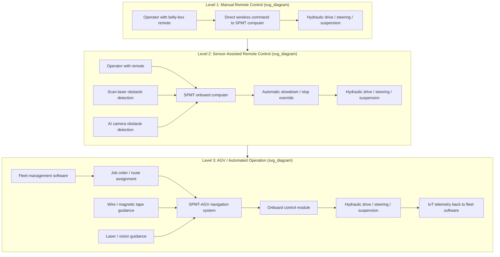

## Automation and Remote Operation Developments

### Overview

Automation and remote operation are among the most consequential technical trends reshaping heavy-lift transport, spanning a spectrum from today's already-standard wireless remote control of SPMTs, through sensor-based safety augmentation, to emerging conversion of SPMT platforms into fully automated guided vehicles (AGVs) for repeatable in-plant and shipyard transport tasks. This section documents current baseline practice, the sensor and control architecture enabling it, and the direction of travel toward higher levels of automation.

---

### Baseline: Remote-Controlled SPMT Operation (Current Standard Practice)

**Key Points**

- SPMT travel at very slow speeds with the operator walking alongside, controlling the SPMT with a remote-control device — this walk-alongside remote-control model is the dominant operating paradigm for SPMT fleets today, not a legacy or transitional method.
- The wireless remote-control device is commonly referred to in shipyard/heavy-industrial practice as a "belly box," worn by a qualified operator walking beside the SPMT while it moves.
- SPMTs are actually comprised of two different unit types — a module (the wheeled platform/trailer) and a power pack (the diesel or electric prime mover) — which can be combined in various configurations to move very heavy loads with high precision in a wide range of environments, including confined spaces such as dry docks.
- Each trailer's wheels can turn independently, enabling omnidirectional movement, and this is all controlled by a sophisticated computer system; hydraulic suspension controls platform height to ensure stability and even weight distribution across all connected modules.
- SPMTs do not have a built-in crane or ramp — loads must be set onto the platform using separate cranes or forklifts, meaning "automation" of the SPMT itself addresses only the transport/positioning phase, not the load/unload phase, which typically still requires separate lifting equipment and its own operators.

---

### Current Control and Safety Architecture

**Key Points**

- Modern commercial SPMT product lines commonly specify remote control or cabin control as selectable operating modes, with remote control typically used for close-quarters spotting work and cabin control available for longer transit runs.
- Standard safety features on current-generation SPMT platforms include safety railings, LED lighting, and dynamic stability verification, alongside scan-laser obstacle detection with programmable slowdown and automatic-stop zones, and AI-camera-based obstacle detection on more advanced platforms.
- Ergonomic, multifunction remote controls with integrated displays are standard equipment, giving the walking operator real-time feedback on platform status, steering angle, and load distribution while directing the SPMT.
- Some manufacturers now market their SPMT platforms as "Industry 4.0 ready" and describe navigation technology as "AGV ready" — indicating that current-generation hardware is being designed with a forward migration path to full automation in mind, even where day-to-day operation remains manually directed via remote control.
- IoT (Internet of Things) connectivity and remote access for service are increasingly standard features, enabling fleet operators to monitor unit status, diagnostics, and usage data remotely, and allowing manufacturers or service providers to perform remote diagnostic support.
- Synchronous operation — coordinating multiple connected SPMT modules or power packs to move as a single controlled platform — is handled by onboard computer/software systems rather than by independent manual coordination between operators on separate units.

---

### Automation Architecture: From Remote Control to AGV Conversion

An Automated Guided Vehicle (AGV) is a portable robot that, unlike an autonomous mobile robot (AMR), follows marked long lines or wires on the floor, or uses radio waves, vision cameras, magnets, or lasers for navigation, and is most often used in industrial applications to transport heavy materials around a large industrial building such as a factory or warehouse.

**Key Points**

- **Navigation methods relevant to SPMT/AGV conversion**: wired guidance (a wire embedded beneath the floor surface generating a detectable magnetic field along the intended path), magnetic tape or magnet-assembly guidance (lower-cost systems sometimes called Automated Guided Carts, or AGCs, when using this method), vision/camera-based guidance, and laser-based guidance.
- Battery-driven electric SPMTs make use of a high volume of lithium battery capacity, which can be converted to an automated guided vehicle (AGV) configuration relatively easily — indicating that electrification (covered separately as its own sustainability trend) and automation are technically complementary developments, since electric drive architectures integrate more readily with the sensor, control, and power-budget requirements of AGV conversion than diesel-hydraulic systems.
- AGVs may offer the ability to carry payloads too heavy for a person to carry, without the supervision of a person, while retaining the flexibility to be reconfigured to follow a different route or carry different payload types — a description that aligns closely with SPMT platforms' existing modular, reconfigurable design philosophy.
- Retrofit conversion of existing human-operated heavy transport equipment to AGV status is an established engineering pattern in adjacent equipment classes (e.g., forklifts retrofitted with a control module and navigation sensor to function as an AGV), suggesting a similar retrofit pathway is technically plausible for SPMT platforms already built with sophisticated onboard computer control — [Inference: no source directly confirmed a commercial SPMT-specific AGV retrofit kit; this is an architectural inference based on parallel retrofit patterns documented for other heavy material-handling equipment].
- Fleet software can control and optimize all transport orders, receiving job orders from a merchant/production management system — the kind of centralized fleet-orchestration layer already used for standard industrial AGVs and adaptable to a heavy-lift SPMT-AGV fleet context.

---

### Automation Architecture Diagram

**Key Points**

- The three tiers shown reflect the sourced material's documented progression: manual remote control is today's near-universal baseline; sensor-assisted remote control (laser/camera obstacle detection layered onto human-directed operation) is current advanced commercial practice; full AGV-style automated operation is an emerging, technically-adjacent capability drawing on established AGV navigation and fleet-management methods, most directly evidenced for electric/battery SPMT platforms.
- Regulatory and operational context still assumes human control at the on-road/public-access level: policy governing SPMT access on public roads explicitly describes the SPMT travelling at very slow speeds with the operator walking alongside — meaning fully autonomous, unsupervised on-road SPMT operation is not reflected in current regulatory frameworks and remains, per the sourced material, associated with the operator-present remote-control model.

---

### Practical and Regulatory Considerations

**Key Points**

- **Jurisdictional access policy**: Regulatory frameworks governing SPMT movement on public road networks are typically built around the assumption of an on-foot operator using a remote-control device — any future move toward higher automation levels on public roads (as opposed to controlled in-plant or shipyard environments) would need to work within or drive changes to this existing regulatory model.
- **In-plant vs. public-road deployment split**: The clearest current pathway to higher automation (AGV conversion) is described in the context of in-plant, factory, or facility-based transport rather than public-road heavy-haul moves — meaning near-term automation gains are most likely to be realized in shipyards, fabrication yards, and industrial facilities where the SPMT operates on a fixed or semi-fixed route within a controlled environment, rather than on variable public-road project routes.
- **Sensor stack as a safety layer regardless of automation level**: Scan-laser obstacle detection, AI camera systems, and dynamic stability verification are being adopted as standard safety equipment even on manually remote-controlled units, meaning the sensor infrastructure needed for eventual automation is already being deployed for safety purposes on current-generation equipment — lowering the incremental engineering step to full AGV conversion over time.
- **Electrification as an automation enabler**: Because electric/battery SPMT platforms are described as being convertible to AGV configuration with comparative ease, fleet operators planning both electrification and automation investments may find value in sequencing electrification first, since it appears to reduce the subsequent engineering effort for automation.
- **Behavior may vary**: [Behavioral disclaimer] The specific automation capabilities, sensor configurations, and AGV-readiness claims described by individual manufacturers vary by product line and are subject to change as the technology matures; operators should verify current automation capability, certification status (e.g., relevant EN standards, CE certification), and any applicable AGV/AMR safety standards directly against a specific manufacturer's current technical documentation before specifying equipment for a project.

---

**Related Topics**

- Electrification of SPMTs as a technical enabler for AGV conversion (see companion topic: Electrification of SPMTs and Support Vehicles)
- Fleet management software and IoT telemetry architectures for heavy-lift equipment
- Sensor fusion (laser, camera, magnetic) for obstacle detection on heavy transport platforms
- Regulatory frameworks for autonomous/remote-operated heavy vehicles on public roads
- Dynamic stability verification systems and load-distribution monitoring
- Shipyard and fabrication-yard in-plant automation case studies
- AGV/AMR industry standards applicable to heavy-load (100+ ton) automated transport
- Cybersecurity considerations for remotely-controlled and networked heavy transport equipment