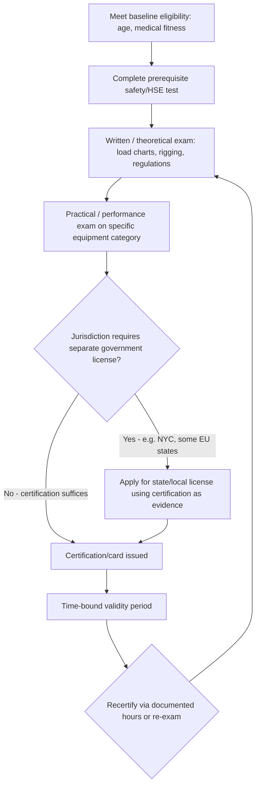

## Regional and National Crane Licensing Requirements

### Regulatory Purpose and Framework Logic

Crane licensing exists to close the gap between general equipment-operation competence and the specific hazard profile of lifting operations: overturning, dropped loads, boom contact with energized lines, two-blocking, and structural failure under dynamic loading. Unlike most powered industrial trucks, cranes routinely operate near their rated capacity, near other workers, and near overhead obstructions, so regulators worldwide converge on the same three-part licensing architecture even when the specific bodies and card names differ:

- **Written/theoretical examination** — load charts, rigging math, stability theory, signals, regulatory knowledge
- **Practical/performance examination** — hands-on demonstration on the specific equipment category
- **Periodic recertification** — because skill decay and equipment/standard changes make one-time certification insufficient

The chapter context (Professional Certifications and Industry Associations) situates this item as the licensing/legal layer beneath the associations that administer or accredit these programs (NCCCO, CPCS/CITB, IUOE, etc.).

### United States: Federal Baseline (OSHA 29 CFR 1926 Subpart CC)

**Key Points**

- Applies to cranes and derricks in construction with a rated capacity over 2,000 lbs, excluding certain exempted equipment (articulating truck cranes used solely to load/unload their own truck under specific conditions, forklift-mounted booms, digger derricks in some utility contexts, etc.)
- Requires that any employee who operates covered equipment be **certified or licensed** to operate that type/capacity of equipment
- Recognizes four certification/qualification pathways:
  1. Certification by an accredited crane operator testing organization (e.g., NCCCO, NCCER, Operating Engineers Certification Program)
  2. Qualification through an audited employer program
  3. Licensing by a state or local government that meets federal requirements
  4. Military certification, for qualified military personnel operating within the scope of that certification
- OSHA does not itself issue crane licenses; it sets the compliance floor that third-party certifying bodies and state licensing schemes must meet

**Certification is equipment-type specific**, not a single blanket "crane license." A candidate certifies separately per category — e.g., lattice boom crawler, lattice boom truck, telescopic boom (swing cab), telescopic boom (fixed cab), tower crane, overhead crane, articulating crane, dedicated pile driver — because load-chart interpretation and control layout differ meaningfully across these.

[Inference] The multi-category structure reflects OSHA's determination that competence does not transfer automatically between fundamentally different crane geometries, even though core rigging and signal knowledge is shared.

### NCCCO as the Dominant U.S. Certifying Body

The National Commission for the Certification of Crane Operators (NCCCO) is accredited by both the National Commission for Certifying Agencies (NCCA) and the American National Standards Institute (ANSI), and is the only crane operator certification program accredited by both bodies, with federal OSHA officially recognizing NCCCO as meeting its requirements for crane operator qualifications. [Train For The Crane](https://trainforthecrane.com/nccco-certification-complete-guide/)[Train For The Crane](https://trainforthecrane.com/nccco-certification-complete-guide/)

**Core eligibility and process:**

- Minimum age 18 [Train For The Crane](https://trainforthecrane.com/nccco-certification-complete-guide/)
- Compliance with the CCO Substance Abuse Policy and Code of Ethics
- Pass a Core written exam plus at least one Specialty written exam [Train For The Crane](https://trainforthecrane.com/nccco-certification-complete-guide/)
- Pass the corresponding Practical Examination within 12 months of the written exam, with both exams for the same designation falling within a 12-month window [Train For The Crane](https://trainforthecrane.com/nccco-certification-complete-guide/)[Train For The Crane](https://trainforthecrane.com/nccco-certification-complete-guide/)
- Documented hands-on operating experience is generally expected/recommended, though exact hour thresholds vary by specialty and by whether the candidate is pursuing initial certification or recertification

**Certification categories** commonly pursued include Lattice Boom, Telescopic Boom Swing Cab, Telescopic Boom Fixed Cab, Tower Crane, Overhead Crane, and Articulating Crane, and all specialty designations require the shared Core written exam plus the specialty-specific written and practical exams. [Skillit](https://skillit.com/blog/nccco-certification-crane-operators-2026)[Skillit](https://skillit.com/blog/nccco-certification-crane-operators-2026)

**Validity and recertification:**

- Certification remains valid for five years before recertification is required [Train For The Crane](https://trainforthecrane.com/nccco-certification-complete-guide/)
- Recertification pathways typically include a documented-hours option (experience operating the specific crane type during the preceding certification period, per state-specific implementations such as California's 1,000 hours of documented experience operating the specific type of crane for which recertification is sought) or a re-examination option [Californiacraneschool](https://californiacraneschool.com/osha-crane-laws/2026/eligibility-for-operating-a-crane-in-california/)

[Unverified] Exact recertification hour thresholds and available pathways are periodically revised by NCCCO's governing board; candidates should confirm current requirements directly against NCCCO's published policy rather than third-party summaries, since blog-level sources vary in precision on this point.

**Related certifications beyond the operator role**, all under the same accreditation umbrella:

- Rigger (Level I / Level II)
- Signalperson
- Lift Director
- Mobile Crane Inspector

### State and Local Layering in the U.S.

Federal OSHA sets the floor, but states and municipalities may impose additional or independently administered licensing:

| Jurisdiction type | Example pattern |
| --- | --- |
| States with their own licensing board | California (Cal/OSHA Title 8, with unique physical/medical and eligibility requirements layered atop general NCCCO guidelines) |
| States requiring state license *in addition to* national certification | New York City (Department of Buildings crane operator license, separate exam and class structure), Illinois (Department of Labor crane operator license) |
| States deferring entirely to accredited third-party certification | Majority of states with no independent crane licensing board |
| No state-level requirement, employer-verified only | States relying solely on the federal OSHA/accredited-certifier framework |

**Key Points**

- A worker moving between jurisdictions cannot assume portability; NCCCO certification is nationally recognized, but a state or city license (e.g., NYC DOB) is a *separate legal instrument* required to operate within that specific jurisdiction regardless of NCCCO status
- California layers physical and medical requirements and other state-specific conditions on top of general NCCCO eligibility [Californiacraneschool](https://californiacraneschool.com/osha-crane-laws/2026/eligibility-for-operating-a-crane-in-california/)
- Some jurisdictions also license by **capacity tier** (e.g., under/over a tonnage threshold) rather than only by crane type

[Inference] This layered structure — federal floor, national certifying body, optional state/local license — mirrors the general U.S. pattern for other safety-critical trades (e.g., commercial driving, electrical work), where states retain police-power authority to add requirements OSHA does not preempt.

### United Kingdom: CPCS and the Card-Based System

The UK does not use a government-issued crane operator "license" in the U.S. sense; competence is evidenced through **industry skills cards**, principally under the Construction Plant Competence Scheme (CPCS), with NPORS as a widely accepted alternative scheme.

**CPCS structure:**

1. **CITB Health, Safety and Environment (HS&E) test** — a 45-minute Health, Safety and Environment touchscreen test required before attempting the technical test [Ainscough Crane Hire](https://www.ainscough.co.uk/blog/an-essential-guide-for-training-to-be-a-crane-operator/)
2. **CPCS Technical Test** — theory plus a technical test assessing operators' abilities in the safe and efficient use of the equipment [Emerson Cranes](https://emersoncranes.com/how-to-become-a-crane-operator-in-the-uk/)
3. **Category-specific card**, e.g. A60 for A-block duties, B for pick-and-carry duties only, and A60 for all duties, with separate categories for Crane Supervisor, Slinger/Signaller, and Appointed Person alongside Mobile Crane Operator (MCO) cards [Ainscough Crane Hire](https://www.ainscough.co.uk/blog/an-essential-guide-for-training-to-be-a-crane-operator/)[Ainscough Crane Hire](https://www.ainscough.co.uk/blog/an-essential-guide-for-training-to-be-a-crane-operator/)

**Card tiers and progression:**

- **Red Trained Operator Card** — issued on completion of the initial CPCS course, valid for up to two years, signifying trained-but-not-yet-NVQ-verified status [Emerson Cranes](https://emersoncranes.com/how-to-become-a-crane-operator-in-the-uk/)
- **Blue Competent Operator Card** — the upgrade path, requiring completion of an NVQ qualification alongside CITB health, safety and environment tests; valid for five years and renewable via test and refresher training [How to become a crane operator in the UK | Emerson Cranes +2](https://emersoncranes.com/how-to-become-a-crane-operator-in-the-uk/)

**Ancillary licensing requirements:**

- A UK driving licence category matched to the crane's gross vehicle weight when operating on public roads: Category C1 for vehicles between 3.5 and 7.5 tonnes, and Category C for vehicles exceeding 7.5 tonnes, since most mobile crane units over 7.5 tonnes require at least an HGV Category C licence [What qualifications do I need to become a crane operator? | Sparrow Crane Hire +2](https://www.sparrowcrane.co.uk/faq/what-qualifications-do-i-need-to-become-a-crane-operator/)
- Compliance with the Road Traffic Act, a current road fund licence (vehicle tax), and roadworthy condition when the crane travels on public highways
- For local authority permitting of a *crane installation* (distinct from operator licensing) — e.g., tower crane erection near a public highway — councils commonly require public liability insurance of at least £10 million and a scaled site plan showing the crane's position and over-sail area with dimensions [Get Licensed UK](https://www.get-licensed.co.uk/licence/crane-licence)

**Distinguishing CPCS from CSCS:**

The CSCS card is a registration scheme recording level of academic achievement in the construction industry and is not itself a competency qualification, whereas CPCS/NPORS certify hands-on operating competence. The schemes are affiliated but serve different purposes — a common source of confusion for candidates and hiring managers. [Ainscough Crane Hire](https://www.ainscough.co.uk/blog/an-essential-guide-for-training-to-be-a-crane-operator/)

### Comparative Table: U.S. vs. UK Licensing Architecture

| Dimension | United States (NCCCO/OSHA) | United Kingdom (CPCS) |
| --- | --- | --- |
| Governing instrument | Federal OSHA standard (29 CFR 1926 Subpart CC) recognizing third-party certifiers | Industry-run card scheme (CITB-affiliated), no direct government license |
| Core credential | NCCCO Certification (Core + Specialty) | CPCS Technical Test + HS&E test |
| Validity period | 5 years | Red card: up to 2 years; Blue card: 5 years |
| Category specificity | By crane type (lattice, telescopic swing/fixed cab, tower, overhead, articulating) | By duty category (A60 all duties, B pick-and-carry, etc.) and equipment class |
| Road/transport credential | Not federally mandated for crane operation itself (separate CDL rules apply to driving the carrier) | HGV Category C1/C required for road travel of the crane unit |
| Sub-state/regional layering | Yes — state and municipal licenses (e.g., NYC DOB, California Title 8) can add requirements | Minimal — CPCS is nationally uniform, though NPORS operates as a parallel scheme |
| Progression structure | Flat (certified or not, per category) | Tiered (Red → Blue via NVQ) |

### Rest-of-World Patterns (Representative, Not Exhaustive)

**Key Points**

- **Canada**: Provincial jurisdiction (no single federal crane license); provinces such as Ontario (mobile crane operator trade certification, compulsory in Ontario) and Alberta/British Columbia issue their own tickets, often via apprenticeship-linked trade certification rather than a pure testing-organization model
- **Australia**: WorkSafe/state regulators require a High Risk Work (HRW) licence under the model Work Health and Safety framework, with sub-classes by crane type and capacity (e.g., C2, C6, C1, CT for tower cranes, CV for vehicle-loading cranes, DG for derrick/dogging-adjacent work)
- **European Union member states**: No single EU-wide crane license; national schemes prevail (e.g., Germany's Kranführerschein tied to DGUV/BG Bau training requirements), though EU machinery and lifting-equipment directives harmonize equipment design and inspection standards that licensing programs reference
- **Middle East / Gulf states**: Often require both a recognized international certification (NCCCO, CPCS, or equivalent) *and* local labor-ministry or municipality endorsement, particularly for large infrastructure and energy-sector projects
- **Singapore**: Ministry of Manpower (MOM) requires a Certificate of Competency for mobile/tower crane operators, tied to WSH (Workplace Safety and Health) Council-approved training providers

[Inference] The recurring cross-jurisdictional pattern — written exam, practical exam, fixed validity period, category-specific scope — suggests convergent regulatory design driven by shared incident-causation research (falling loads, tip-overs, contact with power lines) rather than direct harmonization between regulators.

### Employer and Multi-Employer Coordination Considerations

- **Reciprocity is not automatic.** A crane operator certified in one country, and even in many cases one U.S. state, cannot assume the credential transfers; project owners on cross-border or federally funded projects often require the *locally* recognized credential regardless of foreign or out-of-state equivalency.
- **Insurance and contractual requirements frequently exceed regulatory minimums.** General contractors and owner-controlled insurance programs (OCIPs) commonly require NCCCO (or equivalent) certification even on projects/equipment technically exempt under OSHA Subpart CC, because insurers price risk against the certification baseline.
- **Documentation burden**: Employers must retain evidence of current certification/license status, medical/physical qualification (where required, e.g., vision, hearing, and general physical exams under some state and CPCS-adjacent NVQ requirements), and, in audited-employer-program pathways, internally documented evaluation records.
- **Third-Party Involvement**: On sites using signal persons and riggers, licensing requirements typically extend to those supporting roles as well (e.g., NCCCO Signalperson and Rigger certifications; CPCS Slinger/Signaller cards), because crane incidents frequently trace to miscommunication or rigging failure rather than operator error alone.

### Illustrative Process Flow (Generic Cross-Jurisdiction Model)

### Worked Example: Operator Certifying for a New Crane Category

An NCCCO-certified Telescopic Boom Fixed Cab operator wants to add Tower Crane capability.

1. **Core exam reuse**: Because Core certification is shared across specialties, the operator does not retake the Core written exam if it remains within its validity window relative to the new specialty application.
2. **New Specialty written exam**: Tower Crane-specific content — luffing/hammerhead configuration differences, wind-loading considerations, slewing mechanics — must be passed independently.
3. **New Practical exam**: Conducted on an actual or simulator-approved Tower Crane, since practical competence does not transfer from telescopic boom experience.
4. **Separate validity tracking**: The Tower Crane specialty now carries its own 5-year clock, independent of the Telescopic Boom Fixed Cab credential's expiration date — multi-category operators must track expirations per category, not as a single bundled certification.

**Output**: The operator now holds two independently valid, independently expiring NCCCO specialty certifications under one Core.

### Common Pitfalls and Compliance Failures

- Assuming a national certification substitutes for a required state/city license (e.g., operating in NYC on NCCCO alone without the DOB license)
- Allowing practical exam scheduling to exceed the 12-month window after passing the written exam, forcing the written exam to be retaken
- Treating CSCS (UK) as equivalent to CPCS competence — it is not a competency card
- Failing to track per-category expiration dates separately when holding multiple crane-type certifications
- Overlooking that certain crane configurations (e.g., self-erecting tower cranes, articulating loader cranes used only for self-loading a truck) may fall under narrower exemptions or different licensing tracks than general mobile/tower categories

**Next Steps**

- Occupational Safety Standards Governing Crane Operations (ASME B30 series, OSHA Subpart CC substantive requirements)
- Rigger and Signalperson Certification Pathways
- Crane Inspection Regimes (Pre-Use, Periodic, and Annual/Comprehensive Inspections)
- Load Chart Interpretation and Capacity Calculations
- Lift Planning and Critical Lift Procedures
- Site-Specific Hazards: Power Line Proximity, Ground Bearing Pressure, and Wind Limits
- International Reciprocity and Credential Recognition Frameworks
- Insurance and Liability Frameworks for Heavy-Lift Operations