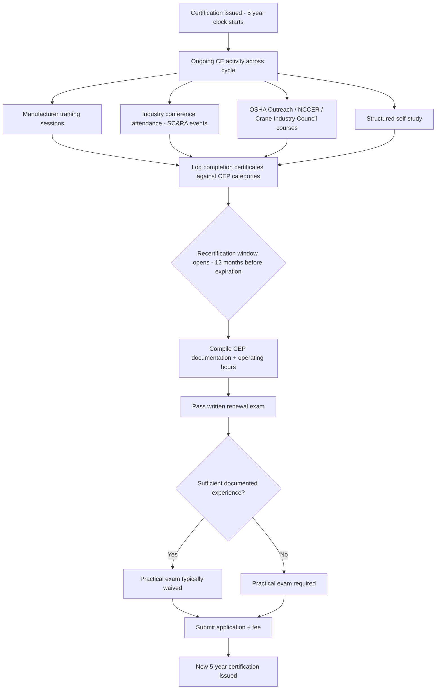

## Continuing Education and Industry Conferences

### Purpose Within the Certification Lifecycle

Continuing education (CE) and industry conferences occupy the space between initial licensing/certification (covered under crane licensing) and the periodic recertification cycle. Where licensing establishes a competence floor at a point in time, CE and conference participation exist to counter three specific decay risks in a heavy-lift career:

- **Regulatory drift** — OSHA interpretation letters, ASME B30 revisions, and state permitting rules change faster than certification cycles
- **Technological obsolescence** — new lift-planning software, telematics, load-moment indicator generations, and rigging hardware standards emerge continuously
- **Skill and judgment decay** — infrequent exposure to critical/complex lifts erodes the situational judgment that routine operation does not exercise

[Inference] The industry treats CE less as a bureaucratic renewal formality and more as a substitute mechanism for the on-the-job exposure that a single employer or equipment fleet cannot provide alone.

### Continuing Education Credit (CEC/CEP) Systems

**Key Points**

- NCCCO offers a Continuing Education Points (CEP)-based recertification pathway as an alternative to a pure written/practical re-exam, and operators who choose CEP-based recertification are required to earn 25 continuing education points (CEPs) over the five-year certification cycle.
- CEPs can be earned through training courses, manufacturer training, safety conference attendance, and structured self-study.
- Recertification requires a written renewal exam plus any equipment-specific recertification exams, and NCCCO does not require a separate medical exam at recertification, though operators must continue to meet the OSHA 1926.1427 medical and physical requirements at each employer.
- The recertification window opens 12 months before expiration and closes 12 months after; recertifying within that window preserves the original certification date for the next five-year cycle, while lapsing beyond the grace period requires restarting the full initial certification process, including the practical exam.
- Recertification candidates must also document compliance with the substance abuse policy and accumulate the required operating hours or CEUs for their specific certification.

**High-value CE content areas** commonly emphasized in the industry include: annual review of recent OSHA citations and enforcement letters, manufacturer service bulletins for the operator's specific equipment, lift-planning software updates and capabilities, and incident lessons learned from industry data sources.

**Recognized low-cost/no-cost CE sources**: the Crane Industry Council, NCCER, and OSHA Outreach programs offer free or low-cost continuing education content, while operators in unionized environments often access continuing education through IUOE training programs tied to apprenticeship and journeyman progression.

[Unverified] The exact CEP point-value assigned to specific activities (e.g., hours per conference session versus hours per self-study module) is set by NCCCO's published CEP policy and periodically revised; operators should confirm current point allocations directly with NCCCO rather than relying on secondary summaries.

### CE Documentation and Audit Practice

Recordkeeping is the operational core of CE compliance, since a credential holder who cannot produce documentation is treated as non-compliant regardless of actual participation.

**Typical documentation set:**

- Original certification card and government-issued identification
- Continuing education records/certificates of completion showing course name, provider, date, and hours or points awarded
- Employment/experience verification letters, where the recertification pathway relies on documented operating hours rather than pure CEPs
- Medical certification records, where applicable to the specific jurisdiction or employer

**Example** (documentation workflow):

1. Operator completes a manufacturer-sponsored load-moment-indicator training session at an industry conference
2. Conference/course provider issues a completion certificate stating hours and topic
3. Operator logs the certificate against the relevant CEP category in their personal CE tracking record
4. At recertification, the operator compiles all logged CE evidence into the recertification application alongside the written exam result and fee

**Employer-side responsibility**: employers commonly maintain a parallel CE tracking system for their certified workforce, both to manage recertification timing across multiple operators and because insurers and OCIPs increasingly request aggregate CE compliance data as part of risk underwriting.

### Major Industry Conferences and Events

The heavy-lift and specialized transport sector is served by a small number of dominant trade associations whose annual event calendars function as the primary in-person CE and networking infrastructure for the industry, distinct from the pure certification bodies (NCCCO, NCCER) covered elsewhere in this chapter.

**Specialized Carriers & Rigging Association (SC&RA)** — the leading international trade association for the crane, rigging, and specialized transportation industry, with more than 1,400 member companies from 46 nations involved in specialized transportation, machinery moving and erecting, industrial maintenance, millwrighting, and crane and rigging operations. SC&RA's recurring annual event cycle includes:

| Event | Typical Timing | Focus |
| --- | --- | --- |
| January Board & Committee Meeting | January | Association governance, planning for the year ahead |
| Specialized Transportation Symposium | Late February | Education sessions and speakers focused on the specialized transportation side of the industry, alongside a large exhibit center |
| Annual Conference | Late April | Broad industry education sessions, committee meetings, the Job of the Year Awards across multiple categories, the Environmental Award, Golden Achievement Award, and President's Award |
| Crane & Rigging Workshop | September | Described as a must-attend event for mobile, tower, truck, overhead, and other crane owners, rental companies, and manufacturers, positioned as the most comprehensive crane-focused group event in the industry |
| Financial & Risk Management Forum | Concurrent with Symposium/Workshop | One-day session pairing participants with mentors on financial and risk topics specific to the industry |
| Future Leaders Forum | Varies | Aimed at accelerating growth and decision-making skills for the next generation of industry leaders |

**Key Points**

- SC&RA events combine formal education sessions with committee meetings that directly feed the association's regulatory advocacy work — e.g., the Permit Policy Committee's work on state and local permitting rules — making conference attendance a channel not just for individual CE but for industry input into rulemaking.
- Preferred producers and underwriters frequently present risk-management-focused sessions at these events (e.g., insurance and underwriting content aimed at crane companies), reflecting the industry's current cost pressures around liability and insurance premiums.
- The **Specialized Carriers & Rigging Foundation (SC&RF)**, a 501(c)(3) affiliated with SC&RA, funds industry-specific research and workforce development, and its Educational Assistance committee oversees a Collegiate Scholarship, a Vo/Tech Scholarship, and a Company Training Grant program — representing a formal philanthropic/training funding channel distinct from paid CE courses.

**Other notable education and standards bodies feeding CE content** (cross-referenced from adjacent chapter items): NCCCO's own training-provider network, NCCER's curriculum-based training, ASME's standards-update seminars (relevant to B30 series revisions), and OSHA Outreach Training programs (10-hour/30-hour construction safety curricula, periodically updated).

### Conference Value Beyond Formal CE Credit

**Example** (non-credentialed value capture):

- **Regulatory foresight**: attending committee sessions (e.g., SC&RA's Permit Policy Committee proceedings) exposes attendees to pending state and local permitting changes before they take effect — a form of CE that no formal course curriculum captures because it concerns forthcoming rather than settled rules.
- **Peer benchmarking**: award competitions such as the Job of the Year Awards function as informal technical case studies, publicly documenting complex lift methodologies, rigging configurations, and engineering solutions that attendees can study even without directly competing.
- **Vendor/manufacturer technical sessions**: conference exhibit floors and paired technical sessions are frequently the first venue where new load-moment-indicator software, telematics platforms, or rigging hardware standards are demonstrated to a practitioner audience, ahead of formal manufacturer documentation updates.
- **Workforce pipeline engagement**: philanthropic/education-adjacent programming (e.g., SC&RF's Workforce Ambassadors program) increasingly treats conference attendance as a recruitment and industry-image function alongside its CE function, reflecting an industry-wide skilled-labor shortage concern.

### Comparative Model: CE Pathways vs. Pure Re-Examination

| Dimension | CEP/CEU-based recertification | Written + practical re-exam |
| --- | --- | --- |
| Time investment pattern | Distributed across the 5-year cycle | Concentrated near expiration |
| Content currency | Reflects whatever courses/conferences were actually attended | Reflects the current version of the standardized exam |
| Practical skill verification | Not directly re-tested (relies on documented operating hours) | Directly re-tested via practical exam, in most cases, unless sufficient documented experience substitutes |
| Flexibility for working operators | High — can be completed incrementally around job assignments | Lower — requires blocking time for exam scheduling |
| Employer/insurer visibility | Requires ongoing documentation tracking | Single point-in-time result, simpler to verify |

### Illustrative CE-to-Recertification Flow

### Common Pitfalls

- Waiting until the 12-month recertification window opens to begin accumulating CEPs, rather than logging credit incrementally across the full 5-year cycle
- Attending conference sessions without retaining or requesting a completion certificate, leaving no auditable record for the CEP portfolio
- Assuming conference attendance alone satisfies CEP requirements without confirming the specific session or track is an NCCCO-recognized CEP activity
- Allowing the certification to lapse past the 12-month post-expiration grace period, which forces a full restart including the practical exam rather than a streamlined renewal
- Treating CE as satisfying only the certifying body's requirement while overlooking separate employer-mandated or insurer-mandated training obligations that may have different content or documentation standards

**Next Steps**

- NCCCO Recertification Examination Structure and Scoring
- OSHA Outreach Training Curriculum (10-Hour and 30-Hour Construction)
- ASME B30 Standards Revision Cycle and Industry Comment Process
- Manufacturer-Specific Equipment Training Programs
- Trade Association Advocacy and Regulatory Engagement (SC&RA Permit Policy Committee model)
- Workforce Development and Apprenticeship Pipeline Programs (IUOE, SC&RF)
- Insurance and Risk Management Education for Crane and Rigging Companies